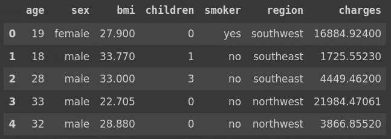
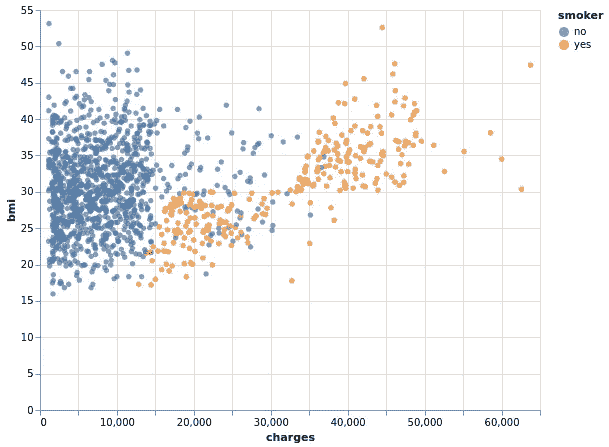
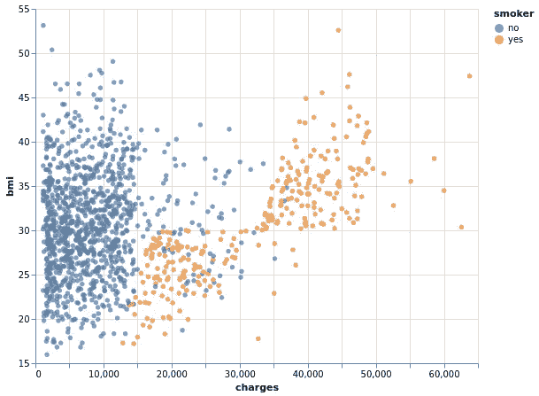
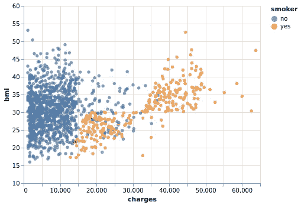
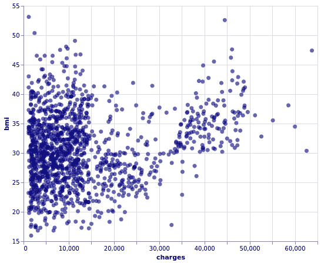
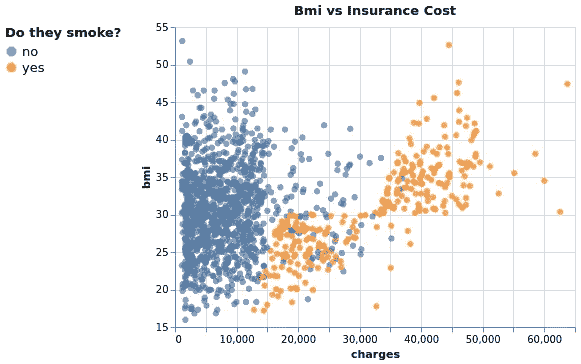
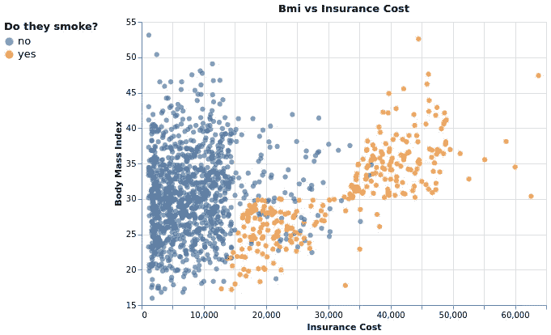

# Altair:Python 的统计可视化库(第 4 部分)

> 原文：<https://towardsdatascience.com/altair-statistical-visualization-library-for-python-part-4-9ec970fb12e8?source=collection_archive---------18----------------------->

自定义可视化


艾萨克·史密斯在 [Unsplash](https://unsplash.com/s/photos/chart?utm_source=unsplash&utm_medium=referral&utm_content=creditCopyText) 上拍摄的照片

Altair 是 Python 的统计可视化库。它的语法清晰易懂，我们将在示例中看到。用 Altair 创建交互式可视化也非常简单。

Altair 在数据转换方面非常灵活。在创建可视化时，我们可以应用许多不同种类的转换。它使得库对于探索性数据分析更加有效。

Altair 系列的前三部分涵盖了以下主题。

*   第一部分:[简介](/altair-statistical-visualization-library-for-python-cfb63847c0c0)
*   第二部分:[过滤和转换数据](/altair-statistical-visualization-library-for-python-part-2-4c8ce134e743)
*   第 3 部分:[互动情节和动态过滤](/altair-statistical-visualization-library-for-python-part-3-c1e650a8411e)

在本文中，我们将看到用 Altair 定制可视化的不同方法。创建信息可视化来展示数据中的底层结构或揭示变量之间的关系是数据科学的关键部分。

同样重要的是让他们看起来漂亮和有吸引力。因此，我们应该花一些时间来定制可视化效果，以获得更好的外观。

我们将使用 Kaggle 上的保险数据集。让我们从导入库和将数据集读入 Pandas 数据帧开始。

```
import numpy as np
import pandas as pd
import altair as altinsurance = pd.read_csv("/content/insurance.csv")
insurance.head()
```



(图片由作者提供)

该数据集包含关于保险公司的客户和保险收费金额的一些度量(即特征)。

我们可以创建一个散点图来检查身体质量指数(bmi)和保险成本(费用)之间的关系。吸烟者栏可用于区分吸烟者和不吸烟者。

```
(alt.
  Chart(insurance).
  mark_circle().
  encode(x='charges', y='bmi', color='smoker').
  properties(height=400, width=500))
```



(图片由作者提供)

所有的 bmi 值都高于 15。因此，如果 y 轴上的刻度从 15 开始，看起来会更好。我们可以使用 *scale* 属性来调整自定义 y 轴。

```
(alt.
  Chart(insurance).
  mark_circle().
  encode(
    alt.X('charges'),
    alt.Y('bmi', scale=alt.Scale(zero=False)),
    alt.Color('smoker')).
properties(height=400, width=500))
```

为了使用 scale 属性，我们用 Y 编码(alt。Y('bmi '))而不是传递一个字符串(y='bmi ')。零参数设置为“假”以防止轴从零开始。

以下是更新后的可视化效果:



(图片由作者提供)

我们还可以使用 domain 参数来指定一个自定义范围。让我们也使用 properties 函数来改变可视化的大小。

```
(alt.
  Chart(insurance).
  mark_circle().
  encode(
    alt.X('charges'),
    alt.Y('bmi', scale=alt.Scale(domain=(10,60)),
    alt.Color('smoker')
  ).
  properties(height=300, width=400))
```



(图片由作者提供)

我们可能还想定制散点图中点的外观。例如，大小、颜色和不透明度可以调整如下:

```
(alt.
  Chart(insurance).
  mark_circle(size=50, color='darkblue', opacity=0.6).
  encode(
    alt.X('charges'),
    alt.Y('bmi', scale=alt.Scale(domain=(15,55)))
  ).
  properties(height=400, width=500))
```



(图片由作者提供)

我们也可以在编码函数中指定这些变化。下面的代码生成与上面相同的可视化效果。

```
(alt.
  Chart(insurance).
  mark_circle().
  encode(
    alt.X('charges'),
    alt.Y('bmi', scale=alt.Scale(domain=(15,55))),
    size = alt.value(50),
    color = alt.value('darkblue'),
    opacity = alt.value(0.6)
  ).
  properties(height=400, width=500))
```

Altair 也允许定制图例。

```
(alt.
  Chart(insurance).
  mark_circle(size=40).
  encode(
    alt.X('charges'),
    alt.Y('bmi', scale=alt.Scale(zero=False)),
    alt.Color('smoker', 
              legend=alt.Legend(
                 title='Do they smoke?',  
                 orient='left',
                 titleFontSize=13,
                 labelFontSize=13
                 )
              )
    ).
  properties(title="Bmi vs Insurance Cost")
)
```

我们已经更改了图例的标题，并将其放在左侧。标题和标签的字体大小也进行了调整。



(图片由作者提供)

我们还使用 properties 函数添加了一个标题。

在某些情况下，我们需要更改轴标题，因为列名可能不合适或不太清楚。X 和 Y 编码的标题用于改变轴标题。

```
(alt.
  Chart(insurance).
  mark_circle(size=40).
  encode(
    alt.X('charges', title="Insurance Cost"),
    alt.Y('bmi', scale=alt.Scale(zero=False), 
          title="Body Mass Index"),
    alt.Color('smoker', 
              legend=alt.Legend(
                 title='Do they smoke?',  
                 orient='left',
                 titleFontSize=13,
                 labelFontSize=13
                 )
              )
    ).
  properties(title="Bmi vs Insurance Cost",
             height=350, width=500)
)
```



(图片由作者提供)

我们最后取得的成果似乎比我们创作的第一个情节要好得多。

## 结论

我们已经介绍了 Altair 提供的定制可视化的一些选项。当然，有更多的方法来创建高度定制的可视化。

在许多情况下，默认设置稍加调整就可以了。然而，我们总是可以使可视化更有吸引力和独特性。这会帮助你更清楚地传达信息。

感谢您的阅读。如果您有任何反馈，请告诉我。