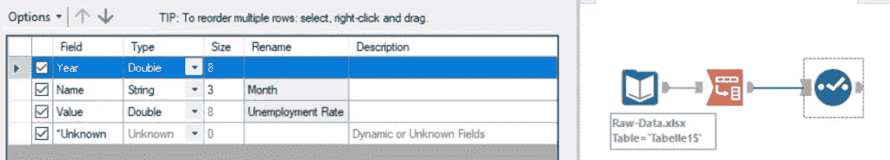
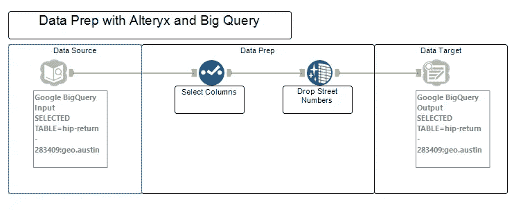
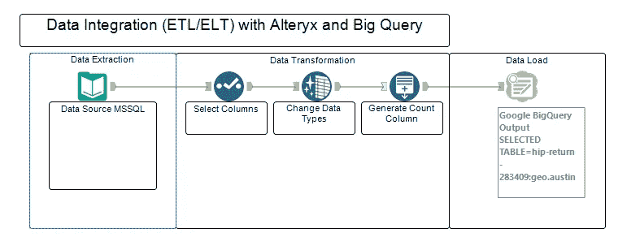
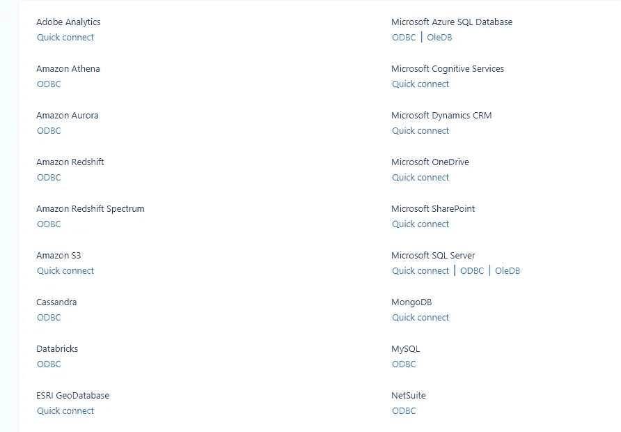
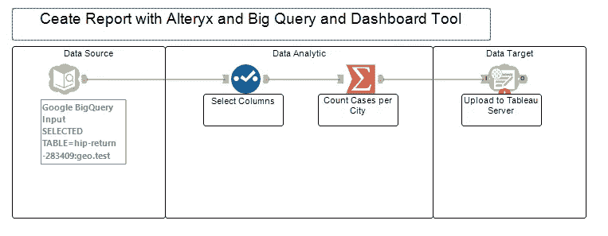

# alteryx——一个有价值的数据平台？

> 原文：<https://towardsdatascience.com/alteryx-a-worthy-data-platform-b3444fc7a63b?source=collection_archive---------32----------------------->

## 如何将 Alteryx 用于数据工程和科学

克里斯托弗·扎里略在 [Unsplash](https://unsplash.com/s/photos/montana?utm_source=unsplash&utm_medium=referral&utm_content=creditCopyText) 上拍摄的照片

Alteryx 被认为是一个结合了分析、数据科学和过程自动化的平台。与许多工具的集成可以非常容易地实现，并用于许多有趣的用例。在这个演练中，我使用 Google BigQuery 作为源和目标平台。

如何开始:

*   安装 Alteryx 并创建一个 GCP 帐户，该帐户有权**创建一个服务帐户。**
*   为 Alteryx 安装**大查询工具**。
*   通过**服务对服务**验证或**最终用户**验证来验证 big query([完整指南](https://help.alteryx.com/current/designer/google-bigquery-input-tool))【1】。

## 用例

这里是我遇到的一些典型用例，可能会给你一些 Alteryx 可以做什么的灵感。

**数据准备**

虽然像 GCP 这样的工具和云平台已经带来了他们自己的数据准备工具(Cloud Dataprep)或者像数据传输服务这样的服务，但是你可能会选择 Alteryx，因为它的多样性。它还为您提供了 ESB 和数据分析/科学家功能—您可以从众多工具中选择一个来完成工作，或者使用 Python 和 R 代码。

无编码的数据准备—图片由作者提供

另一个原因可能是内部版本，由于数据治理问题，这可能是您和您的公司的必备产品。因此，一个典型的用例是从任何来源获取数据或已经加载到 BigQuery 中的数据，并为进一步的分析案例准备数据。

数据准备工作流程-按作者分类的图像

你可以使用许多内置的数据准备工具中的一个(如上图中的蓝色图标所示),或者像上面已经说过的那样，使用 python 和 R 代码来变魔术。最后，您可以使用 BigQuery 输出工具轻松地将其加载回 BigQuery 中的新表。

## 数据集成

另一个用例是将 Alteryx 用于您的 ETL/ELT 过程。如上所述，Alteryx 提供了一套广泛的连接器和数据集成工具。

ELT/ETL 工作流—按作者分类的图像

与上面的用例类似，在这个例子中，您可以从 MSSQL 数据库中提取数据，转换它，最后将它加载到您的数据仓库中。输入工具支持的广泛数据源(如绿色图标所示)无疑是一大优势。

支持的数据源-按作者分类的图片

这一应用领域在热带冰沙咖啡馆的成功故事中也有描述，该咖啡馆的数据来源是 AWS——见[此处](https://community.alteryx.com/t5/Alteryx-Use-Cases/Transforming-4-Billion-Rows-of-Data-into-Insights-with-Alteryx/ta-p/161798) [2]。

## 报告和分析

与其他案例类似，但侧重于分析，可以使用 Alteryx 作为构建报告的工具。通常，您的数据仓库或湖中有原始数据，并希望用它来构建报表。在这里，您可以使用 Alteryx 来完成更繁重的数据分析/科学任务，如准备、聚合、统计以及机器学习。此后，您可以使用众多受支持的 BI 和 BI 服务器工具之一将您的数据上传到那里。在这个用例中，我将数据上传到 Tableau 服务器。

分析工作流程-按作者分类的图像

在这里，Alteryx 在您的数据处理中是一个真正的大优势，因为 BI 工具通常不提供各种各样的分析功能。在这个[的故事中，西门子描述了一个类似的用例。](https://community.alteryx.com/t5/Use-Cases-Deutsch/Siemens-verarbeitet-50-Millionen-Datenzeilen-innerhalb-von/ta-p/597152)

## 结论

Alteryx 不仅仅是一个数据分析工具，它还适用于数据集成任务，并且可以通过它的许多系统和数据库连接器大放异彩。与 BigQuery 等技术以及许多其他软件和数据库一起，您可以实现数据集成和准备，以及报告和分析用例。我喜欢的是在众多 Alteryx 工具(拖放)之间进行选择的可能性，以及使用 Python 或 r 的机会。这两种工具的结合将为您提供一个出色的数据集成和分析平台，使您和您的公司能够获得广泛的工具集，以应对敏捷和数据驱动的世界中的挑战。

## 资料来源和进一步阅读

[1] Alteryx，[谷歌大查询输入工具](https://help.alteryx.com/current/designer/google-bigquery-input-tool) (2020)

[2] Alteryx，[利用 Alteryx、AWS 和 Tableau 将 40 亿行数据转化为洞察力](https://community.alteryx.com/t5/Alteryx-Use-Cases/Transforming-4-Billion-Rows-of-Data-into-Insights-with-Alteryx/ta-p/161798) (2018)

[3]西门子公司 2020 年的 5000 万美元预算