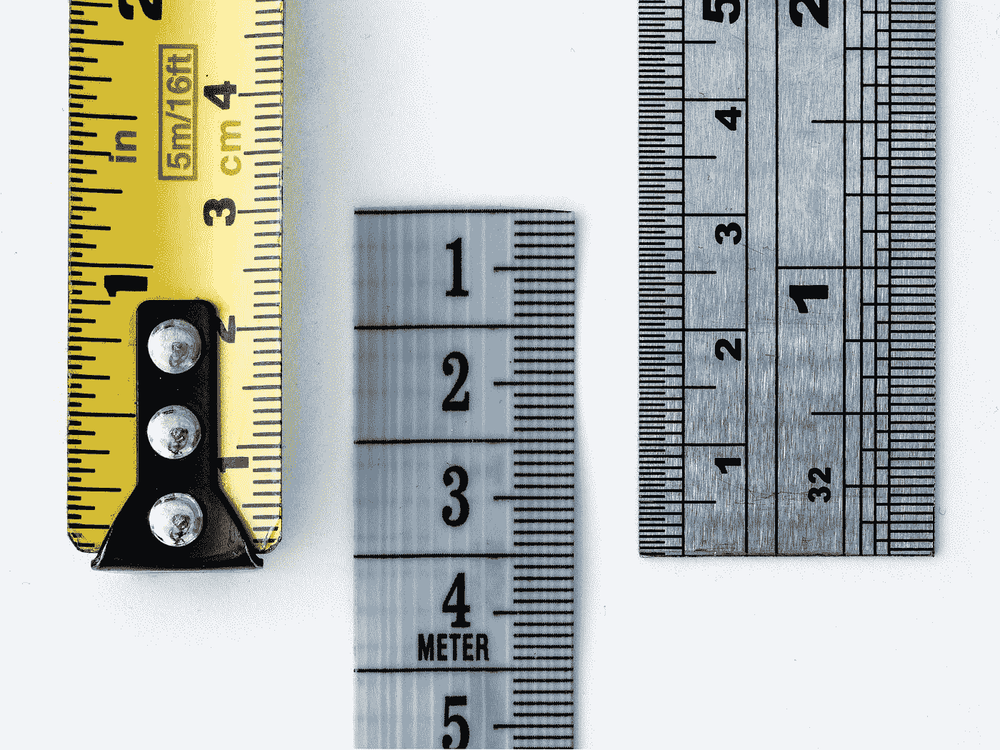

# 永远测量你的基线——数据科学家的黄金法则

> 原文：<https://towardsdatascience.com/always-measure-your-baseline-a-golden-rule-for-data-scientists-2bf38371cc41?source=collection_archive---------32----------------------->

## 你很容易发现自己注定会失败。在开始之前验证和检查指标是我学到的最有价值的经验之一(艰难的方式)。

在开始任何改善现有模型或流程的项目之前，一定要确保你没有受到不公平的衡量(图片由 [Unsplash](https://unsplash.com?utm_source=medium&utm_medium=referral) 上的[威廉·沃比](https://unsplash.com/@wwarby?utm_source=medium&utm_medium=referral)拍摄)

# 注定失败

这是我多年来见过几次的问题，也是我职业生涯早期碰到的问题。这也是我学到的最重要的一课。

众所周知，大部分数据科学项目都会失败。这通常归因于工作模型从未投入生产，以及围绕 MLOPs 和机器学习工程的困难。在我继续之前，如果你想要一个超级简单的指南来完成端到端的过程，我不久前写了一篇关于这个的文章，介绍了一些基本知识。你可以在这里查看:

 [## 数据科学家的 Docker 第 2 部分

### 开发机器学习模型、编写 API、打包到 Docker 中、在任何地方运行、分享的完整指南…

towardsdatascience.com](/docker-for-data-scientists-part-2-7655c02fe975) 

这不会让你很快得到一份 MLE 的工作，但是如果你刚刚开始，这真的可以增强你的自信，让一些步骤不再神秘。

现在，虽然 MLOps 是许多数据科学项目的巨大障碍，但我认为许多项目失败实际上还有另一个重要原因。事实上，在我做顾问的日子里，我不止一次在我们合作过的组织中发现这一点，这些组织谴责他们对数据科学的整个尝试是失败的。

我非常清楚这个问题，因为它在我职业生涯的早期就困扰着我。幸运的是，有一个非常简单的方法可以解决这个问题，我们很快就会看到，但是首先，有一个故事…

# 热切的数据科学家的寓言

在职业生涯的早期举起手来表现出热情是很好的，但是要小心你自愿做的事情(照片由[国家癌症研究所](https://unsplash.com/@nci?utm_source=medium&utm_medium=referral)在 [Unsplash](https://unsplash.com?utm_source=medium&utm_medium=referral) 上拍摄)

当我完成博士学位时，我非常渴望成为一名数据科学家。我花了数年时间构建复杂激光系统和量子力学过程的计算模型——甚至为了激光设计玩强化学习！我很幸运地在格拉斯哥的一家非常早期的初创公司找到了一个很有前途的职位。不幸的是，这一承诺没有转化为销售，不到一年，我不得不继续前进。

我进入了一家保险公司，也是一家初创公司，但比我的第一份工作做得更好——我们实际上在盈利！我被引入定价团队，研究如何改进作为业务核心的全能定价模式。

人们最终如何支付他们的保险有一个特别的输入。我不会在这里详述，但基本上有四种结果。两个是中性的，一个意味着企业获得了超出预期的额外利润，一个意味着企业赚的钱比预期的少。

所以，新来的人告诉我，这可能是一个特别棘手的问题，也是他们想用数据科学解决的问题。急于取悦我举起我的手，并陷入其中。

这是一个很大的问题，定义明确，有大量的数据——在英国，如果你注册成为四大价格比较网站的供应商，你每天会收到大约 100 万份汽车保险报价，每个报价(当时)大约有 900 个字段。

我花了一些时间研究整个行业的其他模式和方法，从我们组织的主题专家那里获取专业知识，并与同事和社区等合作。我最终得出了一个非常合理的模型，ROC AUC 为 0.82，用于预测某人落入负面结果类别的可能性。

这是事情变得困难的时候。

当插入大定价机制时，优化开始给出与中小企业所知道的不一致的结果。我被拷问，模型被撕成碎片。

回到绘图板。

我经历了几次这样的迭代，没有太大的变化。每一种新的方法和所有额外的研究都不断让我得到类似的结果。作为一名早期职业数据科学家，仅仅在我的第二份工作中，我就开始担心了。

我开始感到很困惑，于是要求向我展示中小企业得出结论的具体过程。他们使用了什么样的模型给出了如此大相径庭的结果？

那时一切都变得清晰了。

当我看到事情是如何完成的，我开始钻研之前的计算方法时，很明显我们测量的是完全不同的东西。事实上，他们是如此的不同，以至于我不可能得到一个满意的结果。

经过一段时间和咨询后，我的模型最终超越了现有的方法，并导致了一些违反直觉的发现——定价模型核心的优化实际上更有利于那些处于负面结果类别的人，因为他们有一些不太明显的长期行为，这些行为显著增加了他们的终身价值！

# 苹果对苹果

检查你是否真的在比较苹果(照片由[悉尼·雷](https://unsplash.com/@srz?utm_source=medium&utm_medium=referral)在 [Unsplash](https://unsplash.com?utm_source=medium&utm_medium=referral) 上拍摄)

那么这一切有什么意义呢？

自从那件事之后，我给自己定了一个新的规则，我是否应该开始一个项目来改进现有的模型或过程:

> 使用您打算用来衡量模型的相同流程，重新计算现有模型的评分标准

对许多人来说，这似乎很简单，但却很容易被忽视。我已经看到这是整个团队的失败，他们努力做出真正的改进，因为他们严格的方法无法与管理层对现有过程珍视的草率的幻想度量相竞争。你知道这种电子表格，充满了捏造的因素和调整，已经运行了公司多年，或者数据拼凑在一起，每个月手动“按摩”成型。

> 如果不将更广泛的业务与您自己的方法保持相同的标准，您将处于非常不利的地位。

再加上你经常能从急于证明数据科学是浪费时间的人那里找到的阻力，你甚至可能永远无法起步。

现在必须说，在某些情况下，准确或严格地重现现有的方法/理解实际上是不可能的。没关系。在这种情况下，你需要做的就是从一开始就列出这个限制。如果可能的话，建议一个代理或类似的计算来比较你的进展。

> 作为一名数据科学家，你的工作是教育更广泛的组织变得更加数据驱动。

如果处理得当，这真的可以让你脱颖而出，成为整个企业变革的积极力量，并让人们与你同行。

## 摘要

小心你不是在尝试不可能的事情，确保你(或组织中的某个人)可以重新创建衡量你的标准。

如果你不知道你从哪里开始，就很难知道你已经走了多远。