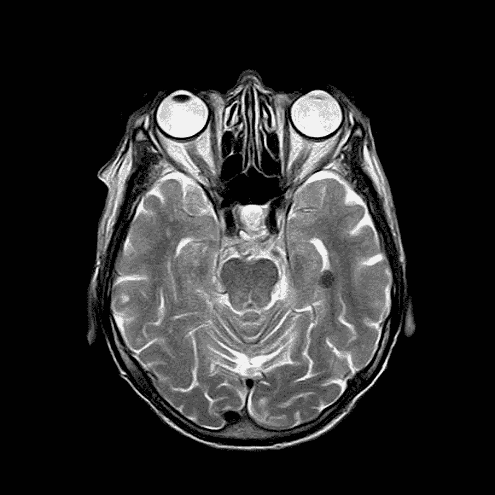

# 基于深度学习的阿尔茨海默病诊断研究综述

> 原文：<https://towardsdatascience.com/alzheimer-diagnosis-with-deep-learning-a-survey-265406fa542a?source=collection_archive---------16----------------------->

## [理解大数据](https://towardsdatascience.com/tagged/making-sense-of-big-data)

## 医学中的深度学习是一个不断发展的领域；让我们来分析一下阿尔茨海默氏症诊断的现状。

由 [Robina Weermeijer](https://unsplash.com/@averey?utm_source=medium&utm_medium=referral) 在 [Unsplash](https://unsplash.com?utm_source=medium&utm_medium=referral) 上拍摄的照片

> 本文是我揭露从我的人工智能硕士论文中提取的研究、实现和结论的系列文章的一部分。虽然本文呈现的是论文的**探索阶段**(文献综述)，但其他文章将处理描述阶段([数据预处理](/alzheimer-diagnosis-with-deep-learning-data-preprocessing-4521d6e6ebeb)和[模型实现](/alzheimer-diagnosis-with-deep-learning-model-implementation-5a0fd31f148f))。
> 
> 整个项目可以在下面的 GitHub 资源库中找到:[https://github.com/oscardp96/TFM-Alzheimer-Diagnosis](https://github.com/oscardp96/TFM-Alzheimer-Diagnosis)
> 
> 感谢阅读

在过去的二十年里，人工智能(AI)的理论和实践进展已经渗透到各个领域，并使其受益，如医学、旅游、教育、娱乐等。具体来说，在医学领域，人工智能已经证明了其潜力:通过病变检测，细胞和器官分割，自动对话等，帮助检测和诊断几种疾病；此外，还可以通过远程监控患者、发现药物、机器人辅助手术等来帮助治疗各种疾病[1] — [3]。

在过去二十年中，深度学习的兴起推动了对解决方案的研究，以帮助改善基于神经成像数据的阿尔茨海默病诊断。因此，已经使用了各种不同的技术，但是在过去十年中已经观察到明显转向使用卷积神经网络(CNN)。事实上，提出的各种选择是巨大的，每一个都有其特殊性。例如，他们中的一些人使用磁共振成像(MRI)，而另一些人选择正电子发射断层扫描(PET)图像。另一方面，可以使用不同的机器学习模型。

基于上述内容，本文旨在对机器学习，或者更具体地说，深度学习模型进行综述，这些模型已被证明在阿尔茨海默病诊断方面是有用的。在其他文章中，从这项研究中提取的结论将被付诸实践，以获得更广泛的领域知识。最后，将为试图在该领域开展工作的数据科学家提供一些建议。

## 概观

医学图像的使用是几种疾病的诊断和治疗的一个关键方面，因为这些图像是提取有用生物标志物的强大来源[4]。它们是电子健康记录(EHR)的重要组成部分，通常由称为放射科医生的专业人员进行检查。还有各种各样的图像格式，磁共振成像(MRI)和正电子发射断层扫描(PET)是阿尔茨海默氏症诊断中最常见的。然而，如上所述，专家基于对记录图像的视觉检查做出诊断，这是基于医生的经验，因此可能导致人为错误，从而导致错误的诊断。

鉴于这一挑战，在过去的 15 年中，使用人工智能的医学图像分析已经成为医学应用中的主要研究方向之一，其目的是提供第二种意见来支持专家做出的诊断。

在这种情况下，已经使用了应用简单机器学习算法的方法，例如支持向量机(SVM) [5]和统计方法，例如独立成分分析(ICA) [6]。然而，最近五年的趋势是使用深度学习，具体来说是 CNN [7]，[8]。与此相关的主要因素有三个:

*   提高数据的数量和质量。在这方面，该领域正在接近大数据。
*   试图减少人为错误，因为放射科医生受到几个因素的限制，如速度或经验[7]，[5]。
*   人工智能本身的崛起，更具体地说，深度学习。如果这种类型的系统在最近几十年里没有表现出如此突出的性能[9]，[10]，将它们应用于医疗应用就不会被认为是可行的。

这些技术也已经用于医学图像分析中的不同应用。它们可以浓缩为以下几类[7]、[8]、[11]、[12]:

*   计算机辅助检测。识别图像中的某些元素，如器官或细胞。这对于突出物理学家感兴趣的区域也是有用的，例如病变。
*   分段，不要和 CADe 混淆。将整个图像区域与其余区域隔离开来。
*   计算机辅助诊断(CADx)，这是本文的重点。基于某些信息的诊断，可以用更简单的术语解释为分类任务。在阿尔茨海默病的情况下，通常分为三类:正常人群(NC)、轻度认知障碍(MCI)或阿尔茨海默病(AD)。最近，这一类别被称为计算机化诊断[13]。

在[12]中，提到了一个额外的有趣类别；这被称为深度特征学习。它基于能够从数据中提取有用特征的系统的设计和实现。它允许获得更高层次的特征，这些特征对于人眼是不可见的，并且碰巧在不同的场景中是可重用的。在计算机化诊断中，它通常被用作从图像中提取有用特征或预训练深度网络的前一步，通过无监督模型，如自动编码器[14]-[17]。

这种深度特征提取的过程似乎逐渐被废弃，可能是因为它需要额外的开发阶段，并且不再提高整体精度[18]。这两个事实使得直接训练深度卷积神经网络对于实现 AD 诊断的实际解决方案更加可行。然而，注意到 AI 不仅可以评估纯诊断，还可以帮助理解诊断结果和大脑结构变化之间的关系，这也非常重要，同时可以在未来更好地实现深度神经网络[19]。

总之，CNN 代表了过去五到十年中使用的绝大多数模型的基础。这些通常以监督的方式训练，但是它们的非监督应用也是非常重要的。在任何情况下，图像必须进行预处理，以便模型可以充分利用它们。

## **图像预处理**

对自动 AD 诊断的研究表明，对于图像预处理，最初，作者利用手动定义的特征，这需要非常复杂的预处理技术。然而，使用 CNN 和自动编码器进行自动特征提取稍微简化了这个过程。在这种情况下，两种常用的方法是:1)图像配准，和 2)颅骨剥离。

图像配准包括将一幅图像与另一幅参考图像(通常称为图谱)相适配，寻求两者的相同区域代表相同的解剖结构[20]。对于 CNN 或自动编码器来说，将图像的某个区域识别为相关会更简单，因为相同的信息将在所有图像中被表示。图像配准算法种类繁多[20]，不仅适用于神经成像[16]、[21]-[23]，还适用于其他医学领域，如乳腺癌[24]。

颅骨剥离是从 MRI 图像上出现的颅骨中去除信息。目标是获得尽可能清晰的最终图像，仅包含与手头任务相关的信息。显然，在 AD 的病例中，没有一个最相关的生物标记在头骨中被发现。因此，某些出版物使用不同的技术来提取头骨和其他非大脑区域[21] — [23]，或者直接使用已经提取头骨的图像数据集[25]。图 1 显示了颅骨如何占据图像的重要部分，尤其是在较低的轴向切面中。

图一。无颅骨剥离的 MRI 图像的低轴切面。由 [Toubibe](https://pixabay.com/es/users/toubibe-647761/) 在 [Pixabay](https://pixabay.com/es/) 上拍摄的照片

还有其他技术，如图像归一化，它可以分为两种变体:强度归一化和空间归一化。前者是基于根据某个标准调整像素值的范围，例如将它们减少到某个范围或减去平均值并除以标准偏差，这被称为白化[26]。后者包括调整像素(或三维体素)，使其代表特定的空间(或体积)[26]。例如，在[27]中，调整 3D 图像，使得每个体素代表 2mm 的空间。在这方面，图像配准可以被视为一种形式的空间标准化[26]。

## 用于 AD 诊断的训练模型

近年来，CNN 在阿尔茨海默病的计算机化诊断领域发挥了重要作用[21]、[25]、[27]。这并不意味着这些模型以前没有使用过，但它们曾经得到过其他深度学习策略的支持，如深度特征提取。直接和特定的应用实际上最近已经开始，实现了比以前的方法更高的准确性，同时也提供了更简单的解决方案。

AlexNet [10]是深度学习历史上的一个转折点。它证明了 CNN 如何能够在图像分类中获得优异的结果。几年后，它的想法得到了进一步发展，产生了其他重要的架构，如 VGGNet [28]、Inception [29]和 ResNet [30]。虽然它们最初是为处理 ImageNet 数据而设计的，但是它们出色的结果使它们成为了多种应用程序的默认选择。大多数深度学习框架都提供了这些已经用 ImageNet 训练过的网络，因此开发人员可以根据自己的目的对它们进行微调。

医学图像分析也不例外。虽然这两个领域确实有很大的差异，限制了通过微调这些网络可以获得的性能，但这种技术仍然被证明是实践中最有前途的技术。不仅是阿尔茨海默病，还有其他疾病的诊断，如糖尿病视网膜病变[31]，乳腺癌[32]和皮肤癌[33]。

*   在[31]中，作者微调了一个 Inception V3 模型。
*   在[32]中，作者尝试了 Inception V3 模型和 ResNet50。
*   在[33]中，Inception V3 模型也用于 757 种不同疾病类别的分类。

事实上，Inception V3 [34]和 ResNet 是文献中最常见的架构。表 1 显示了直接使用 CNN 诊断阿尔茨海默氏病和前面提到的疾病的出版物。

**表 1。使用 CNN** 的出版物。LeNet5 是一个相对较老的架构，源自[9]。VoxCNN 是由 VGGNet 衍生而来的一种体卷积神经网络。VoxResNet 是一个体积残差网络。

关于 AD，在针对诊断的特定情况训练 CNN 的第一次尝试中，研究人员没有使用 ImageNet 权重或微调；相反，他们使用盗梦 V1 和 AlexNet 架构[21]。然而，研究人员发现，当使用更先进和复杂的架构时，有限的可用数据会导致过度拟合。因此，他们将两种模型结合起来，设计了一种决策算法，其准确率接近 100%。

进一步的研究表明，CNN 可用于生成特征和对 AD 阶段进行分类[25]。为此，他们尽可能地简化了模型的创建，仅使用了 231 张图片。他们建立了一个受 VGGNet 启发的 3D CNN，他们称之为 VoxCNN 并与体素网模型(3D ResNet)进行了比较。与[17]进行直接比较，结果明显更差，但他们强调了实施其解决方案的简单性。

最后，最近的出版物用 18F-FDG PET 图像微调了 InceptionV3 网络，使用 Keras 框架实现模型，使用 SciPy 预处理图像。通过与放射科医生进行直接比较，他们证明了他们的模型在统计上明显优于他们，特别是在提前六年多预测阿尔茨海默病的发作方面[27]。

## **挑战**

人工智能在临床应用中的不同用途面临一系列挑战。

第一个是标记数据的**有限可用性。虽然这个问题随着时间的推移而减少，但它仍然是研究人员之间的一个主要问题，特别是当与 ImageNet 等其他数据集进行比较时。当然，ImageNet 数据库有数百万张图像，而 [OASIS Brains](https://www.oasis-brains.org/) 只有 1098 名受试者的 MRI 和 PET 数据。尽管事实上，通常情况下，医疗应用程序中的类数量也较少(ImageNet 支持 1000 个类)，但情况并非总是如此。例如，已经指出，在[33]中，在 757 个标签之间进行分类。这个问题通常会导致过度拟合。因此，一个常见的解决方案是从图像中提取几个随机的小块，包括二维的[14]和三维的[15]。这种技术与放射科医生按区域检查图像的工作方式有些相似[22]。其他解决方案以不完全随机的方式提取补片，试图从每个图像中关联多个补片以利用上下文信息[35]，或者还使用数据扩充[27]或者甚至合成图像的创建[36]，尽管这些不太常见。但是最常见的技术可能是使用迁移学习[27]、[31]-[33]、[37]、[38]。当微调初始网络或 ResNet 时，预期需要较少的训练数据。**

另一方面，还有**数据不平衡**的问题。与积极阶层相比，消极阶层通常人数过多。这是因为获得健康患者信息的过程更简单。更糟糕的是，消极类通常是强相关的，而积极类则有很大的差异。关于这个主题的研究表明，对代表过多的类进行欠采样从来都不是一个好主意，而对代表不足的类进行过采样在某些情况下可能会有所帮助[39]。

此外，**图像的结构多样性**是一个具有挑战性的话题。除了可以使用的不同扫描类型的数量(MRI、fMRI、PET 等。)，这些可以用不同的方式。主要地，该决定基于是否直接使用三维数据，因为所有这些图像通常是 3D 的(有时甚至在 4D)，或者将图像转换到 2D。理论上，3D 数据应该是默认的选择，因为它可以防止信息的丢失[15]–[17]，[25]。然而，有一种趋势是将图像转换成 2D，主要是因为训练 2D 网络要快得多，并且更容易避免过度拟合[14]、[21]、[27]。在[15]中，对从图像中提取 2D 和 3D 补片进行了直接比较，得出的结论是差异并不显著。

除了技术挑战，还有几个伦理和哲学问题。EHR 是非常敏感的数据，这不仅限制了可以收集的图像的数量，而且迫使人们非常小心地使用它们。与此相关的是，对人工智能的信心是另一个重要的问题，因为普通大众仍然缺乏关于人工智能是什么或它如何真正工作的知识。此外，在有经验的人工智能专业人员中，存在黑盒问题，这是一个非常重要和活跃的研究课题，尽管不仅仅与医疗应用相关[40]，[41]。

## 结论

从这篇综述中可以得出的主要结论是，讨论不再集中在哪些模型应该用于医学图像分类的任务上。CNN 已经被广泛接受并被大多数研究人员使用。

在过去的几年中，研究之间的差异主要体现在图像预处理的方式上，以及 CNN 训练的一些具体方面。常见的做法是用于预处理的图像配准，以及用于训练网络的迁移学习或深度特征提取。

然而，在未来几年中，这一领域仍存在需要解决的重大挑战。这已经表明，在真实的临床环境中部署这些解决方案几乎是不可行的。

## 参考

[1] Z. Akkus，A. Galimzianova，A. Hoogi，D. L. Rubin 和 B. J. Erickson，[大脑 MRI 分割的深度学习:现状和未来方向](https://link.springer.com/article/10.1007/s10278-017-9983-4) (2017)，《数字成像杂志》，第 30 卷，第 4 期，第 449-459 页

[2] F. Ciompi 等人，[使用 2D 视图和卷积神经网络的集成对计算机断层摄影中的肺裂周
结节进行自动分类](https://www.sciencedirect.com/science/article/abs/pii/S1361841515001255) (2015)，《医学图像分析》，第 26 卷，第 1 期，第 195–202 页

[3]罗世昌、楼世良、林、弗里德曼、钱和门世光，[人工卷积神经网络技术及其在肺结节检测中的应用](https://www.researchgate.net/profile/Seong_Mun/publication/3220638_Artificial_Convolution_Neural_Network_Techniques_and_Applications_for_Lung_Nodule_Detection/links/59cd2a09a6fdcc0333ebcd74/Artificial-Convolution-Neural-Network-Techniques-and-Applications-for-Lung-Nodule-Detection.pdf) (1995)，IEEE 医学成像汇刊，第 14 卷，第 4 期，第 711-718 页

[4] J. P. B. O'Connor 等人，[癌症研究的成像生物标志物路线图](https://www.nature.com/articles/nrclinonc.2016.162.pdf?origin=ppub) (2017)，《自然评论临床肿瘤学》，第 14 卷，第 3 期，第 169-186 页

[5]s . klp pel 等人，[痴呆症诊断的准确性——放射科医生和计算机化方法之间的直接比较](https://academic.oup.com/brain/article/131/11/2969/373488) (2008 年)，《大脑》，第 131 卷，第 11 期，第 2969-2974 页

[6] W. Yang 等，[基于独立成分分析的阿尔茨海默病 MRI 数据分类](https://www.ncbi.nlm.nih.gov/pmc/articles/PMC3697832/) (2011)，阿尔茨海默病杂志，第 24 卷，第 4 期，第 775–783 页

[7] J. Ker，L. Wang，J. Rao 和 t .Lim，[深度学习在医学图像分析中的应用](https://ieeexplore.ieee.org/stamp/stamp.jsp?arnumber=8241753) (2018)，IEEE Access，第 6 卷，第 9375–9389 页

[8] G. Litjens 等人，[医学图像
分析中深度学习的调查](https://arxiv.org/pdf/1702.05747.pdf?source=post_page---------------------------) (2017)，《医学图像分析》，第 42 卷，第 1995 期，第 60–88 页

[9] Y. LeCun，L. Bottou，Y. Bengio，P. Haffner 等人，[基于梯度的学习应用于文档识别](https://www.iro.umontreal.ca/~lisa/bib/pub_subject/finance/pointeurs/lecun-98.pdf) (1998)，IEEE 会议录，第 86 卷，第 11 期，第 2278-2324 页

[10] A. Krizhevsky、I. Sutskever 和 G. E. Hinton，[使用深度卷积神经网络的 Imagenet 分类](https://kr.nvidia.com/content/tesla/pdf/machine-learning/imagenet-classification-with-deep-convolutional-nn.pdf) (2012)，神经信息处理系统的进展，第 1097-1105 页

[11] H. Greenspan、B. van Ginneken 和 R. M. Summers，[客座编辑
医学成像中的深度学习:令人兴奋的新技术的概述和未来前景](https://ieeexplore.ieee.org/stamp/stamp.jsp?arnumber=7463094) (2016)，IEEE 医学成像汇刊，第 35 卷，第 5 期，第 1153-1159 页

[12] D. Shen、G. Wu 和 H.-I. Suk，[医学图像分析中的深度学习](https://www.annualreviews.org/doi/abs/10.1146/annurev-bioeng-071516-044442?journalCode=bioeng) (2017)，《生物医学工程年刊》，第 19 卷，第 221-248 页

[13] Thijs Kooi，[为什么皮肤病变是花生和脑瘤一个更硬的坚果](https://thegradient.pub/why-skin-lesions-are-peanuts-and-brain-tumors-harder-nuts/) (2020)，梯度

[14] A .古普塔、m .埃汉和 a .梅达，[表示神经成像数据的自然图像库](http://proceedings.mlr.press/v28/gupta13b.pdf) (2013)，机器学习国际会议，第 987–994 页

[15] A. Payan 和 G. Montana，[预测阿尔茨海默病:一项使用 3D 卷积神经网络的神经成像研究](https://arxiv.org/pdf/1502.02506) (2015)，arXiv Prepr。arXiv1502.02506

[16] E. Hosseini-Asl，R. Keynton 和 A. El-Baz，[阿尔茨海默氏病
通过调整 3D 卷积网络进行诊断](https://arxiv.org/pdf/1607.00455) (2016)，IEEE 图像处理国际会议(ICIP)，第 126–130 页。

[17] E. Hosseini-Asl，G. Gimel'farb 和 A. El-Baz，[阿尔茨海默氏病
通过深度监督适应性 3D 卷积
网络](https://arxiv.org/pdf/1607.00556)进行诊断(2016)，arXiv Prepr。arXiv1607.00556

[18]e . hellstrm，[使用深度神经网络进行特征学习，用于
击键生物识别:监督预训练和
自动编码器的研究](https://www.diva-portal.org/smash/get/diva2:1172405/FULLTEXT01.pdf) (2018)

[19] F.J. Martinez-Murcia 等人，[研究阿尔茨海默病的流形结构:使用卷积自动编码器的深度学习方法](https://ieeexplore.ieee.org/stamp/stamp.jsp?arnumber=8737996) (2019)， *IEEE 生物医学和健康信息学杂志*，第 24 卷，第 1 期，第 17-26 页。

[20] A. Klein 等人，[对应用于人脑 MRI 配准的 14 种非线性变形算法的评估](https://www.ncbi.nlm.nih.gov/pmc/articles/PMC2747506/) (2009)，《神经影像》，第 46 卷，第 3 期，第 786–802 页

[21] S. Sarraf，G. Tofighi 等人， [DeepAD:使用 MRI 和 fMRI 通过深度卷积神经网络进行阿尔茨海默病分类](https://www.biorxiv.org/content/biorxiv/early/2017/01/14/070441.full.pdf) (2016)，BioRxiv，第 70441 页

[22] H.-I. Suk，S.-W. Lee，D. Shen，A. D. N. Initiative 等人，[用于 AD/MCI 诊断的分层特征表示和具有深度学习的多模态融合](https://www.ncbi.nlm.nih.gov/pmc/articles/PMC4165842/) (2014)，《神经影像》，第 101 卷，第 569-582 页

[23] H.-I. Suk，S.-W. Lee，D. Shen，A. D. N. Initiative 等人，[用于 AD/MCI 诊断的堆叠式自动编码器的潜在特征表示](https://www.ncbi.nlm.nih.gov/pmc/articles/PMC4065852/) (2015)，《大脑结构和功能》，第 220 卷，第 2 期，第 841-859 页

[24] D. Rueckert，L. I. Sonoda，C. Hayes，D. L. G. Hill，M. O. Leach 和
D. J. Hawkes，[使用自由变形的非刚性配准:应用于乳房 MR 图像](https://www.academia.edu/download/44920233/3.pdf) (1999)，IEEE 医学成像学报，第 18 卷，第 8 期，第 712-721 页

[25] S .科洛列夫、a .萨菲乌林、m .贝尔亚耶夫和 y .多多诺娃，[用于 3D 大脑 MRI 分类的残差和普通卷积神经网络](https://arxiv.org/pdf/1701.06643) (2017)，IEEE 第 14 届国际生物医学成像研讨会(ISBI 2017)，第 835-838 页

[26] M. Rajchl，S. I. Ktena 和 n .鲍洛夫斯基，[关于使用 TensorFlow 和 DLTK 进行生物医学图像分析的介绍](https://medium.com/tensorflow/an-introduction-to-biomedicalimageanalysis-with-tensorflow-and-dltk-2c25304e7c13) (2018)，Medium.com

[27] Y. Ding 等，[利用脑的 18F-FDG PET 预测阿尔茨海默病诊断的深度学习模型](https://pubs.rsna.org/doi/pdf/10.1148/radiol.2018180958) (2018)，放射学，第 290 卷，第 2 期，第 456–464 页

[28] K. Simonyan 和 A. Zisserman，[用于大规模图像识别的甚深卷积网络](https://arxiv.org/pdf/1409.1556.pdf%20http://arxiv.org/abs/1409.1556) (2014)，arXiv 预印本 arXiv1409.1556

[29] C. Szegedy 等人，[深入卷积](https://www.cv-foundation.org/openaccess/content_cvpr_2015/papers/Szegedy_Going_Deeper_With_2015_CVPR_paper.pdf) (2015)，IEEE 计算机视觉和模式识别会议论文集，第 1–9 页

[30]何国光，张，任，孙军，[深度残差学习用于
图像识别](https://openaccess.thecvf.com/content_cvpr_2016/papers/He_Deep_Residual_Learning_CVPR_2016_paper.pdf) (2015)

[31] V. Gulshan 等人，[用于检测视网膜眼底糖尿病性视网膜病变的深度学习
算法的开发和验证
照片](https://research.google/pubs/pub45732.pdf) (2016)，Jama，第 316 卷，第 22 期，第 2402-2410 页

[32] S. Vesal，N. Ravikumar，A. A. Davari，S. Ellmann 和 A. Maier，[使用迁移学习对乳腺癌组织学图像进行分类](https://arxiv.org/pdf/1802.09424) (2017)，《公共科学图书馆综合》，第 12 卷，第 6 期，第 812-819 页

[33] A. Esteva 等人，[皮肤科医生水平的皮肤癌分类
与深度神经网络](http://202.113.61.185/xc-ftp/Paper2/Deep_Learning/Dermatologist-level%20classification%20of%20skin%20cancer%20with%20deep%20neural%20networks.pdf) (2017)，《自然》，第 542 卷，第 7639 号，第 115 页

[34] C. Szegedy，V. Vanhoucke，S. Ioffe，J. Shlens 和 Z. Wojna，[重新思考计算机视觉的初始架构](https://www.cv-foundation.org/openaccess/content_cvpr_2016/papers/Szegedy_Rethinking_the_Inception_CVPR_2016_paper.pdf) (2016)，IEEE 计算机视觉和模式识别会议论文集，第 2818-2826 页。

[35] T. Tong 等，[脑 MRI 痴呆分类的多示例学习](http://citeseerx.ist.psu.edu/viewdoc/download?doi=10.1.1.1041.1726&rep=rep1&type=pdf) (2014)，医学图像分析，第 18 卷，第 5 期，第 808-818 页

[36] E. Castro，A. Ulloa，S. M. Plis，J. A. Turner 和 V. D. Calhoun，[用于深度学习预训练的合成结构磁共振图像的生成](https://www.researchgate.net/profile/Eduardo_Castro7/publication/275649827_Generation_of_synthetic_structural_magnetic_resonance_images_for_deep_learning_pre-training/links/554252050cf23ff71683597a.pdf) (2015)，IEEE 第 12 届国际生物医学成像研讨会(ISBI)，第 1057-1060 页

[37]于，林，孟，魏，郭，赵，[深度迁移学习在医学图像模态分类中的应用](https://www.mdpi.com/2078-2489/8/3/91/pdf) (2017)，《信息》第 8 卷第 3 期第 91 页

[38] H. G. Kim、Y. Choi 和 Y. M. Ro，[医学图像分类的模态-桥迁移学习](https://arxiv.org/pdf/1708.03111) (2017)，第十届图像和信号处理、生物医学工程和信息学国际大会，第 1–5 页

[39] M. A. Mazurowski、P. A. Habas、J. M. Zurada、J. Y. Lo、J. A. Baker 和 G. D. Tourassi，[为医疗决策训练神经网络分类器:不平衡数据集对分类性能的影响](https://www.ncbi.nlm.nih.gov/pmc/articles/pmc2346433/) (2008)，《神经网络》，第 21 卷，第 2–3 期，第 427–436 页

[40] G. Montavon、S. Lapuschkin、A. Binder、W. Samek 和 K.-R. Müller，[用深度泰勒分解解释非线性分类决策](https://www.sciencedirect.com/science/article/pii/S0031320316303582) (2017)，《模式识别》，第 65 卷，第 211-222 页

[41] M. D .泽勒和 r .弗格斯，(2014)，欧洲计算机视觉会议，第 818–833 页

> 再次感谢您的阅读…