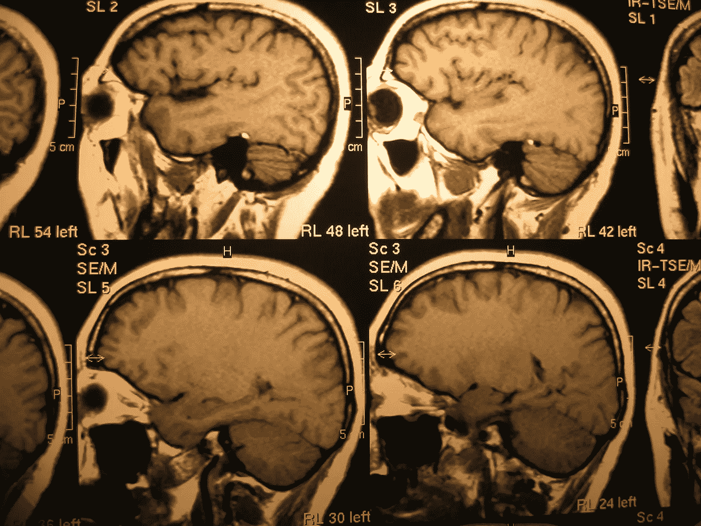
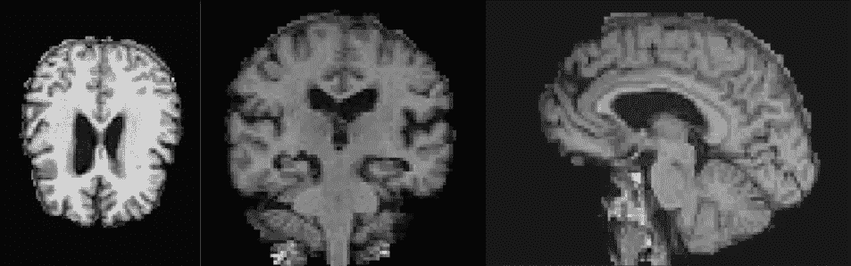
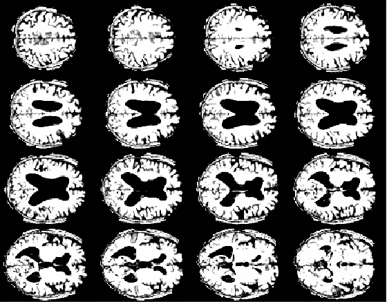

# 基于深度学习的阿尔茨海默病诊断:数据预处理

> 原文：<https://towardsdatascience.com/alzheimer-diagnosis-with-deep-learning-data-preprocessing-4521d6e6ebeb?source=collection_archive---------5----------------------->

## 预测阿尔茨海默病模型实施前的 MRI 数据预处理

阿伦·巴洛在[上的照片](https://www.freeimages.com/es/photo/x-ray-head-1435100)

> 本文是我揭露从我的人工智能硕士论文中提取的研究、实现和结论的系列文章的一部分。虽然[以前的一篇文章讨论了论文的探索阶段](/alzheimer-diagnosis-with-deep-learning-a-survey-265406fa542a)(文献综述)，但这篇文章介绍了**描述阶段**(数据预处理)的第一部分。[最后一篇文章](/alzheimer-diagnosis-with-deep-learning-model-implementation-5a0fd31f148f)将描述模型实现。
> 
> 整个项目可以在下面的 GitHub 资源库中找到:[https://github.com/oscardp96/TFM-Alzheimer-Diagnosis](https://github.com/oscardp96/TFM-Alzheimer-Diagnosis)
> 
> 感谢阅读

在[之前的一篇文章](/alzheimer-diagnosis-with-deep-learning-a-survey-265406fa542a)中，分析了阿尔茨海默病计算机化诊断的当前艺术状态。从该综述中，可以为基于 MRI 的分类系统的实现过程提取一些有趣的结论。这些结论归纳为以下几点:

*   卷积神经网络是模型实现的明显选择。关于是否应该使用任何其他机器学习或深度学习模型来代替，没有太多讨论。讨论主要集中在如何训练 CNN。
*   **图像配准**真的很重要。适应于参考图谱的多个医学图像将在图像的相同区域上表示相同的解剖结构。这将有助于 CNN 确定感兴趣的领域。
*   **颅骨剥离**可能是一种非常有用的消除噪声的技术。头骨的信息与阿尔茨海默氏症的诊断无关，因此消除这些信息可以简化模型训练。
*   必须决定数据集图像的**结构。可以使用多种图像类型，最常见的是 MRI 和 PET。此外，图像维度可以是 4D(时间序列)或 3D，但是可以被转换为 2D，它们可以被增强，可以从它们中提取补片，等等。**

在这个实验中，将训练两个神经网络:用 ImageNet 权重预训练的 2D InceptionV3 网络和 3D ResNet。

## 数据

本文准备过程中使用的数据来自阿尔茨海默病神经影像计划(ADNI)数据库(adni.loni.usc.edu)。因此，ADNI 的调查人员参与了 ADNI 的设计和实施和/或提供了数据，但没有参与分析或撰写本报告。ADNI 调查员的完整名单可在以下网址找到:[https://adni . loni . USC . edu/WP-content/uploads/how _ to _ apply/ADNI _ acknowledge ment _ list . pdf](https://adni.loni.usc.edu/wp-content/uploads/how_to_apply/ADNI_Acknowledgement_List.pdf)

从 ADNI 提供的数据中，获得了超过 3000 个 T1 加权的 MRI 图像。样本由年龄在 55 岁到 92 岁之间的患者组成，他们被分配到三个可能的标签中的一个:AD、MCI 和 NC。完整的分布情况见表 1。

表 1。磁共振图像的类别分布

在整个样本中，15%保留在训练之外，作为测试集。同时，从剩余的训练集中分离出另外的 15%作为验证集，用于随着训练的进行(随着每个时期)评估模型的质量。

## 工具

生物医学数据的预处理可能相当复杂，但在本实验中，该过程是使用对所有图像不加区分地应用的库和开源工具来执行的，以寻求最佳的可能结果，但没有单独处理每幅图像。这是测试当今可用工具在多大程度上使构建这种类型的系统成为可能的好方法，因为对于在放射学方面没有深入经验的数据科学家来说，单独的图像处理可能是负担不起的。如上所述，以下工具用于图像预处理:

*   用于医学成像的 [*深度学习工具包*](https://dltk.github.io/)(DLTK)【1】是一个 TensorFlow 扩展，它提供了有用的方法和模型来实现对生物医学图像的深度学习。虽然这个框架不用于模型实现，但它对于图像预处理非常有用，为图像的白化和空间归一化提供了基本方法。此外，这个框架允许简单快速的实验，尽管许多使用的方法并没有在最后的工作中应用。
*   [SimpleITK](https://simpleitk.org/) 用于转换。ADNI 提供的 nii 图像放入 numpy 数组。

如何加载。nii 图像作为 numpy 数组，中间使用 SimpleITK 格式

*   使用 simple elastix【2】将 ADNI 图像配准到 [MNI 305 图谱](https://www.bic.mni.mcgill.ca/ServicesAtlases/MNI305)【3】【6】。这是一个建立在 SimpleITK 上的医学图像配准库。
*   对于颅骨剥离，使用了由[ni type](https://nipype.readthedocs.io/en/0.12.1/index.html)[8]库实现到 Python 中的 [FSL 打赌](https://nipype.readthedocs.io/en/0.12.1/interfaces/generated/nipype.interfaces.fsl.preprocess.html) [7】工具。尽管 FSL BET 本身可以作为 UNIX 系统的命令行工具，但是 Nipype 方法允许在 Python 环境中执行它。

## 空间标准化

空间归一化预处理步骤旨在确保数据集的所有图像的空间结构尽可能相似。最初，来自 ADNI 的图像有相当多不同的形状，数据库中不同的图像已经用不同的技术进行了预处理。由于这个原因，图像需要重新采样到一个共同的各向同性分辨率，并需要注册到一个共同的地图集。

因此，在第一步中，图像被重新采样到 2mm 的各向同性分辨率，这意味着每个体素将代表“真实”世界中 2mm 的空间。为此，创建了一个非常简单的方法，基于代码片段包括[，这里是](https://medium.com/tensorflow/an-introduction-to-biomedical-image-analysis-with-tensorflow-and-dltk-2c25304e7c13) [1]。注意，该方法采用 SimpleITK 格式的图像，而不是 numpy 数组。

图像重采样方法

一旦图像被重新采样，它就可以被注册到参考图像。一个地图集基本上是一个像其他任何图像一样的图像，它可以用同样的方式管理。它还应该被重新采样到与其余图像相同的各向同性分辨率:

加载和重采样地图集图像

将 MNI 305 地图集重新采样到 2mm 的各向同性分辨率，得到了最终分辨率为 78x110x86 的图像。因此，在配准之后，数据集中的每个图像将具有相同的分辨率。

对于图像配准，使用 SimpleElastix 实现了以下方法。值得一提的是，使用了仿射变换，因为非刚性变换要慢得多，而且往往会扭曲最终图像。

图像配准方法

在定义了重采样和配准方法并加载了图集之后，可以构建完整的预处理流程。最初，ADNI 数据库混合了所有图像，忽略了标签(AD/MCI/NC)，而是提供了一个描述文件(。csv)，其中标签可以使用图像 ID 进行索引。因此，对于每个图像，该预处理流程应该:

1.  加载图像并提取其标签。
2.  对图像进行重新采样，并将其配准到图集。
3.  将映像写入一个新的磁盘位置，组织在一个允许轻松识别其标签的文件夹中。

对于最后一步，应该准备一个目标文件夹:

最后，可以实现主要的预处理方法:

使用这种方法，剩下的就是遍历原始数据库来预处理所有的图像。这可以使用简单的循环来完成。

## 颅骨剥脱术

在空间标准化之后，执行颅骨剥离步骤，以从图像中移除不相关的信息，仅留下脑组织。如前所述，FSL 打赌是用于这一点，运行在 Nipype。这里的关键是为主要的超参数找到合适的值:分数强度阈值。它基本上测量算法在去除不代表脑组织的图像成分方面的积极性。非常小的值会在图像中留下一些不相关的信息，而非常大的值会移除一些脑组织。

这里的问题是，由于不是所有的 MRI 数据在存储到 ADNI 数据库之前都以相同的方式获得和预处理，因此为整个数据集找到理想的分数强度阈值是不可行的。同时，保持一个简单的方法是这个实验的一个关键方面。所以在多次测试后，使用了 0.2 的阈值，因为它能够为大多数图像保持正确的平衡，而不是对大多数图像都完美。

颅骨剥离方法

一旦实施了颅骨剥离方法，可以迭代空间归一化图像以生成新的颅骨剥离数据集。

对整个数据库应用颅骨剥离

图 1 最后显示了完全预处理的 MRI 的三个切片。它被重采样到 2mm 的各向同性分辨率，注册到 MNI 305 地图集，并被剥离头骨。在此图像中，几乎没有任何头骨的痕迹，也没有丢失脑组织，但在其他情况下，可能会出现这些情况之一，因为分数强度阈值 0.2 并不适用于所有图像。

图一。轴向，冠状和矢状切面，分别配准和颅骨剥离图像。作者图片

## 准备 2D 数据集

数据集的当前状态将允许训练 3D 卷积神经网络，这是本文开始时建立的目标之一。另一个目标是微调用 Imagenet 预训练的 InceptionV3 网络，这将需要一个二维数据集。

对于 3D 到 2D 变换，从[9]的工作中得到启发，实现了一个简单的算法。它包括制作多个轴向(水平)切口，并将它们放置在同一平面上，以构建二维图像。更具体地说，从每个 3D 图像中取出 16 个不同的切片，并放置在 4x4 图像的“矩阵”上。产生的二维图像被复制三次以采用 RGB 尺寸。因此，110x86 大小的 16 个切片产生 440x344x3 的图像。

在提取切割之前，3D 图像被标准化为具有零平均值和单位标准偏差。换句话说，应用了白化过程。随后，在轴向高度 28 和 60 之间选择 16 个切片，在多次测试后发现这代表了足够的信息。高度大于 60 的切片显示了非常远的大脑上部，高度小于 28 的切片显示了脑干的大部分区域。16 个切片彼此等距分布，即从每两个切片中提取一个轴向切片。结果示例可以在图 2 中看到。

图二。2D 转换后的结果图像示例。请注意，在这种情况下，颅骨剥离过程并不像图 1 中那样有效。作者图片

以下代码显示了创建 2D 图像的方法:

将 3D MRI 转换成 2D 的方法

该方法在另一个方法中使用，该方法加载 3D 图像并应用白化过程。该方法必须在数据集的所有图像上运行。为了简洁起见，本文不打算展示这最后一个基于循环的代码，但是可以在这里查看[。](https://github.com/oscardp96/TFM-Alzheimer-Diagnosis/blob/master/Code/Image%20Preprocessing.ipynb)

白化和应用 2D 变换

## TFRecords 数据库和培训/测试拆分

如前所述，谷歌实验室用于模型训练。这个平台有两个限制因素:

*   模型训练有时间限制，所以训练过程尽可能快是很重要的。
*   它提供了 12GB 的内存，这显然不足以在内存中加载所有 3000 张图像，尤其是来自 3D 数据集的图像。

第一个问题没有真正的解决方案，它总是一个限制因素。但是，第二个问题可以通过构建 TFRecords 数据库来解决。 [TFRecords](https://www.tensorflow.org/tutorials/load_data/tfrecord) 是 Tensorflow 提供的一个解决方案，允许以一种特殊的格式保存数据集，使用张量可以更快读取的文件。这需要复制硬盘上的信息，以这种格式保存，但这也比使用 Python 的原生生成器快得多。

这个过程非常普通，所以为了简洁起见，本文将不解释代码。这里可以结账[。](https://github.com/oscardp96/TFM-Alzheimer-Diagnosis/blob/master/Code/BuildingTFRecordsDB.ipynb)

## 未来的步骤

本文描述了构建 3D 和 2D MRI 数据集的过程。所有图像都可以用于训练深度学习模型，这将在未来的文章中讨论。

## 参考

[1] M. Rajchl，S. I. Ktena，n .鲍洛夫斯基，【TensorFlow 和 DLTK 生物医学图像分析导论 (2018)，Medium.com

*[2] K. Marstal、F. Berendsen、M. Staring 和 S. Klein， [SimpleElastix:用于医学图像配准的用户友好的多语言库](https://www.cv-foundation.org/openaccess/content_cvpr_2016_workshops/w15/papers/Marstal_SimpleElastix_A_User-Friendly_CVPR_2016_paper.pdf) (2016)，IEEE 计算机视觉和模式识别研讨会会议录，第 134-142 页*

*[3] A. C. Evans，[来自 250 名年轻正常受试者的基于 MRI 的立体定向图谱](https://ci.nii.ac.jp/naid/10029626680/) (1992)，Soc。神经科学。文章摘要*

*[4] D. L. Collins，P. Neelin，T. M. Peters 和 A. C. Evans，[标准化 Talairach 空间中 MR 体积数据的自动 3D 主体间配准](https://europepmc.org/article/med/8126267) (1994) *，*《计算机辅助断层摄影杂志》，第 18 卷，第 2 期，第 192-205 页*

*[5] A. C. Evans *等*，[立体定位坐标空间中功能激活的解剖标测](https://www.sciencedirect.com/science/article/pii/1053811992900069) (1992)，神经影像，第 1 卷，第 1 期，第 43–53 页*

*[6] A. C. Evans、D. L. Collins、S. R. Mills、E. D. Brown、R. L. Kelly 和 T. M. Peters，[来自 305 个 MRI 卷的 3D 统计神经解剖学模型](https://www.ece.uvic.ca/~bctill/papers/learning/Evans_etal_1993.pdf) (1993)，IEEE 会议记录核科学研讨会和医学成像会议，第 1813-1817 页*

*[7] S. M. Smith，[快速鲁棒的自动大脑提取](https://onlinelibrary.wiley.com/doi/pdfdirect/10.1002/hbm.10062) (2002 年)，人类大脑绘图，第 17 卷，第 3 期，第 143-155 页*

*[8] K. Gorgolewski *等*，[ni type:python 中灵活、轻量、可扩展的神经影像数据处理框架](https://www.frontiersin.org/articles/10.3389/fninf.2011.00013/full?source=post_page---------------------------) (2011)，《神经信息学前沿》，第 5 卷，第 13 页*

*[9] Y. Ding 等，[利用脑的 18F-FDG PET 预测阿尔茨海默病诊断的深度学习模型](https://pubs.rsna.org/doi/pdf/10.1148/radiol.2018180958) (2018)，放射学，第 290 卷，第 2 期，第 456–464 页*

> *再次感谢您的阅读。让我们在 LinkedIn 上继续这个对话:[https://www.linkedin.com/in/oscar-darias-plasencia/](https://www.linkedin.com/in/oscar-darias-plasencia/)*