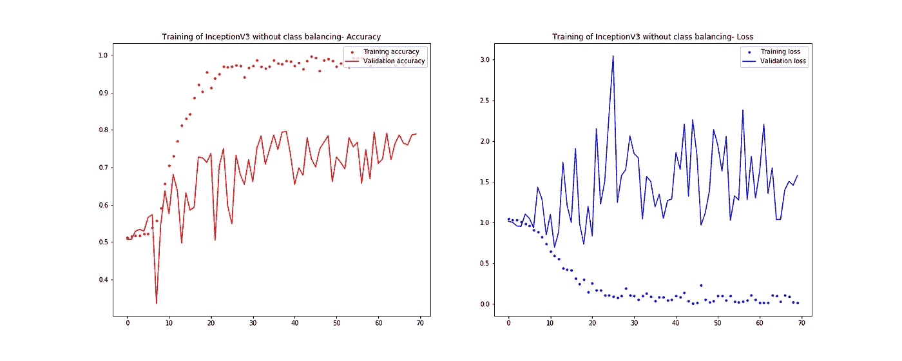
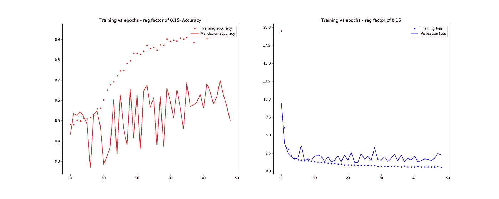
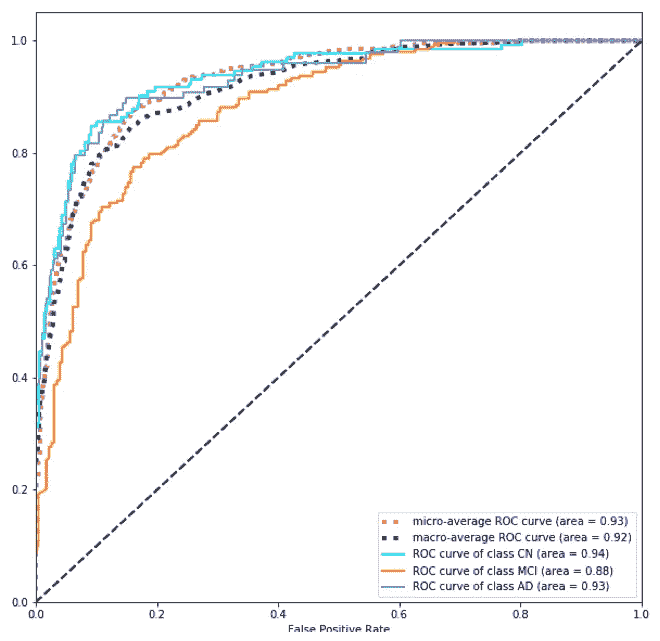
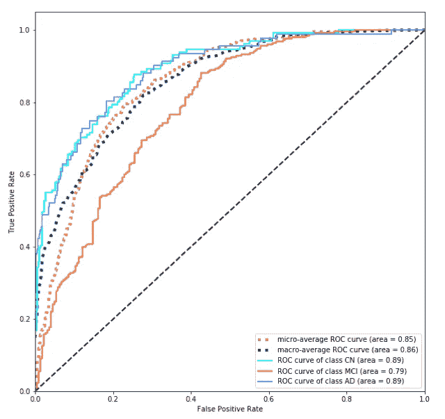

# 基于深度学习的阿尔茨海默病诊断:模型实现

> 原文：<https://towardsdatascience.com/alzheimer-diagnosis-with-deep-learning-model-implementation-5a0fd31f148f?source=collection_archive---------18----------------------->

## [实践教程](https://towardsdatascience.com/tagged/hands-on-tutorials)

## 阿尔茨海默病预测与深度学习的模型实现策略比较

[国立癌症研究所](https://unsplash.com/@nci?utm_source=medium&utm_medium=referral)在 [Unsplash](https://unsplash.com?utm_source=medium&utm_medium=referral) 上拍摄的照片

> *本文是我揭露从我的人工智能硕士论文中提取的研究、实现和结论的系列文章的一部分。第一篇文章论述了论文的探索阶段(* [*文献综述*](/alzheimer-diagnosis-with-deep-learning-a-survey-265406fa542a) *)，第二篇文章呈现了第一部分的* ***描述阶段*** *(* [*数据预处理*](/alzheimer-diagnosis-with-deep-learning-data-preprocessing-4521d6e6ebeb) *)。这最后一篇文章介绍了这个描述阶段的第二部分:模型实现，比较两种常用的策略*
> 
> *整个项目可以在下面的 GitHub 资源库中找到:*[*https://github.com/oscardp96/TFM-Alzheimer-Diagnosis*](https://github.com/oscardp96/TFM-Alzheimer-Diagnosis)
> 
> *感谢阅读*

在[之前的文章](/alzheimer-diagnosis-with-deep-learning-data-preprocessing-4521d6e6ebeb)中，对 MRI 图像的两个数据集进行了预处理，目的是训练两个卷积神经网络:用 ImageNet 权重预训练的 2D 概念 3 网络和 3D ResNet 并转换成 TFRecords 文件。本文描述了构建和训练这些模型的过程。随后，对结果进行分析和比较，得出一系列实施阿尔茨海默病计算机诊断模型的建议。

**第一步**

1.  导入需要使用的主库。

2.声明常量，这些常量定义 TFRecords 文件的路径以及用于保存定型模型和所有定型、验证和测试信息的目标文件夹。

3.定义一种方法来计算三种标签在测试集上的 AUC。注意这个方法是如何被设计来接收一个训练好的模型和测试数据的。

**盗梦空间 V3**

随着近年来将预训练 ImageNet 网络用于医疗应用的成功趋势[1] — [4]，创建的 2D 数据集用于微调 Inception V3 网络。完整的代码，包括几个测试和实验，可以在这里查看。在本文中，描述了主要过程。

第一步是解码 TFRecords 数据，检索图像数据和类标签。为此，创建了以下方法:

使用这些方法，可以定义训练张量和验证张量。此外，还会导入 Keras 预定义的 InceptionV3 网络。

对 Keras 中定义的默认 InceptionV3 模型的唯一修改是具有 512 个单元和 80%的下降正则化的最终层，以及最终的 softmax 层。

在第一个训练阶段，只有新定义的最后两层用 Adam 优化器训练 10 个时期，使用 1 *e-4* 的学习率和 8 的批量。还设置了 0.001 的学习率衰减。

接下来，对整个网络进行微调，将历元的数量增加到 70 个，并将学习速率衰减到 1 *e-7* ，并保持其余的超参数值不变。分类交叉熵是损失函数，准确性也被监控以指导训练过程。然而，值得注意的是，由于类别不平衡，准确性不是一个很好的指标[5]，因此指导本实验的主要评价指标是 AUC。在本文的后面部分，将介绍和讨论获得的最佳 AUC。

该模型还被训练为在 MCI 类上执行欠采样，当与 AD 或 CN 相比时，MCI 类被过度表示。然而，正如之前其他研究表明的那样[5]，这种策略并没有改善结果。

**ResNet3D**

实施的第二种方法基于适用于体积数据的残差网络，在 Keras 上实施[，完整代码可在此处](https://github.com/JihongJu/keras-resnet3d)查看[。在这种情况下，3D 数据集用于训练。与 2D 数据相比，解码 3D TFRecords 数据的过程略有不同:](https://github.com/oscardp96/TFM-Alzheimer-Diagnosis/blob/master/Code/Using%20a%20Resnet3D.ipynb)

训练一个 3D 建筑是一个非常慢的过程，它增加了对更多图像的需求。一般来说，网络越复杂，需要处理的信息越多，需要学习的观察数据就越多。由于这些限制，只对两个最小的可用网络进行了测试，分别由 18 层和 34 层组成。

18 层 3D ResNet 的最后一层被移除，并添加了一个具有 512 个单元的全连接层，具有 80%的下降率和最后的 *softmax* 层。这是为 Inception V3 模型执行的相同过程。使用 Adam 优化器对其进行 50 个时期的训练，学习率为 10e 5，批次大小为 8。分类交叉熵被用作损失函数，准确性也被监控。模型很容易陷入过度拟合，所以用控制 L2 正则化的正则化因子( *r* eg_factor)进行了一些实验。最佳值介于 0.03 和 0.05 之间，它们之间的差异很小。

使用 70 个时期，用类似的超参数训练 34 层 3D ResNet。训练一个 50 层的网络是难以忍受的，因为只有三个时期需要大约 30 分钟。

## 结果

为了研究实施的网络的潜力，进行了几次培训尝试，但由于基础设施的限制，交叉验证和其他更严格的验证技术是不可能的，这意味着谷歌联合实验室不是一个适合长期培训大规模网络的平台。尽管如此，从结果中可以得出有趣的结论。

微调 Inception V3 网络始终比训练 3D 残差网络产生更好的结果，这可能是因为网络复杂性和可用数据量的差异。然而，在两种模型上的训练是高度不规则的，并且控制过度拟合成为一项困难的任务。例如，图 1 示出了当训练 Inception V3 模型时验证损失和准确性的演变。其他训练尝试产生了类似的结果，具有阶梯状曲线和不规则的结果。与训练损失(图 2)相比，只有具有较高正则化因子(0.05)的 ResNet3D-18 保持了验证损失的适度发展，但总体结果最终比初始 V3 或较低正则化因子(0.03)更差。

图一。当训练 70 个时期的 Inception V3 模型时，准确性(左)和损失(右)的演变。结果非常不规则

图二。训练正则化因子为 0.05 的 18 层 ResNet3D 时精度(左)和损失(右)的演变

尽管准确性和损失的演变并没有表明结果接近可以被认为是体面的，但当查看测试预测的 ROC 和 AUC 值时，可以得出非常不同的结论。图 3 示出了通过微调 Inception V3 网络获得的最佳结果。该模型保持了一种非常简单的方法，是三级分类中最强的模型之一，正如在研究 AUC 值时的现有技术中所述。值得注意的是，代表性过强的阶层也是该模式遇到最大困难的阶层(MCI)。同样的情况也发生在[1]中，这里的过度表示不太明显，所以这些困难可能是这些类的本质所固有的。

图 3。通过微调 Inception V3 网络获得最佳结果。无欠采样

图 4 示出了通过训练 18 层 ResNet3D 获得的最佳结果。将深度增加到 34 层并没有导致更好的结果，尽管由于训练的缓慢，对这种深度的实验是有限的。尽管如此，通过微调 Inception V3，结果明显更好，因此使用 3D 架构似乎没有任何有趣的潜力，至少在标记数据有限的情况下。

图 4。使用 ResNet3D、18 层和正则化因子 0.03 获得最佳结果

## 分析和讨论

将结果与当前的技术水平联系起来，应该考虑两个出版物。在[1]中，作者保留了基于 2D 变换和微调 Inception V3 的类似方法。该出版物中获得的结果高出约 5 个百分点，AD 类的 AUC 为 0.98，而本研究中获得的 AUC 为 0.93。然而，这两项研究之间存在着值得注意的关键差异。

第一，扫描类型。虽然在这项工作中使用了 T1 加权 MRI 图像，但在[1]中使用了 18FGD-PET 图像。这种差异很重要，因为 MRI 图像更便宜，对病人无害[6] — [8]。这可能会导致对使用 MRI 图像进行阿尔茨海默病计算机诊断的兴趣增加。

第二，基于简单性的方法。尽管 2D 转化过程非常相似，但该出版物的作者执行了更复杂的步骤。例如，“通过选择代表超过 100×100𝑚𝑚的脑实质的最颅侧和最尾侧部分，使用连通分量分析来导出相关的成像体积”[1]。一个更简单的过程，像在这个实验中执行的过程，被证明能够产生体面的，虽然明显较差的结果。此外，在这项研究中，图像配准和颅骨剥离进行了易于使用的工具。

关于 3D 网络，考虑了[9]中的结果。该研究还试图通过直接使用 3D 图像和体积残差网络来保持一种非常简单的方法。当考虑本研究中获得的最佳模型时，结果非常相似。例如，在[9]中 AD 对 NC 的 AUC 约为 0.87，而两类的 AUC 达到 0.89，如图 5 所示。这里的关键区别在于，这项研究执行三类分类，而在[9]中，作者构建了多个二元分类器。一方面，本研究获得的结果可以表明，多类分类是一个同样可行的发展道路。另一方面，值得一提的是，在[9]中，考虑的是平均值，而在本文中，考虑的是最大值。由于硬件限制，无法执行进一步的验证。

最后，应该注意的是，这些类型的模型在真正的临床环境中部署之前还有很长的路要走。直接看结果，很难说它们足够精确。然而，其他研究也确实与放射科医生进行了直接比较，并得出了令人惊讶的结论，表明这些模型明显更优越[1]，[10]。在这种情况下，最好的模型应该总是直接与人类专业人员进行比较，以便提取真实质量的度量，并估计在真实环境中部署它们是否真的可行。

## 推荐

在对结果进行彻底分析并与近年来的其他重要工作进行比较后，可以向开始研究基于人工智能的阿尔茨海默氏症诊断系统的数据科学家提出一系列建议。

首先，应该注意的是，卷积神经网络的使用应该是直接的选择，因为它们实际上捕获了一般医学图像分析中的所有应用，而不仅仅是在阿尔茨海默氏病诊断中。

其次，说到数据，可以说 ADNI 数据库包含了足够高质量的图像来构建好的模型。这是可以从以前的工作中得出的结论[9]。然而，处理这些信息有点复杂，因为可用的开源工具并不完美，尤其是在颅骨剥离方面。可取的做法是对图像进行分组处理，或者根据在 ADNI 系统上存储之前对图像进行的预处理步骤，或者甚至根据获取图像的硬件的特性；寻求适当地调整分数强度阈值(在 FSL 下注的情况下)。问题是，管理阈值是否正确的唯一方法是直接观察结果，对于非常大的图像集，这可能非常昂贵。

第三，图像注册工具工作得很好。它们足以自动处理图像，只要它们被注册到相同模态的图谱(在本工作的情况下，T1 加权)，并且所有图像被归一化到相同的空间分辨率。在这一点上，应该注意，空间分辨率越高，得到的图像就越大，并且每个体素将代表更小的区域。这表明使用 1𝑚𝑚的各向同性分辨率对于细节来说会更好，但是更大尺寸的图像会使训练过程更慢。所以是时间和硬件能力的问题。

第四，关于图像的结构，将图像转换成 2D 是可取的，即使这是通过一个非常简单的程序，如在这项工作中使用的程序。3D 网络的训练要复杂得多，速度更慢，效果更差，至少在可用数据的情况下是如此。另一方面，2D 网络训练速度更快，而且有各种各样的先进模式可供微调。此外，它们更直观，因为它们需要像放射科医师那样以类似的方式定位问题，分别检查多个切面或切片。

第五，就扫描类型而言，MRI 和 PET 都可以使用。后者不需要颅骨剥离，并且在其他出版物中显示了极好的结果，但是它们获得起来更昂贵并且对患者更有害。另一方面，MRI 价格低廉，对患者无害，但需要更仔细的预处理。最终，选择归结于可用性和利益相关者的偏好。

第六，决定如何进行培训也很重要。一般来说，使用公认的架构，比如 Inception 或 ResNet，应该是默认的选择，因为它们已经被证明在各种各样的应用程序中非常好。在这项工作的情况下，使用小批量和小学习率已经获得了更好的结果。Adam 之类的自适应优化器也非常适合。此外，最近的工作也遵循这些准则[1]，[9]。

最后但同样重要的是，主要建议是不要部署这种类型的系统。疾病的诊断是一个极其敏感的问题，不仅需要出色的结果——在写这几行字的时候还没有达到——还需要对模型的可靠性进行深入的检验。在未来的几年里，越来越多的可用数据将缓解这些问题，但目前还需要更多更好的研究。

## 参考

[1] Y. Ding 等，[利用脑的 18F-FDG PET 预测阿尔茨海默病诊断的深度学习模型](https://pubs.rsna.org/doi/pdf/10.1148/radiol.2018180958) (2018)，放射学，第 290 卷，第 2 期，第 456–464 页

[2] V. Gulshan 等人，[用于检测视网膜眼底糖尿病视网膜病变的深度学习
算法的开发和验证
照片](https://research.google/pubs/pub45732.pdf) (2016)，Jama，第 316 卷，第 22 期，第 2402–2410 页

[3] S. Vesal，N. Ravikumar，A. A. Davari，S. Ellmann 和 A. Maier，[使用迁移学习对乳腺癌组织学图像进行分类](https://arxiv.org/pdf/1802.09424) (2017)，PLoS One，第 12 卷，第 6 期，第 812-819 页

[4] A. Esteva 等人，[皮肤病学水平的皮肤癌分类
与深度神经网络](http://202.113.61.185/xc-ftp/Paper2/Deep_Learning/Dermatologist-level%20classification%20of%20skin%20cancer%20with%20deep%20neural%20networks.pdf) (2017)，《自然》，第 542 卷，第 7639 号，第 115 页

[5] M. A. Mazurowski、P. A. Habas、J. M. Zurada、J. Y. Lo、J. A. Baker 和 G. D. Tourassi，[为医疗决策训练神经网络分类器:不平衡数据集对分类性能的影响](https://www.ncbi.nlm.nih.gov/pmc/articles/pmc2346433/) (2008)，《神经网络》，第 21 卷，第 2–3 期，第 427–436 页

[6] Hoffman，John M .等人[病理证实的痴呆患者的 FDG PET 成像](https://jnm.snmjournals.org/content/jnumed/41/11/1920.full.pdf) (2000)《核医学杂志》，第 41 卷，第 11 期，第 1920-1928 页

[7] Nordberg，Agneta 等人[PET 在阿尔茨海默病中的应用](https://www.researchgate.net/profile/Agneta_Nordberg/publication/41414505_The_use_of_PET_in_Alzheimer_disease/links/0fcfd507d2d7c117b9000000.pdf) (2010)《自然评论神经学》，第 6 卷，第 2 期，第 78-87 页

[8] Pichler，Bernd J .等人 [PET/MRI:为下一代临床多模态成像应用铺平道路](https://jnm.snmjournals.org/content/51/3/333.full.pdf+html) (2010)《核医学杂志》，第 51 卷，第 3 期，第 333-336 页

[9] S .科洛列夫、a .萨菲尤林、m .贝尔亚耶夫和 y .多多诺娃，[用于 3D 大脑 MRI 分类的残差和普通卷积神经网络](https://arxiv.org/pdf/1701.06643) (2017)，IEEE 第 14 届国际生物医学成像研讨会(ISBI 2017)，第 835-838 页

[10]klp pel，Stefan 等人[痴呆症诊断的准确性——放射科医生和计算机化方法之间的直接比较](https://academic.oup.com/brain/article/131/11/2969/373488) (2008)《大脑》，第 131 卷，第 11 期，第 2969-2974 页