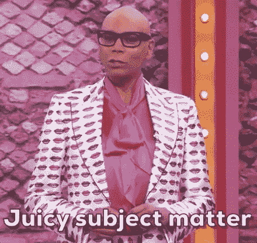
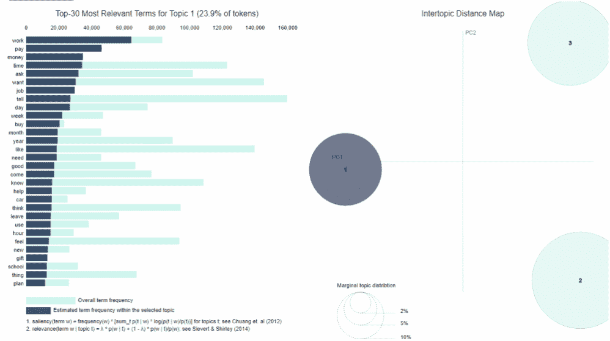
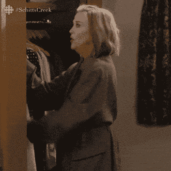
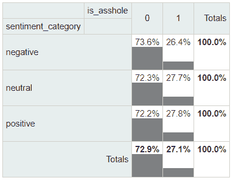
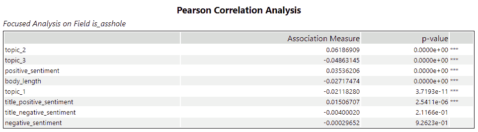
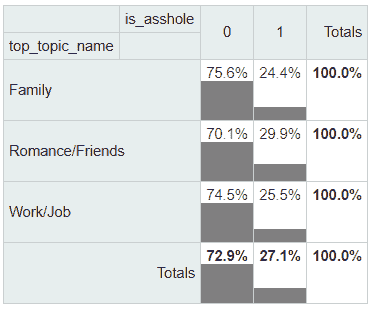

# 我是那个分析 Reddit AITA 帖子的数据怪胎吗？是的。

> 原文：<https://towardsdatascience.com/am-i-the-data-geek-who-analyzed-reddit-aita-posts-yes-4954a8d37055?source=collection_archive---------16----------------------->

## 我们试图用主题建模、情感分析和一些好的统计数据来回答我们这个时代的经典问题。

*照片由* [*苏珊 Q 尹*](https://unsplash.com/@syinq?utm_source=unsplash&utm_medium=referral&utm_content=creditCopyText) *上* [*下*](https://unsplash.com/@ssivek/likes?utm_source=unsplash&utm_medium=referral&utm_content=creditCopyText)

是数据集一直在呼唤我的名字。我不太确定这说明了我什么。

自从我听说它，我就想探索一个来自红迪网帖子的[数据集](https://github.com/iterative/aita_dataset)，它来自一个著名的叫做[的子编辑“我是个混蛋吗？”](https://www.reddit.com/r/AmItheAsshole/) (AITA)，用户发布冲突的故事，在这些故事中，他们不确定自己是否做了正确的事情，或者相反，嗯，是个混蛋。其他用户根据他们的判断进行评论和投票:你是混蛋(YTA)，不是混蛋(NTA)，这里每个人都很烂(ESH)，这里没有混蛋(NAH)，或者信息不够(Info)。

*图片经由* [*GIPHY*](https://media.giphy.com/media/6RoOocJxK3Ypq/giphy.gif)

该数据集包含超过 97，000 个帖子的文本，以及投票结果和每个帖子的评论数量。只有大约 27%的案例中，用户给出了 YTA 或 ESH 的判断，这意味着几乎四分之三的案例被判断为不包含任何错误。这实际上是对人性和我们担心做正确的事情的倾向的安慰。

尽管混蛋只是少数，我们可以进一步挖掘这个复杂的人类情况的丰富数据集。这是很多文本，但我们在 Alteryx Designer 中有必要的工具，还有来自[Alteryx Intelligence Suite](https://www.alteryx.com/products/alteryx-platform/intelligence-suite)的[文本挖掘](https://help.alteryx.com/20212/designer/text-mining)调色板。

我决定使用这些工具和数据调查工具面板来探索 AITA 邮报中有趣的模式。享受这个稍微有点粗鲁的情感分析、主题建模和相关性复习。也许我们会在这个过程中对人类行为有更多的了解。

> ***一些 AITA 帖子的标题和判断***
> 
> ***AITA……***
> 
> 当我的狗舔我的胳膊时，我替它把口水擦掉了？(NTA)
> 
> *因为在 2013 年过期的 sriracha 酒瓶上发表评论？(YTA)*
> 
> *因为我只想把我的秘密圣诞礼物送给他们的猫？(NTA)*
> 
> *因为我把我室友所有发霉的脏盘子和垃圾放在她的浴室里？*(NTA)
> 
> 因为对这个大富翁游戏感到不安？(YTA)
> 
> 把糖果藏在商店里，这样我就可以在打折的时候买了？(YTA)

# 匆忙做出判断:文本分析的三个简单步骤

数据集非常干净(至少从数据的角度来看)，所以我只是整理了一些小的文本格式问题，并为原始帖子的长度创建了一个新变量。我认为，看看帖子的长度——情况的复杂性和/或某人认为他们必须解释自己的程度——是否与其他变量相关会很有趣。

在对文本进行任何其他处理之前，我使用了[情感分析工具](https://community.alteryx.com/t5/Data-Science/Try-Sentiment-Analysis-with-Designer-You-Must/ba-p/589153)来评估每个帖子的标题和正文的积极、中性或消极价值，或情感权重。VADER，这个工具背后的算法，被设计成即使在包含 NSFW 单词，表情符号，夸张的标点符号的文本上也能很好地工作！！！以及社交媒体内容中的其他奇怪现象。所有这些都应该原封不动地留给情感分析。

*图像通过* [*GIPHY*](https://media.giphy.com/media/vttfd2k9qktNey2Zcp/giphy.gif)

然而，在主题建模之前，我准备了更多的文本。文本预处理工具处理了这个大任务。(请在我们关于文本规范化的帖子的第一部分和第二部分[T21 中阅读相关内容。)这个工具基于 Python NLP 库](https://community.alteryx.com/t5/Data-Science/Text-Normalization-in-Alteryx/ba-p/611283) [spaCy](https://github.com/explosion/spaCy) ，它会对文本进行归一化和过滤。它做了一件奇怪的事情:它用符号-PRON-代替了代词。如果你在互联网上呆过一段时间，你可能会怀疑 spaCy 指的不是代词。实际上，这个缩写是它在文本中对代词的替代。我用公式工具中的 [REGEX_Replace](https://help.alteryx.com/20212/designer/string-functions#regex_replace) 函数从标题和处理后的文章文本中删除了所有这些符号。

然后，我将主题建模工具添加到工作流中，[将其配置为](https://community.alteryx.com/t5/Data-Science/Getting-to-the-Point-with-Topic-Modeling-Part-2-How-to-Configure/ba-p/613596)来识别帖子中的三个主题。由此产生的[可视化](https://community.alteryx.com/t5/Data-Science/Getting-to-the-Point-with-Topic-Modeling-Part-3-Interpreting-the/ba-p/614992)非常容易解释；看看下面的 GIF 图，看看出现的主要话题。

*话题一:工作/工作；话题二:浪漫/友谊；主题 3:家庭(作者图片)*

基于每个话题的关键词列表和对 AITA 语境的了解，这三个话题可以说代表了“家庭问题”、“爱情/朋友关系冲突”和“工作/工作问题”在主题间距离图中，这三个主题被很好地分开，描述每个主题的单词列表也很有意义。主题建模工具还为数据集中的每个帖子添加每个主题的分数，反映该主题在帖子中出现的程度。

在超过 97，000 个帖子中快速找到主要主题，并分析其中的情绪，这真是太棒了。但是这些主题和情绪水平与用户对 AITA 的评价有联系吗？为了找到答案，我打开了数据调查工具面板，看看我们能在这些帖子和回复中找到什么样的模式。

*图像通过* [*GIPHY*](https://media.giphy.com/media/l1J9LVgNqSYv71Ag8/giphy-downsized.gif)

# 调查一个洞和情绪

[列联表工具](https://community.alteryx.com/t5/Alteryx-Designer-Knowledge-Base/Tool-Mastery-Contingency-Table/ta-p/356042)使得比较分类变量并查看它们的值如何一致变得容易。这是一个更近距离观察情感分析结果和 AITA 判断的好方法。我们可以用数据集中提供的“is _ 屁眼”变量来比较标题和帖子的正面或负面情绪。(如果最终投票结果不是混蛋，这里没有混蛋，或者信息不够，is _ 混蛋变量为 0，如果结果是你是混蛋或者这里的每个人都很烂，变量为 1。)

也许令人惊讶的是，就数量而言，被判定为含有虚假内容的标题和帖子的情感价值并没有太大的区别。积极的帖子实际上比消极的帖子更容易被认为是 YTA 或 ESH。

*帖子情感与屁眼存在的对比(图片由作者提供)*

使用[关联分析工具](https://community.alteryx.com/t5/Alteryx-Designer-Knowledge-Base/Tool-Mastery-Association-Analysis/ta-p/40459)稍微深入一点，我们可以检查出我们的情感价值分数、主题得分和我添加的帖子长度变量之间的相关性。我选择了“目标字段进行更详细的分析”选项，以获得这些变量与“is _ 屁眼”变量关系的 [p 值](https://community.alteryx.com/t5/Data-Science/The-Data-Science-Celebrity-Q-amp-A-Meet-P-Value-aka-p-value/ba-p/743016)。

这里我们看到，有点令人惊讶的是，虽然在头衔和帖子中的负面情绪与无知没有显著的相关性，但在头衔和帖子中的*正面*情绪却有。所以对一种情况持积极态度可能会让你更有可能被 YTA，或者至少你会被别人这样评价。

*作者图片*

当然，皮尔逊相关是基于变量之间的线性关系；我们也可以尝试一下 [Spearman 相关工具](https://help.alteryx.com/20212/designer/spearman-correlation-tool)，它的计算并没有假设线性关系。与皮尔逊相关一样，越接近-1 或 1 的值分别表示越强的负相关或正相关。

职位的积极性和“是混蛋”之间的 Spearman 相关系数是 0.31。标题越正面，越有可能被判定为无信仰。(有了这个数据集，我们不得不有点怀疑；例如，一个正价值很高的帖子标题是“最好的朋友聚会便壶惨败”VADER 可能会被“最好的朋友”和“派对”这两个快乐的词搞得有点晕头转向，但不会注意到标题中最后两个相关的词。)

*《AITA 邮报》最正面的标题，最初都以“AITA”开头(图片由作者提供)*

帖子的积极性和 is _ 屁眼之间的 Spearman 相关性只有 0.04，所以标题在设定选民的期望方面可能更重要(尽管我们不能假设这有因果关系)。

*图像通过* [*GIPHY*](https://media.giphy.com/media/PH5B8oLFhjOLb9mIsz/giphy-downsized.gif)

# 家里和工作上的漏洞

关于感情，说够了；哪些话题似乎涉及到最多的学问？当人们分享家庭、爱情/友谊或工作时，他们更容易被认为是混蛋吗？我们可以看看上面的相关性来进行比较，但也可以把它们看作类别。我确定了每个帖子的三个主题中哪个得分最高，然后比较了这些主题是如何被全面评判的。另一个列联表工具揭示了下面的比较。

*作者图片*

事实证明，坏行为在我们的生活中分布相当均匀，至少根据这些情景和判断是这样的。Reddit 的投票者对家庭和工作情况稍微宽容一些，对爱情/友谊问题的判断稍微严厉一些，但比例并没有太大不同。

*图片经由* [*GIPHY*](https://media.giphy.com/media/6PAbFX7jVXWTK/giphy.gif)

# 什么让人们感兴趣？

如果你对 YTA 很好奇，并想把你的困境提交给 AITA 的选民，怎样才能让人们投票或评论你的帖子呢？该数据集中的“得分”变量代表一篇帖子获得的净投票数(上投票数减去下投票数)，它自然与评论数高度相关(皮尔逊相关系数为 0.83)。总体而言，对 YTA 或 ESH 的评价与帖子的评论数量之间只有轻微的相关性，与分数的相关性非常小。

事实证明，如果你在帖子中谈论你的家庭(上面结果中的话题 3)，或者至少写很多，人们可能会稍微更有可能参与其中。但是不要写一个听起来积极的标题，因为标题的积极程度与评论和分数有轻微的负相关。

# 量化人类行为，好的和坏的

对《AITA 邮报》的分析表明，如何快速将大量非结构化文本信息提取为主题和情感洞察，并以多种不同方式进行分析。这种方法可以用于你的社交媒体内容、产品评论、调查回复和许多其他类型的文本数据，也可以集成到预测模型中。不管你的项目是什么，我希望你能发现在你的数据中混蛋也是少数。

## 推荐阅读

*   [使用文本预处理工具进行分词和过滤停用词](https://community.alteryx.com/t5/Data-Science/Tokenization-and-Filtering-Stopwords-with-the-Text-Pre/ba-p/607660)
*   我们关于主题建模的系列文章，从[开始进入主题建模的要点|第 1 部分——什么是 LDA？](https://community.alteryx.com/t5/Data-Science/Getting-to-the-Point-with-Topic-Modeling-Part-1-What-is-LDA/ba-p/611874)
*   嗬，嗬…嗷！利用主题建模识别假日危险
*   更多关于[皮尔逊积差相关](https://statistics.laerd.com/statistical-guides/pearson-correlation-coefficient-statistical-guide.php)(又名皮尔逊相关)和[斯皮尔曼等级顺序相关](https://statistics.laerd.com/statistical-guides/spearmans-rank-order-correlation-statistical-guide.php)

*原载于 Alteryx 社区* [*数据科学博客*](https://community.alteryx.com/t5/Data-Science/Am-I-the-Data-Geek-Who-Analyzed-Reddit-AITA-Posts-Yes/ba-p/789146?utm_content=789146&utm_source=tds) *。*