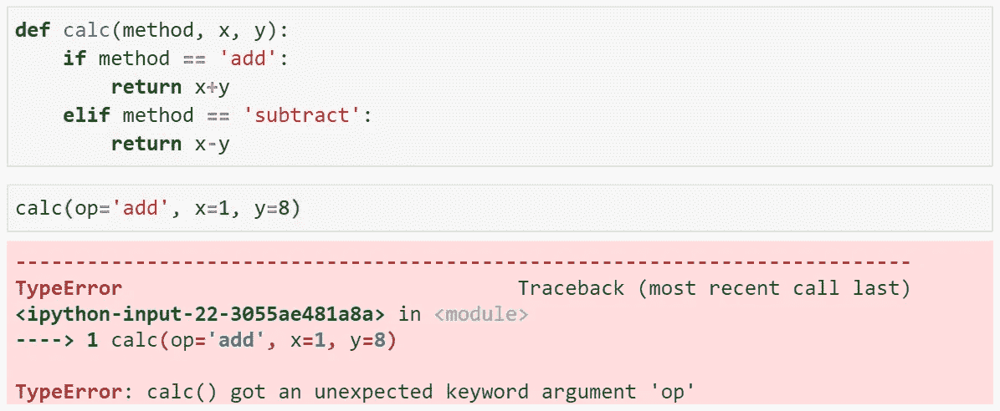
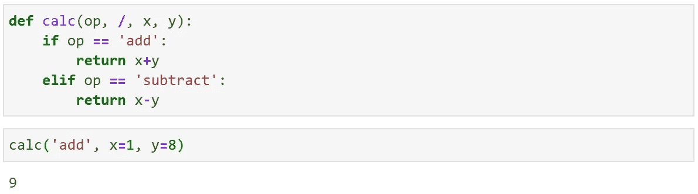

# 从 3.7 到现在 Python 中添加的主要特性

> 原文：<https://towardsdatascience.com/amazing-features-added-to-python-from-3-7-to-now-4f35f0bb1ea6?source=collection_archive---------14----------------------->

## Python 3.7–3.9 中添加的最佳新特性概述


[扬西·敏](https://unsplash.com/@yancymin?utm_source=medium&utm_medium=referral)在 [Unsplash](https://unsplash.com?utm_source=medium&utm_medium=referral) 上的照片

随着 Python 3.7 的发布，2018 年为我们带来了大量的新功能，随后是 2019 年的 3.8 和 2020 年的 3.9。

许多这些变化都是幕后发生的。优化和升级，我们绝大多数人永远不会注意到，尽管他们的好处。

其他的更明显，语法或功能的增加会改变我们写代码的方式。但是即使这些可见的变化也很难跟上。

在本文中，我们将浏览更明显的升级，对 Python 在过去几年中的所有新东西提供一个简短但有价值的回顾。

```
**> Python 3.7**
  - Breakpoints**> Python 3.8**
  - Walrus Operator
  - F-string '=' Specifier
  - Positional-only Parameters**> Python 3.9**
  - New Parser
  - More Type Hinting
  - Dictionary Unions
```

如果你喜欢视频，我已经在这里浏览了所有内容(包括代码):

# Python 3.7

## 断点

有时，或者实际上，几乎总是——代码调试令人沮丧。Python 3.7 包含了`breakpoint()`，使得它不那么烦人了。

这个新功能允许我们直接在脚本中添加断点，如果我们看到一个我们根本无法解决的错误，我们可以添加`breakpoint()`来停止代码，并允许我们尝试找出是什么导致了错误。


**breakpoint()** 默认使用 **pdb** 调试器，但是也可以使用其他替代调试器。

然后我们可以运行代码，它将在我们的断点处中断，并为我们提供一个交互式 shell 来测试我们的代码。

它允许我们用不同的数据类型/变量打印、测试我们的函数——并简单地做我们需要做的事情来调试我们的代码。

在 [PEP 553](https://www.python.org/dev/peps/pep-0553/) 中阅读更多相关信息。

# Python 3.8

## 海象操作员

大多数人已经看过了 walrus operator，它是任何人在 3.8 版本中报道新特性的首选。

除了作为 Python 语法的有趣补充之外，操作符确实非常有用。它允许我们“动态地”给变量赋值。

这意味着我们可以编写更紧凑的代码。虽然下面不是一个好的用例，但它清楚地表明了操作员可以做什么。


如果没有 walrus 操作符，我们需要在进入 if 语句之前赋值 **t_len** 。

这里我们需要检查一个列表的长度，如果它超过了一定的长度，打印一个关于它的长度大于三的声明。

walrus 运算符允许我们将变量赋值和 if 语句合并成一行，如下所示:


我们可以使用 walrus 操作符编写更紧凑的代码。

或者更有用的例子是使用 RegEx，我们需要检查模式是否存在，如果匹配，返回匹配的模式:


与 RegEx 一起使用的 walrus 运算符示例。

PEP 572 涵盖了你想知道的关于海象运营商的一切。

## f 字符串“=”说明符

调试的另一个好特性。当打印 f 字符串时，我们可以添加`=`来打印变量名和值，如下所示:


= '说明符可以在 f 字符串中使用，以返回变量名和值。

一个更小但仍然有用的附加物。在 [bpo-36817](https://bugs.python.org/issue36817) 中有全面的介绍。

## 仅位置参数

3.8 的最后一个特性是包含了指定函数输入参数的语法，这些参数不能通过名字调用，而是通过位置调用。例如:


我们可以通过给定的关键字指定输入参数，也可以不指定——有时强制用户不指定是有益的。

在这里，我们可以通过给定的名称来指定输入参数——在大多数情况下这是有意义的。

但是，有时这可能是我们想要阻止的行为。例如，如果我们正在编写一个函数，其中输入参数的名称将来可能会改变。



我们可能希望避免让用户指定输入参数名，这样我们就可以在将来毫无问题地更改变量名。

如果我们和函数的其他用户指定输入参数名，然后我们更新该函数以使用不同的变量名——我们可能会破坏使用该函数的所有其他代码库。

为了阻止用户使用输入参数名，我们可以添加仅位置语法`/`。让我们看看当添加到我们的原始代码中时，这是如何表现的:


如果我们试图通过关键字指定一个仅定位的参数，我们将收到一个 TypeError。

我们看到在`/`之前定义的所有参数都引发了一个 TypeError。这防止用户从一开始就使用这些变量名**。现在，用户将不得不使用`op`的位置，而不是关键字:**

****

**添加仅位置参数意味着用户将被迫通过位置而不是关键字来指定参数。**

**因此，当我们将来将`op`改为`method`时，我们的用户会受到保护:**

****

**现在，当用户从使用 **op** 的旧函数切换到使用**方法**的新函数时——他们不会注意到差异——也不会破坏他们的代码。**

**在 [PEP 570](https://www.python.org/dev/peps/pep-0570/) 中阅读所有相关内容。**

# **Python 3.9**

**我已经在[这篇文章](/python-3-9-9c2ce1332eb4)中写了更多关于 Python 3.9 的内容，但是我将在这里总结所有内容。**

## **新解析器**

**虽然这不会立即带来任何新的语法，但它仍然是重要的，并会在今后导致一些大的变化。**

**[吉多·范·罗苏姆](https://medium.com/u/1ecea0006127?source=post_page-----4f35f0bb1ea6--------------------------------)在 30 年前写了之前的 Python 解析器 pgen。这是为 Python 编写的第一批代码之一。**

**Pgen 使用基于 LL(1)的语法的变体。这意味着解析器从上到下、从左到右地读取代码，只需一个标记**的前视。****

**这造成了一些限制:**

*   **单标记前瞻**限制了语法规则的表达能力**。**
*   **非 LL(1)语法的实现需要 Python 开发人员做大量**混乱的工作**。**
*   **左递归语法会导致解析树无限循环，导致**栈溢出**(这里[解释](https://medium.com/@gvanrossum_83706/left-recursive-peg-grammars-65dab3c580e1))。**

**从 Python 3.9 开始。CPython 将使用**基于 PEG 的解析器**，我们将从 Python 3.10 开始看到它的影响。你可以在 [PEP 617 这里](https://www.python.org/dev/peps/pep-0617/)了解更多。**

## **更多类型提示**

****

**Python 中类型提示的稳步引入和改进是过去几年 Python 中反复出现的主题。**

**简而言之，他们引入了一个可选的**语法层**，帮助我们理解代码中需要哪些数据类型。**

****

**无类型提示(左)，Python 3.9 类型提示(右)。**

**在上图中，我们有不带类型提示的代码(左)和带类型提示的代码(右)。 **Python linter** 也将通读这段代码，并识别在我们的类型提示定义的数据类型和实际使用的数据类型之间哪里看起来不匹配。**

****

**指定预期的输入和输出数据类型。**

**我们也可以使用`-> type`语法来确定函数**的输出数据类型**。**

****

**我们可以将不同的类型结合起来创建更复杂的注释。**

**或者我们也可以定义更复杂的数据类型。 [PEP 585](https://www.python.org/dev/peps/pep-0585/) 涵盖了 Python 3.9 中的类型提示。**

## **字典联盟**

**Python 操作符的另一个有趣的补充。两者都用于字典联合。我们有**合并**操作符`|`:**

```
a = {1: **'a'**, 2: **'b'**, 3: **'c'**}
b = {4: **'d'**, 5: **'e'**}c = **a | b**
print(c)
```

**`[Out]: {1: 'a', 2: 'b', 3: 'c', 4: 'd', 5: 'e'}`**

**以及**更新**操作符`|=`，它允许我们进行**就地合并**:**

```
a = {1: 'a', 2: 'b', 3: 'c'}
b = {4: 'd', 5: 'e'}**a |= b**
print(a)
```

**`[Out]: {1: 'a', 2: 'b', 3: 'c', 4: 'd', 5: 'e'}`**

**在 [PEP 584 中阅读更多关于字典联合操作符的内容。](https://www.python.org/dev/peps/pep-0584/)**

**这就是本文的全部内容，涵盖了 Python 在过去几年中的一些最大变化和升级。**

**当然，还有大量的特性我们没有在这里介绍。但是，当使用 Python 时，这些是最明显的和产生最大差异的。**

****

**Python 3.10 的开发始于 2020 年中期，我们可以期待 2021 年 10 月的完整发布。**

**尽管如此，这些新特性足以让您跟上 Python 的发展和演变。在即将到来的 Python 3.10 变化中，有很多东西需要学习。**

**我希望你喜欢这篇文章！如果您有任何问题，请通过 [Twitter](https://twitter.com/jamescalam) 或在下面的评论中告诉我。如果你想要更多这样的内容，我也会在 YouTube 上发布。**

**感谢阅读！**

# **资源**

**[1]吉多·范·罗苏姆， [PEG 解析器](https://medium.com/@gvanrossum_83706/peg-parsers-7ed72462f97c) (2019)。**

**[🤖《变形金刚》课程 NLP 的 70%折扣](https://bit.ly/nlp-transformers)**

****所有图片均由作者制作，除非另有说明。***