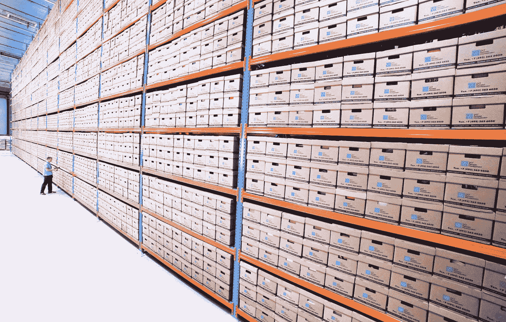

# 亚马逊红移 vs 谷歌大查询:最大的 OLAP 数据仓库之战

> 原文：<https://towardsdatascience.com/amazon-redshift-vs-google-bigquery-battle-of-the-biggest-olap-data-warehouses-8311241b2c91?source=collection_archive---------47----------------------->

## 会是亚马逊吗？还是谷歌会拿走蛋糕？让我们找出答案

对于大数据领域的企业来说，拥有灵活、可扩展、同时经济高效的数据仓库势在必行。鉴于现代企业越来越多地将大数据视为在所有领域提升的解决方案；从客户支持到生产进度，分析数据仓库对大多数业务需求都变得至关重要。

虽然数据分析的世界仍在蓬勃发展，但大型企业已经通过自己的数据仓库成功地在市场上站稳了脚跟。处于大数据热潮核心的行业巨头亚马逊和谷歌提供了备受追捧的数据仓库 Redshift 和 BigQuery。我将在今天的博客中分析这两个最大的在线分析处理(OLAP)数据仓库，以帮助您选择更好的解决方案来满足您的数据需求。但是在我们深入研究这两个数据仓库哪一个更好之前，我将带您简单了解一下什么是数据仓库。请继续阅读。

**这是一个大数据仓库！**

[娜娜·斯米尔诺娃](https://unsplash.com/@nananadolgo?utm_source=unsplash&utm_medium=referral&utm_content=creditCopyText)在 [Unsplash](https://unsplash.com/s/photos/data-warehouse?utm_source=unsplash&utm_medium=referral&utm_content=creditCopyText) 上的照片

数据仓库可以简单地认为是一个存储容器或存储大量数据以供处理的地方。现在，从这个仓库获取某些信息的过程，或者处理数据查询的方式，在体系结构方面从一个仓库到另一个仓库是不同的。此外，与存储容器的大小以及其中可以存储或处理的内容量类似，数据仓库也有其自身的限制和功能，企业可以根据这些限制和功能找到自己的最佳选择。现在，让我们详细看看两个强大的 OLAP 数据仓库。

# AWS 红移

亚马逊红移是一个数据仓库，是电子商务巨头亚马逊网络服务(AWS)云计算平台的一部分。Redshift 于 8 年前首次发布，它允许企业用户从少量数据(几百千兆字节)开始，直到高达数千兆字节的数据，所有这些都借助云的力量实现。

## 它是如何工作的？

Redshift 是一款快速且经济高效的 BI 工具，使用标准 SQL 存储所有数据，以集群或块的形式存储数据，与传统或本地数据仓库相比，可以实现更快的无缝查询。聚类格式最大限度地减少了信息输入或输出的实例，以便只关注相关的信息提取。

与传统的数据仓库不同，Redshift 允许您对 TB 级到 Pb 级的结构化和半结构化数据进行复杂的分析查询。它使用复杂的查询优化、列存储和跨多个物理资源的并行查询执行。

通过使用熟悉的基于 SQL 的客户端和使用标准开放式数据库连接(ODBC)和 Java 数据库连接(JDBC)的 BI 工具，Redshift 承诺了令人印象深刻的快速查询功能，大多数在几秒钟内返回。

在定价方面，Redshift 允许您以每小时 0.25 美元的价格从几千兆字节的数据开始，以每年 1，000 美元的价格扩展到千兆字节和千兆字节，成本不到传统内部解决方案的十分之一。它还包括亚马逊红移光谱，以帮助您直接对亚马逊 S3 数据湖中的非结构化数据运行 SQL 查询。

即使数据量很大，Redshift Spectrum 也会根据检索到的数据自动扩展计算能力，以便针对亚马逊简单存储服务或 S3 进行更快的查询。更何况不需要加载，也不需要改造。可以使用开放数据格式，包括 Avro、CSV、Grok、Amazon Ion、JSON、ORC、Parquet、RCFile、RegexSerDe、Sequence、Text、胡迪、Delta 和 TSV。

## 红移一览:

*   快速且经济高效
*   以分栏格式存储数据
*   成本不到传统内部解决方案的十分之一
*   并行查询执行
*   直接允许 SQL 查询
*   通过 AWS IAM 集成、列级访问控制、VPC、加密等实现安全。
*   使用复制和连续备份来提高性能

## 最佳使用案例

Redshift 非常适合处理需要实时分析的[时间敏感型工作负载](https://www.xplenty.com/blog/redshift-vs-bigquery-comprehensive-guide/#performance)的企业。例如，每日股市指数报告、广告竞价或实时仪表板。Redshift 上的预测模型允许近乎实时的广告竞价。需要通过刷新进行连续查询的实时数据流用例也处理得令人印象深刻。

# 谷歌大查询

[Google BigQuery](https://cloud.google.com/bigquery/) 是搜索巨头自有云基础设施 Google Cloud 下的另一个受欢迎的数据仓库。无服务器的多云数据仓库旨在处理海量数据，同时保证灵活性和可伸缩性。

## 它是如何工作的？

BigQuery 的核心是 [Dremel](https://cloud.google.com/files/BigQueryTechnicalWP.pdf) —谷歌的查询服务，允许你对庞大的数据集运行 SQL 查询，并在几秒钟内获得准确的结果！因此，BigQuery 是 Dremel 的外部化，使用 Rest API、命令行界面、web UI 和访问控制向第三方开发人员提供其核心特性集。为了估计它的潜力，Dremel 可以在几十秒内扫描 350 亿行而不用索引。通过共享谷歌自己的云基础设施，它可以将每个查询并行化，并同时在数万台服务器上运行。

回到 BigQuery，它与 Dremel 共享相同的架构和性能特征。通过利用谷歌的计算和云基础设施，好处包括跨区域的多次复制和高数据中心可扩展性，而不需要开发者的任何管理。

BigQuery 还以一种称为 Capacitor 的列格式存储数据。表中的每一列都存储在单独的文件块中，所有列都存储在单个电容器文件中，然后对该文件进行压缩和加密。

它允许使用标准 SQL 跨云进行数据分析。它是完全管理的，针对企业的大规模数据处理。BigQuery 的一个关键的与众不同的特性是它更加兼容 AI 和 ML。它允许您使用自然语言处理(NLP)获得数据洞察力，提供内置的 ML 和 AI 集成，提供 ODBC 和 JDBC 驱动程序，并使用谷歌的工具提供无缝数据集成。

## BigQuery 概览:

*   与大型数据集兼容
*   支持人工智能、人工智能集成
*   非程序员的易用性
*   依赖于谷歌自己的云基础设施
*   使用文件系统存储数据
*   快速且自我管理

## 最佳使用案例

顾名思义，当数据查询高峰且空闲时间很长时，BigQuery 处于最佳状态。一些例子包括每天运行一次的电子商务网站上的推荐、偶尔需要复杂查询的季度报告、团队通过自定义数据分析进行特别发现的销售智能，以及最重要的用于发现和分析数据模式(如消费者行为)的机器学习。

# 共性

考虑到这两个数据仓库都有满足 BI 需求的潜力，很明显它们提供了一些共同的特性。以下是其中一些例子:

*   SQL 标准:BigQuery 和 Redshift 都支持标准的 SQL 数据类型。但是，前者适用于一些标准的 SQL 数据类型。
*   更新和删除:这两个工具都是仅追加的，但是如果查询出错，它们可以处理更新和删除。
*   安全性:Redshift 使用 Amazon IAM，而 BigQuery 使用 Google Cloud IAM，允许安全的身份管理。

# 竞争优势

*   集成:Redshift 和 BigQuery 都提供了大量的集成。然而，Google 的 BigQuery 因其 ML 集成而脱颖而出，使数据科学家能够在结构化或半结构化数据上构建和操作 ML 模型。
*   可扩展性:借助 Redshift，企业无法独立扩展资源，因为存储和计算不是分开的。任何微调都需要集群重新配置，这是一个耗时的过程。另一方面，BigQuery 将存储和计算分开，提供了更大的灵活性和更多的可伸缩性。
*   维护:红移需要定期清空或表分析。你可能会花费数小时做简单的维护，如更新。BigQuery 维护性低；它没有索引或列约束，并且不允许性能调优功能。这是一个完全由谷歌管理的服务，处理所有的后端配置和调整。
*   定价:使用 Redshift，您可以从每小时 0.25 美元开始，扩展到数 Pb 的数据和数千个并发用户，总计每年每 TB 1000 美元。您还可以选择按需定价，根据集群中节点的类型和数量按小时付费。Redshift 还提供基于频谱、扩展、存储和部署 ML 模型的现收现付定价模式。另一方面，BigQuery 对数据存储、流插入和查询数据收费，但加载和导出数据是免费的。有两种订阅模式—每 TB 5 美元的现收现付价格和 100 个保留插槽每月 1，700 美元起或 100 个灵活插槽每小时 4 美元起的统一价格。

# 谁拿了蛋糕？

如果您是一家处理数据的企业，并希望赶上新时代的数字化转型，Redshift 和 BigQuery 都是非常有前途的数据仓库解决方案。由于处理大型数据查询和提供快速准确结果的潜力相似，在这两种服务之间做出决定可以归结为工作流的性质和 BI 需求。

在我看来，谷歌的 BigQuery 是一个比 Redshift 更健壮的解决方案，因为它提供了额外的功能，如 ML 集成。以谷歌自己的云基础设施为核心，它是一个更具性价比的工具。它是完全受管理的，这减少了部署系统工程师在使用 Redshift 时根据需要不断进行微调的需要。对于更大的数据量和不同的查询负载，BigQuery 非常适合。

*最初发表于*[*【https://anujsyal.com】*](https://anujsyal.com/amazon-redshift-vs-google-bigquery-battle-of-the-biggest-olap-data-warehouses)*。*