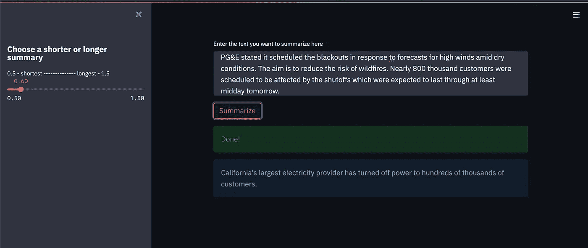

# 亚马逊 SageMaker 和🤗变压器:使用自定义数据集训练和部署汇总模型

> 原文：<https://towardsdatascience.com/amazon-sagemaker-and-transformers-train-and-deploy-a-summarization-model-with-a-custom-dataset-5efc589fedad?source=collection_archive---------18----------------------->

## 深入探讨新发布的端到端模型培训和部署功能


Igor Saveliev 在 [Pixabay](https://pixabay.com/) 上拍摄的照片

2021 年 3 月 25 日，亚马逊 SageMaker 和 HuggingFace [宣布了一项合作](https://huggingface.co/blog/the-partnership-amazon-sagemaker-and-hugging-face)，旨在利用可访问的[变形金刚](https://huggingface.co/transformers/master/)库，让训练最先进的 NLP 模型变得更容易。 [HuggingFace 深度学习容器](https://huggingface.co/transformers/sagemaker.html)开放了大量预先训练的模型，可直接与 [SageMaker SDK](https://sagemaker.readthedocs.io/en/stable/index.html) 一起使用，从而轻松为工作提供正确的基础设施。
从一个已经在一个巨大的语料库上训练过的模型开始也意味着，为了在你的特定用例上获得良好的性能，你不需要获取一个非常大的数据集。在本教程中，我将带您完成以下 3 个步骤:

*   在一个定制的数据集上微调一个摘要模型:这将需要准备您的数据用于摄取，并启动一个 SageMaker 培训工作；
*   将微调后的模型部署到 [SageMaker 托管服务](https://docs.aws.amazon.com/sagemaker/latest/dg/deploy-model.html):这将自动提供一个托管您的模型的持久端点，您可以从中获得实时预测。
*   在我们的本地机器上启动一个 [Streamlit](https://streamlit.io/) 应用程序来与您的模型进行交互；这是一个开源框架，允许您从非常简单的 Python 脚本创建交互式 web 应用程序，常用于 ML 和数据应用程序。

我们将从设置一个 SageMaker Notebook 实例开始，在这里我们将运行本教程的代码。您可以[按照这些说明](https://docs.aws.amazon.com/sagemaker/latest/dg/nbi.html)来设置您的笔记本电脑环境；ml.m5.xlarge Notebook 实例类型应该就可以了。继续启动一个新的 Jupyter 笔记本，带有一个`conda_pytorch_p36`内核。我们需要的所有软件包都预装在笔记本电脑环境中。

如果你打算遵循本教程中的代码，现在是将这个回购克隆到你的实例中的好时机。有三个笔记本(数据准备、微调和部署)，其中包含接下来的代码片段。做完那件事，让我们开始吧！

# 模型和数据集

出于本教程的目的，我们将使用 [PEGASUS](https://huggingface.co/google/pegasus-large) 模型，以及在 Transformers Github 资源库中可用的[微调脚本](https://github.com/huggingface/transformers/blob/v4.6.1/examples/pytorch/summarization/run_summarization.py)。您可以将脚本*原样用于 PEGASUS 的*，以及 [HuggingFace 模型中枢](https://huggingface.co/models)中可用的其他几个*序列到序列*模型，例如`[BART](https://huggingface.co/facebook/bart-large)`和`[T5](https://huggingface.co/t5-large)`(参见脚本的[自述文件](https://github.com/huggingface/transformers/tree/v4.6.1/examples/pytorch/summarization/README.md)的*支持的架构*部分中的所有合适选项)。

脚本向用户公开配置和超参数选项，同时负责适当的文本标记化、训练循环等。您可以通过两种方式之一提供您的数据集，要么是 **1)** 指定一个`dataset_name`(将从[hugging face Dataset Hub](https://huggingface.co/datasets))*或* **2)** 您本地数据文件的位置(`test_file`、`validation_file`和`test_file)`)；我们对后者感兴趣。我们将会看到，这些文件是在培训时从亚马逊 S3 下载的。

[极端摘要(XSUM)数据集](https://github.com/EdinburghNLP/XSum/tree/master/XSum-Dataset)包含约 225，000 篇 BBC 文章及其摘要，涵盖各种领域。[在第一个笔记本](https://github.com/joaopcm1996/demo-sm-hf-summarization/blob/master/1_XSUM_dataset_prep.ipynb)中，我们下载数据集，并提取每篇文章的正文和相应摘要。然后，我们将数据分为训练集和验证集，并将每个数据集的 CSV 文件上传到 S3。这些文件中的每一行对应不同数据样本的`**text,summary**`；这种格式在训练脚本中被自动识别(保留 CSV 头)。上面的自述文件详细说明了如何以更通用的方式使用 CSV 或 JSONLINES 文件，以及如何在文件有多个额外列的情况下指定正确的列名。

# 微调

现在，我们已经准备好为培训作业设置配置和超参数了！首先，我们定义一些导入，并检索我们的 SageMaker 执行角色、会话和默认 S3 存储桶:

然后，我们将超参数传递给`[HuggingFace](https://sagemaker.readthedocs.io/en/stable/frameworks/huggingface/sagemaker.huggingface.html#huggingface-estimator)` [估计器](https://sagemaker.readthedocs.io/en/stable/frameworks/huggingface/sagemaker.huggingface.html#huggingface-estimator)，以及其他一些配置:

一个[评估器](https://sagemaker.readthedocs.io/en/stable/api/training/estimators.html)是一个抽象，它封装了 SageMaker SDK 中的训练；因为 git 支持是内置的，所以我们可以直接指定训练脚本名称和目录为`entry_point`和`source_dir`，以及`git_config`中的 repo 和 branch。PyTorch、Transformers 和 Python 版本对应于撰写本文时 HuggingFace 容器中支持的最新版本。

在不耗尽 GPU 内存的情况下，这个特定模型在一个`ml.p3.2xlarge`实例上可计算的最大批量大约为 2。这个容量将取决于其他因素，例如我们为输入序列定义的最大长度。由于这是一个相当大的数据集，如果你想增加批量大小，大幅加速训练，可以利用 [SageMaker 分布式数据并行训练](https://docs.aws.amazon.com/sagemaker/latest/dg/data-parallel.html)；这个特性已经被集成到`Transformers`[训练器](https://huggingface.co/transformers/main_classes/trainer.html) API 中，所以你可以利用它，除了你在上面代码片段中看到的最小设置之外，不需要改变你的训练脚本。

`hyperparameters`将作为命令行参数传递给微调脚本。我们定义了训练参数(比如时期数和学习率)，以及训练容器中数据所在的目录。在[文件模式](https://docs.aws.amazon.com/sagemaker/latest/dg/your-algorithms-training-algo-running-container.html#your-algorithms-training-algo-running-container-trainingdata)下，SageMaker 从 S3 下载你的数据，使其在`/opt/ml/input/data/<channel_name>`目录下可用。当您调用`Estimator.fit()`——有效地开始训练作业——时，您提供< channel_name >，以及训练和验证集在 S3 的相应文件位置。

培训工作结束后，一个`model.tar.gz`文件会上传到你在 S3 上默认的`session_bucket`；它将包含部署我们的微调模型和服务推理请求所需的模型和记号化器工件。

# 部署

最后，我们将微调后的模型部署到一个持久端点。SageMaker 托管将公开一个 RESTful API，您可以使用它从您的模型中实时获得预测。

在`inference_code`目录下，你会找到脚本`inference.py`。这对流程很重要，它详细描述了:1)如何在端点之间转换输入和输出，2)如何将模型加载到推理容器中，以及 3)如何从模型中获得预测。这个脚本必须有一个特定的结构，这样 SageMaker 就知道你的代码的哪一部分用于这些不同的功能。

我们首先定义一个`[HuggingFaceModel](https://sagemaker.readthedocs.io/en/stable/frameworks/huggingface/sagemaker.huggingface.html#sagemaker.huggingface.model.HuggingFaceModel)`，包含关于模型和推理代码位置的细节:

注意，我们可以通过使用`huggingface_estimator.model_data`获得模型工件的 S3 URL；另外，`entry_point`和`source_dir`指定推理脚本的名称和目录(存储在您的笔记本上)。

然后，我们将模型部署到一个`ml.m5.xlarge`实例:

一旦部署完成，您可以直接使用`predictor`对象从您的模型中获得预测。注意，我们可以传入任何[模型的生成参数](https://huggingface.co/transformers/master/main_classes/model.html#transformers.generation_utils.GenerationMixin.generate)；在这种情况下，我们指定`length_penalty`——一个实数，如果>为 1，则激励生成更长的摘要，反之亦然*。我们将在测试中使用一个新闻更新示例:*

*我们可以看到，在总结这个具体的新闻故事时，长度参数的变化非常有意义，因为较短的摘要忽略了较长摘要中透露的一条重要信息:计划停电的*原因*。*

# *启动一个简单的 Streamlit 界面*

*为了不必一直通过手动运行代码行来与您的模型进行交互，此时您将在本地机器上部署一个 Streamlit UI。正如您在脚本`streamlit_app.py`中看到的，Streamlit 允许我们用 30 多行代码创建一个直观且响应迅速的界面。在这段代码中，我们将使用用于 Python 的 [SageMaker 运行时 Boto3 客户端](https://boto3.amazonaws.com/v1/documentation/api/latest/reference/services/sagemaker-runtime.html)，以不同于以前的方式调用我们的 SageMaker 端点。您需要在您的本地环境中设置适当的权限，或者通过使用 AWS CLI 配置您的凭证，或者直接将它们作为参数传递给客户端。

首先，打开一个新的终端并运行以下命令来安装 Streamlit:*

```
*pip install streamlit*
```

*要启动界面，请运行以下命令:*

```
*streamlit run \
streamlit_app.py -- --endpoint_name summarization-endpoint*
```

*这将在`localhost`上启动您的应用程序，默认监听端口 8501。运行该命令后，应该会自动弹出一个浏览器标签，但如果没有，就访问`http:localhost:8501`。

这是界面的样子:*

**

*现在，您甚至可以更新/切换支持应用程序的模型端点，这样您就可以在不同的数据集上进行重新训练或微调后对其进行实时测试！*

# *结论*

*在这篇博文中，我们看到了如何利用 HuggingFace SageMaker 估计器的固有功能来微调最先进的摘要模型。最重要的是，我们使用了一个自定义数据集和一个现成的示例脚本，您可以复制这些东西，以便轻松地根据您个人/公司的数据训练模型。

我们还看到了如何轻松地获得最终的微调模型，将其部署到完全受管的端点，并通过调用简单的 Streamlit 接口的*。

在现实生活场景中，您将能够轻松地优化和扩展该流程的各个部分，如设置[自动缩放](https://docs.aws.amazon.com/sagemaker/latest/dg/endpoint-auto-scaling.html)以基于负载自动启动更多端点实例，将 GPU 的一部分[附加到您的端点以加速推理，以及许多其他有用的功能。

我希望你现在能够更快地利用大量可用的 NLP 资源。下次见！](https://docs.aws.amazon.com/sagemaker/latest/dg/ei.html)**

**附:非常感谢*[*Heiko Hotz*](https://medium.com/u/993c21f1b30f?source=post_page-----5efc589fedad--------------------------------)*激励并支持这篇博文的创作。**

## **参考文献**

*[1] J. Zhang，Y. Zhao，M. Saleh，P. Liu， [PEGASUS:用于抽象概括的提取间隙句的预训练](https://arxiv.org/abs/1912.08777) (2020)第 37 届机器学习国际会议论文集*

*【2】s .纳拉扬，S.B .科恩，m .拉帕塔，[不要给我讲细节，只讲概要！用于极端摘要的话题感知卷积神经网络](https://arxiv.org/abs/1808.08745)(2018)2018 年自然语言处理经验方法会议录*