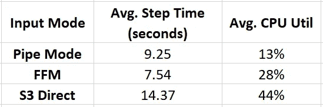

# 亚马逊 SageMaker 快速文件模式

> 原文：<https://towardsdatascience.com/amazon-sagemaker-fast-file-mode-d12829479c39?source=collection_archive---------11----------------------->

## [提示和技巧](https://towardsdatascience.com/tagged/tips-and-tricks)

## 从亚马逊 S3 向亚马逊 SageMaker 传输训练数据的方法——第二部分


由 [Christina Rumpf](https://unsplash.com/@punk_rock_vegan?utm_source=medium&utm_medium=referral) 在 [Unsplash](https://unsplash.com?utm_source=medium&utm_medium=referral) 上拍摄的照片

去年我们发表了一篇[博文](https://julsimon.medium.com/deep-dive-on-tensorflow-training-with-amazon-sagemaker-and-amazon-s3-12038828075c)，其中我们调查了将存储在[亚马逊 S3](https://aws.amazon.com/s3/) 中的训练数据流式传输到[亚马逊 SageMaker](https://aws.amazon.com/sagemaker/) 训练会议的不同方法。我们强调了不同选项的一些优势和劣势，并检查了它们解决某些特定需求的能力，例如:

1.  *动态增强*，需要在训练过程中改变数据采样方式。
2.  自由选择除 [*TFRecord*](https://www.tensorflow.org/tutorials/load_data/tfrecord) 格式以外的数据格式，以及
3.  *随机访问*数据记录。

上个月，AWS [向](https://aws.amazon.com/about-aws/whats-new/2021/10/amazon-sagemaker-fast-file-mode/)宣布了一个名为*快速文件模式* (FFM)的新机制，用于利用来自[亚马逊 S3](https://aws.amazon.com/s3/) 的数据在[亚马逊 SageMaker](https://aws.amazon.com/sagemaker/) 进行培训。在这篇文章中，我们将回顾这种新方法的一些特性，并将其与我们在上一篇文章中回顾的一些替代方法进行比较。

正如在我们之前的帖子中，我们处理的场景是数据集的大小如此之大，以至于在训练之前将它完整地下载到本地磁盘是不可能的或低效的。相反，我们将数据直接从 S3 传入训练循环。我们将把重点放在 TensorFlow 的培训上，特别是 2.6 版，尽管我们将进行的大多数观察也同样适用于其他培训框架。

# 快速文件模式——工作原理

*要对您的 [Amazon SageMaker](https://aws.amazon.com/sagemaker/) 培训课程进行编程，以使用快速文件模式从 S3 传输数据，您需要将 *input_mode* 设置为 *FastFile* ，并输入您的数据集 S3 路径到 *fit* 函数，如下面的代码块所示:*

```
*from sagemaker.tensorflow import TensorFlow

estimator=TensorFlow(entry_point='main.py',
                     role=<AWS IAM role>,
                     py_version='py37',
                     framework_version='2.6.0', #tf version
                     instance_count=1,
                     instance_type='ml.g4dn.xlarge',
                     **input_mode='FastFile'** )**train_data="s3://sagemaker-path-to-train-data"
test_data="s3://sagemaker-path-to-test-data"**estimator.fit(**{'train':train_data, 'test':test_data}**)*
```

*这里我们定义了两个通道，分别命名为*训练*和*测试*。训练作业将从对应于两个数据通道的两个环境变量 *SM_CHANNEL_TRAIN* 和 *SM_CHANNEL_TEST* 开始。每一个都将被设置为一个本地路径，该路径对于培训应用程序来说就像是 S3 编程路径中所有数据的 POSIX 文件系统挂载。因此，为了访问位于*S3://sage maker-path-to-train-data/relative-path*的文件，而不是下载文件(例如，使用 boto3)，训练应用程序将简单地打开:
`path=os.path.join(os.environ["SM_CHANNEL_TRAIN"],<relative-path>)` 例如，如果您的文件以 [*TFRecord*](https://www.tensorflow.org/tutorials/load_data/tfrecord) 格式存储，您可以使用[*TF record dataset*](https://www.tensorflow.org/api_docs/python/tf/data/TFRecordDataset)*创建一个数据集，如下面的代码块所示:**

```
**paths=[<list of relative filepaths>]
local_root=os.environ["SM_CHANNEL_TRAIN"]
filepaths=[os.path.join(local_root,path) for path in paths]
ds=tf.data.TFRecordDataset(
               filepaths, 
               num_parallel_reads=tf.data.experimental.AUTOTUNE)**
```

# **FFM 的优势**

**在我们之前的博客文章中，我们介绍了将数据从 S3 传输到亚马逊 SageMaker 培训课程的几种选择。在本节中，我们将重点介绍 FFM 相对于其他方法的一些优势，尤其是 Amazon SageMaker 管道模式的替代方案。关于管道模式的更多细节，请查看之前的帖子。**

## **1.多数据集支持**

**正如我们在过去的中讨论过的[，管道模式支持的数据流数量被限制为 20(截至本文撰写之时)。使用多个数据流可以解决某些需求，例如数据分区(其中我们根据类别对数据进行分区)或流复制(例如，在执行数据分布式训练时，以独特的洗牌方式将相同的数据集流式传输到多个进程)。正如](https://julsimon.medium.com/making-amazon-sagemaker-and-tensorflow-work-for-you-893365184233)[这篇博文](https://julsimon.medium.com/making-amazon-sagemaker-and-tensorflow-work-for-you-893365184233)中所详述的，对频道流数量的限制可能会带来挑战，这可能需要创造力来克服。通过 FFM，可以使用单个数据通道配置定义多个数据集。您只需将通道的基本 S3 路径配置为所有数据集的根。**

## **2.增强对数据输入流的控制**

**当您对作业进行编程以使用管道模式时，您可以配置一组通过管道传输的固定文件，并且可以选择将洗牌和/或分片委托给管道模式管理器。一旦培训开始，您就不能更改管道的内容或其配置。相对于管道模式，FFM 提供了更大的控制:**

*   ****洗牌** —您可以应用自己的数据洗牌策略，也可以捕获随机生成的参数。**
*   ****分片** —你可以定义自己的分片策略。**
*   ****在训练期间更新数据集内容** —您可以在模型训练期间更改数据的混合。**
*   ****文件块支持** — FFM 支持读取文件的一部分，而无需提取整个文件。这可能会影响您在 S3 选择数据的文件格式，因为有些格式依赖于文件分块。请注意，虽然可以使用文件分块(假设文件格式合适)来实现对数据记录的随机访问，但这可能会严重影响性能。然而，您可以通过分析您的机器学习项目的最小可接受块大小来实现某种程度的随机访问。**

**在下面的代码块中，我们演示了如何创建一个自定义生成器来控制(和记录)混洗、分片和在训练中更改数据混合。**

```
**import random
def generator():
    paths=... # optionally shard filepaths
    for e in range(num_epochs):
        seed=random.randrange(100)
        print(f"starting epoch {e}. Random seed is {seed}")
        random.seed(seed)
        random.shuffle(paths)
        # optionally modify contents based on current metrics           
        paths=... 
        for p in paths:
            yield pfilepaths_ds=tf.data.Dataset.from_generator(
               generator,
               output_types=tf.string,
               output_shapes=())
ds=tf.data.TFRecordDataset(
               filepaths_ds, 
               num_parallel_reads=tf.data.experimental.AUTOTUNE)**
```

**这里的[参见](https://julsimon.medium.com/deep-dive-on-tensorflow-training-with-amazon-sagemaker-and-amazon-s3-12038828075c)如何利用该方案实现两个类的*动态增强*的示例。**

## **3.文件格式自由**

**虽然管道模式可以配置为传输任何二进制数据，从而传输任何文件格式，但高级别[亚马逊 SageMaker SDK](https://sagemaker.readthedocs.io/) 仅通过[*PipeModeDataset*](https://sagemaker-examples.readthedocs.io/en/latest/sagemaker-python-sdk/tensorflow_script_mode_pipe_mode/tensorflow_script_mode_pipe_mode.html)为 [*TFRecord*](https://www.tensorflow.org/tutorials/load_data/tfrecord) 文件格式提供支持。在管道模式下使用任何其他文件格式都需要一点努力。与管道模式相反，FFM 并不偏爱任何一种文件格式。
在之前的帖子中，我们调查了用于 TensorFlow 培训的几种不同的文件格式选项。使用 FFM 你可以自由使用其中任何一个。**

**请记住，在云中存储文件有一些最佳实践。特别是，这些实践规定了最佳的文件大小。我们通常将数据存储在大小为几百 MB 的文件中。
另一个考虑因素是文件的数量。根据 FFM [文档](https://docs.aws.amazon.com/sagemaker/latest/APIReference/API_AlgorithmSpecification.html)，培训开始时间可能会受到文件总数的影响。**

## **4.使用标准 TensorFlow 数据集类**

**如上所述，使用 FFM 时，我们可以使用与本地环境中相同的标准 TensorFlow 数据集类。这与管道模式相反，后者需要一个特殊的自定义数据集 PIPEmodeDataset。这有几个含义:**

*   **更易于编程——将您的代码从本地培训课程调整到基于云的培训课程所需的修改更少。**
*   **更容易调试—与本地运行的相似性使得调试问题更容易。**
*   **API 支持-使用标准化 TensorFlow 数据集意味着自动支持所有 TensorFlow 数据集实用程序 API。**

# **性能比较**

**在本节中，我们将在由[*TF record*](https://www.tensorflow.org/tutorials/load_data/tfrecord)*文件组成的数据集上对 FFM、管道模式和直接 S3 访问进行性能比较。我们比较的指标是:1 .平均数据吞吐量，以每秒的记录数度量，以及 2。平均 CPU 利用率。为了评估输入模式对潜在 CPU 瓶颈的影响程度，测量 CPU 利用率非常重要。我们用来执行测试的代码可以在下面的代码块中找到:***

```
***count = 0
begin = time.time()
stime = begin
for x in ds:
  count = count + 1
  if count % 1000 == 0:
    etime = time.time()
    print(f"step: {count} step/sec: {float(1000)/(etime-stime)}")
    stime = time.time()
  if count==100000:
    break
print(f"average step/sec: {float(100000)/(time.time()-stime)}")***
```

***请注意，我们通过迭代数据集将我们的分析隔离到管道的数据输入部分，而没有将数据实际输入到训练管道中。测试是在 ml.c5.xlarge 实例类型上执行的。结果如下图所示。在我们已经运行的测试中，FFM 拥有最好(最低)的步长时间，管道模式紧随其后。同时，注意 CPU 利用率的增加。这些结果是您可能会看到的比较指标类型的一个示例。这些指标可能高度依赖于您的模型架构，并且您得到的结果可能非常不同。例如，如果您的步进时间目前完全由您的 GPU 活动决定，您可能对数据输入模式完全不感兴趣。***

******

***输入模式性能比较(按作者)***

# ***摘要***

***最近宣布的亚马逊 SageMaker 快速文件模式提供了一种新的方法，可以将训练数据直接有效地传输到亚马逊 SageMaker 训练课程中。它提供了管道模式的潜在性能以及本地数据集的便利性和灵活性。重要的是，每个机器学习项目都是独一无二的；在一个模型中观察到的绩效行为可能与在另一个模型中观察到的完全不同。在转换项目之前，评估采用 FFM 的性能影响至关重要，并建议您以一种使流选项之间的切换变得容易的方式对解决方案进行编码。祝你好运！***