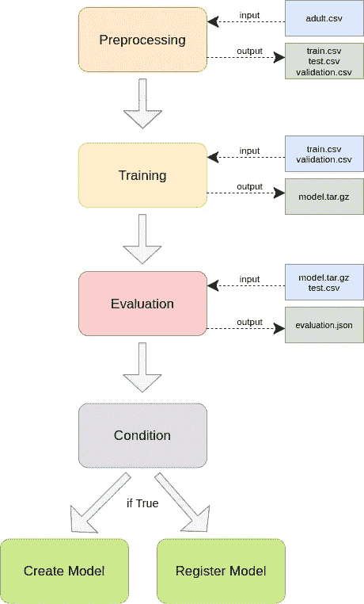
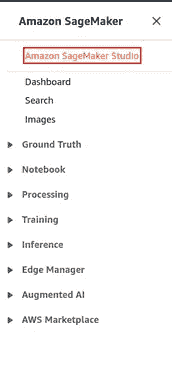
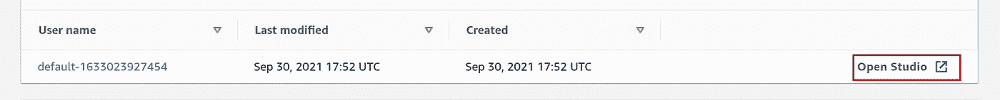
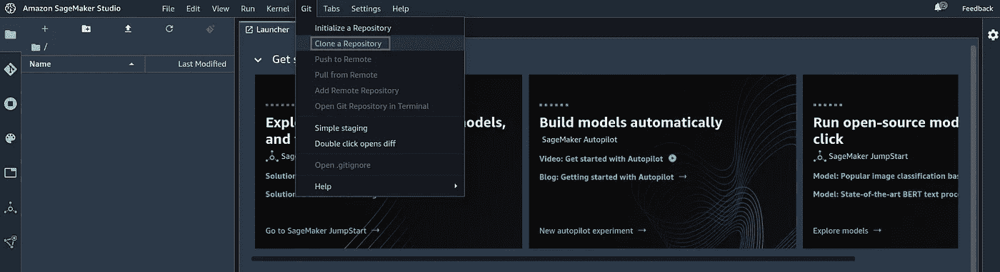
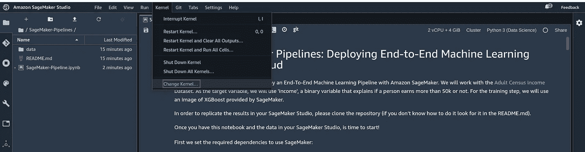

# 亚马逊 SageMaker 管道:在云中部署端到端的机器学习管道

> 原文：<https://towardsdatascience.com/amazon-sagemaker-pipelines-deploying-end-to-end-machine-learning-pipelines-in-the-cloud-9199b637e8ca?source=collection_archive---------29----------------------->

## 使用当前最先进的工具之一，构建一个从原始数据到模型部署的机器学习管道

一级方程式赛车每年都会汇集最好的车手、最好的赛车和最好的技术。对于后者，他们使用像 SageMaker 这样的 AWS 工具。卡尔·乔根森在 [Unsplash](https://unsplash.com?utm_source=medium&utm_medium=referral) 上的照片

# 介绍

云计算是机器学习领域发展最快的技能之一。在云服务公司中，亚马逊因提供最先进的机器学习工具之一而脱颖而出:亚马逊 SageMaker。使用 SageMaker，除了其他许多事情之外，你还可以构建、测试和部署机器学习模型。此外，您可以创建端到端的管道，以便在 CI/CD 环境中集成您的模型。

在这篇文章中，我们将使用 Amazon SageMaker 一步一步地创建端到端的管道。首先，我们将对项目做一个概述，然后我们将进行一些理论解释，最后但同样重要的是，我们将编码。对于编码部分，我们将使用[这个 Jupyter 笔记本](https://github.com/Adricarpin/SageMaker-Pipelines/blob/master/SageMaker-Pipeline.ipynb)。

我们将使用[成人人口普查收入](https://www.kaggle.com/uciml/adult-census-income)数据集。我们将使用“收入”作为目标变量，这是一个解释一个人收入是否超过 50k 的二元变量。对于训练步骤，我们将使用 AWS 提供的 XGBoost 图像。

# 项目概述

在解释如何建立管道之前，我认为首先理解计划是至关重要的。再往下一点，你会发现一张管道图，这将是我们创建管道的蓝图。如果你能理解这个图表，一半工作就完成了(剩下的只是把它放进代码里)🙈 ).但是，在查看图表之前，我认为先了解这些事情是有益的:

*   我们的管道中有哪些步骤
*   每一步的输入和输出是什么

为了理解这一点，我们将以直观的方式解释流水线中的所有步骤:

📒注意:尽量记住文件名，这样你就更容易理解图表。

1.  **预处理步骤**:在这一步我们将预处理原始数据。因此，这一步的输入是原始数据，输出是经过处理的数据(准备好传递给模型的数据)。在我们的项目中，原始数据是“成人. csv”文件，处理后的数据文件名将是“train.csv”、“validation.csv”和“test.csv”。
2.  **训练步骤**:在这一步我们将训练模型。此步骤中的输入是经过处理的数据，特别是“train.csv”和“validation.csv”文件。输出将是我们训练好的模型。这个文件叫做“model.tar.gz”。
3.  **评估步骤**:在这一步中，我们将用新数据测试我们的模型。输入将是模型文件和带有测试数据的文件，即“model.tar.gz”和“test.csv”。输出将是存储该步骤的元数据(例如精度)的文件。我们将称之为“evaluation.json”。
4.  条件步骤:在交付之前，我们必须知道我们的模型是否足够好。在条件步骤中，我们将测试精度与阈值进行比较。如果精度高于阈值，我们继续下一步。如果不是，我们停止管道，这样模型就不会被部署。
5.  **创建模型步骤**:如果模型通过了条件步骤，我们创建一个 SageMaker 模型。SageMaker 模型是可以部署到端点的实例。
6.  **注册模型步骤**:如果模型通过了条件步骤，我们将注册模型，这样我们就可以随时访问它。在 SageMaker model registry 中，您可以拥有一个模型及其相应元数据的目录。

一旦我们了解了所有这些，让我们来看看期待已久的管道图:

作者图片

📒注意:“创建模型步骤”和“注册模型步骤”是独立的步骤:它们之间没有特定的顺序。

好了，现在我们知道了计划，是时候学习理论了！

# 萨格马克管道理论:我们需要知道什么

这一节只是试图回答以下问题:在开始编码之前，您必须了解 SageMaker 管道的哪些知识？

首先你必须理解 SageMaker 构建管道的方式是首先指定管道的步骤，然后用一个[管道实例](https://docs.aws.amazon.com/sagemaker/latest/dg/build-and-manage-pipeline.html)将它们连接起来。

为了创建管道步骤，我们使用[步骤类](https://docs.aws.amazon.com/sagemaker/latest/dg/build-and-manage-steps.html)。在开始编码之前，有两个步骤类特别重要:一个是`ProcessingStep`类，另一个是`TrainingStep`类。

## ProcessingStep 类

对于我们的“预处理步骤”和“评估步骤”，我们将使用一个`ProcessingStep`类(你可以在这里看到文档[)。基本上，这是 SageMaker 用来构建我们处理数据的步骤的类。当构建一个`ProcessingStep`时，您必须传递一个处理器实例和代码。代码只是一个处理数据的 Python 脚本。处理器实例是一个 Docker 映像，带有运行该步骤的规范。](https://sagemaker.readthedocs.io/en/stable/workflows/pipelines/sagemaker.workflow.pipelines.html)

等等，所以我要创造一个码头工人的形象？

如果您愿意，您可以创建一个，但您不需要这样做。您可以只使用 SageMaker 提供和维护的处理器实例。最常用的有 [SKLearnProcessor](https://docs.aws.amazon.com/sagemaker/latest/dg/use-scikit-learn-processing-container.html) (针对 SKLearn)和 [PySparkProcessor](https://docs.aws.amazon.com/sagemaker/latest/dg/use-spark-processing-container.html) (针对 Apache Spark)。为了导入特定的图像，您可以使用 [ScriptProcessor](https://docs.aws.amazon.com/sagemaker/latest/dg/processing-container-run-scripts.html) 实例。

📒注意:在我们的项目中，我们将为预处理步骤传递一个`SKLearnProcessor`实例，为评估步骤传递一个`ScriptProcessor`。对于`ScriptProcessor`,我们将传递 SageMaker 提供的 XGBoost 图像。

关于这个话题的更多信息，你可以去[这里](https://docs.aws.amazon.com/sagemaker/latest/dg/processing-job.html)。如果缺少了什么，不要担心，一旦你完成了动手操作部分，一切都会变得更加清晰。

## 训练步骤类

对于培训步骤，我们将使用`TrainingStep`类(你可以在这里看到文档[)。当指定一个`TrainingStep`类时，你必须通过一个评估器。](https://aws-step-functions-data-science-sdk.readthedocs.io/en/stable/sagemaker.html)

有三种方法可以构建评估器:

1.  **使用内置算法**:您可以从 SageMaker 存储库中导入一个评估者的图像。
2.  **在支持的框架中使用脚本模式**:你可以在 Python 脚本中构建自己的算法，并使用支持它的框架。这比内置算法更加灵活。
3.  **自带容器**:终于可以自己创建容器了。该选项比脚本模式和内置算法选项更灵活。

在我们的项目中，我们将创建一个 XGBoost 估计器，您可以在这里[检查创建它的不同方法](https://docs.aws.amazon.com/sagemaker/latest/dg/xgboost.html)。您也可以查看 [SageMaker 培训文档](https://docs.aws.amazon.com/sagemaker/latest/dg/train-model.html)了解更多信息。

好了，现在我们大脑中有了所有这些信息，是时候编码了！

# 和 SageMaker 一起动手

⚠️ **警告** ⚠️:如果你正在读这篇文章，并且你完全是 AWS 的初学者，那么**要小心**:你将使用付费服务，所以你应该知道如何管理它。如果你了解 AWS 的基础知识(S3、EC2、IAM 角色、计费…)，这个练习应该不成问题。你可以在 SageMaker 免费层下做，不需要支付任何费用。**但是**，小心点，完成后**移除所有东西，因为如果你不这么做，迟早 AWS 会开始收费。我强烈建议你设置一个**计费闹铃**，一旦费用超过特定阈值，它就会给你发一封电子邮件，以防万一。如果你是 AWS 的完全初学者，想学习基础知识，我强烈推荐你[这个课程](https://www.coursera.org/learn/aws-cloud-technical-essentials?specialization=aws-fundamentals)。**

如果你有信心，准备好了，那就去争取吧！

我们要做的第一件事是创建一个 SageMaker 工作室(如果你已经知道如何做，你可以跳过这一部分)。在 AWS 搜索栏中，搜索 SageMaker，点击 Amazon SageMaker。一旦你进入，点击侧边栏上的 Amazon SageMaker Studio:

作者图片

您可以使用快速启动选项创建一个工作室，只需输入一个名称并选择一个附加了 AmazonSageMakerFullAccess 策略的 IAM 角色。

📒注意:如果您不知道如何创建 IAM 角色，您应该在继续下一步之前创建，所以要小心。IAM roles 是一个您需要了解的工具，因为它可以处理安全问题。学习 IAM 角色如何工作可能是一件苦差事，但是请记住 AWS 是一个非常强大的工具。权力越大，责任越大。别忘了本叔叔。

创建工作室后，单击打开工作室。

作者图片

现在你加入了，你可以开始一个机器学习项目了！

对于我们的项目，你必须导入一个 Jupyter 笔记本和原始数据。你可以将这个 [Github 仓库](https://github.com/Adricarpin/SageMaker-Pipelines)克隆到 Amazon Sagemaker Studio 中，方法是转到 Git，克隆一个仓库，

作者图片

并粘贴存储库的 URL。单击“克隆”后，您应该会在边栏中看到一个文件夹，其中包含笔记本和数据。

最后但同样重要的是，你可以通过进入内核，改变内核…

作者图片

Python 3(数据科学)适合我。

现在您已经准备好运行笔记本并构建 SageMaker 管道了！

我现在，你手中有一个完整的笔记本，也许你会想一次运行每个单元，看看它是否工作，但记住什么是最佳实践。我强烈建议您慢慢阅读代码和注释，并提取其中的要点。然后玩玩代码:我要求你尝试用不同的数据集复制管道，或者将内置的估计器改为用“支持的框架中的脚本模式”选项制作的估计器(参见[使用 XGBoost 作为框架](https://docs.aws.amazon.com/sagemaker/latest/dg/xgboost.html))。你也可以尝试实施[新步骤](https://docs.aws.amazon.com/sagemaker/latest/dg/build-and-manage-steps.html)。

一旦你用笔记本结束，你将知道如何用 Amazon SageMaker 创建一个管道！

AWS 是一个巨大的世界，你总能学到新的东西。如果你想了解更多，推荐你查看 [SageMaker 开发者指南](https://docs.aws.amazon.com/sagemaker/latest/dg/whatis.html)(特别是[管道部分](https://docs.aws.amazon.com/sagemaker/latest/dg/pipelines-sdk.html))[亚马逊 SageMaker 示例笔记本](https://sagemaker-examples.readthedocs.io/en/latest/)及其 [Github 资源库](https://github.com/aws/amazon-sagemaker-examples)。也可以考虑做 DeepLearning 的[实用数据科学](https://www.coursera.org/specializations/practical-data-science)专业。AI 和 AWS。

希望你学到了很多！感谢阅读！

# 参考

*   [亚马逊 SageMaker 开发者指南](https://docs.aws.amazon.com/sagemaker/latest/dg/whatis.html)
*   [实用数据科学专业](https://www.coursera.org/specializations/practical-data-science?)
*   [亚马逊 Sagemaker 示例](https://sagemaker-examples.readthedocs.io/en/latest/)