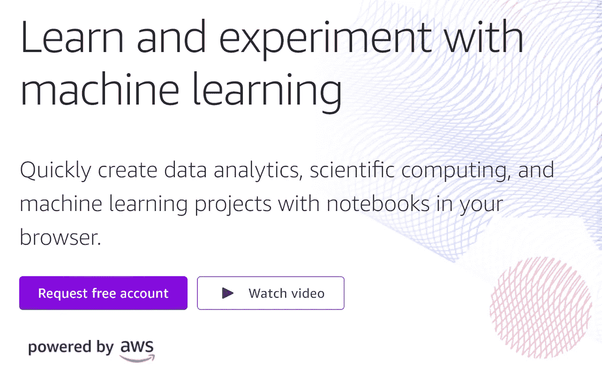
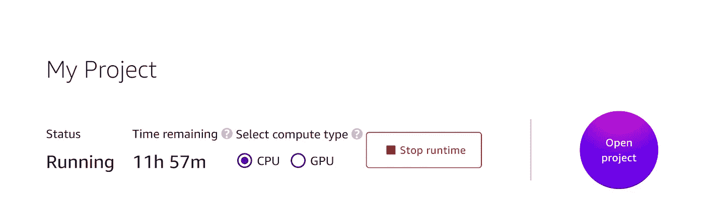
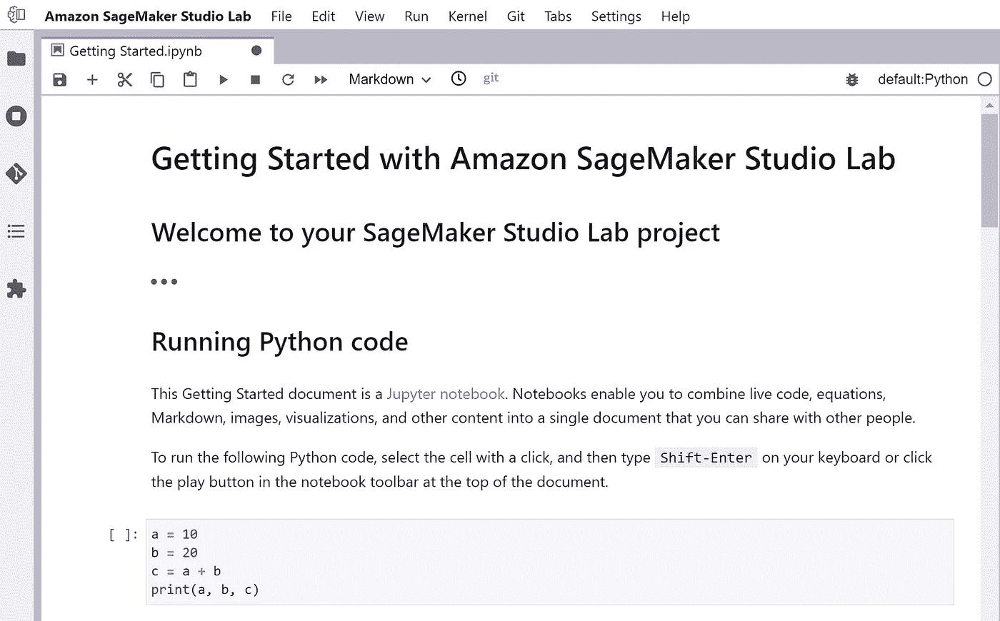
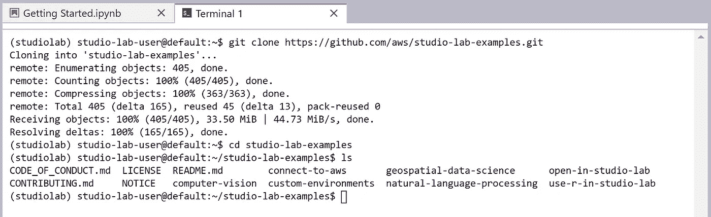
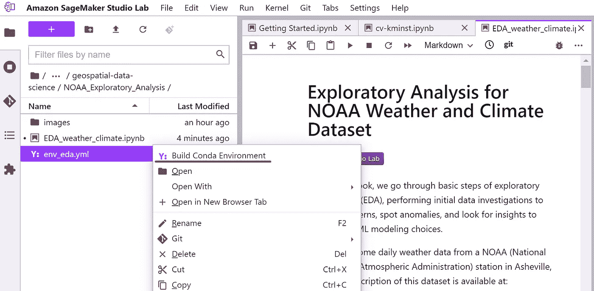
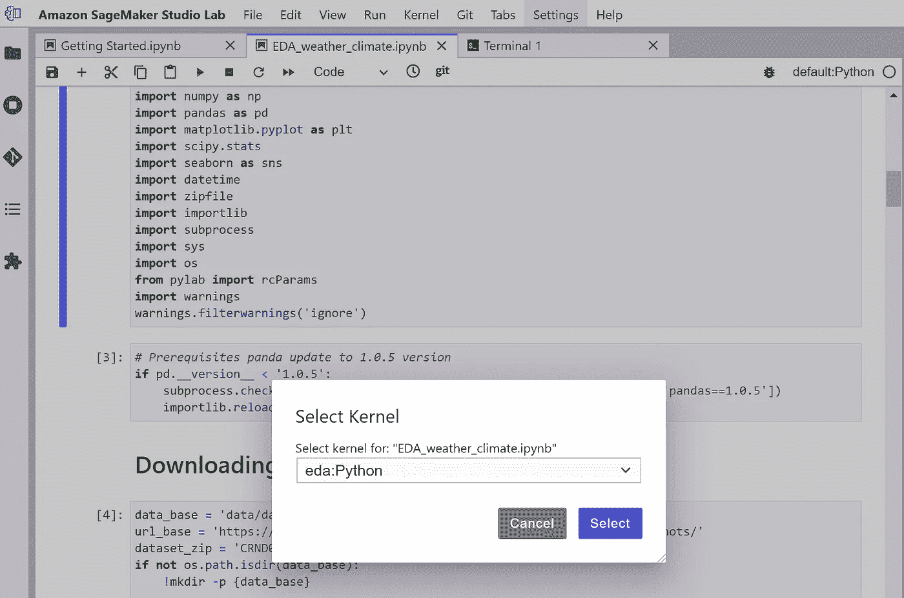
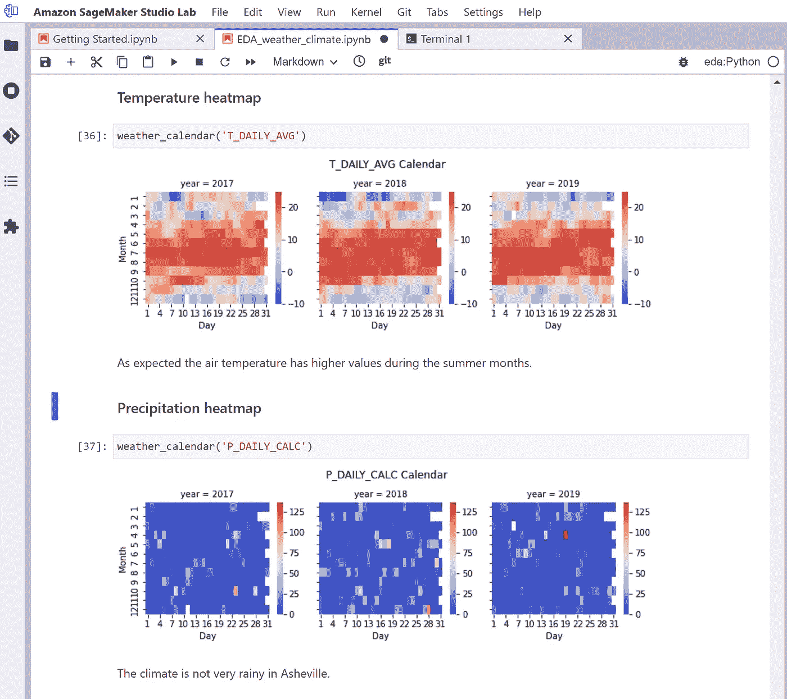

# 亚马逊 SageMaker 工作室实验室:Google Colab 的绝佳替代品

> 原文：<https://towardsdatascience.com/amazon-sagemaker-studio-lab-a-great-alternative-to-google-colab-7194de6ef69a?source=collection_archive---------15----------------------->

## 介绍 AWS 新的免费机器学习平台


[斯科特·格雷厄姆](https://unsplash.com/@homajob?utm_source=medium&utm_medium=referral)在 [Unsplash](https://unsplash.com?utm_source=medium&utm_medium=referral) 上拍照

从机器学习开始可能是一个令人生畏的经历，尤其是如果你不是技术型的，也没有计算机方面的经验。Anaconda 是一个神奇的工具，但是它需要一些专业知识来正确设置和使用。此外，拥有一台强大的计算机对于在大数据集上训练机器学习模型是必要的，如果你对深度学习感兴趣，这一点尤其如此。幸运的是，有各种替代方法可以让初学者尝试机器学习，通过在云服务上轻松执行他们的代码。在过去的几年里，Google Colab 已经成为一种行业标准，因为它是一种用户友好的服务，只需创建一个 Google 帐户就可以轻松访问。亚马逊最近推出了 [SageMaker Studio Lab](https://studiolab.sagemaker.aws/) ，这是一项提供有用特性和功能的替代服务。在本文中，我将介绍它的主要特性，并提供一个简短的教程来帮助您熟悉这项服务。我们开始吧！

# 服务介绍

SageMaker Studio 实验室提供了对 AWS 运行时的免费访问，这些运行时针对机器学习和深度学习任务进行了优化。如果您对技术规范感兴趣，CPU 运行时基于 [T3.xlarge](https://aws.amazon.com/ec2/instance-types/t3/) 实例，而 GPU 运行时运行在 [G4dn.xlarge](https://aws.amazon.com/ec2/instance-types/g4/) 上。每个运行时都带有 JupyterLab，这是一个基于 web 的界面，允许您创建和执行 Jupyter 笔记本，这是数据科学事实上的标准。此外，该服务提供 15 GB 的持久存储，让您存储数据集和实验结果。

访问 AWS 运行时非常有用。例如，在自己的计算机上安装 Anaconda 和 JupyterLab 有困难的人可以从中受益匪浅。此外，即使是有经验的用户也不总是能接触到强大的硬件，所以在这种情况下，利用云服务是一个很好的选择。最后，由于硬件短缺和各种其他原因，GPU 价格在过去几年中有所上涨。因此，利用 SageMaker Studio Lab 的 GPU 运行时对于那些买不起 GPU 卡的人来说将是无价的！

# 与 Google Colab 的比较

Google Colab 是 SakeMaker Studio Lab 的主要替代方案，所以我打算简单比较一下。Google Colab 是一项成熟的服务，被数百万数据科学家和机器学习工程师使用，因此该领域的大多数专业人士都已经熟悉它。在我看来，Google Colab 是精简且易于使用的，同时还具有高级协作功能，这是 SageMaker Studio 实验室目前有些缺乏的领域。

无论如何，应该注意的是，Google Colab 不提供持久存储，每次重启实例都会丢失数据。此外，谷歌 Colab 通常将特斯拉 K80 GPU 分配给免费账户，而[更快的 GPU 则留给高级 Colab Pro 服务](https://colab.research.google.com/signup)的订户。另一方面，[sage maker Studio 实验室的 GPU 运行时利用了特斯拉 T4 模型](https://studiolab.sagemaker.aws/faq)，这是一种比特斯拉 K80 好得多的 GPU，因此使这项服务对那些对深度学习感兴趣的人具有吸引力。无论如何，这两种服务都是在云上运行 Jupyter 笔记本的绝佳选择。

# SageMaker Studio 实验室入门



作者图片

首先，你需要访问[这个链接](https://studiolab.sagemaker.aws/requestAccount)并完成表格来申请一个免费的 SageMaker Studio 实验室账户。根据亚马逊的说法，申请通常会在 1 到 5 个工作日内获得批准，但我在提交表格后几个小时就可以访问我的帐户，所以你可能会很幸运。在您的帐户获得批准后，您可以使用您的凭据登录服务。



作者图片

登录 SageMaker Studio 实验室后，您只需选择您喜欢的实例类型，可以基于 CPU 或 GPU。在这种情况下，我决定启动 CPU 运行时，如屏幕截图所示。单击“启动运行时”按钮后，会话将启动并在接下来的 12 个小时内保持活动状态。如果选择 GPU 运行时，最长时间限制为 4 小时。当达到时间限制时，运行时将重新启动，但您的文件将保存到永久存储中。我们现在可以单击“打开项目”按钮来启动 JupyterLab 界面。



作者图片

我们现在使用的是 JupyterLab 环境，它提供了一些高级特性，比如执行 Python 代码、编写 Markdown 文本、在终端上运行 Linux 命令以及其他各种特性。此外，您可以通过使用`pip`和`conda`包管理器来安装任何您想要的 Python 包。如果你不熟悉 JupyterLab，我建议你阅读[官方文档](https://jupyterlab.readthedocs.io/en/stable/)来熟悉它。



作者图片

如果你想熟悉 SageMaker Studio Lab，你可以克隆`studio-lab-examples`库并用提供的笔记本进行实验。如屏幕截图所示，这可以通过启动终端并运行以下命令轻松完成。显然，您可以克隆任何其他可能有用的 Github 库。

```
git clone [https://github.com/aws/studio-lab-examples.git](https://github.com/aws/studio-lab-examples.git)
```

# 执行 Jupyter 笔记本



作者图片

在克隆了`studio-lab-examples`存储库之后，我们现在将执行它包含的一个笔记本。我选择了`EDA_weather_climate.ipynb`笔记本，但其余的过程是相似的。首先我们需要打开`NOAA_Exploratory_Analysis`目录，右键点击`env_eda.yml`文件。之后，我们选择“构建 Conda 环境”选项来创建一个 Conda 环境，其中包含该笔记本所需的所有软件包。这些命令将在新的终端上执行，该过程可能需要几分钟才能完成。



创建环境后，我们可以通过选择`eda`内核来激活它。请记住，没有必要为每台笔记本电脑创建一个新的环境，但这被认为是最佳做法，这样我们可以避免包依赖冲突和其他问题。



作者图片

激活`eda` Conda 环境后，我们只需选择“运行所有单元”来执行所有笔记本单元并渲染结果图，如上面的截图所示。

# 结论

很明显，亚马逊 SageMaker Studio Lab 是一项引人注目的服务，它提供了对 JupyterLab 环境的轻松访问，让任何人都可以从事机器学习项目。它的高级特性和功能使它成为 Google Colab 的一个很好的替代品，因此引入了竞争，这可能会激励 Google 改善其服务，也许是通过向 Colab 用户提供持久存储。因此，我鼓励你尝试 SageMaker Studio Lab，看看它是否适合你的需求！欢迎在评论中分享您的想法，或者关注我的 LinkedIn，我会定期在那里发布关于数据科学和其他主题的内容。你也可以访问我的[个人网站](https://giannis.io/)或者查看我的新书，书名是[用 PyCaret](https://leanpub.com/pycaretbook/) 简化机器学习。