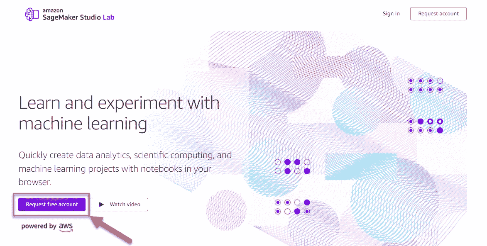
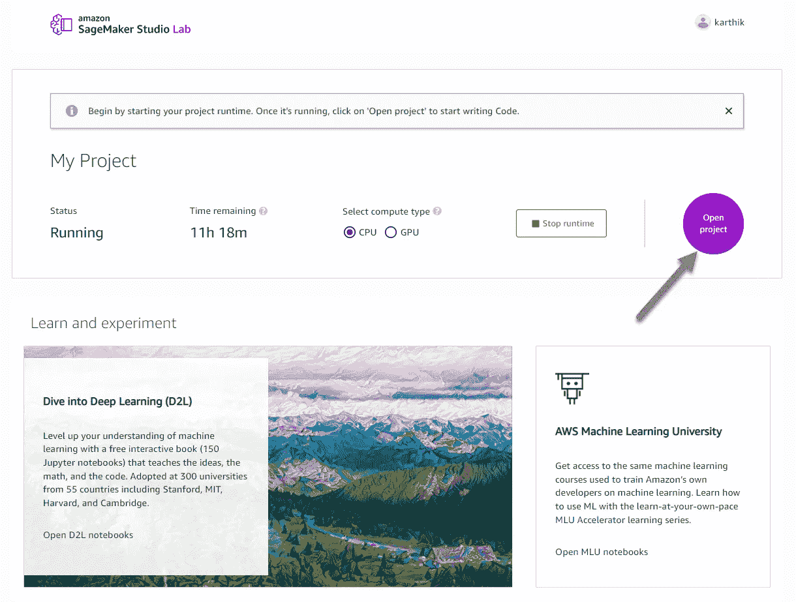
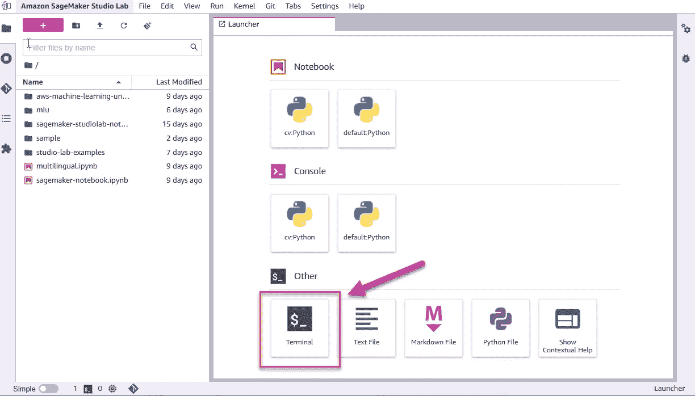
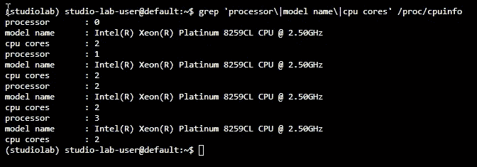
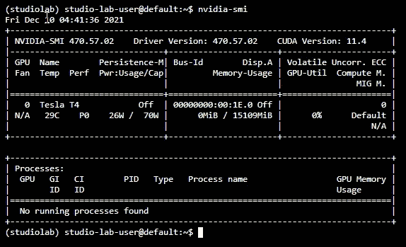
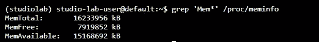
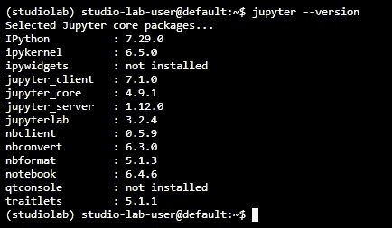
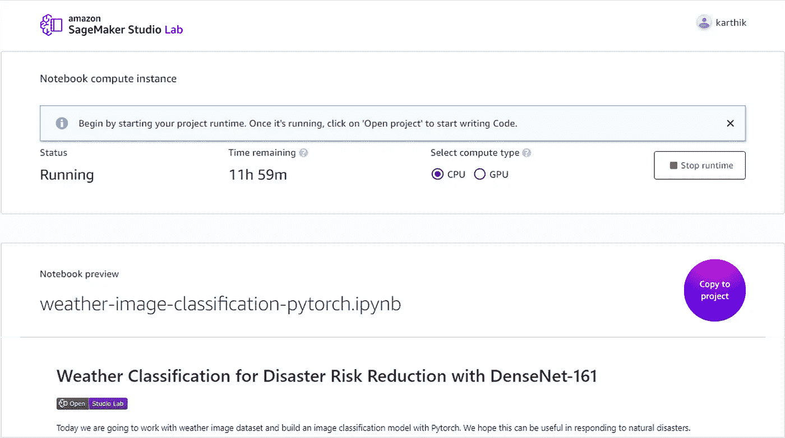
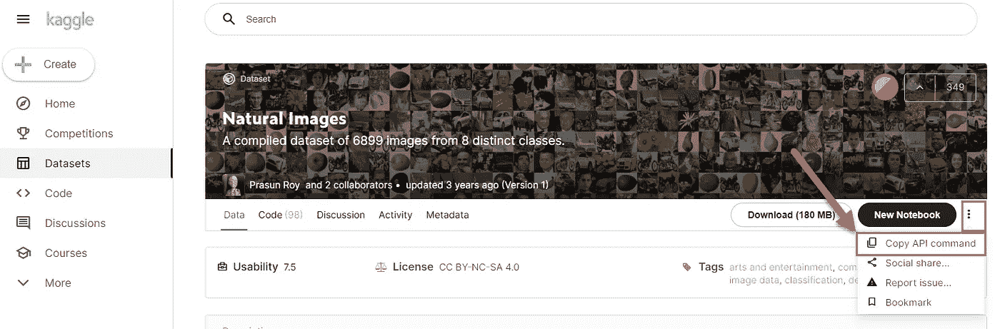
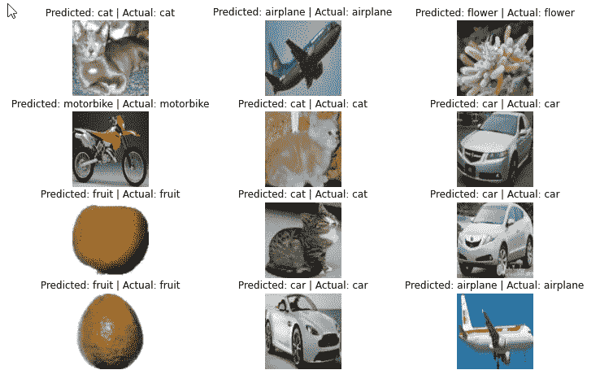

# 亚马逊 SageMaker 初学者工作室实验室

> 原文：<https://towardsdatascience.com/amazon-sagemaker-studio-lab-for-beginners-b5421b1550d3?source=collection_archive---------14----------------------->

## 使用 SageMaker Studio Lab、GitHub 和 Kaggle 数据集，探索学习 ML 是如何变得简单而有趣


尼克·莫里森在 [Unsplash](https://unsplash.com?utm_source=medium&utm_medium=referral) 上拍摄的照片

机器学习无处不在。今天，随便挑一篇文章或一个工业应用，你都会阅读或使用 ML。学习和实验 ML 最简单的方法是使用 Jupyter 笔记本。我们使用笔记本以自己选择的编程语言编写代码，用文本进行注释，并处理数据。每当我学习一个新的话题，我发现自己在 Evernote、Quip 或 notes 上草草记下笔记。然后我切换到 Word 或 PDF 文档来起草最终版本。涉猎 ML 应该没什么区别。你想快速开始并尝试 ML。

# 亚马逊 SageMaker Studio Lab 是什么？

Amazon SageMaker Studio Lab 是一个免费、无需设置的笔记本环境，旨在学习和试验 ML。如果你熟悉 Jupyter 笔记本，使用 SageMaker Studio Lab 会有宾至如归的感觉。最棒的是，你不需要建立一个 AWS 账户或使用信用卡。首先，[用你的邮箱注册一个账户](http://studiolab.sagemaker.aws/)。

我使用 Amazon SageMaker Studio Lab 快速、轻松地对 ML 进行实验。无论您是学习 ML 课程的学生，还是运行许多 TensorFlow 模型的专家数据科学家，您都需要一个工具来试验 ML。

(**注** *:我是亚马逊 SageMaker 团队的产品经理，职业上不是数据科学家或者 ML 工程师。我每天都像你一样学习、呼吸和建造所有的东西。不过，你应该对我的意见有所保留*😊)

# 我为什么要用它？

是单纯，是安心。SageMaker Studio Lab 让你花更多的时间学习 ML，而不是为数据科学建立基础设施。如果你想知道这与在笔记本电脑上设置自己的 Jupyter 笔记本或使用其他免费的笔记本解决方案有何不同，请继续阅读。

*   从头开始构建一个环境并管理它是一件痛苦的事情。您不想花时间设置数据科学环境。
*   你不希望注册一个云提供商，并在计算上花钱来试验 ML。
*   您希望有一个环境，即使您注销了帐户也能保存您的结果，并且每次登录时不会强迫您从头开始。
*   您希望从环境中快速连接到 GitHub 和 Kaggle 等服务以构建原型。


彼得·康伦在 [Unsplash](https://unsplash.com?utm_source=medium&utm_medium=referral) 上的照片

# 让我们试一试

首先，您需要从 SageMaker Studio 实验室网站申请一个新帐户。您将被添加到等待列表中，一旦您的帐户获得批准，您就可以登录了。



作者图片

登录后，您将看到项目界面，其中包含启动运行时、打开项目和运行示例的选项。选择**打开项目。**您将被带到您的项目，在那里您可以创建笔记本、终端、源代码、降价文件等等。



作者图片

让我们打开一个终端(文件>新建>终端或选择**终端**按钮)来检查配置。



作者图片

让我们检查一下 CPU 信息。如果选择计算类型作为运行时的 CPU，请运行以下命令。



作者图片

从项目登录页面，您可以通过切换计算类型从 CPU 切换到 GPU(反之亦然)，运行时将使用新硬件重新启动。选择计算类型为 GPU 后，返回终端窗口并运行以下命令。



作者图片

接下来，让我们检查内存信息。



作者图片

您还可以使用以下命令检查 JupyterLab 版本。



作者图片

我们运行的是 JupyterLab 3.2.4，这是 JupyterLab 开源包的最新版本。现在我们已经看到了基本的硬件和软件配置，是时候创建和运行一个 ML 模型了。

# 你好 SageMaker 工作室实验室

我们将使用运行 PyTorch 的 SageMaker Studio 实验室构建一个图像分类 ML 模型。创建模型有三个步骤:

1.从 GitHub 打开笔记本

2.连接到 Kaggle 数据集

3.使用 PyTorch 训练图像分类模型

# 1.在 GitHub 中打开笔记本

最快的实验方法是从 GitHub 的笔记本开始。您可以使用[天气数据图像分类笔记本](https://studiolab.sagemaker.aws/import/github/aws/studio-lab-examples/blob/main/computer-vision/weather-data/weather-image-classification-pytorch.ipynb)并根据我们的需要进行调整。或者，我已经在 GitHub 中发布了[笔记本，上面有我们将在这个实验中使用的自然图像数据集。](https://github.com/karthik-1/SageMakerStudioLab/blob/main/studiolab-image-classification-kaggle-pytorch-learning.ipynb)

如果您登录到 SageMaker Studio 实验室，请打开上面的 URL。选择**复制到项目，**示例将加载到运行时中。确保您的运行时正在运行，计算类型为 CPU。



作者图片

# 2.从 SageMaker 工作室实验室连接到 Kaggle

我们将使用来自 Kaggle 的[自然图像](https://www.kaggle.com/prasunroy/natural-images)数据集和 8 个不同类别的 6.8K 图像。要下载和使用数据集，你需要一个 Kaggle 账户。

在 Kaggle 的帐户页面中，创建一个新的 API 令牌，如下所示。您的浏览器将下载 ***kaggle.json*** 文件，该文件包含通过命令行连接 kaggle 的凭证。


作者图片

将这个 JSON 文件上传到您的笔记本目录中。然后在笔记本中运行以下命令来安装 Kaggle 库并使用您的凭证。

导航到自然图像数据集[页面](https://www.kaggle.com/prasunroy/natural-images)并复制 API 命令以下载图像。



作者图片

在笔记本中添加一个新单元格，然后粘贴 API 命令。下载完成后，您可以解压缩该文件并将其重命名，以便与示例的其余部分一起使用。

# 3.规范化数据并训练模型

我们将更新示例以引用数据集中正确的图像类。

在数据集规范化下，使用以下数据集类

```
dataset_classes = ['airplane', 'car', 'cat', 'dog', 'flower', 'fruit', 'motorbike', 'person']
```

接下来，遍历将对数据进行规范化的单元格，加载 DenseNet 模型以对图像进行分类，并使用样本数据对模型进行微调。为我训练模型用了不到 10 分钟。

# 查看结果

模型训练完成后，您可以可视化图像子集的分类结果。



作者图片

您还可以查看模型的混淆矩阵。记住，对于这个示例，将类的数量更新为 8。

您现在可以在 GitHub 上发布您的笔记本，供其他人在 SageMaker Studio Lab 上使用。您也可以通过在 Markdown 或 HTML 中添加代码片段来添加一键启动按钮以加载您的笔记本。

将上面的笔记本网址替换为您在 GitHub 上的笔记本链接。

# 结论

我们在今天的预览版中看到了 SageMaker Studio Lab 的功能。具体来说，我们研究了如何在 GitHub 中打开笔记本并连接到 Kaggle 数据集。如果想深入学习，可以用几个 Jupyter 笔记本例子[这里](https://github.com/d2l-ai/d2l-pytorch-sagemaker-studio-lab)。如果你对 SageMaker Studio Lab 有任何问题，或者对上述实验有任何反馈，请随时发表评论，或者就堆栈溢出问题联系 [#amazon-sagemaker](https://stackoverflow.com/questions/tagged/amazon-sagemaker) 。

# 其他资源的链接

[1]吴恩达，[斯坦福机器学习课程](https://www.coursera.org/learn/machine-learning)，Coursera

[2]吴恩达，[深度学习专精](https://www.coursera.org/specializations/deep-learning)，Deep Learning。人工智能

[3]张，阿斯顿和利普顿，扎卡里 c .和李，穆和斯莫拉，亚历山大 j .，[潜入深度学习](https://d2l.ai/) (2021)

[4] AWS [机器学习大学](https://aws.amazon.com/machine-learning/mlu/) (2021)

【5】丹尼尔·伯克，[‘我想学习人工智能和机器学习。我能从哪里开始？](/i-want-to-learn-artificial-intelligence-and-machine-learning-where-can-i-start-7a392a3086ec) (2018)，走向数据科学


伊恩·施耐德在 [Unsplash](https://unsplash.com?utm_source=medium&utm_medium=referral) 上拍摄的照片

感谢阅读！