# 使用 TigerGraph 和 Google Vertex 检测 AMLSim 欺诈第一部分:准备数据

> 原文：<https://towardsdatascience.com/amlsim-fraud-detection-with-tigergraph-and-google-vertex-part-i-preparing-the-data-2f3e6487f398?source=collection_archive---------13----------------------->

## 使用 TigerGraph 运行图形查询以准备 AMLSim 欺诈检测数据集

> 这个项目是和[德州陈](https://medium.com/u/9ee92495f34e?source=post_page-----2f3e6487f398--------------------------------) ( [领英](https://www.linkedin.com/in/dezhou-chen-625904206))在[乔恩·赫克](https://medium.com/u/571f80cc8b69?source=post_page-----2f3e6487f398--------------------------------) ( [领英](https://www.linkedin.com/in/jonherke))的帮助下共同创作的。它基于 Jon Herke 创建的 AMLSim Python Lab。

# 概述和目标

图形数据库最流行的用例之一是欺诈检测。在这篇博客中，我们将加载基于 [IBM 的 AMLSim 项目](https://github.com/IBM/AMLSim)的数据(我们将在这里使用来自实验室[的数据)，一个来自银行交易模拟的数据集。](https://github.com/TigerGraph-DevLabs/AMLSim_Python_Lab)

在这个实验中，我们将利用 TigerGraph 的图形数据库和 Google Vertex 的机器学习来将交易分类为欺诈性或非欺诈性交易。

本博客将向您介绍如何使用 TigerGraph 创建 AML Sim 图，运行 pagerank 和 label prop 等图形算法，最后编写查询从 TigerGraph 中提取所需信息。我们开始吧！

# 第一部分:在 https://tgcloud.io/创建一个免费的 TigerGraph 解决方案

首先，你需要在[https://tgcloud.io/](https://tgcloud.io/)创建一个免费的解决方案。这是我们存放图表数据库的地方。如果您还没有，请前往[https://tgcloud.io/](https://tgcloud.io/)创建一个帐户。你可以在谷歌、LinkedIn 或电子邮件上注册。

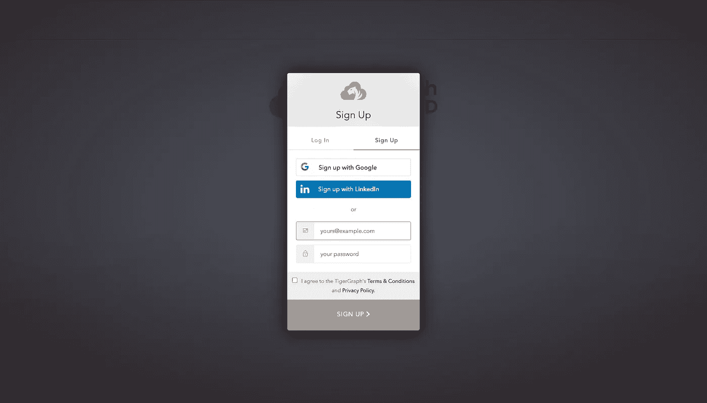

注册或登录后，导航至左侧边栏中的“我的解决方案”选项卡，然后点击右上角的蓝色“创建解决方案”按钮。

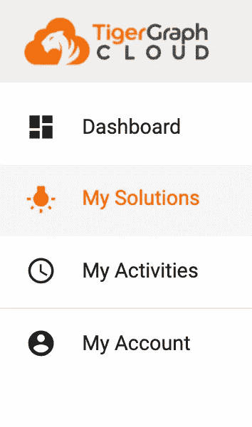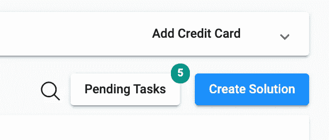

转到“我的解决方案”选项卡，然后单击“创建解决方案”

在第一个选项卡上，从“选择初学者工具包”中选择“空白”选项。不要更改任何其他内容，然后按下一步。

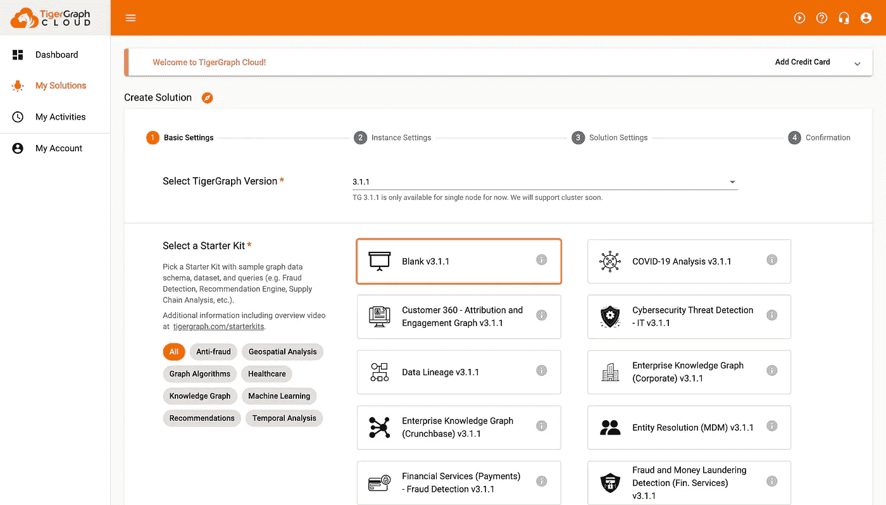

单击空白，然后单击下一步。

第二步，不要修改任何东西(本质上这只是创建一个免费的解决方案),然后点击 next。

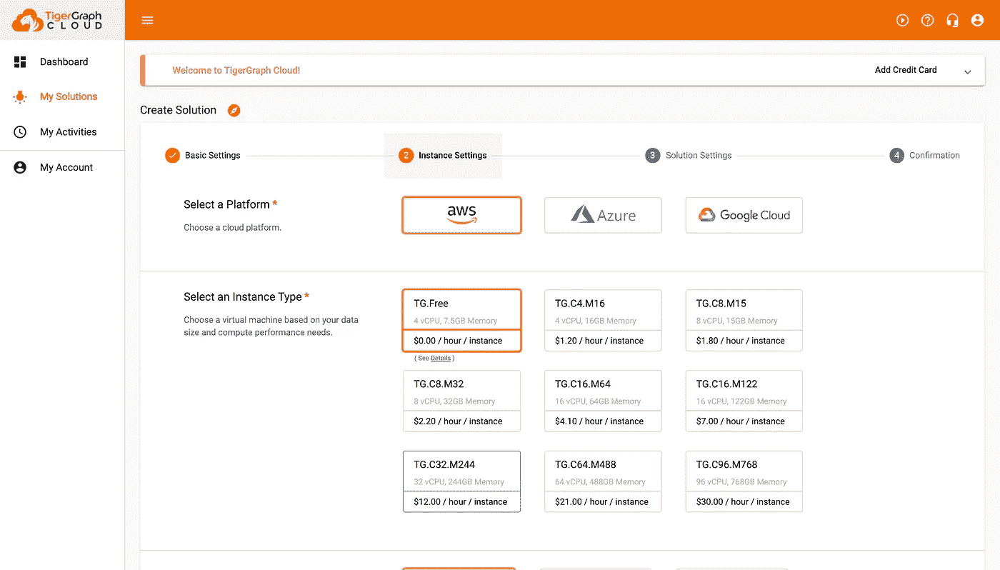

不要在这里修改任何东西，然后按下一步。

第三步，添加您的解决方案名称、标签、密码、子域和描述。请记住您的初始密码和子域！

> 注意:每个子域必须是唯一的，所以你可能无法使用我使用的相同的子域。

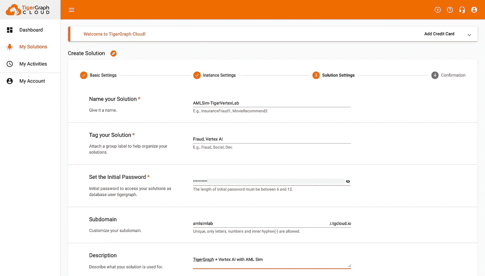

将此更新为您自己的

仔细检查第四步中的所有信息，然后按“提交”创建您的解决方案。创建您的解决方案可能需要几分钟时间。

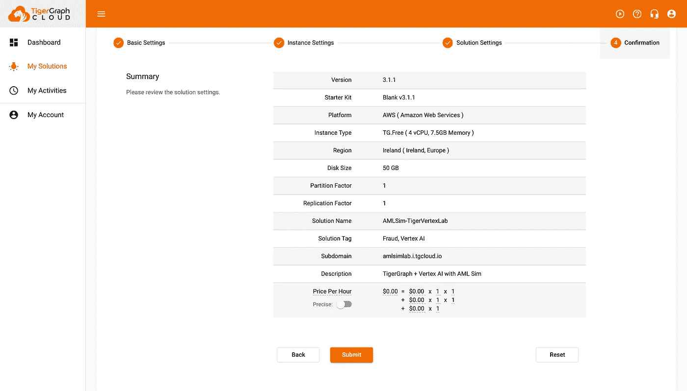

仔细检查您的解决方案摘要是否正确，然后按提交！

恭喜你。您已经用 TigerGraph 创建了一个解决方案！现在，让我们转到笔记本来创建图表、加载数据、创建和运行查询！

# 第二部分:用 TigerGraph 创建一个 AMLSim 图

## 步骤 1:连接到您的解决方案

首先，我们将使用 pyTigerGraph 连接到我们刚刚创建的解决方案。pyTigerGraph 是一个用于 TigerGraph 的 Python 包，我们将使用它与我们的解决方案进行交互。

在 Colab 中，我们需要首先 pip 安装 pyTigerGraph，然后导入库。

```
!pip install pyTigerGraphimport pyTigerGraph as tg
```

太好了！现在，让我们连接到刚刚创建的解决方案。为此，我们可以使用 tg.TigerGraphConnection。

```
conn = tg.TigerGraphConnection(host="https://SUBDOMAIN.i.tgcloud.io", password="PASSWORD")
```

运行之后，您就可以连接并准备创建一个模式了！

## 步骤二:创建一个模式

现在我们要创建一个模式。这将由包括账户和交易在内的几个顶点组成，这些顶点将由无向和有向边连接。例如，帐户和交易顶点将用两条有向边连接:Send_Transaction 和 Recieve _ Transaction。

下面的代码将创建所有的顶点和边。

```
print(conn.gsql('''CREATE VERTEX Country (PRIMARY_ID id STRING) WITH primary_id_as_attribute="true"
CREATE VERTEX Customer (PRIMARY_ID id STRING) WITH primary_id_as_attribute="true"
CREATE VERTEX Account (PRIMARY_ID id STRING, init_balance DOUBLE, account_type STRING, tx_behavior INT, pagerank FLOAT, label INT, current_balance DOUBLE, min_send_tx DOUBLE, min_recieve_tx DOUBLE, max_send_tx DOUBLE, max_recieve_tx DOUBLE, avg_send_tx DOUBLE, avg_recieve_tx DOUBLE, cnt_recieve_tx INT, cnt_send_tx INT) WITH primary_id_as_attribute="true"
CREATE VERTEX Transaction (PRIMARY_ID id STRING, tx_behavior_id INT, amount DOUBLE, is_fraud BOOL) WITH primary_id_as_attribute="true"
CREATE VERTEX Alert (PRIMARY_ID id STRING, alert_type STRING, ts INT) WITH primary_id_as_attribute="true"CREATE UNDIRECTED EDGE Based_In (From Customer, To Country)
CREATE UNDIRECTED EDGE Customer_Account (From Customer, To Account)
CREATE UNDIRECTED EDGE Transaction_Flagged (From Transaction, To Alert)
CREATE DIRECTED EDGE Send_To (From Account, To Account) WITH REVERSE_EDGE="reverse_Send_To"
CREATE DIRECTED EDGE Send_Transaction (From Account, To Transaction, ts INT, tx_type STRING) WITH REVERSE_EDGE="reverse_Send_Transaction"
CREATE DIRECTED EDGE Recieve_Transaction (From Transaction, To Account, ts INT, tx_type STRING) WITH REVERSE_EDGE="reverse_Recieve_Transaction"''', options=[]))
```

接下来，我们将使用上面创建的所有顶点和边创建一个名为 AMLSim 的图(我们将把它作为参数传递给 CREATE GRAPH 函数)。

```
print(conn.gsql('''CREATE GRAPH AMLSim(Country, Customer, Account, Transaction, Alert, Based_In, Customer_Account, Transaction_Flagged, Send_To, Send_Transaction, reverse_Send_Transaction, Recieve_Transaction, reverse_Recieve_Transaction)''', options=[]))
```

现在，如果您返回到 https://tgcloud.io/的，点击“我的解决方案”选项卡，点击“操作”下的四个框(悬停值为“应用”)，然后点击 GraphStudio，您将能够看到您创建的图表。

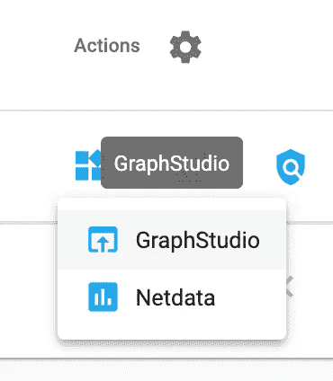

转到 GraphStudio。

单击“设计模式”查看全局模式。

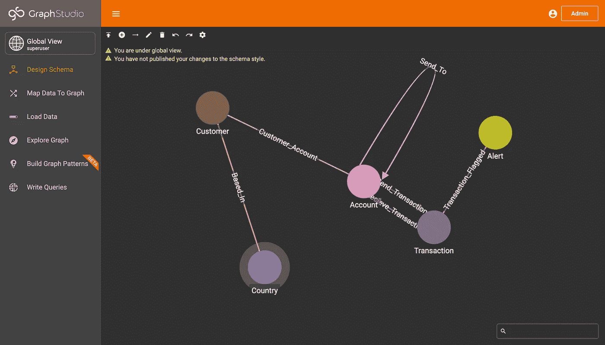

模式的全局视图。

如果您单击“全局视图”，将会出现该解决方案中所有图表的下拉列表。您会注意到我们刚刚创建的图表 AMLSim 就在那里！点击那个。

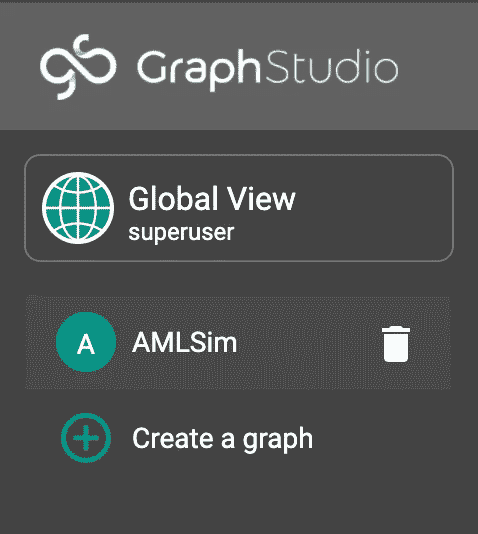

您会注意到 AMLSim 是下拉选项之一。点击 AMLSim。

在“设计模式”中，您将再次看到您的模式！

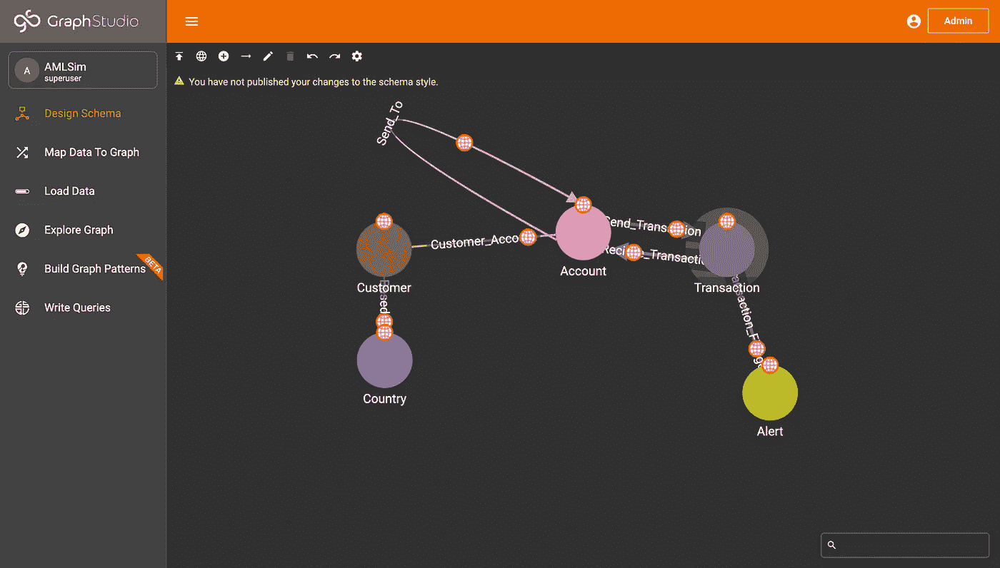

AMLSim 图的架构。

如果您点击左侧边栏中的“加载数据”，您将能够看到加载到图表中的任何数据。

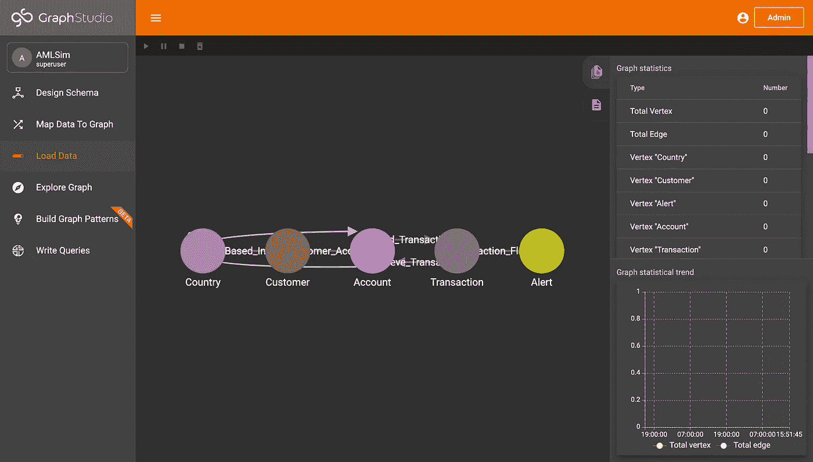

加载数据页面。

现在，没有数据加载，所以让我们改变这一点！

## 第三步:加载数据

让我们将数据加载到图表中。为此，我们首先需要从 GitHub 存储库中获取从 CSV 加载的数据。我们将首先导入 pandas 来读取 CSV，然后 git 克隆存储库。我们将使用 pandas 的 read_csv 函数来创建 csv 数据的数据帧，并将其分配给变量 accounts、alerts 和 transactions。

```
import pandas as pd!git clone https://github.com/TigerGraph-OSS/AMLSim_Python_Labaccounts = pd.read_csv("AMLSim_Python_Lab/data/accounts.csv", sep=",")
alerts = pd.read_csv("AMLSim_Python_Lab/data/alerts.csv", sep=",")
transactions = pd.read_csv("AMLSim_Python_Lab/data/transactions.csv", sep=",")
```

接下来，我们将把数据帧中的所有 id 列更新为字符串，而不是整数。

```
accounts['ACCOUNT_ID'] = accounts['ACCOUNT_ID'].astype(str)alerts['ALERT_ID'] = alerts['ALERT_ID'].astype(str)
alerts['SENDER_ACCOUNT_ID'] = alerts['SENDER_ACCOUNT_ID'].astype(str)
alerts['RECEIVER_ACCOUNT_ID'] = alerts['RECEIVER_ACCOUNT_ID'].astype(str)transactions['TX_ID'] = transactions['TX_ID'].astype(str)
transactions['SENDER_ACCOUNT_ID'] = transactions['SENDER_ACCOUNT_ID'].astype(str)
transactions['RECEIVER_ACCOUNT_ID'] = transactions['RECEIVER_ACCOUNT_ID'].astype(str)
```

现在，在我们将数据加载到图表中之前，让我们更新图表参数。我们将创建一个 API 令牌，并将 graphname 设置为 AMLSim。

```
conn.graphname = "AMLSim"conn.apiToken = conn.getToken(conn.createSecret())
```

最后，我们将使用 pyTigerGraph 中的 upsertVertexDataFrame 和 upsertEdgeDataFrame 函数将数据帧作为顶点和边向上插入到我们的图形中。

```
# UPSERT VERTEX "Customer"
v_customer = conn.upsertVertexDataFrame(accounts, "Customer", "CUSTOMER_ID", attributes={"id": "CUSTOMER_ID"})
print(str(v_customer) + " Customer VERTICES Upserted")# UPSERT VERTEX "Account"
v_account = conn.upsertVertexDataFrame(accounts, "Account", "ACCOUNT_ID", attributes={"id": "ACCOUNT_ID", "init_balance": "INIT_BALANCE", "account_type": "ACCOUNT_TYPE", "tx_behavior": "TX_BEHAVIOR_ID"})
print(str(v_account) + " Account VERTICES Upserted")# UPSERT VERTEX "Transaction"
v_transaction = conn.upsertVertexDataFrame(transactions, "Transaction", "TX_ID", attributes={"id": "TX_ID", "amount": "TX_AMOUNT", "is_fraud": "IS_FRAUD"})
print(str(v_transaction) + " Transaction VERTICES Upserted")# UPSERT VERTEX "Alert"
v_alert = conn.upsertVertexDataFrame(alerts, "Alert", "ALERT_ID", attributes={"id": "ALERT_ID", "alert_type": "ALERT_TYPE", "ts": "TIMESTAMP"})
print(str(v_alert) + " Alert VERTICES Upserted")# UPSERT EDGE "Send_Transaction"
e_send_transaction = conn.upsertEdgeDataFrame(transactions, "Account", "Send_Transaction", "Transaction", from_id="SENDER_ACCOUNT_ID", to_id="TX_ID", attributes={"ts": "TIMESTAMP", "tx_type": "TX_TYPE"})
print(str(e_send_transaction) + " Send_Transaction EDGES Upserted")# UPSERT EDGE "Send_Transaction"
e_recieve_transaction = conn.upsertEdgeDataFrame(transactions, "Transaction", "Recieve_Transaction", "Account", from_id="TX_ID", to_id="RECEIVER_ACCOUNT_ID", attributes={"ts": "TIMESTAMP", "tx_type": "TX_TYPE"})
print(str(e_recieve_transaction) + " Recieve_Transaction EDGES Upserted")# UPSERT EDGE "Send_To"
e_send_to = conn.upsertEdgeDataFrame(transactions, "Account", "Send_To", "Account", from_id="SENDER_ACCOUNT_ID", to_id="RECEIVER_ACCOUNT_ID", attributes={})
print(str(e_send_to) + " Send_To EDGES Upserted")# UPSERT EDGE "Transaction_Flagged"
e_transaction_flagged = conn.upsertEdgeDataFrame(alerts, "Transaction", "Transaction_Flagged", "Alert", from_id="TX_ID", to_id="ALERT_ID", attributes={})
print(str(e_transaction_flagged) + " Transaction_Flagged EDGES Upserted")# UPSERT EDGE "Customer_Account"
e_customer_account = conn.upsertEdgeDataFrame(accounts, "Customer", "Customer_Account", "Account", from_id="CUSTOMER_ID", to_id="ACCOUNT_ID", attributes={})
print(str(e_customer_account) + " Customer_Account EDGES Upserted")# UPSERT EDGE "Based_In"
e_based_in = conn.upsertEdgeDataFrame(accounts, "Customer", "Based_In", "Country", from_id="CUSTOMER_ID", to_id="COUNTRY", attributes={})
print(str(e_based_in) + " Based_In EDGES Upserted")# PRINT OUT STATS
print("=====TOTAL_UPSERTS=====")
print(str(v_customer+v_account+v_transaction+v_alert) + " TOTAL VERTICES")
print(str(e_send_transaction+e_recieve_transaction+e_send_to+e_transaction_flagged+e_customer_account+e_based_in) + " TOTAL EDGES")
```

最后，您可以转到 GraphStudio 中的 loading 选项卡，您会发现所有数据都被向上插入。

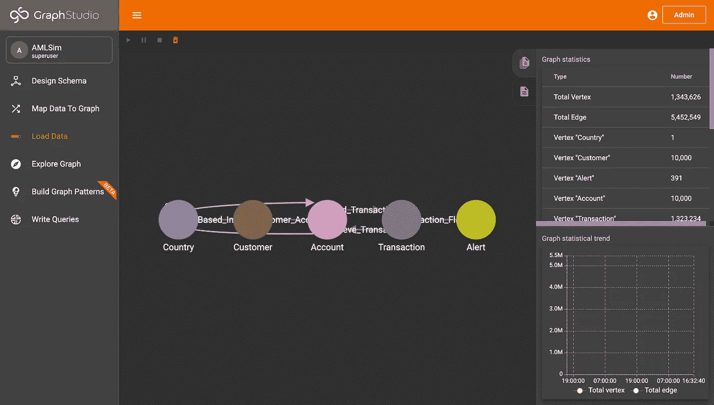

我们的图表中现在有数据了！

恭喜你。您已经用 TigerGraph 正式创建了一个图形数据库，创建了一个模式并加载了数据！现在，让我们编写一些查询和图算法来更新我们的图，并为机器学习做准备。

# 第三部分:创建和安装查询

## 查询 I:帐户活动

我们的第一个查询 accountActivity 将用于使用有关帐户活动的特性来更新图中顶点和边的属性。例如，它将更新帐户的当前余额、帐户的最大、最小和平均交易金额，以及帐户的交易数量。

```
print(conn.gsql('''CREATE QUERY accountActivity() FOR GRAPH AMLSim {SumAccum<DOUBLE> @s_sumAmt, @r_sumAmt;
SumAccum<DOUBLE> @s_txCnt, @r_txCnt;
MinAccum<DOUBLE> @s_minAmt, @r_minAmt;
MaxAccum<DOUBLE> @s_maxAmt, @r_maxAmt;
AvgAccum @s_avgAmt, @r_avgAmt;Seed = {Account.*};acctSend = SELECT tgt FROM Seed:s -(Send_Transaction:e)-> Transaction:tgt
ACCUM s.@s_sumAmt += tgt.amount, s.@s_txCnt += 1, s.@s_minAmt += tgt.amount, s.@s_maxAmt += tgt.amount, s.@s_avgAmt += tgt.amount
POST-ACCUM s.current_balance = s.@s_sumAmt - s.init_balance, s.min_send_tx = s.@s_minAmt, s.max_send_tx = s.@s_maxAmt, s.avg_send_tx = s.@s_avgAmt, s.cnt_send_tx = s.@s_txCnt;acctRecieve = SELECT tgt FROM Seed:s -(reverse_Recieve_Transaction:e)-> Transaction:tgt
ACCUM s.@r_sumAmt += tgt.amount, s.@r_txCnt += 1, s.@r_minAmt += tgt.amount, s.@r_maxAmt += tgt.amount, s.@r_avgAmt += tgt.amount
POST-ACCUM s.current_balance = s.@r_sumAmt + s.init_balance, s.min_recieve_tx = s.@r_minAmt, s.max_recieve_tx = s.@r_maxAmt, s.avg_recieve_tx = s.@r_avgAmt, s.cnt_recieve_tx = s.@r_txCnt;PRINT "Features Have Been Calculated";}INSTALL QUERY accountActivity''', options=[]))
```

## 查询二:label_prop

标签属性是一种图形算法。要了解更多信息，请访问德州陈的博客！你也可以在 [TigerGraph 的算法页面](https://docs.tigergraph.com/tigergraph-platform-overview/graph-algorithm-library#label-propagation)了解。简而言之，这种算法试图找到社区，并根据其社区标记一个顶点。

```
print(conn.gsql('''CREATE QUERY label_prop (SET<STRING> v_type, SET<STRING> e_type, INT max_iter, INT output_limit, BOOL print_accum = TRUE, STRING file_path = "", STRING attr = "") FOR GRAPH AMLSim{OrAccum @@changed = true;
MapAccum<INT, INT> @map;
MapAccum<INT, INT> @@commSizes;
SumAccum<INT> @label, @num;FILE f (file_path);Start = {v_type};
Start = SELECT s FROM Start:s ACCUM s.@label = getvid(s);WHILE @@changed == true LIMIT max_iter DO
@@changed = false;Start = SELECT s
FROM Start:s -(e_type:e)-> :t
ACCUM t.@map += (s.@label -> 1)
POST-ACCUM INT maxV = 0, INT label = 0,
FOREACH (k,v) IN t.@map DO
CASE WHEN v > maxV THEN maxV = v, label = k
END
END,CASE WHEN label != 0 AND t.@label != label AND maxV > t.@num THEN
@@changed += true,
t.@label = label,
t.@num = maxV
END,
t.@map.clear();END;Start = {v_type};Start =  SELECT s FROM Start:s
POST-ACCUM
IF attr != "" THEN s.setAttr(attr, s.@label) END,
IF file_path != "" THEN f.println(s, s.@label) END,
IF print_accum THEN @@commSizes += (s.@label -> 1) END
LIMIT output_limit;IF print_accum THEN
PRINT @@commSizes;
PRINT Start[Start.@label];END;}INSTALL QUERY label_prop''', options=[]))
```

## 查询三:page_rank

页面排序是另一种图形算法。要了解更多，请查看即将在[德州陈](https://medium.com/u/9ee92495f34e?source=post_page-----2f3e6487f398--------------------------------)的网页上发布的博客！你也可以在 [TigerGraph 的算法页面](https://docs.tigergraph.com/tigergraph-platform-overview/graph-algorithm-library#pagerank)了解。简而言之，这个算法将查看图中每个顶点对每个其他顶点的影响，并给它一个影响分数。

```
print(conn.gsql('''CREATE QUERY pageRank (STRING v_type, STRING e_type, FLOAT max_change=0.001, INT max_iter=25, FLOAT damping=0.85, INT top_k = 100, BOOL print_accum = TRUE, STRING result_attr =  "", STRING file_path = "", BOOL display_edges = FALSE) FOR GRAPH AMLSim {TYPEDEF TUPLE<VERTEX Vertex_ID, FLOAT score> Vertex_Score;
HeapAccum<Vertex_Score>(top_k, score DESC) @@topScores;
MaxAccum<FLOAT> @@max_diff = 9999;
SumAccum<FLOAT> @recvd_score = 0;
SumAccum<FLOAT> @score = 1;
SetAccum<EDGE> @@edgeSet;FILE f (file_path);Start = {v_type};WHILE @@max_diff > max_change LIMIT max_iter DO
@@max_diff = 0;V = SELECT s FROM Start:s -(e_type:e)-> v_type:t
ACCUM t.@recvd_score += s.@score/(s.outdegree(e_type))
POST-ACCUM s.@score = (1.0-damping) + damping * s.@recvd_score, s.@recvd_score = 0, @@max_diff += abs(s.@score - s.@score');END; IF file_path != "" THEN
f.println("Vertex_ID", "PageRank");
END;V = SELECT s FROM Start:s
POST-ACCUM
IF result_attr != "" THEN s.setAttr(result_attr, s.@score) END,
IF file_path != "" THEN f.println(s, s.@score) END,
IF print_accum THEN @@topScores += Vertex_Score(s, s.@score) END;
IF print_accum THEN PRINT @@topScores;
IF display_edges THEN PRINT Start[Start.@score];Start = SELECT s FROM Start:s -(e_type:e)-> v_type:t
ACCUM @@edgeSet += e;
PRINT @@edgeSet;END; END;}INSTALL QUERY pageRank''', options=[]))
```

## 查询四:多重限制

这是我们将使用的最后一个查询。这个查询将能够获取我们想要的所有期望的属性。它将抓取前 1000 笔交易，订单基于是否欺诈。

```
print(conn.gsql('''CREATE QUERY txMultiHopLimit() FOR GRAPH AMLSim SYNTAX v2 { /* This grabs the first 1,000 transactions. The beginning has all of the fraudulent transactions and the latter part has some non-fraudulent transactions. */TYPEDEF TUPLE <BOOL tx_fraud, DOUBLE tx_amount, FLOAT s_pagerank, INT s_label, DOUBLE s_min_send_tx, DOUBLE s_min_receieve_tx, DOUBLE s_max_send_tx, DOUBLE s_max_recieve_tx, DOUBLE s_avg_send_tx, DOUBLE s_avg_recieve_tx, INT s_cnt_recieve_tx, INT s_cnt_send_tx, INT s_timestamp, FLOAT r_pagerank, INT r_label, DOUBLE r_min_send_tx, DOUBLE r_min_receieve_tx, DOUBLE r_max_send_tx, DOUBLE r_max_recieve_tx, DOUBLE r_avg_send_tx, DOUBLE r_avg_recieve_tx, INT r_cnt_recieve_tx, INT r_cnt_send_tx, INT r_timestamp> ORDER_TX;HeapAccum<ORDER_TX>(1000, tx_fraud DESC) @@txRecords;Seed = {Account.*};acctSend = SELECT tgt FROM Seed:s - ((Send_Transaction>):e1) - Transaction:v1 - ((Recieve_Transaction>):e2) - Account:tgt ACCUM @@txRecords += ORDER_TX(v1.is_fraud, v1.amount, s.pagerank, s.label, s.min_send_tx, s.min_recieve_tx, s.max_send_tx, s.max_recieve_tx, s.avg_send_tx, s.avg_recieve_tx, s.cnt_recieve_tx, s.cnt_send_tx, e1.ts, tgt.pagerank, tgt.label, tgt.min_send_tx, tgt.min_recieve_tx, tgt.max_send_tx, tgt.max_recieve_tx, tgt.avg_send_tx, tgt.avg_recieve_tx, tgt.cnt_recieve_tx, tgt.cnt_send_tx, e2.ts); PRINT @@txRecords; }INSTALL QUERY txMultiHopLimit''', options=[]))
```

干得好！您现在已经创建并安装了您需要的所有查询！现在让我们开始执行查询来更新我们的图表并获取我们的数据(我们将使用这些数据进行机器学习)。

# 第四部分:执行查询来构建图表

现在，让我们把所有的东西放在一起更新我们的图表。首先，我们需要在图表中生成属性/特征，所以让我们运行 accountActivity 查询。

```
accAct = conn.runInstalledQuery("accountActivity", {})
```

接下来，我们需要更新图中的 label_prop 和 pagerank 值，所以接下来让我们运行它们。

```
pagerank = conn.runInstalledQuery("pageRank", {"v_type":"Account", "e_type":"Send_To", "max_change":"0.001", "max_iter":"25", "damping":"0.85", "top_k":"10", "print_accum":"TRUE", "result_attr":"pagerank", "file_path":"", "display_edges":"FALSE"})label_prop = conn.runInstalledQuery("label_prop", {"v_type":"Account", "e_type":"Send_To", "max_iter":"10", "output_limit":"10", "print_accum":"TRUE", "file_path":"", "attr":"label"})
```

太好了！我们的图表正式全面更新！现在让我们用 txMultiHopLimit 获取我们想要的所有值。

```
tx_hop = conn.runInstalledQuery("txMultiHopLimit", {}, timeout="99999999999", sizeLimit="1500000000")
```

最后，我们将导入 flat_tables 来规范化图形(注意任何有问题的值，比如 NaN)。我们将删除索引列并保存 CSV。

```
!pip install flat-table
import flat_tabledf_tx_hop = pd.DataFrame(tx_hop[0]["@@txRecords"])
df_tx_hop = flat_table.normalize(df_tx_hop)df_tx_hop = df_tx_hop.drop(columns=["index"])df_tx_hop.to_csv("tg_fraud_data.csv", index=False)
```

太棒了。现在您的 Colab 中有一个 CSV 文件可以下载了！我们将在控制台中对 Vertex AI 使用该查询，并且我们将对自定义训练使用 txMultiHopLimit 查询。

# 第五部分:祝贺+下一步

恭喜你。您已经使用 TigerGraph 创建了一个图表，创建并运行了用于特征提取和图表算法的查询，并保存了数据的 CSV 文件！接下来，我们将探索如何使用 Google 的 AutoML 来处理我们刚刚导出的 CSV 数据。明天在博客上看看吧！

与此同时，如果您有任何问题或者您想了解更多关于 TigerGraph 的信息，请加入 TigerGraph Discord！

[](https://discord.gg/gRHWBZNpxW) [## 加入 TigerGraph Discord 服务器！

### 查看 Discord 上的 TigerGraph 社区-与 572 名其他成员一起玩，享受免费的语音和文本聊天。

不和谐. gg](https://discord.gg/gRHWBZNpxW)