# 使用 TigerGraph 和 Google Vertex 的 AMLSim 欺诈检测第二部分:在 Vertex AI 上使用 AutoML 和 TigerGraph 数据

> 原文：<https://towardsdatascience.com/amlsim-fraud-detection-with-tigergraph-and-google-vertex-part-ii-using-automl-with-tigergraph-data-65cb86fc34b3?source=collection_archive---------20----------------------->

## 如何在 TigerGraph 数据上使用 Google 的 AutoML

> 这是用 TigerGraph 和 Google Vertex 检测 AMLSim 欺诈的第二篇博客。在这里找到第一篇博客:[https://towards data science . com/AML sim-fraud-detection-with-tiger graph-and-Google-vertex-part-I-preparing-the-data-2f3e 6487 f 398](/amlsim-fraud-detection-with-tigergraph-and-google-vertex-part-i-preparing-the-data-2f3e6487f398)。

# 概观

> 这个项目是由[德州陈](https://medium.com/u/9ee92495f34e?source=post_page-----65cb86fc34b3--------------------------------) ( [LinkedIn](https://www.linkedin.com/in/dezhou-chen-625904206) )在[乔恩赫尔克](https://medium.com/u/571f80cc8b69?source=post_page-----65cb86fc34b3--------------------------------) ( [LinkedIn](https://www.linkedin.com/in/jonherke) )的帮助下创建的。

欢迎光临！这是 Tiger Vertex 系列的第二部分，集成了 TigerGraph 和 Vertex AI。

在前面的模块中，我们使用 TigerGraph 加载数据，然后使用图形算法更新数据，最后将数据导出到 CSV 中。在本模块中，我们将使用我们在 Google Vertex AI 的控制台中导出的 CSV，并且我们将使用 Google 的 AutoML 来创建预测。我们开始吧！

# 第一步:在 Google Cloud 上创建一个项目

首先，你需要在 Google Cloud 上创建一个项目。为此，首先导航至[https://console.cloud.google.com/vertex-ai](https://console.cloud.google.com/vertex-ai)。

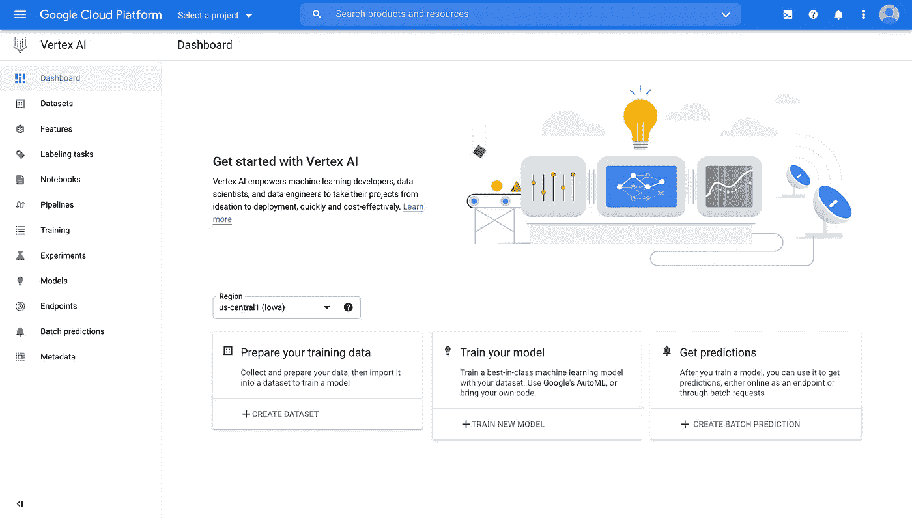

[https://console.cloud.google.com/vertex-ai](https://console.cloud.google.com/vertex-ai)

在左上方显示“选择一个项目”的地方，如果您已经有一个现有的项目，请从窗口中选择一个项目。如果没有，请按右上角的“新建项目”并按照提示的步骤创建您的项目。

> 注意:要使用 Google Vertex AI，必须启用计费。

一旦你点击进入你的项目，并导航到顶点人工智能仪表板，你会看到如下所示的屏幕(虽然你的项目可能不会与数据填充)。如果是这样，恭喜你！你已经准备好进入下一步了！

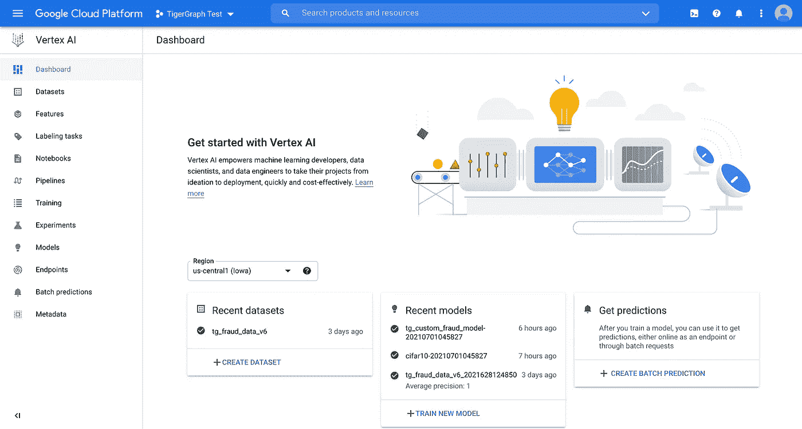

选定项目的 Vertex AI 仪表板

# 第二步:上传 TigerGraph 数据集到 Vertex AI

接下来，我们需要创建一个数据集。在仪表板上，单击“创建数据集”这将把您重定向到设置数据集的页面。

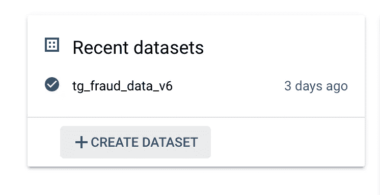

点击“创建数据集”

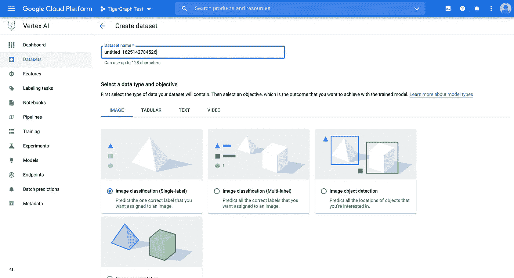

创建数据集 GUI

首先将数据集重命名为类似“tg_amlsim”的名称。

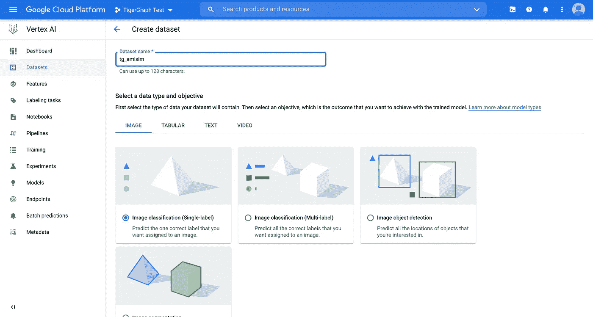

更新数据集的名称

接下来，由于我们想要上传一个 CSV，我们需要选择一个“表格”数据集。由于我们想要确定交易是否是欺诈性的，我们将为该类型选择一个回归/分类。

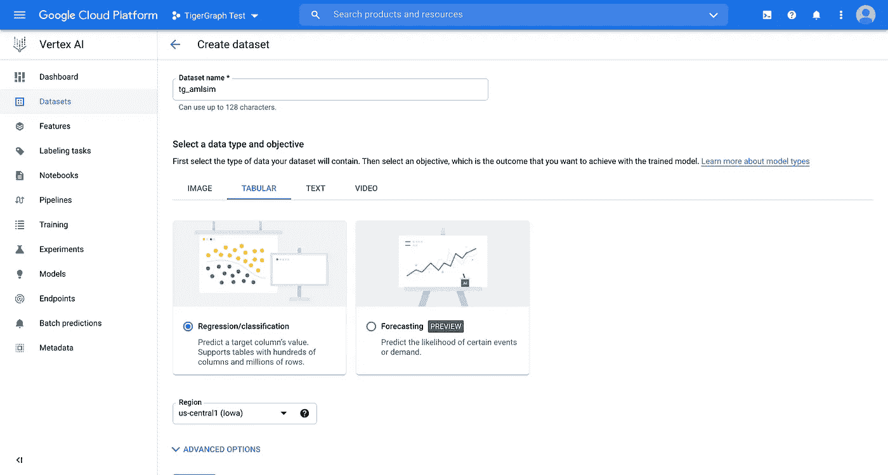

点击表格并选择回归/分类

您不需要更改任何高级选项。向下滚动并点击“创建”当你这样做时，你将被重定向到如下页面。这是我们将数据添加到数据集的地方。

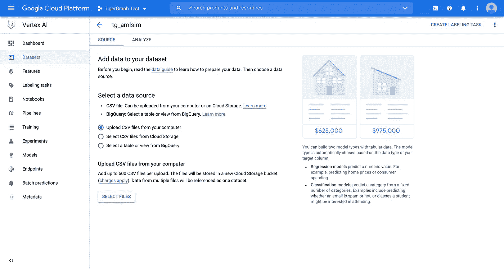

我们将在这里添加数据。

确保选择了“从您的计算机上传 CSV 文件”,然后按“选择文件”按钮。上传我们从 TigerGraph 数据创建的 CSV。

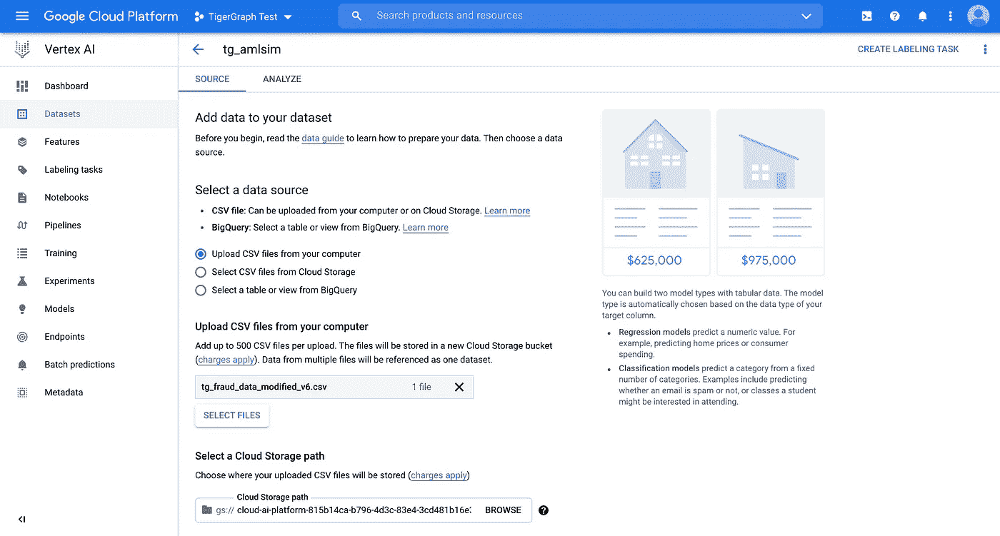

从 TigerGraph 中选择我们在过去模块中创建的 CSV

将云存储路径改为 Google Cloud 上的 bucket。点击“浏览”，然后选择一个出现的选项。(应该只出现一个，但是如果有多个，请选择您喜欢的存储桶。)单击您想要的选项，然后按“选择”

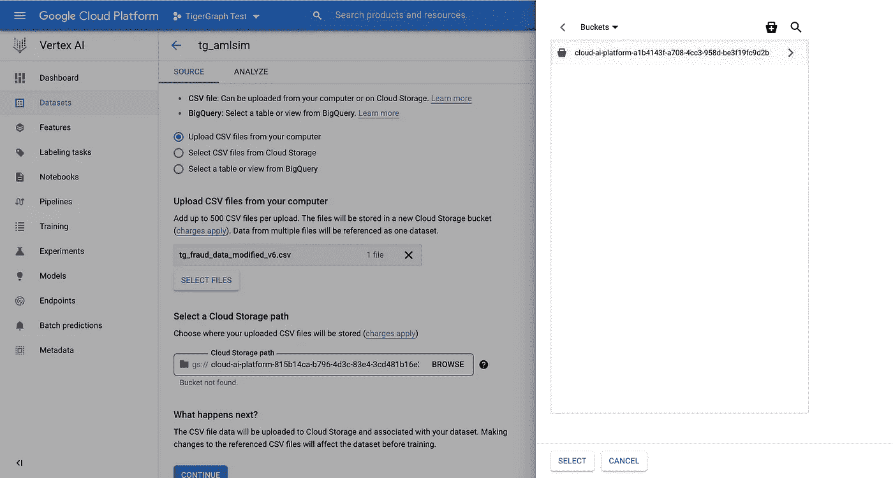

选择你的桶

最后，按“继续”

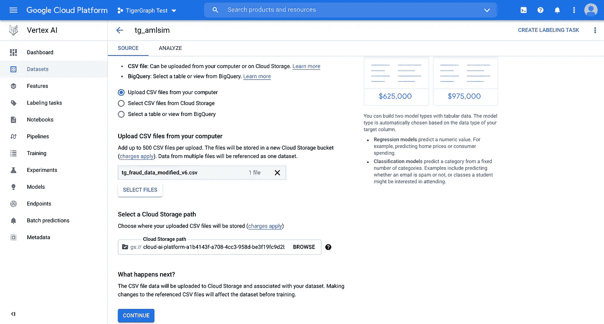

按继续

您的 CSV 将开始上传。这可能需要几秒钟才能完成。上传后，您将被重定向到如下页面，在这里您可以看到您所有的栏目名称。如果你达到了这一点，祝贺你！您已经正式上传了您的数据，并准备运行分析！

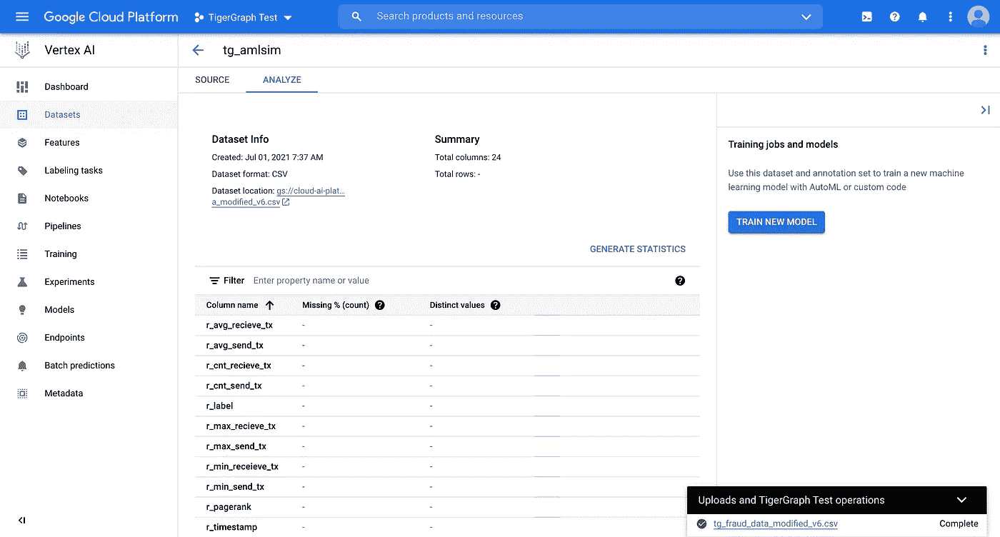

CSV 上传！

# 第三步:训练你的模型

最后，我们来训练模型！在上面的屏幕中，按“训练新模型”

对于第一个屏幕，将目标更改为“分类”然后确保您使用的是 AutoML。然后按“继续”

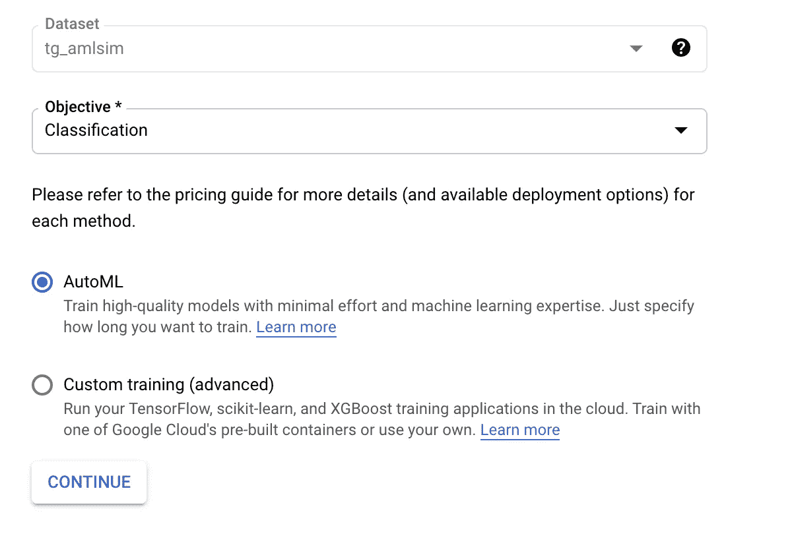

使用分类和自动

在下一个屏幕中，将型号名称更改为您喜欢的名称。对于目标列，选择 tx_fraud。我们不会改变任何高级选项。按继续。

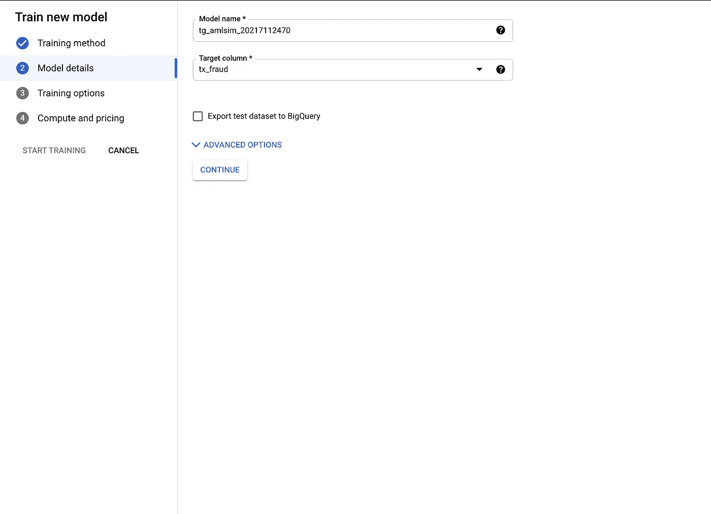

选择 tx_fraud。

滚动到培训选项的底部，点击高级选项。在那里，选择“AUC PRC”这将使模型专注于最大限度地提高不太常见的欺诈交易类别的准确性。然后按继续。

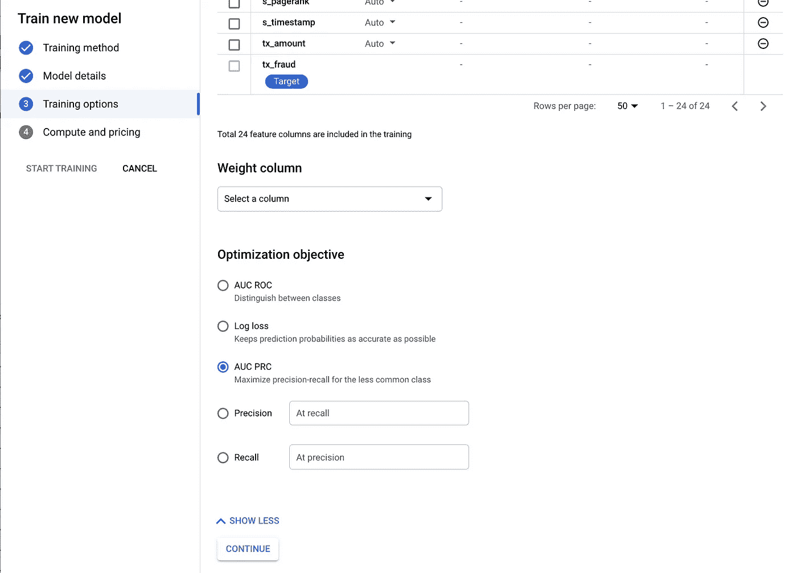

在高级选项中，单击 AUC PRC。

最后，选择你的预算。这里，我们将使用最小值 1。当你准备好开始训练时，点击“开始训练”这将需要大约一个小时，所以在等待 Vertex AI 的电子邮件时，请随意休息一下。

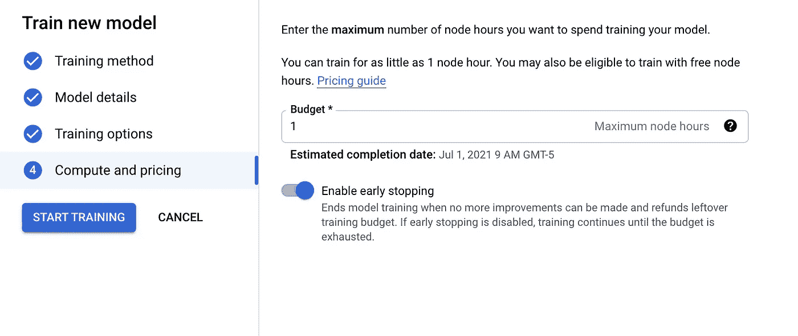

键入 1(或您的偏好)，然后按“开始训练”

# 第四步:探索分析

现在您的模型已经训练好了，您可以查看它了。

您将看到一个概述，其中包含 PR 和 ROC AUC、log loss、F1 得分和其他指标等数据。

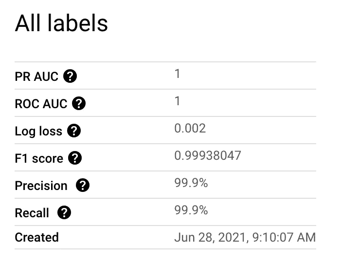

韵律学

接下来，还显示了精确召回和 ROC 曲线。现在，它们不是很合理，这可能是由于我们的数据不平衡。

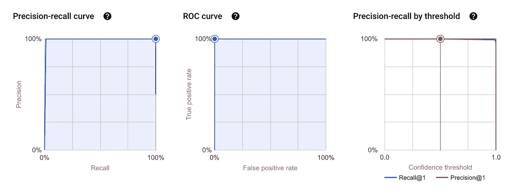

曲线

可能对我们来说最重要的是，Google Vertex 也有一个混淆矩阵。在这里，对我们来说最重要的部分是真实和真实部分。在这种情况下，我们的模型只能正确识别 52%的欺诈交易。这个不太好(基本随机)。

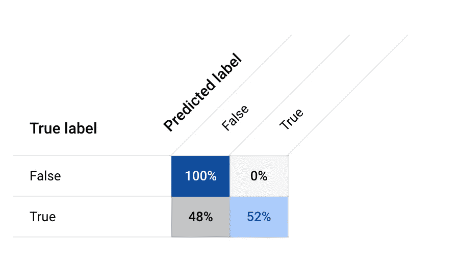

最后，Vertex 有一个特性重要性图表。从这里，我们可以看到交易金额是最重要的变量，其次是发送方交易的最大值、平均值和最小值，但是像接收方交易的最大值、平均值和最小值这样的变量在我们创建的模型中并不重要。

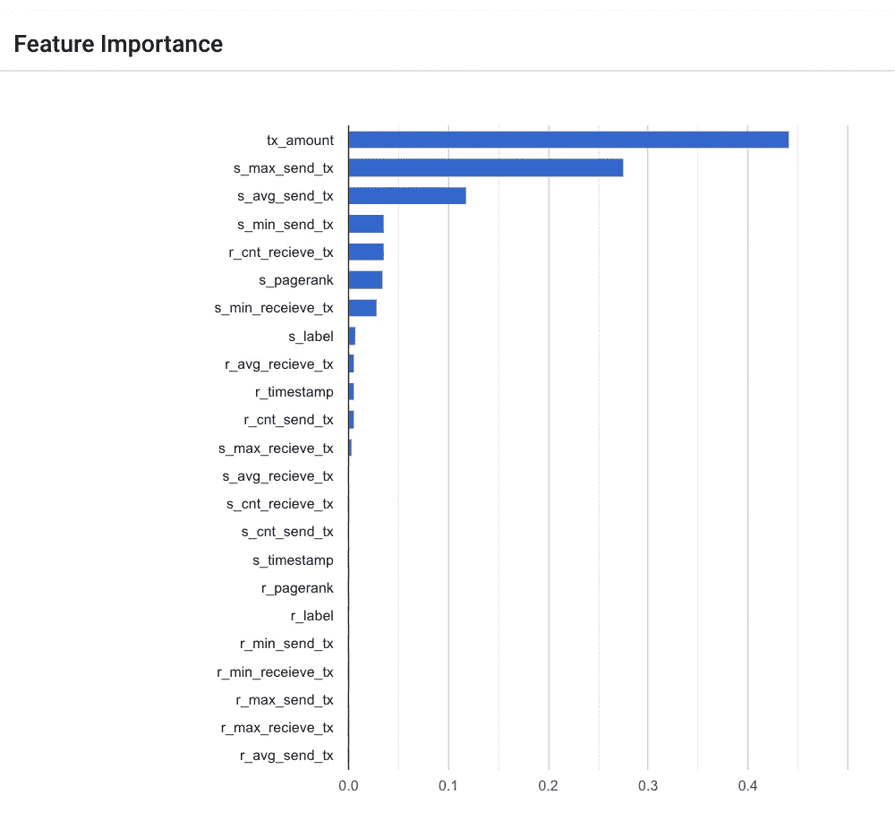

特征重要性图表

为了获得更好的结果，我们可以训练更长的时间，限制我们传递的变量，并生成更多的数据来平衡我们的数据集。

# 第五步:祝贺你！+资源

恭喜你。你已经正式使用 AutoML 对 TigerGraph 的数据进行分析了！

如果您有任何问题，请加入 TigerGraph Discord 并提问:

<https://discord.gg/gRHWBZNpxW> 