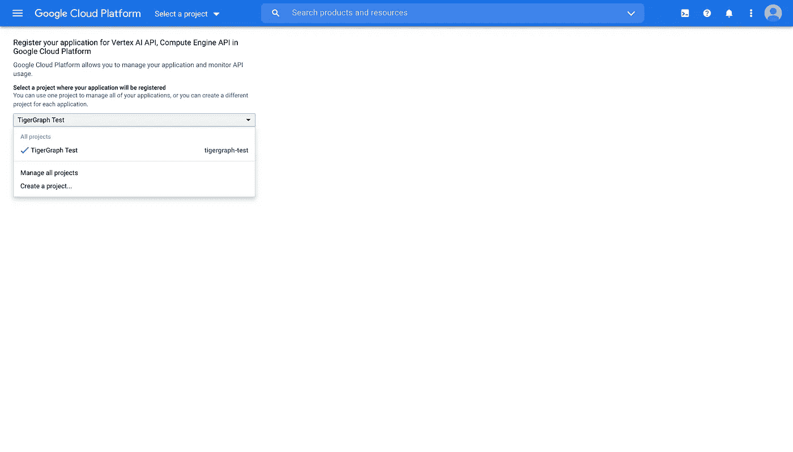
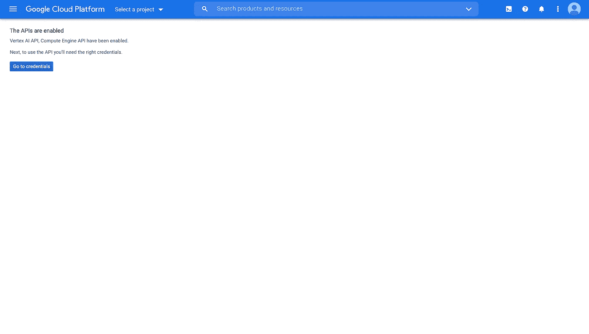
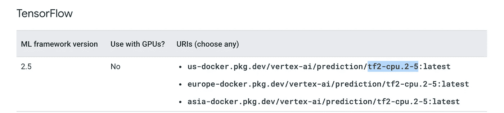
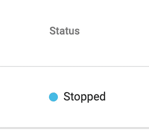
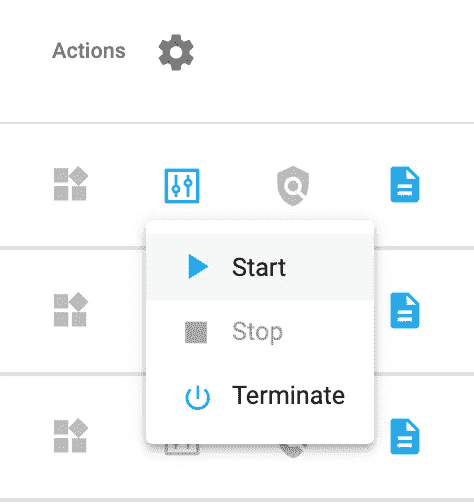
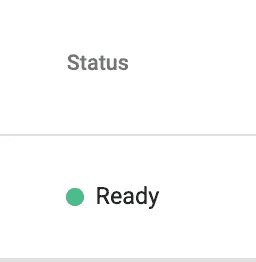
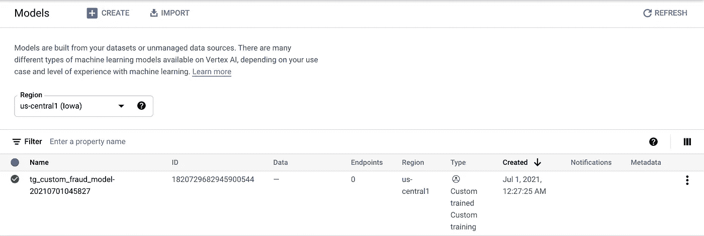

# 使用 TigerGraph 和 Google Vertex 检测 AMLSim 欺诈第三部分:为定制数据准备模型

> 原文：<https://towardsdatascience.com/amlsim-fraud-detection-with-tigergraph-and-google-vertex-part-iii-preparing-your-model-for-custom-561e333e1806?source=collection_archive---------37----------------------->

## 设置 Google Vertex AI，加载我们的 TigerGraph 数据，并创建和拟合我们的模型

> 注意:这是将 TigerGraph 与 Google Vertex AI 结合使用的系列文章的第三部分。要在本博客中使用这些数据，请关注[本博客](/amlsim-fraud-detection-with-tigergraph-and-google-vertex-part-i-preparing-the-data-2f3e6487f398):[https://towards data science . com/AML sim-fraud-detection-with-tiger graph-and-Google-vertex-part-I-preparing-the-data-2f3e 6487 f 398](/amlsim-fraud-detection-with-tigergraph-and-google-vertex-part-i-preparing-the-data-2f3e6487f398)
> 
> 如果你想了解如何在谷歌控制台中通过 AutoML 使用 TigerGraph 数据，请查看[这篇博客](/amlsim-fraud-detection-with-tigergraph-and-google-vertex-part-ii-using-automl-with-tigergraph-data-65cb86fc34b3):[https://towardsdatascience . com/AML sim-fraud-detection-with-tiger graph-and-Google-vertex-part-ii-using-AutoML-with-tiger graph-data-65 CB 86 fc 34 b 3](/amlsim-fraud-detection-with-tigergraph-and-google-vertex-part-ii-using-automl-with-tigergraph-data-65cb86fc34b3)

# 概观

> 注:该系列由[德州陈](https://medium.com/u/9ee92495f34e?source=post_page-----561e333e1806--------------------------------) (LinkedIn)在[乔恩赫尔克](https://medium.com/u/571f80cc8b69?source=post_page-----561e333e1806--------------------------------) (LinkedIn)的帮助下共同创作。本实验基于 Google Vertex 的在线预测和批量预测的笔记本演练。

在这个博客系列中，我们将 TigerGraph 的强大功能与 Google 的 Vertex AI 相结合。在第一篇博客中，我们加载了数据，运行了图形算法，编写了查询，最后导出了一个 CSV。在第二篇博客中，我们在 Google 的控制台中使用了导出的 CSV，并使用了 AutoML。现在，让我们对我们的数据使用一个定制模型。这将在笔记本中通过 Python 完全运行。

在这篇博客中，我们将加载我们的模型并设置必要的配置，然后在下一篇博客中，我们将运行批处理和在线预测。我们开始吧！

# 第一部分:安装库

首先，我们需要安装所有的库。如果你在 Google Cloud 笔记本上运行你的程序，你需要运行这个单元格来添加一个用户标志。如果不是，那么这个细胞就没什么用了。

```
import osIS_GOOGLE_CLOUD_NOTEBOOK = os.path.exists("/opt/deeplearning/metadata/env_version")USER_FLAG = ""
if IS_GOOGLE_CLOUD_NOTEBOOK:
   USER_FLAG = "--user"
```

接下来，我们需要安装所有的库。这将包括 Vertex AI、Google 云存储、pyTigerGraph、flat tables、NumPy 和 Pandas。

```
! pip3 install {USER_FLAG} --upgrade google-cloud-storage
! pip3 install {USER_FLAG} --upgrade pyTigerGraph
! pip3 install {USER_FLAG} --upgrade flat-table
! pip3 install {USER_FLAG} --upgrade numpy
! pip3 install {USER_FLAG} --upgrade pandas
```

最后，您需要重启笔记本来查找包。

```
import osif not os.getenv("IS_TESTING"):
   import IPython
   app = IPython.Application.instance()
   app.kernel.do_shutdown(True)
```

运行该单元后，笔记本应该会自动重启。一旦完成，让我们开始设置模型！

# 第二部分:启用顶点 AI API 和计算引擎 API，并连接到 Google Cloud

> 注意:这些服务中的一部分是要收费的。谷歌云自动启动用户 300 美元免费。

## 第一步:启用 API

本实验将使用两个 API:顶点 AI 和计算机引擎 API。为此，请访问[此链接](https://console.cloud.google.com/flows/enableapi?apiid=aiplatform.googleapis.com,compute_component):【https://console.cloud.google.com/flows/enableapi? apid = ai platform . Google APIs . com，compute_component

在该页面上，您需要选择要使用的项目。我们将使用我们在过去的博客中创建的相同的谷歌云项目。选择它后，按继续。



选择您在过去的博客中创建的项目。

给它几分钟来设置，然后你会收到一个确认页面。



API 已启用。

干得好！您已经启用了您的 API！现在，让我们验证您的 Google Cloud 帐户。

## 第二步:认证谷歌云

接下来，您需要授予您的 Google 帐户使用 Cloud SDK 的权限。运行以下代码:

```
import os
import sysif "google.colab" in sys.modules: from google.colab import auth as google_auth
   google_auth.authenticate_user()elif not os.getenv("IS_TESTING"): %env GOOGLE_APPLICATION_CREDENTIALS ''
```

当您运行此程序时，您将收到一个验证链接。当你点击它时，选择链接到你的谷歌云项目的谷歌账户。谷歌会要求下面的权限。如果你按“继续”，你会找到一个代码复制并粘贴到你的笔记本上，然后按 enter。


Google Cloud SDK 的权限

## 第三步:在笔记本中设置变量

干得好！最后，您需要设置两个变量:PROJECT_ID 和 TIMESTAMP。

```
PROJECT_ID = "tigergraph-test"from datetime import datetime
TIMESTAMP = datetime.now().strftime("%Y%m%d%H%M%S")
```

你可以在你的控制台主页上找到你的项目 id。


在控制台的主页上找到您的项目 ID。

干得好！接下来，您需要为您将使用的 Google Cloud bucket 设置 bucket 名称和区域。

```
BUCKET_NAME = "gs://[your-bucket-name]"
REGION = "[your-region]"
```

你可以在这里 : [找到](https://cloud.google.com/vertex-ai/docs/general/locations#available_regions)[地区列表 https://cloud . Google . com/vertex-ai/docs/general/locations # available _ regions](https://cloud.google.com/vertex-ai/docs/general/locations#available_regions)

对于 bucket，您可以复制并粘贴您在过去的博客中选择的相同的 bucket 名称。

最后，您可以通过运行以下命令来验证您是否连接到了正确的存储桶:

```
! gsutil ls -al $BUCKET_NAME
```

不错！现在，您设置了我们将使用的所有工具。接下来，让我们为谷歌云声明一些变量。

# 第三部分:设置顶点人工智能

## 第一步:导入你的库并初始化顶点人工智能

首先，导入顶点 SDK 库并初始化你的顶点 AI 连接。在初始化过程中，您需要传递您的项目 id、位置/地区和存储桶名称。

```
import os
import sys
from google.cloud import aiplatform
from google.cloud.aiplatform import gapic as aipaiplatform.init(project=PROJECT_ID, location=REGION, staging_bucket=BUCKET_NAME)
```

## 第二步:设置加速器、预构建的容器和机器类型

接下来，设置加速器。如果不想使用加速器，请将其设置为(无，无)。否则，检查[这里的](https://cloud.google.com/vertex-ai/docs/general/locations#accelerators)以查看哪个 GPU 可用于哪个位置/区域。

```
TRAIN_GPU, TRAIN_NGPU = (None, None)
DEPLOY_GPU, DEPLOY_NGPU = (None, None)
```

然后选择一个预构建的容器用于培训和部署。你可以在这里找到训练版本[和部署版本](https://cloud.google.com/vertex-ai/docs/training/pre-built-containers)[的预建容器列表。一旦你找到一个你喜欢的选项，你可以复制并粘贴除了:latest 以外的所有内容。](https://cloud.google.com/vertex-ai/docs/predictions/pre-built-containers)



复制除:latest 以外的最后一节。

将您复制的内容粘贴到以下代码中的 TRAIN_VERSION 或 DEPLOY_VERSION 中。

```
TRAIN_VERSION = "tf-cpu.2-4"
DEPLOY_VERSION = "tf2-cpu.2-5"TRAIN_IMAGE = "gcr.io/cloud-aiplatform/training/{}:latest".format(TRAIN_VERSION)
DEPLOY_IMAGE = "gcr.io/cloud-aiplatform/prediction/{}:latest".format(DEPLOY_VERSION)print("Training:", TRAIN_IMAGE, TRAIN_GPU, TRAIN_NGPU)
print("Deployment:", DEPLOY_IMAGE, DEPLOY_GPU, DEPLOY_NGPU)
```

最后，我们将设置机器类型。

```
MACHINE_TYPE = "n1-standard"
VCPU = "4"
TRAIN_COMPUTE = MACHINE_TYPE + "-" + VCPU
print("Train machine type", TRAIN_COMPUTE)MACHINE_TYPE = "n1-standard"
VCPU = "4"
DEPLOY_COMPUTE = MACHINE_TYPE + "-" + VCPU
print("Deploy machine type", DEPLOY_COMPUTE)
```

太棒了。最后，让我们创建一个训练脚本，训练我们的模型！

# 第四部分:建立培训档案

## 第一步:设置参数

让我们首先设置要传递到培训文件中的参数。我们将从声明 JOB_NAME 和 MODEL_DIR(模型目录)开始。接下来，我们将为我们的模型确定训练策略、时期数和步骤。

```
JOB_NAME = "custom_job_" + TIMESTAMP
MODEL_DIR = "{}/{}".format(BUCKET_NAME, JOB_NAME)if not TRAIN_NGPU or TRAIN_NGPU < 2:
   TRAIN_STRATEGY = "single"
else:
   TRAIN_STRATEGY = "mirror"EPOCHS = 25
STEPS = 50
CMDARGS = [
   "--epochs=" + str(EPOCHS),
   "--steps=" + str(STEPS),
   "--distribute=" + TRAIN_STRATEGY,
]
```

## 第二步:编写培训脚本

> 注意:这整个部分应该在一个单元格中，但是为了便于解释，它将被分解。

现在，我们需要编写我们的培训脚本。在这里，我们将导入数据并创建模型。首先，我们将导入我们所有的库，包括 Tensorflow、argparse、pyTigerGraph 等等。

```
%%writefile task.pyimport tensorflow as tf
from tensorflow.python.client import device_lib
import argparse
import os
import sys
import pyTigerGraph as tg
import flat_table
import pandas as pd
from sklearn.model_selection import train_test_split
import numpy as np
```

接下来，我们将使用 argparse 来读取我们传递的所有参数。

```
parser = argparse.ArgumentParser()
parser.add_argument('--lr', dest='lr', default=0.01, type=float, help='Learning rate.')
parser.add_argument('--epochs', dest='epochs', default=10, type=int, help='Number of epochs.')
parser.add_argument('--steps', dest='steps', default=200, type=int, help='Number of steps per epoch.')
parser.add_argument('--distribute', dest='distribute', type=str, default='single', help='distributed training strategy')args = parser.parse_args()
```

我们将使用策略论点来确定张量流分布。

```
if args.distribute == 'single':
   if tf.test.is_gpu_available():
      strategy = tf.distribute.OneDeviceStrategy(device="/gpu:0")
   else:
      strategy = tf.distribute.OneDeviceStrategy(device="/cpu:0")
elif args.distribute == 'mirror':
   strategy = tf.distribute.MirroredStrategy()
elif args.distribute == 'multi':
   strategy = tf.distribute.experimental.MultiWorkerMirroredStrategy()
```

接下来，我们将设置缓冲区大小和批处理大小变量

```
BUFFER_SIZE = 10000
BATCH_SIZE = 64
```

然后我们将创建一个 prepare_dataset 函数。为了加载我们的数据，我们将首先连接到 TigerGraph 上的图表。在运行该命令之前，转到 GraphStudio 并确保您的解决方案旁边有一个绿色的“Ready”。如果它有一个蓝色的“停止”，然后按“操作”下的“解决方案操作”和下拉菜单，并按“开始”可能需要几分钟才能开始。



如果您的状态显示为“已停止”，请转到“操作”下，然后从下拉列表中按“开始”。



当“状态”为绿色并显示“就绪”时，您就准备好继续前进了

一旦连接到我们的解决方案，我们将运行 txMultiHopLimit 查询。然后我们将使用 pandas 将结果转换成数据帧。我们将使用 flat_table 删除任何 NaN 值或其他潜在错误。最后，我们将使用 sklearn 的 train_test_split 将结果分成训练和测试部分，这将是我们返回的值。

```
def prepare_dataset():
   conn = tg.TigerGraphConnection(host="https://SUBDOMAIN.i.tgcloud.io", username="tigergraph", password="tigergraph", graphname = "AMLSim")
   conn.apiToken = conn.getToken(conn.createSecret())
   tx_hop = conn.runInstalledQuery("txMultiHopLimit", {}, timeout="99999999999", sizeLimit="1500000000")
   odf_tx_hop = pd.DataFrame(tx_hop[0]["@@txRecords"], index=None)
   dataset = flat_table.normalize(odf_tx_hop)
   features = ['tx_amount', 's_pagerank', 's_label', 's_min_send_tx', 's_min_receieve_tx', 's_max_send_tx', 's_max_recieve_tx', 's_avg_send_tx', 's_avg_recieve_tx', 's_cnt_recieve_tx', 's_cnt_send_tx', 's_timestamp', 'r_pagerank', 'r_label', 'r_min_send_tx', 'r_min_receieve_tx', 'r_max_send_tx', 'r_max_recieve_tx', 'r_avg_send_tx', 'r_avg_recieve_tx', 'r_cnt_recieve_tx', 'r_cnt_send_tx', 'r_timestamp']
   X_train, X_test, y_train, y_test = train_test_split(dataset[features], dataset["tx_fraud"], test_size=0.2, random_state=42)
   return X_train, X_test, y_train, y_test
```

接下来，我们将使用 Keras 创建我们的神经网络模型。这将是一个简单的序列模型。

```
def build_and_compile_model():
   model = tf.keras.Sequential([
      tf.keras.layers.Dense(32, activation='relu', input_shape=(1, 23)),
      tf.keras.layers.Dense(64, activation='relu'),
      tf.keras.layers.Dense(1, activation="sigmoid")
   ])
   model.compile( loss=tf.keras.losses.MSE, optimizer=tf.keras.optimizers.Adam(learning_rate=args.lr), metrics=['accuracy'])
   return model
```

然后我们将设置一些变量，特别是 NUM_WORKERS、GLOBAL_BATCH_SIZE 和 MODEL_DIR。

```
NUM_WORKERS = strategy.num_replicas_in_sync
GLOBAL_BATCH_SIZE = BATCH_SIZE * NUM_WORKERS
MODEL_DIR = os.getenv("AIP_MODEL_DIR")
```

我们将运行 prepare_dataset 函数，然后构建模型。

```
res = prepare_dataset()
train_dataset, X_test, y_train, y_test = reswith strategy.scope():
   model = build_and_compile_model()
```

最后，我们将拟合模型并保存它。

```
model.fit(train_dataset, y_train, epochs=args.epochs, steps_per_epoch=args.steps, batch_size=GLOBAL_BATCH_SIZE, validation_data=(X_test, y_test))
model.save(MODEL_DIR)
```

厉害！一旦执行完毕，剩下的就是运行文件了。

## 第三步:训练模型

最后，我们将运行并训练模型。

```
job = aiplatform.CustomTrainingJob( display_name=JOB_NAME, script_path="task.py", container_uri=TRAIN_IMAGE, requirements=["tensorflow_datasets==1.3.0", "pyTigerDriver==1.0.6", "pyTigerGraph==0.0.9.6.8", "pandas==1.1.5", "flat-table==1.1.1", "sklearn==0.0"], model_serving_container_image_uri=DEPLOY_IMAGE)MODEL_DISPLAY_NAME = "tg_custom_fraud_model-" + TIMESTAMPif TRAIN_GPU:
   model = job.run(model_display_name=MODEL_DISPLAY_NAME, args=CMDARGS, replica_count=1, machine_type=TRAIN_COMPUTE, accelerator_type=TRAIN_GPU.name, accelerator_count=TRAIN_NGPU)else:
   model = job.run(model_display_name=MODEL_DISPLAY_NAME, args=CMDARGS, replica_count=1, machine_type=TRAIN_COMPUTE, accelerator_count=0)
```

一旦你运行这个，你将能够在顶点人工智能面板的“模型”标签中看到你的模型。



模型显示在顶点人工智能控制台。

暂时就这样吧！

# 第五部分:祝贺你！

感谢您关注本博客！期待下一个，我们将使用批量和在线预测！在此期间，如果你有任何问题，你可以加入 TigerGraph Discord。

[](https://discord.gg/gRHWBZNpxW) [## 加入 TigerGraph Discord 服务器！

### 查看 Discord 上的 TigerGraph 社区-与 577 名其他成员一起玩，享受免费的语音和文本聊天。

不和谐. gg](https://discord.gg/gRHWBZNpxW)