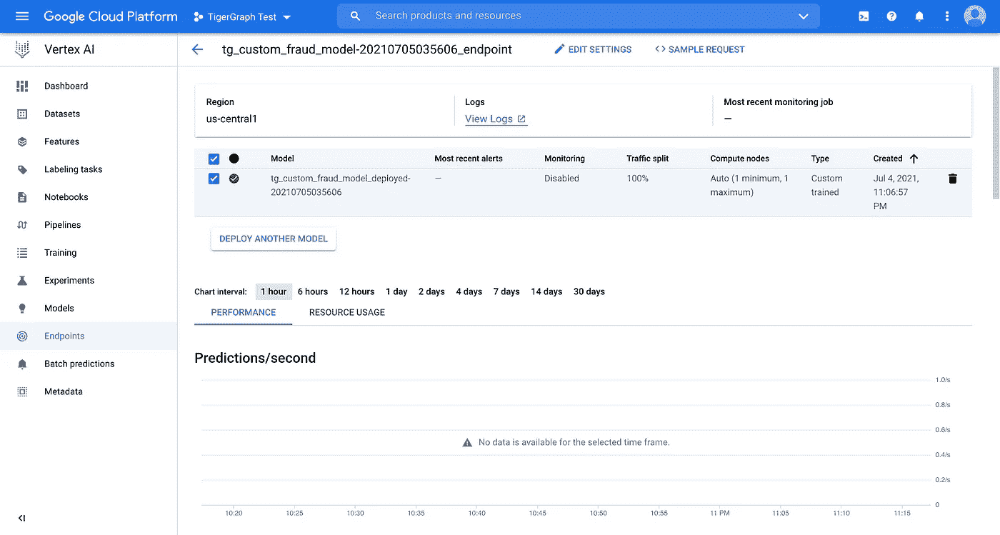
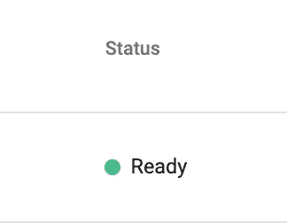
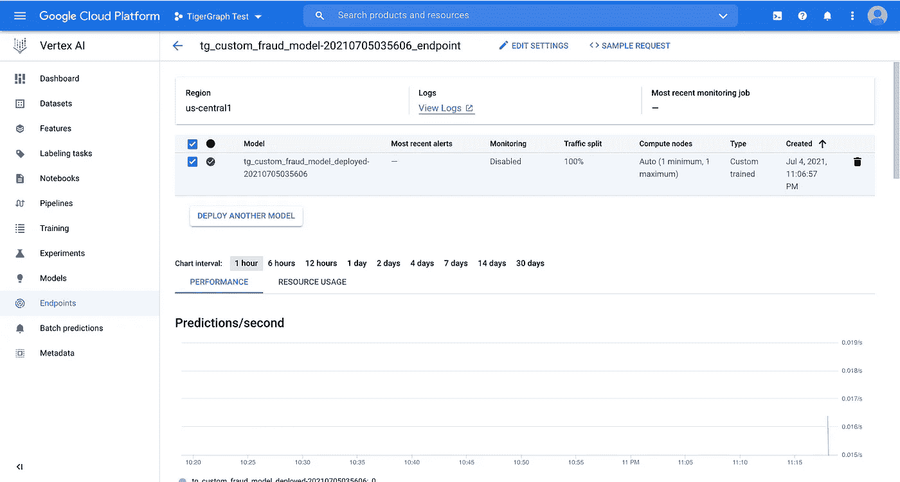

# 使用 TigerGraph 和 Google Vertex 检测 AMLSim 欺诈第四部分:运行在线预测

> 原文：<https://towardsdatascience.com/amlsim-fraud-detection-with-tigergraph-and-google-vertex-part-iv-running-online-predictions-b1bcc64e9576?source=collection_archive---------31----------------------->

## 使用我们的定制模型运行在线预测

> 注意:这是系列的第四篇博客。要获得数据，请阅读[这篇博客](/amlsim-fraud-detection-with-tigergraph-and-google-vertex-part-i-preparing-the-data-2f3e6487f398):[https://towards data science . com/AML sim-fraud-detection-with-tiger graph-and-Google-vertex-part-I-preparing-the-data-2f3e 6487 f 398](/amlsim-fraud-detection-with-tigergraph-and-google-vertex-part-i-preparing-the-data-2f3e6487f398)。
> 要创建使用的模型，请阅读[本博客](/amlsim-fraud-detection-with-tigergraph-and-google-vertex-part-iii-preparing-your-model-for-custom-561e333e1806):[https://towards data science . com/AML sim-fraud-detection-with-tiger graph-and-Google-vertex-part-iii-preparing-your-model-for-custom-561 e333 e 1806](/amlsim-fraud-detection-with-tigergraph-and-google-vertex-part-iii-preparing-your-model-for-custom-561e333e1806)。
> 要在谷歌的控制台中查看正在使用谷歌 AutoML 的数据，请阅读[这篇博客](/amlsim-fraud-detection-with-tigergraph-and-google-vertex-part-ii-using-automl-with-tigergraph-data-65cb86fc34b3):[https://towards data science . com/AML sim-fraud-detection-with-tiger graph-and-Google-vertex-part-ii-using-AutoML-with-tiger graph-data-65 CB 86 fc 34 b 3](/amlsim-fraud-detection-with-tigergraph-and-google-vertex-part-ii-using-automl-with-tigergraph-data-65cb86fc34b3)

# 概观

> 注:这是与[德州陈](https://medium.com/u/9ee92495f34e?source=post_page-----b1bcc64e9576--------------------------------)在 [Jon Herke](https://medium.com/u/571f80cc8b69?source=post_page-----b1bcc64e9576--------------------------------) 的帮助下共同创作的。该实验室基于谷歌的顶点人工智能在线预测笔记本。

这是 TigerGraph 和 Vertex AI 系列(目前)的倒数第二篇博客，它正在探索使用带有 TigerGraph 和 Vertex AI 的图形的力量。在过去的博客中，我们使用来自 TigerGraph 的定制数据来创建和拟合我们的模型。现在，我们需要部署我们的模型，用它进行预测，最后进行清理。

第一篇博客讲述了如何创建我们的图表(设计模式、加载数据、创建和执行查询等)。).然后，在[的第二篇博客](/amlsim-fraud-detection-with-tigergraph-and-google-vertex-part-ii-using-automl-with-tigergraph-data-65cb86fc34b3)中，我们使用谷歌的控制台对我们的数据运行 AutoML。在[的第三篇博客](/amlsim-fraud-detection-with-tigergraph-and-google-vertex-part-iii-preparing-your-model-for-custom-561e333e1806)中，与 AutoML 路线相反，我们使用 TensorFlow 准备了一个定制模型。最后，利用过去博客的数据，我们有两个选择:在线预测和批量预测。本博客将介绍运行在线预测，明天的博客将介绍批量预测。所以让我们开始吧！

# 第一部分:创建端点

首先，我们需要部署我们的模型并创建一个端点。让我们从创建常数开始。这些是我们在部署模型时要传递的一些变量。

```
DEPLOYED_NAME = "tg_custom_fraud_model_deployed-" + TIMESTAMP
TRAFFIC_SPLIT = {"0": 100}
MIN_NODES = 1
MAX_NODES = 1
```

然后我们将部署模型。

> 注意:传递的一些变量是在前面的博客中声明的。

```
if DEPLOY_GPU: endpoint = model.deploy(
      deployed_model_display_name=DEPLOYED_NAME,
      traffic_split=TRAFFIC_SPLIT,
      machine_type=DEPLOY_COMPUTE,
      accelerator_type=DEPLOY_GPU.name,
      accelerator_count=DEPLOY_NGPU,
      min_replica_count=MIN_NODES,
      max_replica_count=MAX_NODES,
   )else: endpoint = model.deploy(
      deployed_model_display_name=DEPLOYED_NAME,
      traffic_split=TRAFFIC_SPLIT,
      machine_type=DEPLOY_COMPUTE,
      accelerator_type=None, # DEPLOY_COMPUTE.name,
      accelerator_count=None, # 0,
      min_replica_count=MIN_NODES,
      max_replica_count=MAX_NODES,
   )
```

在我们的例子中，我们在过去的博客中将 GPU 设置为 None，如下所示。

```
TRAIN_GPU, TRAIN_NGPU = (None, None)DEPLOY_GPU, DEPLOY_NGPU = (None, None)
```

因此，上面的代码将运行 else。因为我们没有使用任何加速器，所以计数和类型的值被设置为 None，但是如果您确实声明了某些加速器，您可以使用注释值。

您可以在 Google Vertex 仪表板的“端点”选项卡中查看您部署的端点。



顶点人工智能控制台中的端点

现在我们的端点已经部署好了，让我们开始使用我们的模型进行预测吧！

# 第二部分:使用测试数据运行预测

## 第一步:验证 TG Cloud 上的解决方案是否就绪

现在我们准备运行预测！首先，我们需要从图表中获取测试数据。为此，请确保您在 TigerGraph Cloud 上的解决方案显示就绪。



确保你的状态下有一个绿点和“准备好”字样。

## 第二步:导入库

接下来，我们需要导入我们的库。我们将再次使用 pyTigerGraph、flat-table、pandas、numpy 和 sklearn。

```
import pyTigerGraph as tg
import flat_table
import pandas as pd
import numpy as np
from sklearn.model_selection import train_test_split
```

## 第三步:连接到图表

然后，您需要连接到您的图表。再次用您的框中的值修改 conn.TigerGraphConnection，将 SUBDOMAIN 更改为您的子域，将 PASSWORD 更改为您的密码。

```
conn = tg.TigerGraphConnection(host="https://SUBDOMAIN.i.tgcloud.io", username="tigergraph", password="PASSWORD", graphname = "AMLSim")
conn.apiToken = conn.getToken(conn.createSecret())
```

## 第四步:运行查询并解析数据

最后，我们将运行查询(txMultiHopLimit)并解析数据。我们将再次使用平面表来删除数据中的任何错误，并使用 train_test_split 将数据分为训练和测试两部分。最后一步将把 X_test 变成一个列表，而不是 DataFrame。

```
tx_hop = conn.runInstalledQuery("txMultiHopLimit", {}, timeout="99999999999", sizeLimit="1500000000")odf_tx_hop = pd.DataFrame(tx_hop[0]["@@txRecords"], index=None)
dataset = flat_table.normalize(odf_tx_hop)features = ['tx_amount', 's_pagerank', 's_label', 's_min_send_tx', 's_min_receieve_tx', 's_max_send_tx', 's_max_recieve_tx', 's_avg_send_tx', 's_avg_recieve_tx', 's_cnt_recieve_tx', 's_cnt_send_tx', 's_timestamp', 'r_pagerank', 'r_label', 'r_min_send_tx', 'r_min_receieve_tx', 'r_max_send_tx', 'r_max_recieve_tx', 'r_avg_send_tx', 'r_avg_recieve_tx', 'r_cnt_recieve_tx', 'r_cnt_send_tx', 'r_timestamp']X_train, X_test, y_train, y_test = train_test_split(dataset[features], dataset["tx_fraud"], test_size=0.2, random_state=42)X_test = list([list(i) for i in np.array(X_test)])
```

## 第五步:预测

到目前为止做得很好！最后，我们需要创建预测。为此，我们将运行 endpoint.predict。然后我们可以将它与 y_test 正确答案进行比较，并最终将其打印出来。

```
predictions = endpoint.predict(instances=[X_test])
y_predicted = np.argmax(predictions.predictions, axis=1)correct = sum(y_predicted == np.array(y_test))
accuracy = len(y_predicted)print( f"Correct predictions = {correct}, Total predictions = {accuracy}, Accuracy = {correct/accuracy}" )
```

恭喜你。如果到目前为止一切正常，那么您已经部署了您的模型，现在您可以对它进行预测了！如果你导航回谷歌顶点人工智能控制台，你现在可以看到一些图表填充了你的预测数据。



带预测的端点

# 第三部分:清理

最后，为了避免来自 Google Cloud 的任何未来费用，让我们取消部署模型并进行清理。你可以删除整个谷歌云项目，或者按照以下步骤撤销在线预测部分。

首先，为了取消部署模型，我们将运行 endpoint.undeploy。

```
deployed_model_id = endpoint.list_models()[0].id
endpoint.undeploy(deployed_model_id=deployed_model_id)
```

此外，我们可以使用。delete()函数。

```
job.delete()
model.delete()
endpoint.delete()
```

最后，如果您想删除您的存储桶，您可以运行以下命令:

```
! gsutil -m rm -r $BUCKET_NAME
```

运行完所有这些之后，所有的更改都应该被恢复。

# 第四部分:祝贺+资源

干得好！本课还有最后一节是关于批量预测的！与此同时，如果您有任何问题，请直接联系 TigerGraph Discord:

[](https://discord.gg/gRHWBZNpxW) [## 加入 TigerGraph Discord 服务器！

### 查看 Discord 上的 TigerGraph 社区-与 578 名其他成员一起玩，享受免费的语音和文本聊天。

不和谐. gg](https://discord.gg/gRHWBZNpxW) 

感谢您阅读这篇博客，希望您继续探索 TigerGraph！