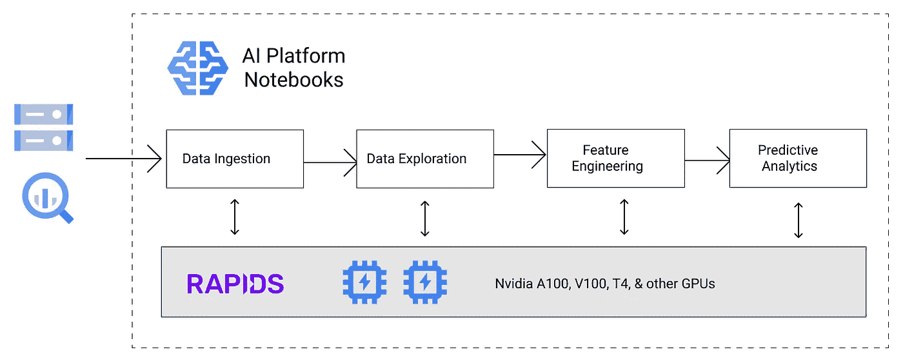
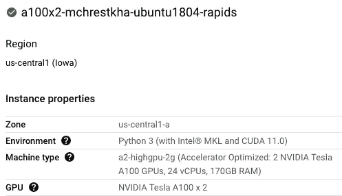
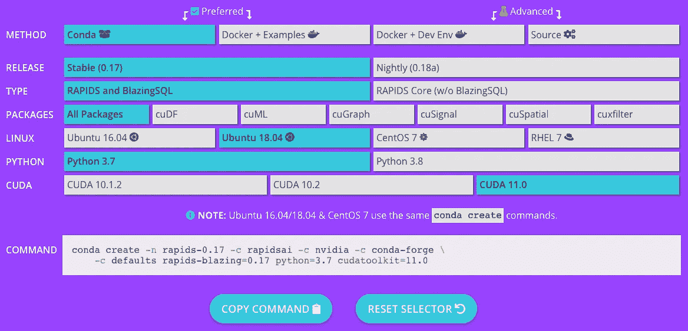
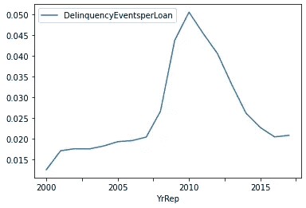

# 面向数据分析师的强大而熟悉的工作流

> 原文：<https://towardsdatascience.com/an-accelerated-big-data-workflow-for-the-data-analyst-5921c9fda866?source=collection_archive---------29----------------------->

## 在谷歌云的人工智能平台笔记本电脑上使用 RAPIDS & Nvidia GPUs 更快地分析数十亿条记录。


照片由[祝铭震·艾文](https://unsplash.com/@firmbee)在 [Unsplash](https://unsplash.com/)

> “在提到的角色中…每个企业都需要数据的唯一角色是决策者和分析师”
> 
> —凯西·科济尔科夫([数据科学最被误解的英雄](/data-sciences-most-misunderstood-hero-2705da366f40))

分析师和"[公民数据科学家](https://blogs.gartner.com/carlie-idoine/2018/05/13/citizen-data-scientists-and-why-they-matter/)"是每个组织中经常被遗忘的英雄。他们往往有广泛的职责，包括业务领域知识、数据提取&分析、预测分析&机器学习，以及向利益相关者报告&沟通。小菜一碟，对吧？

随着数据规模的增长，许多从业者不得不学习大数据框架和基础设施管理的部分内容。这种工作范围的扩大是不可持续的，并对工作流程中最重要的步骤产生直接影响:数据探索和实验。这可能导致不完善的报告、不太准确的预测模型和预测，以及不太创新的见解和想法。

我真的在建议另一种大数据框架/服务吗？我们不是已经有 Hive，Impala，Presto，Spark，Beam，BigQuery，Athena 了吗，不胜枚举。不要误解我。对于为大型组织运行数据平台的团队来说，这些框架/服务中的一个或多个对于管理数百个批处理和流式作业、庞大的数据源生态系统和生产管道至关重要。

然而，我在这里关注的是数据分析师，他们需要一个灵活、可扩展的解决方案，只需对代码进行最少的更改，就能加速他们现有的工作流。在考虑多节点集群和新框架之前，您会惊讶地发现，在 GPU 的帮助下，一台机器上的现有代码可以完成多少工作。以我自己为实验对象，我想探索一个具有以下约束的工作流程:

1.  我希望设置(硬件和软件)简单快捷(< 30 分钟)
2.  我不想管理分布式集群或学习新的框架
3.  我希望完全灵活地与 python 数据和机器学习生态系统(jupyter，pandas，xgboost，tensorflow，pytorch，sklearn)进行交互
4.  我希望能够扩展到数以亿计的数据行，而无需通宵等待结果

这些限制让我在新的强大的 Nvidia [A100 GPU](https://cloud.google.com/blog/products/compute/announcing-google-cloud-a2-vm-family-based-on-nvidia-a100-gpu) 的帮助下进入了 RAPIDS。



作者图片

# 为什么在谷歌云上使用 RAPIDS+Nvidia A100 GPU

*   **速度**:GPU 通过加速管道中的深度学习训练步骤，一直处于机器学习创新的前沿。 [RAPIDS](https://rapids.ai/) 希望通过数据接收、数据转换和预测分析，为您的整个工作流程提供类似的收益。 [Dask](https://dask.org/index.html) 扩展了 RAPIDS，使其能够在单个集群(以及多节点集群，如果需要的话)上跨 GPU 进行扩展，并处理分布在数百个文件中的源数据。
*   **交互式 Python 熟悉度** : RAPIDS 在很大程度上遵循了 pandas 和 sklearn API，并允许一个舒适的交互式工作流来分析每一步之后的结果。入门门槛比学习一个不同概念的新框架要低很多。这就是为什么 [Spark](https://koalas.readthedocs.io/en/latest/#) 和 [Beam](https://beam.apache.org/blog/dataframe-api-preview-available/) 都大力投资熊猫 API 的原因。
*   **按需按照自己的节奏扩展:**仅在需要时使用 Nvidia A100 GPUs 并为其付费。从 CPU&系统 RAM 上的 Pandas 开始，在负担得起的 T4 GPU 上测试 RAPIDS(或者甚至在[ka ggle](https://www.kaggle.com/docs/efficient-gpu-usage)&[Colab](https://research.google.com/colaboratory/faq.html)上免费测试),然后扩展到 Nvidia A100s 以获得最大的数据集。
*   **谷歌云上的 Nvidia A100s:16 x 40GB GPU RAM**:虽然您可以围绕 RAM 限制进行创造性设计(例如，分区，将汇总聚合卸载到数据仓库)，但将数据装入 GPU RAM 可以实现最佳加速，并在最精细的级别上充分灵活地分析数据。Nvidia A100s 拥有 40GB 的 GPU RAM，您可以在一台机器上扩展到 16 个，而不必担心多节点分布。这给了你一个巨大的 640GB 的 GPU 内存来玩。这既简化了环境管理，又限制了在处理多节点设置时出现的任何网络问题。

GPU 不是灵丹妙药，所以[看看我之前关于评估 GPU 是否是你正确选择的博客](https://medium.com/@mchrestkha/cost-benefit-of-gpus-for-data-and-machine-learning-f7ce86e5a20f?sk=aa03a4ac438b3f279133423d5862ede2)。

# 端到端示例

[GitHub 笔记本这里](https://github.com/mchrestkha/machine_learning_examples/blob/master/fannie_mae_loans/rapids_xgboost/notebooks/dask_rapids.ipynb)

## 商业问题

我将探索[房利美单户贷款业绩数据](https://docs.rapids.ai/datasets/mortgage-data)，查看 17 年(2000 年至 2016 年)约 3700 万笔贷款和 18 亿英镑记录的业绩历史。我想回答几个问题:

描述性分析:

*   每年发放的贷款数量是多少？
*   有百分之多少的贷款有拖欠事件？
*   哪一年的拖欠率最高？

预测分析:

*   我们能预测未来贷款拖欠的可能性吗？

## 硬件设置

我首先使用 Python 3、CUDA 11.0 和 Ubuntu 18.04 映像在 [AI 平台笔记本](https://cloud.google.com/ai-platform/notebooks/docs/create-new)上创建了一个托管 JupyterLab 环境。我选择了一台带有 2 个 Nvidia A100 GPUs 的机器，但也可以从 1 个或 2 个 T4 GPU 开始，在一个较小的数据样本上进行测试。Nvidia A100s 目前仅在美国中部地区提供，以防您在下拉列表中没有看到它。



作者图片

## 软件设置

设置一个有许多活动部件的合适环境(GPU 驱动程序、CUDA、NCCL、RAPIDS、Python 等)。)可能是复杂而痛苦的。我已经在我们的基础映像中选择了 Ubuntu 18.04、Python 3 和 CUDA 11.0，所以我们需要构建合适的兼容 RAPIDS 环境。幸运的是， [RAPIDS 站点](https://rapids.ai/start.html)有一个很棒的 UI 工具，可以根据你的需求生成准确的 conda 命令。我添加了 *gcsfs* 来访问 Google 云存储中的文件，添加了 *matplotlib* 来生成一些图表。设置硬件和软件环境花了我 20 分钟。



资料来源:https://rapids.ai/start.html

```
conda create -n rapids-0.17 -c rapidsai -c nvidia -c conda-forge -c defaults rapids-blazing=0.17 python=3.7 cudatoolkit=11.0 matplotlib=3.3.3 gcsfs=0.7.1
```

## Dask 初始化

由于我的 JupyterLab 环境有 2 个 GPU，我将使用 dask 来编排 RAPIDS，将每个 GPU 视为一个工人。这很简单，只需 2 条 import 语句和 2 行集群初始化代码。

```
from dask_cuda import LocalCUDACluster
from dask.distributed import Clientcluster = LocalCUDACluster()
client = Client(cluster)
```

## 数据摄取

你可以从这个 [Nvidia 演示库](https://docs.rapids.ai/datasets/mortgage-data)下载完整的 17 年数据或更小的子集来测试这个工作流。我在 GCS 呆了整整 17 年，有 100 多个 csv 文件，总计约 200GB，可以使用熟悉的 pandas 方法阅读它们。您还可以将文件下载到本地文件系统，并相应地更新位置。

```
csv_acq_fnames='gs://mchrestkha-github-ml-examples/fannie_mae_loans/acq/Acquisition_20*'
csv_perf_fnames='gs://mchrestkha-github-ml-examples/fannie_mae_loans/perf/Performance_20*'df_acq = dask_cudf.read_csv(csv_acq_fnames, sep='|', names=col_acq_names, dtype=dtype_acq, columns=col_acq, parse_dates=parse_dates_acq)df_per = dask_cudf.read_csv(csv_perf_fnames, sep='|', names=col_per_names, dtype=dtype_per, columns= col_per, parse_dates=parse_dates_per)
```

## 数据探索

使用 RAPIDS+dask 的一个主要原因是利用所有您喜欢的 pandas 功能，但在多个工作人员之间在 GPU 上运行更快。下面是我用于初始数据探索和分析的几个例子。

```
df_acq['OrYr']=df_acq['OrDate'].str[-4:]
df_acq['OrUnpaidPrinc $M']=df_acq['OrUnpaidPrinc']/1000000df_acq.head()df_acq_describe=df_acq.describe().compute()df_acq_nulls=df_acq.isna().sum().compute()df_acq_summary = df_acq.groupby('OrYr',as_index=False).agg({'LoanID': 'count','OrUnpaidPrinc $M': 'sum'}).compute()
```

在理解了数据的结构、粒度和信息之后，我定义了我要预测的内容。在查看[数据字典](https://loanperformancedata.fanniemae.com/lppub-docs/FNMA_SF_Loan_Performance_Glossary.pdf)时，有两列很有趣。*‘当前贷款拖欠状态*’可用于标记一笔贷款是否曾经拖欠过，而’*止赎日期*可用于检查一处房产是否被止赎。我为每个事件创建标志，并可以根据我试图回答的业务问题将它们作为我的目标变量(又名标签)。对于这个例子，我希望预测贷款是否会有任何拖欠事件，所以我将使用前者作为标签。

```
df_per['DelinquentEvent']=0
df_per['DelinquentEvent']=df_per['DelinquentEvent'].where(df_per['CLDS']<1,1)df_per['ForeclosureEvent']=0
df_per['ForeclosureEvent']=df_per['ForeclosureEvent'].where(df_per['ForeclosureDate'].isnull()== True,1)
```

对我来说，一个很大的收获是，虽然直接从 dask _ cudf 或 cudf*data frames 绘制图表有局限性，但你可以很容易地围绕它进行设计。我使用了以下方法:*

*   使用 GPU+Dask 进行繁重的数字处理，以创建汇总视图
*   将汇总的数据帧转换回熊猫
*   使用任何 MatPlotlib 库，使用系统内存绘制您最喜欢的图表

下面是一个总结全部 1.8B 记录，然后按年份绘制拖欠率时间序列图表的例子

```
df_per_yr_summary = df_per.groupby('YrRep',as_index=False).agg({'LoanID': 'count', 'DelinquentEvent':'sum'}).compute()df_per_yr_summary['DelinquencyEventsperLoan']=df_per_yr_summary['DelinquentEvent']/df_per_yr_summary['LoanID']df_per_yr_summary.to_pandas().sort_values(by=['YrRep']).plot.line(x='YrRep',y='DelinquencyEventsperLoan')
```



作者图片

## 建模数据集

然后，我将每笔贷款的数据聚集到一行(也就是 example ),并加入所有贷款属性(特性),这些属性(特性)只在发起时可用。这确保了我没有数据泄漏。

```
df_per_loan = df_per.groupby('LoanID',as_index=**False**).agg({'DelinquentEvent':'sum'}).compute()df_per_loan['DelinquentFlag']=0
df_per_loan['DelinquentFlag']=df_per_loan['DelinquentFlag'].where(df_per_loan['DelinquentEvent']<1,1)joined=df_acq.merge(df_per_loan,on=['LoanID'],how='left')
```

然后，我选择我的特征，并将分类变量转换成指示变量(一次性编码)。

```
label=['DelinquentFlag']
cat_features=['Channel','OccStatus','FTHomeBuyer','LoanPurpose','PropertyType','ProductType','RelMortInd']
num_features=['OrInterestRate','OrUnpaidPrinc','OrLoanTerm','OrLTV','OrCLTV','CreditScore']
modeling_dataset=joined_categorized[cat_features + num_features + label]modeling_dataset=dask_df.get_dummies(modeling_dataset)
```

## 培养

最后，我为 XGBoost 设置了输入参数，并训练了模型。

```
<define feature columns>X = joined[features]
y = joined['DelinquentFlag']
dtrain=xgb.dask.DaskDeviceQuantileDMatrix(client, X,y)param =  {
               'max_depth': 8,
               'objective': 'reg:squarederror',
               'tree_method': 'gpu_hist'
             }
bst = xgb.dask.train(client,param, dtrain,num_boost_round=100)
```

# 摘要

大数据生态系统继续发展，有许多选择(Spark、Beam、Flink、Dask、Modin、Ray、BigQuery、SnowFlake、Athena 等)。).历史上，这些选项中的许多都需要在可用性、灵活性和规模之间进行权衡。幸运的是，这些项目中的许多正在投资，以减少这些权衡的需要。

我最兴奋的是这将对数据世界的无名英雄数据分析师产生的影响。让数据分析师和公民数据科学家能够无缝地探索和分析大数据对企业有着巨大的好处:更具洞察力的 BI 报告、更准确的预测和预测模型，以及更具数据驱动力的创新决策。

我在谷歌云的 AI 平台笔记本电脑上提供了一个带有 RAPIDS 的工作流，任何数据分析师今天都可以利用它。该架构遵循以下原则，这是开始加速您的大数据(和数据科学)工作流的良好开端，之后可能会扩展到 Spark 或 Beam，以满足更复杂的管道编排需求。

*   快速简单的设置(< 30 min)
*   No distributed cluster; Scale vertically on one machine before adding horizontal scaling complexity
*   Familiar python tools and APIs (pandas for the win!)
*   Scale to 100s of millions of rows of data
*   Accelerate the entire data life cycle

Big data and machine learning technologies are evolving as fast as ever. High tech companies and research departments will continue to push the limits for their advanced needs. It is however important to step back and think about what is available today. I believe there is a HUGE backlog of use cases that data analysts can solve better & faster with the tools available today. I am excited for many projects (RAPIDS, Dask, BQML, Koalas on Spark) focusing on scalability AND usability to lower the barrier to entry and empower a much larger part of the data community.

Have a question or want to chat? Find me on [Twitter](https://twitter.com/mchrestkha)

这个博客的笔记本例子可以在[我的 GitHub](https://github.com/mchrestkha/machine_learning_examples/blob/master/fannie_mae_loans/rapids_xgboost/notebooks/dask_rapids.ipynb) 上找到。

非常感谢[艾瑟姆·坎](https://www.linkedin.com/in/ethem-f-can-5020b556/)、[雷米·韦尔奇](https://www.linkedin.com/in/remy-welch-77488448/)、[董蒙](https://www.linkedin.com/in/dong-meng/)、[阿伦·拉曼](https://www.linkedin.com/in/arunsraman/)、[拉杰什·塔拉姆](https://www.linkedin.com/in/rajeshthallam/)、[迈克尔·托马斯](https://www.linkedin.com/in/mike-thomas-a0173318/)、[拉詹·阿罗拉](https://www.linkedin.com/in/rajan-arora-ph-d-54b6766/)和[苏巴汉·阿里](https://www.linkedin.com/in/subhanali/)对我的教育和对示例工作流程的帮助。

# 常见问题解答

*   **【问】**对于上游的数据处理，数据仓库(像雪花或者 BigQuery)不是更高效吗？**【A】**如果您的公司/团队能够访问可扩展的数据仓库，那么是的，在您的工作流程早期，尽可能多地将计算(可以用 SQL 编写的)推给它。这篇博客的重点是一个自包含的工作流，它只需要对象存储(或本地文件系统)和一个带有 GPU 的按需 Jupyter 笔记本实例。它更像是一个数据湖架构。
*   **【问】**GPU 不是超级贵吗？**【A】**[首先阅读本文](https://medium.com/@mchrestkha/cost-benefit-of-gpus-for-data-and-machine-learning-f7ce86e5a20f)，因为 GPU 可能不太适合您的工作流程。然而，GPU 正在成为机器学习模型训练步骤的标准。如果您计划在管道的一个步骤中使用 GPU，RAPIDS 允许您运行并加速管道的其余部分，这可能会增加 GPU 的投资回报。
*   **【问】**急流如何融入火花与光束？**【A】**这篇博客关注的是单节点设置，其中各种 RAPIDS 库(即 cudf、cuml)可以像 pandas 一样独立使用。对于多节点设置，您可以将 RAPIDS 视为一个较低级别的 GPU 加速层，可以支持不同的分布式大数据框架。当在 GPU 上运行数据任务时，Spark 和 Dask 都在幕后利用 RAPIDS。我假设 Apache Beam 项目将来也会考虑集成 RAPIDS 来加速 GPU。
*   **【Q】**这个好像没那么快！这能优化多快？**【A】**我不是专家，所以我相信有几种方法可以加速(例如，优化文件大小&分区、索引、利用一些未使用的 CPU 内核等。).这将需要一些试错。我计划在未来进一步探索的一个部分是使用 [Dask Dashboard](https://docs.dask.org/en/latest/diagnostics-distributed.html#dashboard) 来更好地了解瓶颈，使用 [NVDashboard](https://github.com/rapidsai/jupyterlab-nvdashboard) 来更好地了解 GPU 利用率。如果你有一个用例，数据集和基准，我很乐意连接并帮助你测试它。
*   **【Q】**多个用户可以共享同一个环境来共享基础设施和 GPU 吗？**【A】**好抓！这种工作流保持了每台机器一个用户的简单性(可以按需关闭)，但对于团队来说仍然不具成本效益，尤其是对于更昂贵的 Nvidia A100 或 V100 GPUs。有一些在 Kubernetes 上建立多租户笔记本环境的解决方案，这确实增加了一些复杂性。Nvidia A100 也因其[多实例 GPU (MIG)](https://www.nvidia.com/en-us/technologies/multi-instance-gpu/) 架构而引人入胜，该架构允许您将每个 GPU 分成 7 个单元，以便不同的用户可以同时在每个单元上运行任务。为未来的博客做些调查。