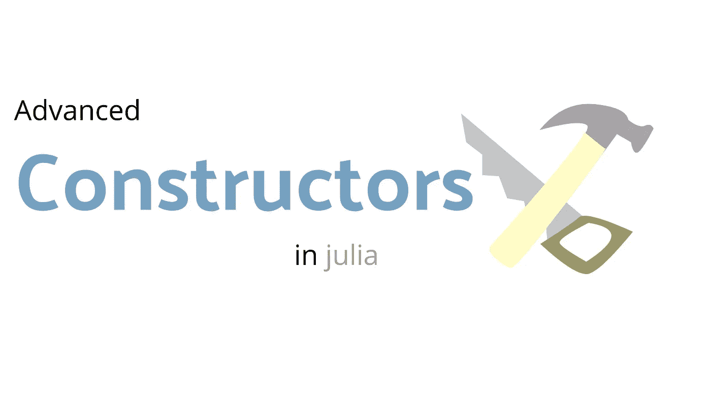

# Julia 中构造函数的高级视图

> 原文：<https://towardsdatascience.com/an-advanced-look-at-constructors-in-julia-5b428882dde8?source=collection_archive---------32----------------------->

## 用 Julia 完整地看一下如何创建复杂的构造函数。



(图片由作者提供)

# 介绍

构造函数是一种计算机编程工具，它允许将数据类型压缩到易于理解的容器中，这些容器可以有效地用作变量和方法，以创建一些非常惊人的结果。然而，在 Julia 语言中，构造函数是自成一体的——比人们第一眼看到的要复杂得多。Julia 中的类型可以以多种方式处理，它们可以是编译器熟知的完全函数式类型，也可以是完全不可变的面向对象类型，这些类型在创建时就交付给编译器——这是该语言魅力的一部分。

在 Julia 编程语言中有两种不同类型的构造函数:

*   内部构造函数
*   外部构造函数

这两个构造函数都有自己特定的用途，并且最终都返回相同的类型。然而，我们可以使用外部构造函数来支持不同类型的算术和类型处理。

# 外部构造函数

外部构造函数是程序员将在 Julia 中使用的典型构造函数类型。也就是说，这通常只是冰山一角，更多的是对终极编程接口的掩盖。也就是说，您可以使用 **struct** 关键字创建一个外部构造函数。见见我的新朋友，看门人**哈尔**:

```
abstract type Employee endstruct Janitor <: Employee
    wage
    age
    yearsend
Hal = Janitor(25, 63, 2)
```

我们刚刚为我们的新类型——看门人——创建了一个外部构造函数。你可能对这类构造函数很熟悉，但是，假设我们不查询数据库就不知道 Hal 的年龄，但是，我们有每个雇员的 UUIDs 列表？这个应用程序会很快崩溃，需要调用一个函数来替换类型。这正是内部构造函数的目的。

# 内部构造函数

内部构造函数可以用来创建不一定是用户提供的数据容器的类型，而是你的函数。虽然在大多数函数式编程语言中，这意味着创建一个远离该构造函数的完全独立的函数，但在 Julia 中，这两个构造函数可以相互协作，并让编译器准备好返回内部构造函数正在处理的类型，请看:

```
abstract type Employee endstruct Janitor <: Employee
    wage::Float64
    age::Int64
    years::Int64 function Janitor(uuid::Int64) wage, age, years = query_db(uuid) return new(wage, age, years)
end
```

如果我们用一个浮点数和两个整数调用看门人，就像这样:

```
Hal = Janitor(8.25, 5, 1)
```

我们仍然得到和以前一样的回报。然而，我们也可以用单个整数调用它，这将运行我们的内部构造函数，并使用 UUID 的逻辑！

```
Hal = Janitor(hals_UUID)
```

当然，这将返回一个带有我们提供的信息的看门人类型，我们可以在它上面添加许多类型转换来优化这段代码，使它比其他方式更有效。对于用一个完全独立的方法构造外部构造函数来说尤其如此！

我们可以更进一步，以多种方式将 dispatch 与适当的类型一起使用。例如，我们可以在内部构造函数中使用 dispatch 来为数据类型创建更多的功能，这些数据类型可以被传递用于返回。使用这种方法我们还可以做的另一件大事是利用 Julia 的类型层次系统。这个系统类似于 Python 中的子类系统。

尽管 Julia 本质上是一种相对基本的函数式编程语言，但正是这种简单性帮助它实现了这些突破性的特性。至少对我来说，这个概念是非常惊人的，因为我们不仅可以通过函数方法调用在全局范围内使用 dispatch，而且还可以通过各种可能的方式一起使用多个构造函数来完成任务！

# 结论

一般来说，构造函数是一个必要且重要的编程概念。然而，在 Julia 编程语言中，构造函数的能力实际上是惊人的。它们不仅可以用来创建可变和不可变类型，还可以利用初始化函数。如果对构造函数的这种观察很有趣，您可能也会喜欢另一篇文章，在这篇文章中，我使用相同的概念在 Julia 中进行面向对象编程！：

[](/how-to-turn-julia-into-python-6ab13dafb84) [## 如何把茱莉亚变成 Python！

### 如何在 Julia 编程语言中使用面向对象编程范式？

towardsdatascience.com](/how-to-turn-julia-into-python-6ab13dafb84) 

谢谢你的阅读，这对我意义重大！