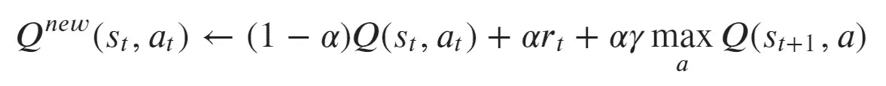

# 一个 AI 智能体学习玩井字游戏(第 3 部分):训练一个 Q 学习 RL 智能体

> 原文：<https://towardsdatascience.com/an-ai-agent-learns-to-play-tic-tac-toe-part-3-training-a-q-learning-rl-agent-2871cef2faf0?source=collection_archive---------10----------------------->

## *我们用 Q 学习训练一个强化学习代理玩井字游戏*

*本文是让计算机使用强化学习玩井字游戏系列的一部分。你可以在这里找到* [*所有文章*](https://towardsdatascience.com/tagged/rl-series-paul) *。我们的目标是提供一个完整的实现，您可以真正从中挑选并学习强化学习。按顺序阅读文章可能是最好的。文章包括所有代码* [*都可以在 Github*](https://github.com/PaulHiemstra/qlearning_paper/blob/master/tictoe_qlearning_paper.ipynb) *上找到。*

# 强化学习回顾

在本系列的第 1 部分和第 2 部分中，我们为我们的强化学习(RL)代理构建了对手，所以现在我们可以开始实际的 RL 代理了。在我们进入实际实现之前，我想花一些时间了解一下 Q 学习是如何工作的。

正如我们在第 1 部分中了解到的，RL 基于以下关键概念:


代理的目标是找到一个有效的**策略**，即在给定的情况下什么行动是最优的。在井字游戏中，这意味着给定棋盘上的状态，哪一步棋是最优的。请注意，该策略关注的是长期**价值** Q，而不仅仅是短期**回报** R。更数学地说，该策略是具有状态𝑠和行动𝑎的函数𝑄(𝑆,𝑎，强化学习是学习该函数的方式。

# RL 的列表方法

Q-learning 是一种常见的强化学习方法。这种方法的核心是 Q 表，它存储状态和动作的所有组合，本质上表示 Q 函数的离散版本。在本文中，我们使用字典存储 qtable。给定某个 boardstate，我们可以确定哪个动作具有最高的 Q 值:

```
'e'
```

给定`board_state_1`，我们能做的最好的移动是`e`(中间的方块)，因为它有最高的 Q 值。

定义了 Q 表后，我们的主要挑战是学习适当的 Q 值。以下伪代码描述了学习过程:

```
for all episodes:
    if not boardstate in qtable:
        qtable[boardstate] = 0 for all actions
    if (pick random action with chance epsilon)
        pick random action
    else
        pick action with highest q value for boardstate
    Q[boardstate, action] = update_qtable(Q[boardstate, action], 
                                          reward for action, 
                                          Q[next_boardstates])
    tree search makes move
```

于是我们就对着树搜索玩了很多井字游戏(剧集)，慢慢更新 Q 值。一些重要的观察结果:

*   我们用`0`初始化我们的 qtable，开始时没有清楚的指示什么是好的移动。
*   如果存在多个具有最大 Q 值的移动，我们从这些移动中选择一个随机动作。这是为了刺激对 boardstates 的探索。在我们训练过程的开始，有多个最大值是很常见的。
*   我们并不总是从 q 表中选择最优的移动(剥削)，而是随机选择𝜖.这是为了通过探索可能会有好的回报的随机新板状态来刺激学习过程。这确保我们不会很快陷入局部最小值，而是继续寻找更好的移动。这种开发与探索的动态是有效学习 Q 表的重要部分。
*   如果我们赢了，奖励是+10 分，如果我们输了，奖励是-10 分，如果我们平了，奖励是+5 分。

# Q 学习的魔力

Q 学习中最重要的步骤是更新表中的 Q 值。下面的伪等式描述了它的工作原理:

```
new Q value = old Q value + instantaneous reward + maximum Q for next states after the action we took
```

因此，新的 Q 值考虑了以前的 Q 值，我们在状态`S`采取行动`a`得到的奖励，以及在状态`S`采取`a`行动后可能的 Q 值*。请注意，要了解长期 Q 值，我们只需预测下一个可能的最大 Q 值。这与树搜索方法形成了鲜明的对比，树搜索方法一直向前看，直到游戏结束。对我来说，通过只看一步棋就能获得长期回报，这让 Q-learning 变得相当神奇。当然，不利的一面是我们需要玩很多游戏来慢慢地让所有的 Q 值在 Q 表中传播。*

以下等式更正式地表达了更新规则:



其中(1−𝛼)𝑄(𝑠_𝑡,𝑎_𝑡)等于在𝑠_𝑡州𝑎_𝑡采取行动的旧 q 值，𝛼𝑟_𝑡等于瞬时回报，𝛼𝛾 max(𝑠_𝑡+1,𝑎)在采取行动`a`并在𝑠_𝑡+1.州结束后，我们下一步行动可以得到的最大 q 值该等式包括多个系数:

*   𝛼学习率，它决定了给定新信息时 q 值更新的速度。如果学习率为零，新值就是旧值。这实质上意味着算法没有学习任何新东西。alpha 值为 1 只是丢弃了这个旧值，并完全依赖于由其他项计算的新 Q 值。介于 0 和 1 之间的值允许您控制学习进度。在足够快地学习和不要太快地专注于一个特定的 Q 值之间取得平衡是 Q 学习挑战的一部分。
*   𝛾贴现因子。这决定了我们是主要关注短期回报(小𝛾)还是长期价值(大𝛾).

# 训练我们的特工

有了理论基础之后，我们就可以开始实际训练我们的 RL 代理了。Github 上的 Python 脚本`[train_qlearning.py](https://github.com/PaulHiemstra/qlearning_paper/blob/master/train_qlearning.py)`按照我们之前定义的伪代码训练方法执行我们的整个训练循环。前十几行初始化我们[构建的](/an-ai-agent-plays-tic-tac-toe-part-1-building-the-opponent-to-play-against-bb5af74fded1)和[优化的](/an-ai-agent-plays-tic-tac-toe-part-2-speeding-up-recursive-functions-using-memoization-97253529aea8)的树，这将作为我们 RL 代理的对手。接下来，我们初始化两个对象:

第一个对象跟踪井字游戏棋盘的状态。它允许一个人采取行动，检查游戏是否结束，并在游戏结束时分发奖励。GitHub 上的文件`[support_functions.py](https://github.com/PaulHiemstra/qlearning_paper/blob/master/support_functions.py)`包含了所有的细节。第二个对象`player_tree`代表我们的 RL 代理，它玩游戏并慢慢更新它的 Q 表。注意，我们手动调整了`alpha`、`gamma`和`epsilon`的值，但是我们的学习似乎对这些值不太敏感。大概井字游戏对于 Q 学习来说真的不是一个有挑战性的问题。

训练循环用这些 Python 对象玩井字游戏，慢慢学习 Q 表:

这里我们玩 10000 个井字游戏。

# 我们的代理表现如何？

作为我们训练过的 RL 代理的基准，我们首先让一个未训练过的代理来对抗树搜索。我们简单地从零开始创建一个播放器，并让它在没有 Q 学习的情况下与树搜索进行游戏:

```
-10.0    768
 5.0     232
dtype: int64
```

未经训练的代理通常会输掉游戏(-10)或和棋(5)。鉴于我们被允许开始游戏，这是糟糕的表现。相比之下，使用`[train_qlearning.py](https://github.com/PaulHiemstra/qlearning_paper/blob/master/train_qlearning.py)`对接受过 100.000 次游戏培训的代理进行相同的分析:

```
5.0    1000
dtype: int64
```

显示 RL 代理已经变得非常擅长对付树，总是打成平局。

# Q 表

为了更深入地了解 Q learning 如何学习如何玩井字游戏，我们将重点放在 Q 表的内容上。下图显示了 100.000 训练游戏结束时的最终 Q 表。请记住，我们是`X`玩家，蓝色表示好的 Q 值，红色表示负的 Q 值:


Q 表包含 RL 代理具有的关于井字游戏策略的信息。好的例子有:


在这里，我们了解到弯角是开始时很好的动作，这从深蓝色中可以明显看出。此外，我们(`X`)学会了通过树搜索(`O`)来阻止移动。这里的阻挡移动是蓝色的，其他移动是深红色的。

除了最终学习的 Q 表，下面的 youtube 电影很好地说明了 Q 表是如何在 100，000 个游戏中慢慢发展的。

随着新状态的引入，表会不断增长。此外，白色慢慢地被正值(蓝色)和负值(红色)所取代，表明代理知道什么是好的和坏的移动。

在我们的下一部分，我们将关注我是如何可视化 Q 表的。

# 我是谁？

我叫 Paul Hiemstra，是荷兰的一名教师和数据科学家。我是科学家和软件工程师的混合体，对与数据科学相关的一切都有广泛的兴趣。你可以在 medium 上关注我，或者在 LinkedIn 上关注[。](https://www.linkedin.com/in/paul-hiemstra-77030b20/)

如果你喜欢这篇文章，你可能也会喜欢我的其他一些文章:

*   [没有像应用数据科学这样的数据科学](/there-is-no-data-science-like-applied-data-science-99b6c5308b5a)
*   [牛郎星图解构:可视化气象数据的关联结构](/altair-plot-deconstruction-visualizing-the-correlation-structure-of-weather-data-38fb5668c5b1)
*   [面向数据科学的高级函数式编程:使用函数运算符构建代码架构](/advanced-functional-programming-for-data-science-building-code-architectures-with-function-dd989cc3b0da)