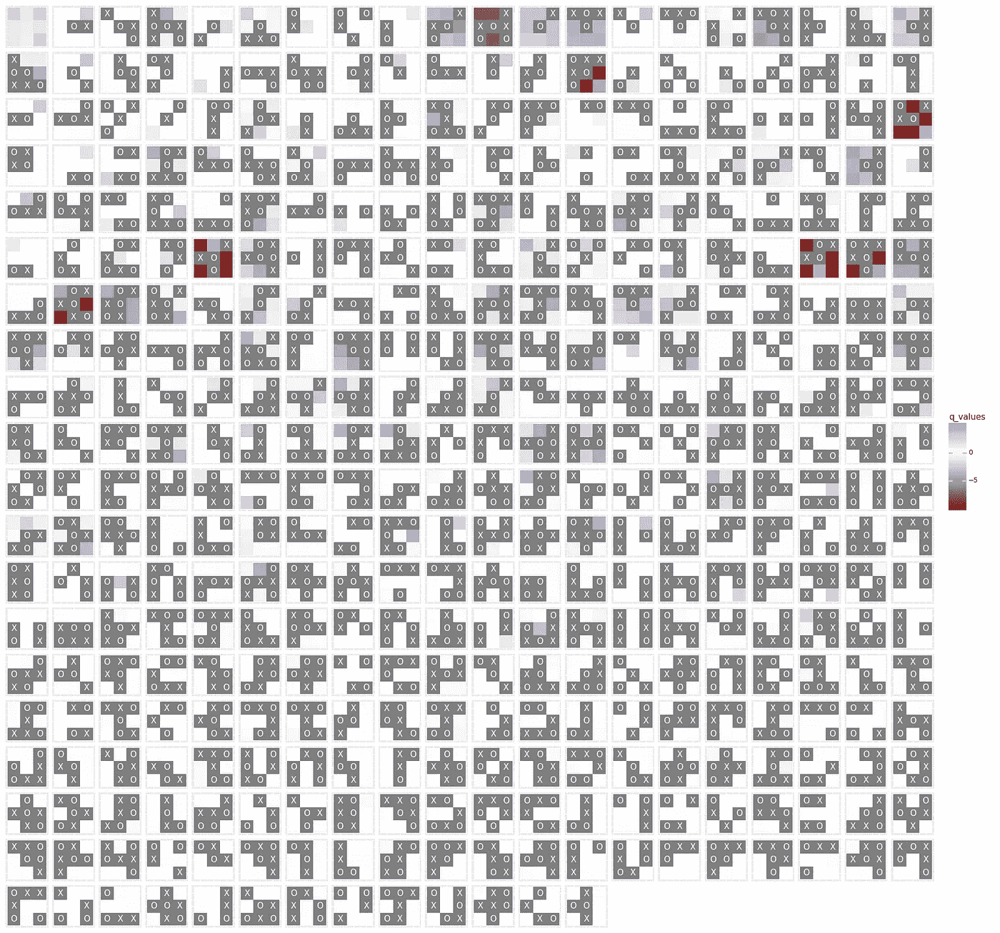

# 一个人工智能代理学习玩井字游戏(第 4 部分):使用 plotnine 和 ffmpeg 可视化 Q 表

> 原文：<https://towardsdatascience.com/an-ai-agent-learns-to-play-tic-tac-toe-part-4-visualising-the-q-table-using-plotnine-and-ffmpeg-9462d50ae482?source=collection_archive---------15----------------------->

## *在这里，我们可以看到培训过程中 Q 表的发展*

本文是让计算机使用强化学习玩井字游戏系列的一部分。你可以在这里找到 [*所有文章*](https://towardsdatascience.com/tagged/rl-series-paul) *。我们的目标是提供一个完整的实现，您可以真正从中挑选并学习强化学习。按顺序阅读文章可能是最好的。文章包括所有代码* [*都可以在 Github*](https://github.com/PaulHiemstra/qtable_movie_paper/blob/master/qtable_movie_paper.ipynb) *上找到。*

# 可视化学习过程

很难真正理解机器学习算法在做什么。尤其是当性能没有改善时，机器学习的黑盒性质真的很难发现算法是否真的在学习什么。能够确定算法正在学习什么，对于诊断我们的黑盒方法实际上在做什么非常重要。

在我们的例子中，Q 值的变化代表 RL 代理正在进行的学习。幸运的是，对于我们简单的井字游戏来说，有一个非常直观的方法来可视化 Q 表。在下一张图中，我们用`X`和`O`显示了玩家已经做出的移动，并以颜色显示了相应的 Q 值:


`X`和`O`代表我们必须做出决定之前的状态，彩色方块代表可能的下一步行动的 Q 值。这证实了 Q 表存储了**政策**:在给定的棋盘状态下，什么棋是好的(高 Q)。在这个特殊的示例图中，我们了解到拐角是开始时很好的移动，从深蓝色中可以明显看出这一点。此外，我们学会了通过树搜索来阻止移动。这里的阻挡移动是蓝色的，其他移动是深红色的。

# 建立我们的观想

为了我们的可视化，我们需要来自第 3 部分的训练有素的 RL 代理[的以下信息，这些信息代表 Q 表:](/an-ai-agent-learns-to-play-tic-tac-toe-part-3-training-a-q-learning-rl-agent-2871cef2faf0)

*   表中所有可能状态的标识符列表，按它们在训练过程中出现的顺序排列。这被存储为 boardstate 数组的一个 [sha1 散列](https://en.wikipedia.org/wiki/SHA-1)。
*   状态链接到实际电路板状态数组的字典
*   状态与下一个可能动作的 Q 值相关联的字典，即 Q 表本身。

`rl_data.pkl`包含第 3 部分中针对受训代理的信息。为了说明内容，我们打印了属于某个州的项目:

```
351d61138857f04cc521e13b7173f266420ea412
{'d': -3.7017636879676767, 'f': -3.5089737163159778, 'g': -3.5089737163159778, 'h': 3.9726827543029692, 'i': -3.63814513936129}
[[ 1\. -1\.  1.]
 [ 0\. -1\.  0.]
 [ 0\.  0\.  0.]]
```

接下来，我们需要将电路板状态数据与 Q 值结合起来。对于上面打印的状态，这将产生:


该绘图数据包含电路板上每个 x、y 坐标的 board_state 和 Q 值。请注意，显然只能通过电路板状态或 Q 值。接下来，我们可以使用`[plotnine](https://plotnine.readthedocs.io/en/stable/index.html)`绘图库中的`geom_tile`来绘制。如果您不熟悉 plotnine 或 ggplot2，请[阅读本教程](https://datascienceworkshops.com/blog/plotnine-grammar-of-graphics-for-python/)。


其中我们已经走的棋(棋盘状态)是灰色的`'X'`和`'O'`，下一步棋的 Q 值是彩色方块。这些值是有意义的，因为蓝色移动阻挡了`'O'`玩家，而红色移动让他们获胜。

# 可视化整个表格

随着我们对一个棋盘状态的可视化，我们需要将它扩展到整个 Q 表。所以我们:

*   将数据生成部分包装在一个函数中，并为所有可能的状态调用它。我们将结果连接成一个大的`DataFrame`。
*   在`plotnine`代码中添加对`facet_wrap`的调用，以创建每个唯一状态的可视化电路板状态。
*   确保每个电路板状态的可视化顺序是按时间顺序排列的，即在培训过程中添加到 Q 表中的顺序。我使用`pd.Categorical`来实现这一点，其中分类变量的顺序由传递给`categories`参数的列表决定。

这会产生以下结果:



注意，您可以在 Player 类中找到代码，更具体地说是在`plot_qtable`方法中。详见 Github 上的[支持功能。](https://github.com/PaulHiemstra/qtable_movie_paper/blob/master/support_functions.py)

# 制作 Q 表的动画

到目前为止，Q 表的可视化是 100，000 场比赛后的决赛表。为了了解 Q 表是如何随时间发展的，我们可以简单地在整个培训过程中绘制 Q 表，并将这些图拼接成一部电影。在剧本`[train_and_generate_frame.py](https://github.com/PaulHiemstra/qtable_movie_paper/blob/master/train_and_generate_frames.py)`中，我们训练了一个 Q 学习代理，但除此之外，我们每隔这么多集就创造情节。训练循环:

现在有了一个额外的部分，它在一个`plots`字典中存储了一个 Q 表的图形。完成培训后，我们可以将这些图作为图像转储:

为了节省时间，我们使用`tqdm`中的`process_map`来创建 5 个工作进程，每个转储将这些进程绘制到磁盘上的映像中。请注意，由于一个 bug ，您不能在 Jupyter 笔记本[中运行这段代码，但是在一个单独的脚本中这可以很好地运行。](https://github.com/has2k1/plotnine/issues/498)

运行脚本后，我们在磁盘上得到几百张图片，我们用`ffmpeg`把它们拼接成一部电影。在命令行上(在我的例子中是 WSL ),我向`ffmpeg`发出以下调用:

```
ffmpeg -r 30 -f image2 -s 1920x1080 -i qtable_ep%06d.png -vcodec libx264 -crf 25  -pix_fmt yuv420p qtable.mp4
```

以 30 秒的 mp4 文件结束:

随着新状态的引入，表会不断增长。此外，白色慢慢地被正值(蓝色)和负值(红色)所取代，表明代理知道什么是好的和坏的移动。

# 我是谁？

我叫 Paul Hiemstra，是荷兰的一名教师和数据科学家。我是科学家和软件工程师的混合体，对与数据科学相关的一切都有广泛的兴趣。你可以在 medium 上关注我，或者在 LinkedIn 上关注我。

如果你喜欢这篇文章，你可能也会喜欢我的其他一些文章:

*   [没有像应用数据科学这样的数据科学](/there-is-no-data-science-like-applied-data-science-99b6c5308b5a)
*   [牛郎星图解构:可视化气象数据的关联结构](/altair-plot-deconstruction-visualizing-the-correlation-structure-of-weather-data-38fb5668c5b1)
*   [面向数据科学的高级函数式编程:使用函数运算符构建代码架构](/advanced-functional-programming-for-data-science-building-code-architectures-with-function-dd989cc3b0da)