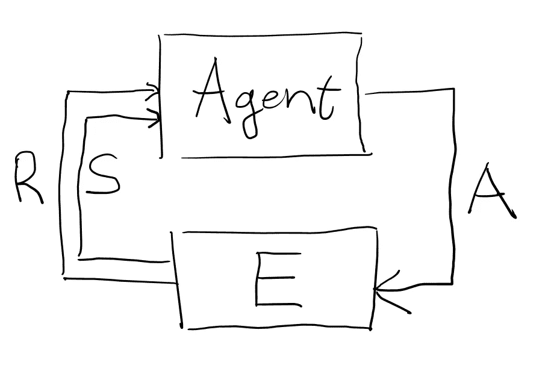
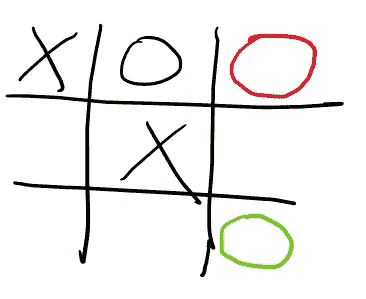
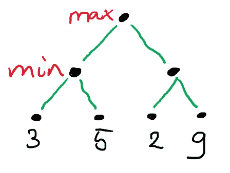
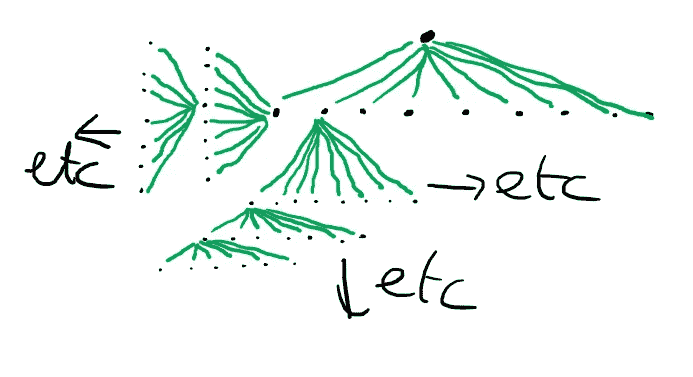
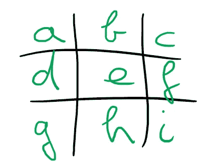

# 一个人工智能代理玩井字游戏(第 1 部分):建立对手来对抗

> 原文：<https://towardsdatascience.com/an-ai-agent-plays-tic-tac-toe-part-1-building-the-opponent-to-play-against-bb5af74fded1?source=collection_archive---------9----------------------->

*我们构建了一个强力极大极小树搜索，它将作为我们强化学习方法的对手*

*本文是让计算机使用强化学习玩井字游戏系列的一部分。你可以在这里找到*[](https://towardsdatascience.com/tagged/rl-series-paul)**的所有文章。我们的目标是提供一个完整的实现，您可以真正从中挑选并学习强化学习。按顺序阅读文章可能是最好的。文章包括所有代码* [*可以在 Github*](https://github.com/PaulHiemstra/minmax_paper/blob/master/min_max_paper.ipynb) 上找到*

# *强化学习到底是什么？*

*强化学习是继监督和非监督建模之后的第三种建模范式。它最近取得了巨大的成功，包括击败世界最佳围棋手。仅仅几年前，这一壮举还被认为是不可能的，因为围棋中巨大的可能棋步甚至让国际象棋相形见绌。我只会简单地介绍一下强化学习是如何工作的，但下面的 youtube 电影应该会提供更深入的介绍( [Intro RL](https://youtu.be/0MNVhXEX9to) ， [Deep RL](https://youtu.be/IUiKAD6cuTA) )。*

*强化学习(RL)基于以下关键概念:*

**

*有一个计算机代理采取行动( **A** )作用于环境( **E** )。该环境通过为该行为提供奖励( **R** )做出响应，并使系统进入下一个状态( **S** )。以下面的状态为例:*

**

*这里我们考虑 O 玩家下一步行动的两个选项:绿色和红色选项。选择绿色选项会产生很高的奖励，因为我们阻止了 X 玩家获胜。或者，红色选项产生低奖励，因为这允许 X 玩家获胜。通过多次玩井字游戏并获得奖励，RL 代理将慢慢了解在特定状态下什么行为提供良好的长期价值。状态到最优行为的映射在 RL 行话中被称为**策略**。*

# *我们第一个简单的极大极小算法*

*有了 RL 的基础知识，我们现在可以专注于本文的目标:为我们的 RL 代理构建一个对手。对我们来说幸运的是，井字游戏足够简单，可以用蛮力的方式解决。这确保了我们在井字游戏中以最佳的走法结束，确保我们的 RL 代理可以从最佳的走法中学习。*

*主要思想是将所有可能的井字游戏状态存储在一个树中，并确定对于给定的状态，下一步采取什么措施会产生好的结果。这是通过递归搜索树并找到奖励来完成的。每个可能的下一步棋下面的子树中的奖励告诉我们哪一步棋是最优的。为了说明这是如何工作的，我们从一个非常简单的树开始([基于这个 youtube 视频](https://www.youtube.com/watch?v=5oXyibEgJr0)):*

**

*在这个游戏中，两个玩家竞争:一个有最大化分数的目标，一个有最小化分数的目标。首先，最大化玩家可以在树的顶端选择，然后最小化玩家可以选择，以此类推。作为最大化玩家，我们的最优选择*似乎是*向右走，这就是 9 的高分所在。然而，第二个玩家在有选择的时候会选择 2。所以，在这种情况下，最优选择是向左走，得三分。*

*使用[最小最大算法](https://en.wikipedia.org/wiki/Minimax)来解决这种树。在树的每一层，最小或最大玩家做出他们的最佳选择。如果我们用 Python 表达这棵树，我们得到:*

```
*root
├── 
│   ├── 3
│   └── 5
└── 
    ├── 2
    └── 9*
```

*我们可以通过遍历树来解决极大极小问题:*

```
*3*
```

*这实际上显示了给定这一特定的树，最大玩家可以得到的正确的最大分数:3。用伪代码显式实现递归揭示了幕后发生的事情:*

```
*start-game: minmax('root') -> 
max-player: max([minmax('l1'), minmax('r1')]) -> 
min-player: max([min([minmax('l1-1), minmax('l1-2')]), 
                 min([minmax('r1-1'), minmax('r1-1')])]) ->
end-tree  : max([min([3, 5]), 
                 min([2, 9])]) -> 
            max([3, 2]) ->
            3*
```

# *井字游戏树上的最小最大树搜索*

*对于井字游戏，我们可以使用完全相同的极大极小方法，使用更大的树。首先，我们从顶部开始，最大玩家有九个可能的移动，然后我们剩下最小玩家有八个移动，等等:*

**

*留给我们的是一棵巨大的树，上面有所有可能的组合。为了存储井字游戏状态，我们为棋盘上的每个区域分配一个字母:*

**

*创建一个 Python 类来存储状态，允许更新棋盘，检查游戏是否结束，并根据结果返回游戏的值:*

*接下来，我们递归地创建巨型树，并在每个节点添加棋盘状态对象。每个节点的 ID 是所采取的步骤的顺序，例如`acig`。*

*完成树后，我们可以使用非常类似于我们首先开始的简单树的极大极小码:*

*使用`determine_move`我们现在可以得到下一个最好的移动。请注意，如果多个移动具有相同的最大值，我们在这些最大移动中选择一个随机移动。比如 max 玩家玩`a`方块的时候:*

```
*e
2.986009120941162*
```

*请注意，它选择了中间的`e`方块，这在井字游戏中确实是非常强的一步棋。此外，确定这一步大约需要 3 秒钟。*

# *解决速度慢的问题*

*所以，现在我们的 RL 代理有了一个有价值的对手。唯一的问题是它非常慢，实际上对于我们的 RL 代理来说太慢了，因为它需要玩很多游戏来学习井字游戏。在第 2 部分中，我们将使用一种高级编程技术来大大加快树搜索的速度。*

# *我是谁？*

*我叫 Paul Hiemstra，是荷兰的一名教师和数据科学家。我是科学家和软件工程师的混合体，对与数据科学相关的一切都有广泛的兴趣。你可以在 medium 上关注我，或者在 LinkedIn 上关注[。](https://www.linkedin.com/in/paul-hiemstra-77030b20/)*

*如果你喜欢这篇文章，你可能也会喜欢我的其他一些文章:*

*   *[没有像应用数据科学这样的数据科学](/there-is-no-data-science-like-applied-data-science-99b6c5308b5a)*
*   *[牛郎星图解构:可视化气象数据的关联结构](/altair-plot-deconstruction-visualizing-the-correlation-structure-of-weather-data-38fb5668c5b1)*
*   *[面向数据科学的高级函数式编程:使用函数运算符构建代码架构](/advanced-functional-programming-for-data-science-building-code-architectures-with-function-dd989cc3b0da)*