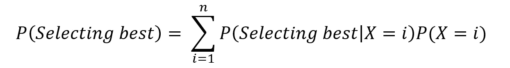
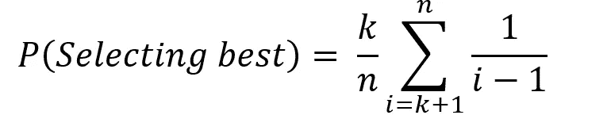
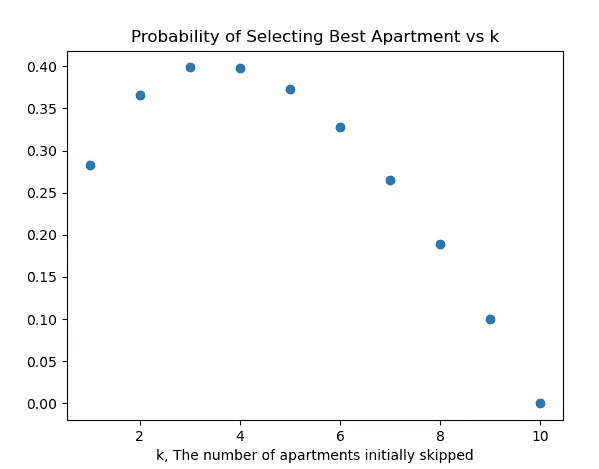
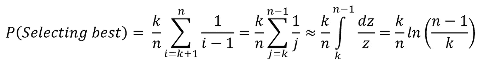
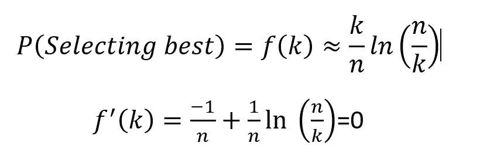

# 赖以生存的算法

> 原文：<https://towardsdatascience.com/an-algorithm-to-live-by-f60dccfa553d?source=collection_archive---------33----------------------->

## **37%法则**

克里斯蒂安·祖尼加博士

假设你正在找房子，想找到最适合你的公寓。虽然你通常可以在网上找到租金价格和图片，但你可能还是想亲自去看看。你终究要住在那里。您可能想查看一些以收集信息，但不想进行扩展搜索。等待太久也可能代价高昂。你怎样才能最好地选择你的新公寓？图 1 显示搜索顺序开始，在看到一些公寓后结束。这也适用于其他情况，比如你的新工作、新员工或新搭档。一般来说，这个问题被称为最优停止问题。[1]

图 1 应该参观多少套公寓才有机会选出最好的一套？(图片由作者提供)

根据 37%规则，你应该先探索候选公寓的 37%，然后继续探索，选择下一个比你之前参观过的所有公寓都好的公寓。这种策略很有可能(37%)给你最好的公寓，而不必探索所有的选择。《赖以生存的算法》一书更彻底地探讨了这一策略，但没有很好地解释为什么它是最佳的。[2]

概率来拯救我们。如参考文献《概率模型导论》所示，用这种策略选择最佳公寓(或最佳奖问题)的概率，其实可以通过一些简化的假设找到[3]。你有 n 个候选公寓，将依次访问它们。这没有太大的限制性，因为这是您通常会做的事情。你收集了一份类似公寓的清单，一旦你进去看了每一个，你就会做出决定。最好的一个同样有可能是那 n 个公寓中的一个。在你参观完一个公寓后，你可以将它与你之前参观过的所有公寓进行比较，然后决定是接受还是拒绝它。例如，如果你有 10 个候选公寓，在你第四次拜访后，(10 的 37%大约是 4)，你应该选择下一个比前 4 个更好的。

一般来说，如果 k 是要访问和拒绝的公寓数量，那么在给定最佳公寓在第 I 个位置的情况下，利用选择最佳公寓的条件概率，就可以求出选择最佳公寓的概率。这种技术被称为条件反射，通常可以简化概率计算。假设 k 是固定的，但最佳 k 是未知的。

X 是最佳公寓的位置，P(X=i) =1/n，最佳公寓位于位置 I 的概率。条件概率 P(选择最佳|X=i)可分为两种情况。

1.如果 i <= k，那么最好的公寓在前 k 次拒绝中被拒绝，并且以后没有机会选择它。如果 i <= k，p(选择最佳|X=i) = 0。

2.如果我> k，那么最好的公寓还没有被选中。选择最佳的概率取决于从位置 k 到 i-1 的所有公寓都比前 k 个公寓差。具体来说，前 k 公寓最好的，也应该是前 i-1 公寓最好的。因为概率是相等的，P(选择最佳| X=i) = k/(i-1)

选择最佳的概率变成:

对于 n= 10 套公寓，编写这个规则并绘制多个 k 值的概率非常简单，如图 2 所示。该图显示，37%法则表明，最大概率发生在 3-4 套公寓附近！

图 2 通过拒绝 k 个初始公寓，然后选择目前看到的最佳公寓，选择最佳公寓的概率。有 n=10 套公寓。(图片由作者提供)

虽然概率可以模拟，但也有近似解析解。求和可以用积分来近似。n 值越大，近似值越好。

选择最佳公寓的概率是 k 的函数。为了找到最大值，我们可以假设 k 是连续的，对 k 求导，并将其设置为 0。

求解 k 得到 **k=n/e** 。因为自然对数的底 e 是 2.718，所以 1/e 大约是 0.37，揭示了 37%法则的来源。

如前所述，37%规则有几个可能不成立的假设。然而，它仍然可以提供有用的指导。

**参考文献**

[1]https://en.wikipedia.org/wiki/Optimal_stopping

[2] Christian 和 Griffiths《算法生存》Henry Holt and Company，LLC 版权所有 2016

[3]罗斯《概率模型导论》第 11 版，爱思唯尔版权 2014