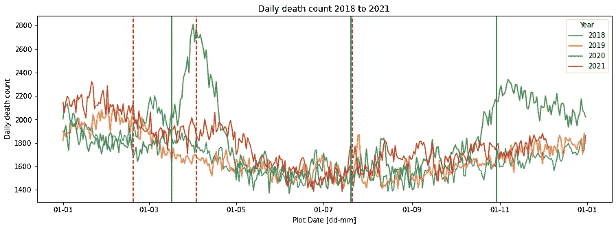
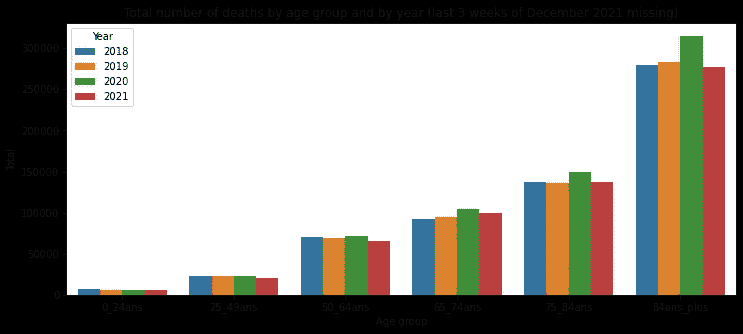
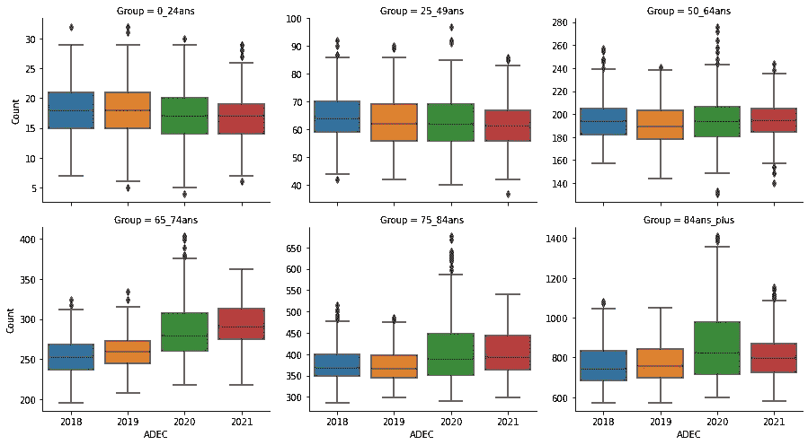
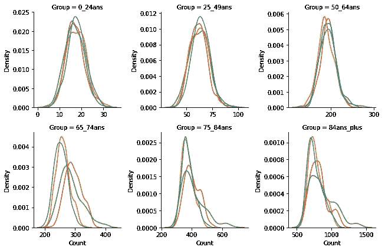
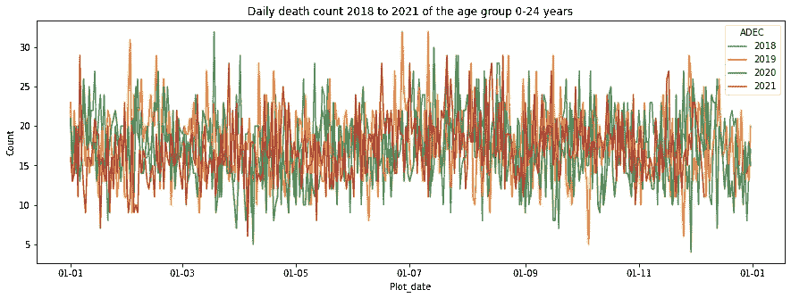
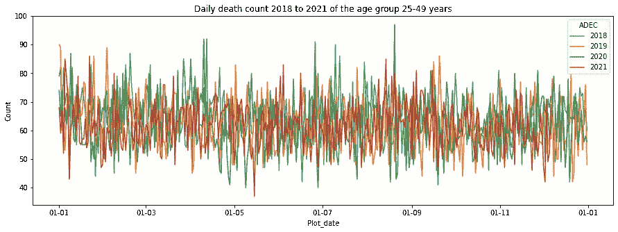
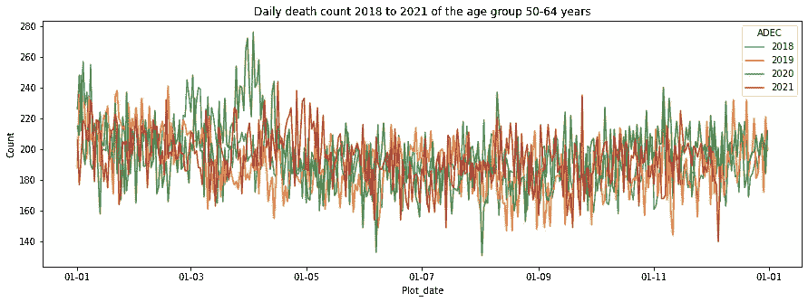
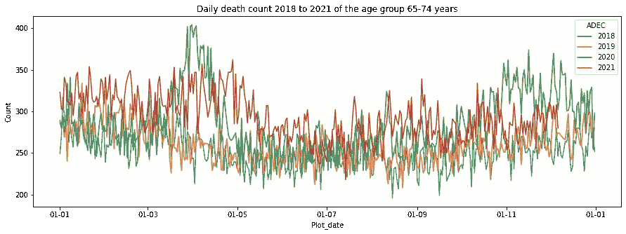
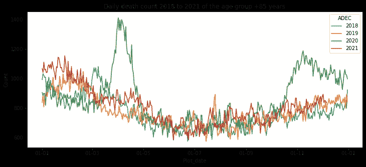

# 新冠肺炎疫情期间法国每日死亡率的分析

> 原文：<https://towardsdatascience.com/an-analysis-of-daily-mortality-in-france-during-the-covid19-pandemic-95286928e80c?source=collection_archive---------25----------------------->

## 可视化不同时间和年龄组的死亡率趋势

## 此帖子包含过去 4 年法国每日死亡率的分析。这些数据在全球范围内按年龄组进行分析，并尽可能与当时有效的疫情遏制措施联系起来。

这里分析的原始数据可以从法国国家统计和经济研究所( [INSEE](https://www.insee.fr/fr/statistiques/4487988?sommaire=4487854#consulter-sommaire) )免费下载。要直接下载我的分析数据，请点击[这里](https://www.insee.fr/fr/statistiques/fichier/4487988/2021-12-17_detail.zip)。数据跨度从 2018 年 1 月 1 日到 2021 年 12 月 6 日。我用来生成这里展示的各种情节的笔记本可以在 [GitHub](https://github.com/gedec/Mortality_France) 上公开获得。

# 1.概观

研究期间法国每日死亡人数的比较可以在下图中看到。对应于 2020 年春季第一波 covid19 的峰值在图上很容易看到，从 2020 年 11 月开始的第二波也是如此。

由于疫苗接种的部署(从 2020 年 12 月 27 日开始)和治疗方案的整体改善，2021 年的总体死亡率仍然很高，但不会达到 2020 年的峰值。

法国每日死亡人数(图片由作者提供)

几个重要的日期有助于理解图上可见的一些趋势:

*   2020 年 3 月 17 日——法国政府首次对人口实施全面严格限制。它将持续到 2020 年 5 月 10 日。
*   2020 年 7 月 20 日—口罩成为封闭环境中的强制要求。
*   2020 年 10 月 30 日——第二次分娩(比第一次稍微宽松)。它将持续到 2020 年 12 月 15 日，一些限制仅在 2021 年 2 月初解除。
*   2021 年 2 月—50 岁以上的人可以接种疫苗。
*   2021 年 4 月 3 日——第三次全面分娩开始，持续到 2021 年 5 月 3 日(在此期间，学校和托儿所仍然关闭)。
*   【2021 年 7 月 — Delta 变体代表大多数新病例。
*   2021 年 7 月 21 日—健康通行证在法国推出，其应用范围将在 2021 年 8 月逐步扩大。
*   2021 年 9 月 13 日—超过 6 个月前注射过最后一次疫苗的人可以注射第三次疫苗。

# 2.按年龄组的全球分析

这些数据被分成了与 INSEE 发表的不同分析中相同的年龄组。这使我们能够比较不同年份不同年龄组的死亡总数。

作者图片

请记住，2021 年最后三周的数据缺失，在这最后三周，每日平均死亡人数在增加，如这里的[所示](https://www.lemonde.fr/les-decodeurs/article/2020/05/05/coronavirus-age-mortalite-departements-pays-suivez-l-evolution-de-l-epidemie-en-cartes-et-graphiques_6038751_4355770.html)。然而，我无法整合这些信息，因为没有提供年龄组的详细信息。

为了更详细，我们可以按年份和年龄组分析每日死亡率的分布。从下面的箱线图可以看出，对于 0-24 岁、25-49 岁和 50-64 岁年龄组，法国的平均每日死亡人数在过去 4 年中保持稳定(0-24 岁年龄组略有下降)。然而，对于 50-64 岁年龄组，一些高异常值是可见的，尽管平均值似乎与其他年份相似。

按年龄组划分的每日死亡率分布(图片由作者提供)

65-74 岁年龄组似乎受到疫情的严重影响，到 2020 年死亡率明显更高，平均水平在 2021 年保持高位。对完整时间序列的研究将提供更多的见解，但较高的比率可能是因为该年龄组在 covid19 感染方面的脆弱性以及他们获得疫苗接种的延迟(在法国疫苗接种已分批部署，优先考虑较大年龄组)。

按年龄组划分的每日死亡率的核密度图(图片由作者提供)

对于 75–84 和 85+组，2020 年两次 covid19 波的影响清晰可见(特别是在分布右侧的异常值中)。2021 年，这些群体的平均值仍然很高，但分布尾部的数字有所减少(红色曲线 2021，绿色曲线 2020)。

# 3.按年龄组划分的每日死亡率图

时间序列图完成了上一节中强调的观察，并有助于理解箱线图中看到的每日死亡率的一些极值。

对于 0-24 岁和 25-49 岁年龄组，死亡率在过去 4 年中非常相似，似乎不受 covid19 疫情的影响。

作者图片

作者图片

covid19 导致的额外死亡率在 50-65 岁年龄组开始显现，尤其是在 2020 年的第一波期间。2021 年，5 月份可见的额外死亡率似乎达到了与 2018 年季节性流感疫情类似的水平，但时间略长

作者图片

如前一节所述，65-74 岁年龄组并未受到每日死亡率大幅上升的影响，但较高的平均值在 2020 年和 2021 年持续了很长一段时间。与 2020 年相比，2021 年秋季的改善可能归因于该年龄组的整体高疫苗接种覆盖率。

作者图片

对于 75-85 岁和+85 岁的年龄组，2020 年前两次浪潮的影响显而易见。疫苗接种开始后，额外死亡率稳定在与 2019 年和 2018 年季节性流感流行期间相当的水平，但特殊性在于额外死亡率跨越了更长的时间。

疫苗接种为这些年龄组提供的保护在 2021 年秋季达到的*正常*日死亡率中清晰可见。

作者图片

作者图片

# 结论

我为自己做了这个分析，以理解当前的时代。法国目前正受到奥米克隆变异体传播的影响，因此这里提出的观察结果可能不会在很长一段时间内保持有效。