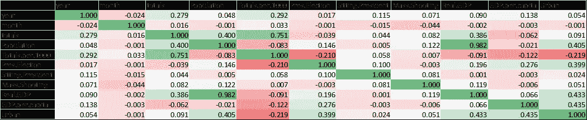
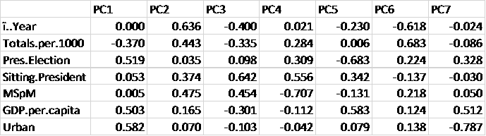
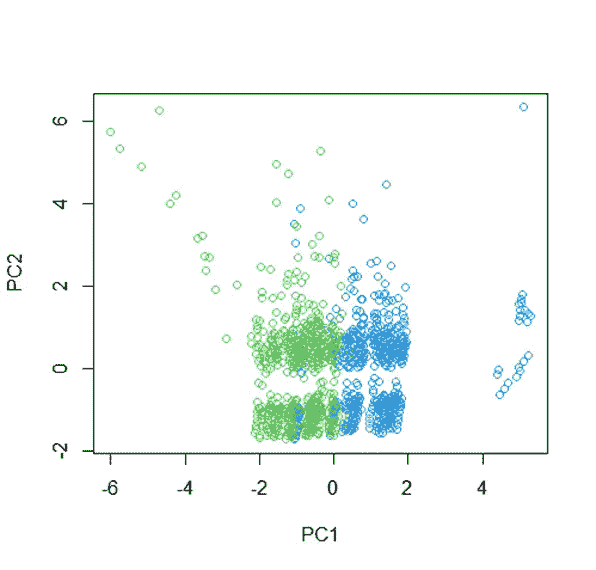
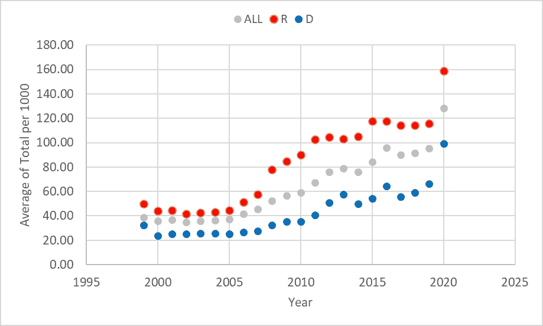

# 美国枪支背景调查分析

> 原文：<https://towardsdatascience.com/an-analysis-of-firearms-background-checks-in-us-d2e4b2bfafe1?source=collection_archive---------20----------------------->

## 1999-2020 年枪支背景调查趋势分析

# **简介**

近年来，美国发生了许多与大规模枪击和枪支暴力有关的悲剧事件。本文旨在了解 1999 年至 2020 年间枪支背景调查与政治和宏观经济趋势之间的一些潜在趋势和关系。为了实现这一目标，必须收集和汇编不同来源的数据。r 用于该数据集的统计分析。下面我会解释数据集的每个变量指的是什么。

总数:这一数字代表通过国家即时犯罪背景调查系统(NICS)启动的枪支背景调查总数。“它们并不代表售出的枪支数量。根据不同的州法律和购买情况，无法在枪支背景调查和枪支销售之间建立一一对应的关系。”虽然无法建立一一对应的关系，但这一统计数据可以很好地表明售出的枪支数量。

人口:给定年份每个州的人口。

每 1000 人的总数:每 1000 人中背景调查的总数。

总统选举:各州如何在总统选举中投票。成绩有效期四年。例如，亚利桑那州在 2016 年投票给共和党，在 2020 年投票给民主党。因此，从 2016 年到 2019 年，它将保持 R，从 2020 年到现在，它将变为 D。1 代表民主党，0 代表共和党。

在任总统:在任总统的政党。1 代表 D，0 代表 r。

大规模射击:数据汇编自斯坦福 MSA 数据库和 TVP 大规模射手数据库。应该注意的是，每个数据库对报告的大规模枪击事件使用不同的标准。对于 1999 年至 2016 年，使用斯坦福数据库，对于 2016 年至 2021 年，使用 TVP 数据库记录每次大规模拍摄的时间和状态。应当指出，大规模枪击受害者只占伤亡人数的一小部分。

MSpM:每 100 万人中的大规模枪击数量。

实际 GDP:基于 2012 年美元的各州年度 GDP。2021 年的数据是前两个季度的平均值。

人均 GDP:基于 2012 年美元的各州年人均 GDP。

城市:每个州的城市人口百分比。1999-2009 年使用 2000 年的数据，2010-2021 年使用 2010 年的数据。

尽管我已经尽最大努力从不同来源收集数据并在一个数据集中呈现它们，但是读者应该参考原始来源以获得关于每个参数的准确数据。

# **相关矩阵**

我们可以做的第一件事是创建数据的相关矩阵，这是总结数据和查看模式的好工具。每个相关系数量化了一对变量之间的关联，并且是该对变量之间线性关系的度量。生成的值范围从-1 到 1，随着数字越来越接近这两个极限，相关性越来越强。

```
> dim(gun)[1] 13923 12> names(gun)[1] “ï..year” “month” “state” “totals” “Population” “Totals.per.1000”[7] “Pres.Election” “Sitting.President” “Mass.Shooting” “Real.GDP” “GDP.per.capita” “Urban”> attach(gun)> gun_Q=gun[,-3]> cor(gun_Q)
```



**表 1。**基于月度数据集的相关矩阵

从表 1 的相关矩阵中观察到:

“Month”与其他任何变量都没有很强的相关性，因此可以减小数据库的大小。相反，年度数据可以用于分析。

“总数”随着“年份”(0.279)的增加而增加，表明从 1999 年到 2021 年火器销售增加。“总数”随着“人口”的增加而增加，这意味着人口越多的州有越多的枪支交易,“总数”和实际 GDP 之间存在同样的相关性。这就是为什么通过包括人均 GDP 数据和“总量”来标准化基于人口的数据很重要。

“每 1000 人的总数”按“年”增加，表明从 1999 年到 2021 年枪支销售增加。“每千人总数”与“Pres”呈负相关。“选举”和“城市”。这意味着城市人口较多的州人均枪支销量较低。此外，支持民主党的州人均枪支销量也较低。然而，“Pres。“选举”和“城市”也密切相关(0.399)，这意味着城市人口更多的州会投票给民主党。“每 1000 人的总数”与“人均国内生产总值”呈负相关，这意味着人均国内生产总值较高的州枪支销量较低。

我们还可以根据相关矩阵收集一些人口统计信息。例如，城市越多的州人口越多(0.405)，选举民主党(0.399)，人均 GDP 越高(0.435)。


**表二。**基于年度数据集的相关矩阵

在年度数据集上运行相关矩阵产生了与之前观察到的月度数据集相同的趋势。然而，对于年度数据集，只包括 1999 年至 2000 年的数据，还增加了每百万人的群体射击数据。唯一的主要区别似乎与“大规模射击”有关:

“大规模枪击事件”与“年份”、“总数”、“人口”和“实际 GDP”呈正相关。然而，其中一些参数是相互关联的(即共线的),如“人口”和“实际 GDP ”,这意味着人口越多的州实际 GDP 也越高。然而，可以肯定地说，从 1999 年到 2020 年，大规模枪击事件有所增加，并且在人口众多的州更加普遍。

“MSpM”与“年份”和“现任总统”的正相关性最高，表明随着时间的推移，大规模枪击事件变得更加普遍。与“现任总统”的正相关意味着当现任总统是民主党人时，大规模枪击事件更为普遍。然而，我们知道最近的总统是民主党人(即在任总统和年份之间有轻微的正相关)。

# **主成分分析**

主成分分析(PCA)是一种有用的技术，可用于具有相关变量的大型数据集。PCA 本质上是一种降维技术，我们试图减少表示数据所需的变量数量，并用于探索性数据分析。基于上述相关矩阵，为了消除共线性，我们首先从数据集中删除'总数'，'人口'，'大规模射击'和'实际国内生产总值'。对于主成分分析，数据应该是定量的，因此“状态”也将从数据集中移除:

```
> names(gun_Q)[1] “ï..Year” “Totals.per.1000” “Pres.Election” “Sitting.President”[5] “MSpM” “GDP.per.capita” “Urban”>pr.out=prcomp(gun_Q,scale=TRUE)> pr.out$rotation
```

表 3 显示了所有 7 台电脑的电脑负载向量。本质上，每个 PC 都是原始变量的线性组合，系数如表 3 所示。



**表 3。**主成分载荷

以下命令将为每台 PC 计算并绘制解释的方差比例(PVE)。

```
> pr.var=pr.out$sdev²> pve=pr.var/sum(pr.var)> pve[1] 0.26944377 0.19945339 0.15671898 0.11911631 0.09628290 0.08377159 0.07521306> plot(pve , xlab=”Principal Component”, ylab=”Proportion of Variance Explained”, ylim=c(0,1) ,type=”b”)> plot(cumsum(pve), xlab=”Principal Component”, ylab =”Cumulative Proportion of Variance Explained”, ylim=c(0,1) , type=”b”)
```

图 1 显示了每种 PCs 的解释方差比例(PVE ),累积 PVE 如图 2 所示。例如，图 2 显示前两个 PC 的累积 PVE 约为 0.5，这意味着前两个 PC 可以解释数据集中 50%的方差。


**图一。**每个主成分的 PVE(图片由作者提供)


**图二。**累积 PVE 与主成分数(图片由作者提供)

```
> biplot(pr.out,scale = 0)
```

图 3 显示了前两个 PC 的数据集的 PC 分数和相应的 PC 加载向量。请注意，加载向量与表 3 中获得的相同。换句话说，图 3 是整个数据集在前两个 PCs 空间上的投影。


**图三。**年度枪械数据集的前两台电脑。箭头显示了前两个 PC 加载向量。每个数字代表前两个主成分的分数。(图片由作者提供)

从表 3 和图 3 中我们可以看出，PC1 的主要组件是“Pres”。“选举”、“城市”和“人均 GDP”，这意味着这三个参数相互关联，表明更多的城市州倾向于选举民主党人，人均 GDP 更高。PC2 的主要组成部分是“年份”、“MSpM”和“现任总统”，表明这三个参数相互关联，因为近年来大规模枪击事件更加普遍，民主党人被选为总统。

参数“Total per 1000”同时显示在 PC1 和 PC2 中，表明它与 PC1 和 PC2 中的参数相关。“每 1000 人总数”箭头的方向也很重要，它指向 PC2 的正值和 PC1 的负值。换句话说，“每 1000 人的总销售额”(即枪支销售额)逐年上升(箭头方向指向正的 PC2 值)，并且在城市人口较少、选举共和党和人均 GDP 较低的州更为普遍(箭头方向指向负的 PC1 值)。

图 3 中还有一个需要注意的重要特性。从图 3 中我们可以看到，数据集分为两大组，分别在 PC2=0 以上和以下。这表明，不考虑 PC1(换句话说，在 D 和 R 状态中)，我们看到从 1999 年到 2020 年的人均枪支销售和人均大规模射击有所增加。在此期间，人均国内生产总值也有所增长，但与人均枪支销售和人均大规模枪击相比，增长速度较慢，而且与 R 国相比，D 国的增长速度更快(因为箭头方向指向 PC1 的正值)。

我们可以根据 D/R 投票对图 3 上的数据集进行颜色编码，如下所示:

```
> attach(gun)> plot(pr.out$x[,1:2],col=Pres.Election+3)
```



**图 4。**年度枪械数据集的前两个 PC 分数。蓝色代表投票给民主党的数据点，绿色代表共和党。(图片由作者提供)

从图 4 中我们可以清楚地看到，D 州的 PC1 得分较高，它们的人均 GDP 较高，并且更加城市化。

图 3 和图 4 显示了 PCA 的强大功能，我们可以在一个图中总结所有数据集，并解释所有变量之间的趋势和相关性。

# **趋势**

以下两个数字显示了多年来“每 1000 人的总数”和“人均国内生产总值”的趋势，并基于 D 和 r 的投票模式。



**图五。**历年“每 1000 人总数”的平均值(图片由作者提供)


**图六。**历年人均 GDP 平均值(图片由作者提供)

图 5 和图 6 的趋势证实了前几节中讨论的调查结果，即“每 1000 人的总数”(即枪支销售)逐年增加，R 州比 D 州高(几乎两倍)。人均国内生产总值逐年增加，但 D 国的人均国内生产总值高于 R 国，而且 D 国的人均国内生产总值比 R 国增长得更快。

# **结论**

枪支背景调查数据与 1999 年至 2020 年各州的 GDP 和投票数据相结合。完成了相关矩阵和主成分分析来分析这些数据并确定趋势。研究发现，从 1999 年到 2020 年，R 和 D 两个州的人均枪支销量和大规模枪击事件都有所增加。与 D 州相比，r 州城市化程度较低，人均 GDP 较低，人均枪支销量较高。

# **来源**

[国家即时犯罪背景调查系统(NICS) —联邦调查局](https://www.fbi.gov/services/cjis/nics)

[git hub-BuzzFeed news/NIC-枪械-背景调查:来自联邦调查局全国即时犯罪背景调查系统的月度数据，从 PDF 转换为 CSV。](https://github.com/BuzzFeedNews/nics-firearm-background-checks)

[东亚银行:区域经济账户:下载](https://apps.bea.gov/regional/downloadzip.cfm)“本网站发布的信息属于公共领域，未经特定许可，不得使用或复制”。

[最全面的枪手数据库——暴力项目](https://www.theviolenceproject.org/mass-shooter-database/)。服务条款见[服务条款-暴力项目](https://www.theviolenceproject.org/terms-of-service/)。

[美国大规模枪击事件|斯坦福图书馆](https://library.stanford.edu/projects/mass-shootings-america)“斯坦福 MSA 是根据创作共用属性 4.0 国际许可发布的”。

[git hub—stanforgeospatialcenter/MSA:美国大规模枪击事件数据库。由斯坦福地理空间中心维护](https://github.com/StanfordGeospatialCenter/MSA)

[2019 年国家和州人口估计(census.gov)](https://www.census.gov/newsroom/press-kits/2019/national-state-estimates.html)“美国人口普查局对引用我们网站上的信息没有具体的风格建议”。

[各州城市人口百分比，历史|爱荷华州社区指标计划(iastate.edu)](https://www.icip.iastate.edu/tables/population/urban-pct-states)原始数据来自美国人口普查局。

[统计学习导论(statlearning.com)](https://www.statlearning.com/)

[Faghihnejad/Gun:1999 年至 2021 年枪支背景调查(github.com)](https://github.com/Faghihnejad/Gun)