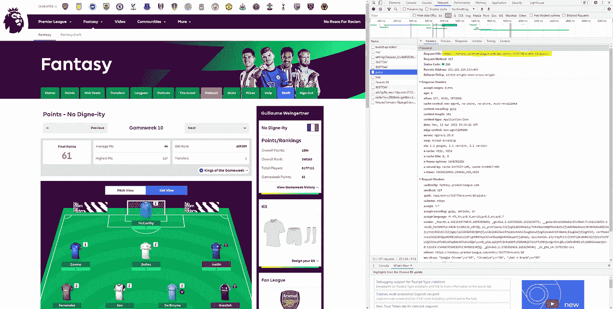
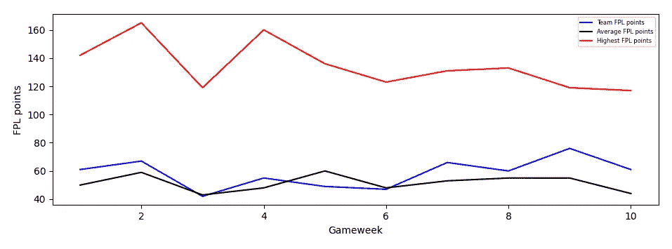
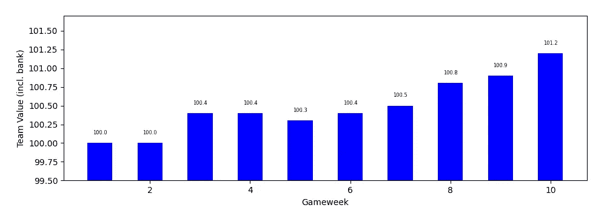
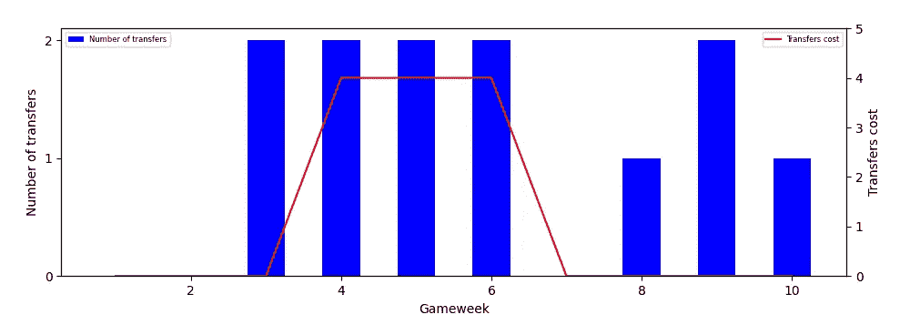
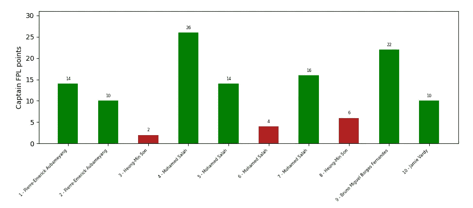
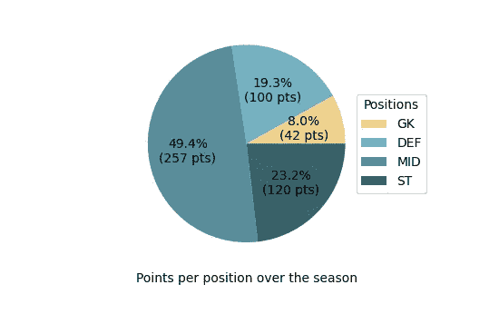
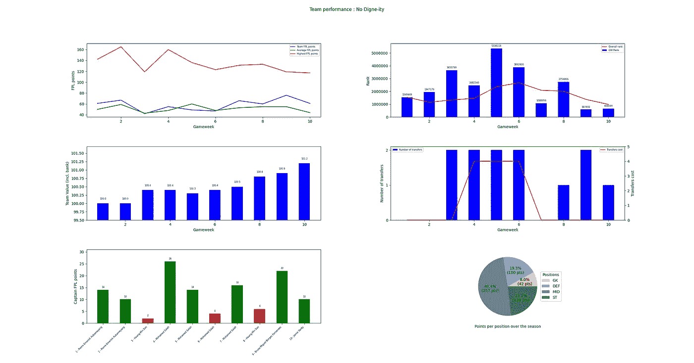

# 用 Python 解析你的梦幻英超球队

> 原文：<https://towardsdatascience.com/an-analysis-of-your-fantasy-premier-league-team-with-python-de4acf77e444?source=collection_archive---------18----------------------->

## 如何使用几行 Python 代码来可视化您的 FPL 团队的表现

作者图片

# #动机

如果你关注足球，你一定在某个时候听说过梦幻足球游戏。很多足球联赛都有自己的，有自己特定的规则，英超也不例外。不仅如此，这个游戏在那个岛上非常受欢迎，全世界有超过 800 万人玩这个游戏。在这篇文章中，我们将看看梦幻英超的经理们如何使用 Python 来分析他们的球队。

虽然这个游戏很好地展示了你对你的团队的一些见解，但它可能比页面上的数字更生动。这就是 FPL API 和几行 Python 代码派上用场的地方，它们可以构建不同类型的可视化，显示任何经理团队和他们一周接一周的开发游戏的最重要方面。

# #识别和获取相关数据

这里的想法是从小处着手，从基本要素开始(点数、等级、团队价值、转会、队长选择和每个位置的点数)。这已经带来了大量关于经理团队的见解。

为了获得这个项目所需的数据，我们将使用 FPL API。尽管没有围绕它们构建的文档，但由于使用 Google Chrome DevTools 对不同的 FPL 网页进行了简单的网络扫描，我们可以找到我们需要的 URL 端点。然后，对这些特定端点的请求使您能够访问 JSON 格式的数据，这在 Python 中处理起来非常实用。

Google Chrome“Inspect”工具的屏幕截图 URL 端点以黄色突出显示

以下是我们用来获取所需数据的 4 个端点:

**https://fantasy.premierleague.com/api/bootstrap-static/**
关于 PL 球队、球员和比赛周详情的一般信息

**https://fantasy.premierleague.com/api/entry/*teamID*/event/*GW number*/picks/** 关于给定的 FPL 队和给定的比赛周的详细信息

**https://fantasy.premierleague.com/api/entry/*团队 id*/**/
给定 FPL 团队的一般信息

**https://fantasy.premierleague.com/api/element-summary/*playerID*/**
具体英超球员的详细信息

也就是说，这就是数据挖掘部分的样子:

在此基础上，让我们构建几个函数来获取英超球员的具体数据:

有了这个，我们就可以开始了！

# #组织数据

既然我们已经从 FPL API 获得了所有的原始数据，游戏的名称就是只保留我们需要的东西，整理东西，并把所有东西组织在列表和字典中。这将使在我们的仪表板上绘制数据变得更加简单。

在初始化了我们想要建立的所有列表和字典之后，我们循环通过所有的游戏周来获取我们需要的数据并填充我们刚刚定义的对象。我们使用 append 方法向列表中添加元素，而对于字典，我们直接添加(键，值)对。

# #创建图表

好了，现在让我们来建造这个东西。将所有数据正确地排列在列表和字典中，我们真正需要的就是 matplotlib！

# 1.游戏周分数以及与最高和平均分数的比较

让我们从基础开始。一个队每周得到的分数以及与比赛周最高和平均分数的比较是要建立的第一个图表。我从未接近过比赛周的最高分数，但与平均分数相比还是很有趣的。

作者图片

# 2.每个比赛周的排名变化

其次，我们来看看每个比赛周的队伍排名，以及整体排名的演变。有了这张图表，你可以监测你的球队一周接一周的比赛表现和整体趋势。

作者图片

# 3.每个比赛周团队价值的演变

如果你不想在赛季结束时落后，FPL 的“金融”部分是至关重要的。关注你的财务状况是很重要的，这张图表就是这么做的。

作者图片

# 4.转让次数和相关费用

现在让我们来看看到目前为止，这位经理在这个赛季中有多活跃。该图显示了所进行的转移及其潜在的相关成本。

作者图片

# 5.船长付款

在 FPL，队长的选择非常重要，它可以完全改变一支球队在特定比赛周的表现。下一张图将向你展示你的队长在哪些地方表现不佳，哪些地方表现过度。

作者图片

# 6.每个位置的点数

我们仪表盘上的最后一张图显示了您每个职位获得的积分。多亏了这张图表，你将清楚地了解到哪些球员给你带来了最多的分数，以及你在整个赛季中遵循了哪些策略。这可能是一个好主意，比较它与游戏中的顶级玩家，看看你可以做什么不同！

作者图片

# #结论

以我的团队为例，在 10 个游戏周之后，仪表板最终看起来是这样的:

作者图片

我们在这个项目中制作的图表集是分析 FPL 团队的良好开端。然而，不言而喻，通过我们设法获得的所有数据，可以得出更多的 FPL 洞见。在这里，我把重点放在观想最重要的事情上，可能会有更多的事情发生！

如果你想分析你的团队，完整的代码可以在这里找到:
【https://github.com/Guigs11/fpl_team_analysis】T2