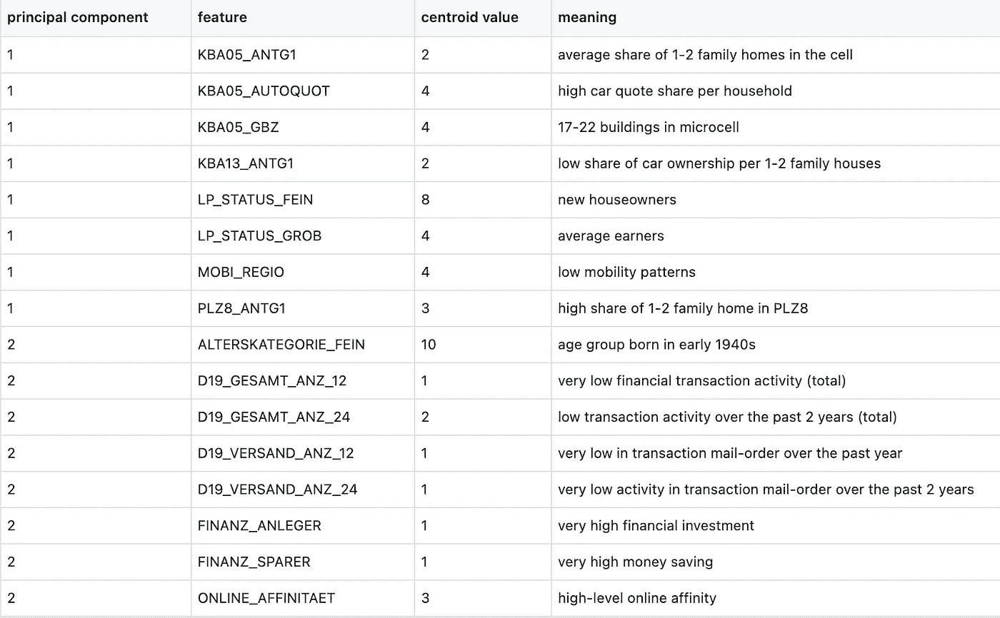

# Arvato 解决方案客户细分和预测

> 原文：<https://towardsdatascience.com/an-analysis-on-arvato-customers-e3d56a366c78?source=collection_archive---------31----------------------->


照片由[约书亚·索蒂诺](https://unsplash.com/@sortino)通过 [Unsplash](https://unsplash.com/) 拍摄

# 介绍

客户细分是营销行业中最重要的过程之一，它允许公司将精力集中在具有相似特征的特定客户子集上。这使得公司能够有效地、适当地向各种受众群体营销群体。据 Shopify 称，客户细分有助于公司:

*   创建有针对性的沟通方法，与特定的客户群体产生共鸣，但不与其他人产生共鸣。
*   确定改进产品、新产品或服务机会的方法。
*   专注于最赚钱的客户。

一个顶点项目关注德国人口统计数据的这一过程。具体来说，它需要分析德国普通人口的人口统计数据以及一家邮购公司的客户数据。该分析的目标是使用包括 K-Means 聚类在内的无监督学习方法来确定邮购公司的客户与一般人群相比如何。

在对客户进行细分并解释分组后，下一步是使用单独的训练数据集来实施和调整一些监督学习算法，以预测个人成为公司客户的概率。

找到最佳预测模型后，最后一步是在测试数据集上使用它来预测客户对活动做出反应的概率。这些预测的概率将被上传到 Kaggle 比赛中，该比赛将测量这些预测与其他参赛作品相比的准确性。

这个项目是 Udacity 数据科学纳米学位顶点的多个选项之一。因此，贝塔斯曼的这个项目成为我的首选，因为几个月前我已经在机器学习纳米学位项目的另一个版本上工作过。那个版本只包含第一步——从清理数据到对客户进行聚类。现在，这是一个超越这一步的机会，同时进一步应用数据挖掘和机器学习的新技能。

# 数据

这三个步骤中的每一步都包含具有相同特征的不同数据集。人口统计数据集包含大约 366 个特征，每个特征描述成千上万人的个性和行为。每一行代表一个人以及该人以外的信息，即家庭、建筑和邻居数据。

德国人口统计数据和邮购公司的客户数据将用于该分析的无监督学习部分。前者包含总共 366 个特征和 891211 个样本，而后者包含 369 个特征和 191652 个样本。两者在功能上的区别是 CUSTOMER_GROUP、ONLINE_PURCHASE 和 PRODUCT_GROUP，它们属于客户数据，提供了更多的客户信息。

邮寄出的训练和测试数据集包含与人口统计数据相同的所有特征。虽然两者都有近 43000 个样本，但这些数据代表了作为营销活动目标的个人。训练数据中的结果变量被命名为 RESPONSE，它指示客户是否响应了成为公司客户的活动。测试数据集包含除响应特征之外的所有特征。这将用于在本项目的最后部分使用最佳模型进行最终预测。

# 第 1 部分—数据预处理

像每一个数据科学问题一样，这个项目在分析数据和进行预测之前涉及到数据预处理和清理。由于四个数据集具有相同的结构，数据清理将被处理到 ETL 管道中，该管道执行缺失值的修改，确定要删除哪些特征和行，如何处理分类/混合特征，以及生成虚拟变量。

## 缺少值

由于人口统计数据的规模很大，我上传了前 100，000 个样本，以便更快地执行初始清理。原始数据包含几个缺失值的特征，这些缺失值用 NaN 以外的许多不同值编码，即-1，0，X，XX。幸运的是，一个单独的 Excel 文件包含每个特性的值及其描述的索引。与含义“未知”相关联的值是缺失值，因此被收集到字典中。在将所有原始的“未知”编码替换为“NaN”之后，我继续确定哪些特性可以被排除。


图 1 —按特征分类的缺失值百分比直方图(按作者分类的图片)

从**图 1，**一个特征的缺失值的最佳阈值是 40%，因为任何高于这个阈值的值在特征数量中出现的频率都非常低。结果，九个特征被丢弃，包括阿格 _ TYP-最佳阿格类型学，KBA05 _ 鲍马克斯-单元内的普通建筑，以及蒂特尔 _ KZ-此人是否有学术头衔。


图 2—按行划分的缺失值百分比直方图(按作者划分的图像)

在删除了大部分缺失的列之后，下一步是对行进行类似的处理。从**图 2 中可以看出，**行缺失值在 50%之后变得不那么频繁，任何缺失值在 70%左右的行对分析都没有好处。因此，丢失超过 50%的任何行都将被丢弃。

## 分类变量

检查要素的数据类型时，其中一些数据类型具有多个值。例如，CAMEO_DEU_2015 和 CAMEO_INTL_2015 将被拆分为两个要素-财富和人生阶段。CAMEO_DEUG_2015 已转换为数字变量，因为其值只有一种含义。

基于 PRAEGENDE _ JUGENDJAHRE 创建了两个特征。这一原创功能结合了三个维度的信息——十年、运动和国家。根据 Excel 文件中关于此功能的信息，这些值被转换为十进制和主流。KZ 西部的特征已经代表了这个国家。

在去掉一些无用的分类变量后，剩下的变量被转换成虚拟变量。这是数据清理过程的最后一步。

在执行各自的分析之前，上述所有步骤将用于所有四个数据集。

# 第 2 部分—客户细分

通过数据清理管道，德国人口统计数据和客户数据集均可用于客户细分分析。客户细分包括缺失值的数据插补、数据标准化、主成分分析降维以及用于细分的 K 均值聚类。

一旦在人口统计数据和客户数据集中生成了聚类，就会对这些聚类进行比较，以确定哪些聚类代表了邮购公司的目标受众，即那些比其人口对应部分获得更高客户比例的聚类。这些聚类将根据最高主成分中的主导特征进行解释，给出营销活动目标人群类型的详细信息。

## 主成分分析

干净数据预处理的第一步是为分割分析找到最佳数量的组件和聚类。对于前者，我创建了一个函数，根据解释的方差阈值的百分比，返回某个主成分的最高主成分权重的特征的条形图。对于人口统计数据，**图 3** 表明，约 154 个主成分解释了 85%的数据变化。


图 3——解释 85%数据变化的主成分数量。


图 4-主成分 1 中权重最高和最低的 10 个特征(作者图片)

从**图 4，**第一主成分中权重最大的特征包括流动模式、单/双户数量、社会地位和汽车份额。具体来说，这些特征与该成分正相关。另一方面，最小的要素权重包括 6 至 10 个家庭住宅的共享、每 6 至 10 个家庭住宅的汽车拥有量、财富/生命阶段和家庭净收入。这意味着第一主成分与大家庭负相关。


图 5—主成分 2 中权重最高和最低的 10 个特征(图片由作者提供)

从**图 5** 来看，第二个主成分中最大的特征意味着它与在线亲和力、交易活动频率、省钱金融拓扑、年龄组正相关。相反，这一部分与财务准备和最近的财务交易现状负相关。

## k 均值聚类

对于人口统计中成千上万的个体，最好估计高于 5 的聚类数。为了测试要使用多少个分类，肘形方法图显示了当 K-means 分类分数降低，分类数增加时，一条线显示出肘形的方向变化。对于像人口统计数据这样大的数据集，循环迭代聚类数并收集分数的快速方法是使用小批量 K-Means 方法。使用常规的 K-means 将增加计算时间来拟合并在循环中产生分数，特别是对于较大的聚类。另一方面，小批量方法减少了 K-mean 算法的时间和空间开销。具体来说，它使用固定大小的小批量随机数据。该方法的评分如图 6**所示。**


图 6 —从小批量 K 均值得出的人口统计数据的肘形图。k 的最佳值被确定为 k = 8。(图片由作者提供)

在拟合了 25 个聚类之后，8 个和 21 个聚类之间似乎有些曲折。因为大型数据集最好用较高数量的聚类来说明，所以图中的最佳弯头似乎集中在 k =8 个聚类处。

为了将人口统计数据与客户数据进行比较，从对聚类的插补来看，后者将具有与前者相同的 sklearn 对象。具体来说，客户将被扩展到 154 个主要成分，并细分为 8 个集群。两个数据集的聚类分布如图 7**所示。**


图 7——德国人口和邮购公司客户的人群比例(图片由作者提供)

从上面的两个图来看，集群 7 在德国人口中最具代表性，约占 16%，而集群 8 在公司客户中最具代表性，约占 20%。相反，聚类 6 在人口统计中最少被代表约 8%，而聚类 5 在客户中最少被代表约 7.5%。有趣的是，集群 6 是最具代表性的客户之一。此外，分类 7 是人口统计中最具代表性的分类之一，也是客户中最不具代表性的分类之一。

## 聚类解释


图 8 —聚类比例比较，其中目标受众为正差异，非目标受众为负差异(按作者分类)

为了确定哪些分类代表邮购公司的目标受众，将从其各自的客户分类比例中减去人口分类比例。此外，目标受众群是那些客户比例大于人口比例的群体。另一方面，非目标受众群体是那些客户比例低于人口比例的群体。根据**图 8，**邮购公司的目标受众在集群 8 和集群 6 中。聚类 8 具有最高的正容限，而聚类 7 具有最大的负容限。


表 1——按年间隔定义的 ALTERSKATEGORIE_FEIN 值(图片由作者提供)

这里要理解的一个重要变量是年龄组。该项目的任何附件中都没有解释 altersketaorie _ FEIN(年龄类别，精细比例)特征。然而，一个变量 GEBURTSJAHR——出生年份——与该变量直接相关。创建一个关联这两个特征的字典有助于理解 ALTERSKATEORIE_FEIN 特征的含义。**表 1** 列出了与每个年龄类别变量相关的 5 年间隔。


图 9-按聚类划分的年龄类别比例热图(图片由作者提供)

**图 9** 中的热图显示了将要分析的聚类中年龄类别的比例。在这两个目标受众群体中，1930 年至 1949 年出生的人在年龄组中所占比例最高。对于群组 3 中的非目标受众，按年龄组划分的最高比例在两个目标群体中几乎相同。另一方面，第 7 组中 1945 年至 1969 年间出生的人比例较高。由于在这种情况下理解诸如年龄组这样的重要变量是重要的，所以目标观众群的质心将带来对彼此之间的相似性和差异的更广泛的洞察。

聚类分析和解释包括计算所有特征的 8 个聚类质心，并将它们逆变换到原始特征尺度。然而，由于有超过 300 个特征，聚类解释仅限于 10 个具有最高正主成分权重的特征，如图**图 4** 和 **5 所示。**

> ***目标受众***


图 9 —前两个主成分的最高特征的目标受众聚类质心(作者图片)

乍一看，除了聚类 7 之外，第一主成分特征的质心值在所有观众聚类中都是相似的。另一方面，对于第二主成分，该群的大多数质心与所有其他目标观众群相似。


表 2 —聚类 6 值及其含义(图片由作者提供)

在集群 6 中，客户倾向于 20 世纪 40 年代出生的新房主。他们居住在大型社区的单/双家庭住宅中，在社会中的流动性很小。由于储蓄和投资的规模很大，他们必须有很高的退休金。虽然这一群体由普通收入者组成，但他们在过去两年中很少或没有金融交易活动。此外，他们拥有较高的汽车份额和适中的在线亲密度。


表 3—聚类 8 值及其含义(图片由作者提供)

与集群 6 类似，集群 8 中的受众通常出生于 20 世纪 40 年代初，生活在大型社区的单/双家庭住宅中，在社会中的流动性较小。由于储蓄的规模很大，他们必须有很高的退休金。虽然这一群体由普通收入者组成，但他们在过去两年中很少或没有金融交易活动，在线亲密度适中。然而，与集群 6 不同，这些客户是更有经验的业主，并且具有更高的投资活动。

> ***非目标受众***



表 4-聚类 3 质心值及其含义(图片由作者提供)

与目标受众类似，第 3 类客户是 20 世纪 40 年代初出生的房主，他们居住在大型社区，在社会中流动性很小。由于储蓄规模非常大，他们必须有很高的退休金。虽然这一群体由普通收入者组成，但他们在过去两年中很少或没有金融交易活动。然而，一些关键的区别是，这一群体的客户平均拥有单/双家庭住房份额，汽车拥有率低，至少有几个交易活动，以及更高的在线亲和力。


表 5—聚类 7 质心值及其含义(图片由作者提供)

乍一看，分类 7 显示的值与其他分类不同。与目标群体一样，这一群体包括居住在大型社区的单/双家庭住房中的房主。由于储蓄规模非常大，他们必须有很高的退休金。然而，这些客户更年轻，并且在过去两年中增加了金融交易活动。而且，他们的线上亲和力很高。

非监督分析的结论是，营销活动的目标受众是 1935 年至 1949 年间出生的人，他们在投资和存钱方面具有较高的财务拓扑结构。他们也是很少或没有整体或邮购交易活动的人，即使他们有适度的网上关系。

# 第 3 部分—监督学习

在对德国人口统计和客户数据集执行聚类分析以确定哪些客户更有可能是邮购公司的客户之后，下一步是将监督学习应用于单独的数据文件。这个数据集与前两个相似，但是每个人都是邮寄活动的目标。此外，它还包括一个响应变量，表示个人在活动结束后是否成为了邮购公司的客户。也就是说，这些数据用作训练集，将用于为单独的测试数据集建立最佳预测算法，该数据集将用于 Kaggle 比赛。


图 10 —培训数据中的客户响应频率(图片由作者提供)

由于训练数据集几乎有 43，000 个样本，**图 10** 显示响应变量明显不平衡。换句话说，大约 1.24%的目标个人成为了公司的客户。由于这是预测模型将使用的目标变量，因此在测试数据中对个人是否会成为客户进行分类将是一个挑战。一种补救方法是在训练预测模型之前，除了数据预处理和训练/测试拆分之外，还实施采样方法。

## 数据预处理

一旦将 300 个预测因子和反应变量彼此分开，基于 0.1 的验证比率和 0.2 的测试比率，将邮寄出的训练数据分成训练、验证和测试集。这三个分割用于在对整个邮寄数据使用最佳模型之前评估候选模型。

分割后，训练集、验证集和测试集分别通过插补、标准化和 PCA 缩减为 154 个组件进行转换。对于这种分析，这些经过处理的数据集将用于评估三种预测算法:逻辑回归、AdaBoost 和梯度增强分类器。该过程包括使用 ROC 分数而不是 f1 分数对模型执行交叉验证，但不是在对训练数据实施额外修改之前。

## 重采样— ADASYN

在对明显不平衡的数据实施模型之前，重采样方法对于精确的模型至关重要。少数反应——反应= 1——非常罕见，以至于任意模型对结果几乎一无所知，从而导致弱模型。为了使积极的反应更重要，模型需要更好地了解它，这就是过采样的用武之地。

两种可能的重采样方法是欠采样和过采样。欠采样包括平衡数据，使得多数类(响应= 0)的观测值随机减少到与少数类相同的大小。然而，对于该数据以及在一些应用中，一个主要的缺点是多数类观察的显著遗漏导致重要信息的丢失，而这些信息对于模型的学习过程可能是至关重要的。另一方面，过采样通常将少数类样本复制到与多数类相同的大小，而不是省略多数类的样本。然而，由于少数样本 </class-imbalance-smote-borderline-smote-adasyn-6e36c78d804> 的高重复率，这种策略很可能会使数据过拟合。

要在两种重采样策略之间做出选择，过采样更好，因为这样会保留更多信息，而不是丢弃 <https://zyxo.wordpress.com/2008/12/30/oversampling-or-undersampling/> 。即便如此，imblearn 包提供了一些增强的过采样方法，减少了一般过采样的缺点。


图 11—ADASYN 少数民族样本的 KNN 世代(图片由 [imblearn](https://imbalanced-learn.org/stable/over_sampling.html) 提供)

一种很好的技术是 ADASYN——自适应合成采样方法。这种重采样技术旨在通过生成少数类样本的合成版本来对其进行过采样。考虑一个样本 x_i，它变成一个新的样本 x_new。这个新样本是通过原始样本的 k 个最近邻生成的。从所有可能的邻居中选择 x_zi，新的观测值计算如下:


其中λ是 0 和 1 之间的随机数。这个新样本一般位于 x_i 和 x_z [和](https://imbalanced-learn.org/stable/over_sampling.html)之间的线上。**图 11** 说明了这一过程。此外，ADASYN 使用密度分布作为标准来决定少数样本的合成样本数。这是通过自适应地改变不同少数样本的权重，同时考虑任何偏斜分布 [⁴](https://www.datasciencecentral.com/profiles/blogs/handling-imbalanced-data-sets-in-supervised-learning-using-family/#:~:text=The%20key%20difference%20between%20ADASYN,to%20compensate%20for%20the%20skewed) 来实现的。

ADASYN 重采样适合分割的训练数据，从而产生总共超过 61044 个样本，而不是 30000 个样本。

> ***逻辑回归***


图 12 —验证和测试集的逻辑回归分类报告(图片由作者提供)

根据对重新采样的训练数据的默认逻辑回归模型，验证和测试分数彼此相似。对于肯定回答，召回分数是 0.43，精确分数是 0.2。这意味着 43%的实际客户被正确分类为 2%的被预测为客户的个人实际上是客户。验证 ROC 得分为 0.53。

对于测试数据，55%的实际客户被正确预测，2%的预测客户被正确分类。ROC 评分为 0.59，高于验证集。

> ***AdaBoost 分类器***


图 13—验证和测试集的 AdaBoost 分类报告(图片由作者提供

根据重采样训练数据的默认 AdaBoost 模型，验证和测试分数彼此相似。对于肯定回答，召回分数是 0.26，精确分数是 0.2。这意味着 26%的实际客户被正确预测，2%被预测为客户的个人实际上是客户。验证 ROC 得分为 0.54。

对于测试数据，26%的实际客户被正确预测，2%的预测客户被正确分类。ROC 评分为 0.54，与验证集大致相同，但略高。

> ***极端梯度提升分类器***


图 14——验证和测试集的极端梯度提升分类报告(图片由作者提供)

根据对重新采样的训练数据的默认极端梯度提升模型，验证和测试分数彼此相似。对于肯定回答，召回分数是 0.07，精确分数是 0.1。这意味着实际上是客户的个人中有 7%被正确预测，而被预测为客户的个人中有 1%实际上是客户。验证 ROC 得分为 0.47，小于其他两个模型。

在测试数据中，10%的实际客户预测正确，1%的预测客户正确。ROC 评分为 0.49，高于验证集。

**型号选择**

根据上述一般模型的初步信息，如果可以选择一个模型，那么向前发展的最佳模型将是逻辑回归模型。因为通过验证和测试，所有三个模型的精确度分数是相同的，所以另一个要考虑的度量是召回和 ROC 分数。关注正面回答，即使它是少数类，逻辑回归在测试和验证集中也具有最高的回忆和 ROC 分数。

然而，对于这种分析，监督模型的目标不是挑选哪个模型通常预测得最好。虽然极端梯度增强可以给出比逻辑回归更高的 ROC 分数，但它被证明是最低的，并且显著低于逻辑回归的 ROC 分数。那么，这是否意味着在真实的测试集上，逻辑回归会比极端梯度推进给出更高的 ROC 分数？为了找出答案，需要对列出的三个模型进行交叉验证和优化，以确定对邮寄测试数据的应用是否会给逻辑回归比其他两个整体模型更高的分数。

## 交叉验证模型调整

> ***逻辑回归***

一旦启动通用逻辑回归模型，它将通过网格搜索交叉验证方法来应用，以找到整个训练数据的最佳参数。通用模型是在包含三种数据转换的流水线中定义的，除了模型之外，还有 ADASYN 过采样。此管线模型的参数集由三个独立的实例组成。

```
lr_parameters = [
    {'model__penalty':['l1'],
     'model__C': np.arange(0.1, 1.1, 0.1),
     'model__max_iter':[300, 500, 800, 1300],
     'model__solver':['saga']
     },

    {'model__penalty':['l2'],
     'model__C': np.arange(0.1, 1.1, 0.1),
     'model__max_iter':[100, 200, 300, 500, 800],
     'model__solver':['newton-cg','lbfgs']
    },

    {'model__penalty':['l2'],
     'model__C': np.arange(0.1, 1.1, 0.1),
     'model__max_iter':[300, 500, 800, 1300],
     'model__solver':['sag']
     }

]
```

逻辑回归接受四种不同的惩罚，但在这种情况下，将使用两种惩罚— l2(默认)和 l1。参数字典结构由一个 *l1* 集合和两个略有不同的 *l2* 集合组成。每一个都包含范围从 0.1 到 1.1 乘 0.1 的 C 系数、范围从 100 到 1300 的最大迭代次数(取决于惩罚)以及不同的解算器。第一个实例对应于 *l1* ，它只接受‘saga’或‘liblinear’解算器。由于该模型将应用于大型数据集，因此将只使用“saga”。第二个实例是对于 *l2* 用‘牛顿-CG’和‘lbfgs’。第三个实例是带有解算器“sag”的 *l2* ，它处理最大迭代次数至少为 300 的大型数据集。网格搜索完成后，系数为 0.8 的逻辑回归、1300 次最大迭代和“sag”求解器得出 ROC 得分为 0.63。

```
LogisticRegression(C=0.8, max_iter=1300, solver='sag')
```

结果，该算法在邮寄测试集上的预测导致 37.6%的个人被预测为客户。最终提交的分数为 0.609。

**AdaBoost 分类器**

与逻辑回归相反，AdaBoost 参数搜索将通过随机搜索进行。虽然有两个参数需要搜索，但几次拟合需要很长时间。学习率值从 0.1 到 0.8 按斐波纳契数列组织，包括默认值 1。估计数的组织方式相同，从 100 到 300，加上值 50。

```
ab_parameters = {'model__learning_rate': [0.1, 0.2, 0.3, 0.5, 0.8, 1],
              'model__n_estimators': [50, 100, 200, 300]
             }
```

AdaBoost 分类器上的随机搜索包括 12 次迭代，其中得分最高的模型具有 0.2 的学习率和 200 个估计量。

```
AdaBoostClassifier(learning_rate=0.2, n_estimators=200,
                                    random_state=0)
```

该算法对邮件发送测试集的预测导致 22%的个人被预测为客户。最终提交的分数为 0.579。

**极端梯度推进分类器**

该模型的参数搜索不同于其他两个模型。因为极端梯度平滑在参数和功效上都比 AdaBoost 更复杂。管道的定义方式与其他两个模型相同。在这个算法的 27 个不同参数中，我选择了 5 个最重要的参数——最大深度、alpha、子样本、树的数量和学习速率。

```
xgb_parameters = {
    'model__max_depth': np.arange(3, 13, 1),
    'model__alpha': np.arange(0.1, 0.8, 0.05),
    'model__subsample': [None, 0.1, 0.25, 0.5, 0.75, 1],
    'model__n_estimators': np.arange(10, 200, 10),
    'model__learning_rate':  np.linspace(0.01, 0.8, 10)
}
```

定义参数后，将通过随机搜索而不是网格搜索来执行交叉验证。这里定义的 XGBoost 参数将花费大量的时间和计算工作。因此，通过一定次数的迭代，有限但随机的搜索将改善这两个问题。对于这种随机搜索，设置了 45 次迭代以增加捕获最佳模型的机会，因为在网格搜索中会有数百种组合可以持续几天。最后，除了搜索中没有的默认参数之外，最佳 XGBoost 分类器还有以下参数。

```
XGBClassifier(**alpha=0.7**, base_score=0.5, booster=None, colsample_bylevel=1,
colsample_bynode=1, colsample_bytree=1, 
gamma=0, gpu_id=-1, importance_type='gain',
interaction_constraints=None,
**learning_rate=0.09777777777777778**,
max_delta_step=0, **max_depth=3**,
min_child_weight=1, missing=nan,
monotone_constraints=None, **n_estimators=90**,
n_jobs=0, num_parallel_tree=1, ***random_state=0***,
reg_alpha=0.699999988, reg_lambda=1,
scale_pos_weight=1, subsample=1,
tree_method=None, validate_parameters=False,
verbosity=None)
```

该算法对邮件发送测试集的预测导致 20%的个人被预测为客户。最终提交的分数为 0.587。

在这三个模型中，在 Kaggle 竞赛中获得最高分的模型是逻辑回归模型。就像基本分类报告一样。


表 6 —最终预测结果

# 结论

这个顶点项目的目标包括在 Arvato Financial Solutions 的类似数据集中进行非监督和监督学习。无监督分析需要主成分分析和 K-均值聚类来描述哪些人最有可能成为邮购公司的客户。监督分析侧重于对训练集进行缩放和过采样，以便预测模型可以准确预测活动的目标个人是否会成为公司的客户。该过程包括初始化和优化三个不同的模型，以确认哪一个在应用缩放和重采样后最准确。

## 未来的工作

如果通过添加更多参数或增加迭代次数来进一步调整极限梯度提升算法，则可以改进监督结果。与其他通用模型相比，通用 XGBoosting 验证和测试结果的 ROC 得分提高了近 10%。训练数据不平衡的方式可能意味着测试数据中的客户百分比也很低。也就是说，更一致的随机搜索或替代参数搜索可能会导致 XGBoost 模型超过逻辑回归得分，考虑到两个最终得分如何相互接近，并且它具有最低的客户预测百分比。

看我的 GitHub 库[这里](https://github.com/juliang94/Data-Science-Capstone-Udacity)。