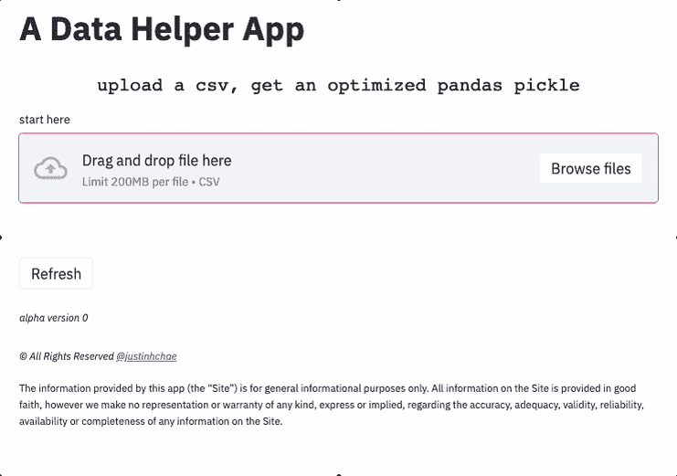

# 用 Streamlit 优化熊猫数据框架的应用程序

> 原文：<https://towardsdatascience.com/an-app-to-optimize-a-pandas-dataframe-with-streamlit-759a270a6d0e?source=collection_archive---------28----------------------->

## [理解大数据](https://towardsdatascience.com/tagged/making-sense-of-big-data)

## 使用此代码和应用程序，熊猫数据帧内存减少 50%或更多。

照片由[尤利娅·马特维延科](https://unsplash.com/@yuliamatvienko?utm_source=medium&utm_medium=referral)在 [Unsplash](https://unsplash.com?utm_source=medium&utm_medium=referral) 拍摄

> 我构建了一个简单的应用程序，它接受一个 csv 文件并返回一个内存优化的 pickle 文件以用作 Pandas data frame——这个故事分享了我使用 Streamlit 构建的经验，描述了要解决的问题，并推广了该应用程序的原型。

如果您正在处理大型 CSV 文件、Pandas 数据帧和 Python，那么这篇文章可能适合您。

【2021 年 4 月 7 日编辑:自从撰写本文以来，我已经创建并部署了一个名为 **pd-helper** 的 Python 包，它运行本文中讨论的代码的优化版本。可以搜索“pd-helper”或者`pip install pd-helper`。更多信息，请参见 [PyPi](https://pypi.org/project/pd-helper/) 。

# 问题是

在进入数据项目的核心之前，我经常花大部分时间清理、争论和管理数据。然而，随着我的数据集变得越来越大，我发现自己更加关注内存优化。换句话说，当使用 Pandas 时，我们需要使数据帧消耗尽可能少的内存。

> 如果您有一个 csv 文件，并且想要一个没有任何开销的优化的 Pandas 数据框架，该怎么办？

# 现有解决方案

有很多关于如何为解决方案编码的文章和要点，我自己也写了一些。然而，尽管文章很多，但有时代码太多，实现令人不知所措。那么，如果您有一个 csv 文件，并且想要一个没有任何开销的优化的 Pandas 数据帧，该怎么办呢？

# 代码

我在许多其他博客和资源的帮助下开源了这个应用程序；但是，app 的编排和实现是我的原创作品。对其他作品的引用与代码一起提供；然而，有两个关键资源本身值得一提。

首先，我改编了这个 [GitHub gist](https://gist.github.com/enamoria/fa9baa906f23d1636c002e7186516a7b) 的一个函数，以编程方式降低数据的数值精度，即从 float64 到 float32。我的改进包括将数据类型转换为布尔型、字符串型、日期型和/或分类型。该函数的目的是在可能或合理的情况下，将所有列更改为除 object 之外的 dtype。目标是减少 50%或更多的内存使用。

第二，我利用 [Streamlit 博客](https://discuss.streamlit.io/t/how-to-download-a-trained-model/2976)来了解如何启用一个腌数据帧的数据下载。与 CSV 文件不同，pickled 文件(除了 HDF5 之外)非常重要，因为它们如上所述保持数据转换。

如何用代码自己实现这一点。以下要点提供了一个名为 **reduce_precision()** 的函数，该函数消耗一个数据帧并返回一个内存减少的数据帧。您应该能够将它复制并粘贴到您的代码中，让它发挥一些内存魔力。

使用此功能可减少 50%或更多的内存。

# 该应用程序

最近发生了两件事。首先，我想获得构建一个有很多用户交互的应用程序的经验，比如数据上传、数据操作和数据下载。其次，我想做一些有用的东西——至少，创建一个我会经常使用的应用程序。因此，当我发现自己在为另一个项目编写优化代码时，我认为制作这个关于数据优化的应用程序可能值得一试。

**app 链接:【*编辑——由于 App 限制(每个用户限三个)，我已经在 streamlit 上更换了 App，但完整代码仍可在 GitHub 中自行运行！***

## 数据

为了测试和开发应用程序，我编写了另一个函数，它在磁盘上创建了 500，000 行和 58 MB 的完美数据作为 CSV 文件(此处有**)。我喜欢 58 MB 的大小，因为我认为它正好处于磁盘和内存都无法处理的极限。**

## **UX**

**使用 [Streamlit](https://www.streamlit.io/) 是获得纯 Python 前端体验的一种有趣方式。在这个原型中，核心功能是转换用户的输入。默认的 Steamlit 用户界面非常干净，我试图保持这种美感，让用户专注于工作流程。然而，在进行这些转换时，有些事情是用户期望看到的。**

**例如，我通常在减小数据帧的大小时过滤某些列，并通过列名检查数据类型。因此，我创建了一个响应式特性选择器，它按列过滤数据帧——最初，它由用户以后可以编辑的所有列填充。**

**此外，我想确保用户得到关于节省了多少内存的反馈，以显示进程的价值。因此，我最终创建了一个带有容器的并排布局来显示内存中的变化。**

# **gif 演示**

****

**数据助手应用的 0 版原型——来自作者 [Justin Chae](https://medium.com/u/d9cf1c8c597d?source=post_page-----759a270a6d0e--------------------------------)**

# **结果**

**原始 CSV 文件从 34 MB 的内存转换为大约 15 MB，节省了 50%以上的内存。在磁盘上，文件大小从 58MB 减少到 31mb——节省的空间不是很大，但可以通过压缩(如. BZ2 或. ZIP)来改善。**

# **丰富**

**这个原型正如我所希望的那样工作，但还有一些改进，我仍然需要工作。目前为止排名前三的问题。**

1.  ****文字处理。**在没有清除唯一数据类型的情况下应用分类数据类型。因此，“烤面包机”被视为与“烤面包机”不同的物体，并导致描述同一事物的两个类别。通过条件检查和文本处理来解决。**
2.  ****数据完整性。**在开发应用程序功能时，我从 [**文档**](https://docs.python.org/3/library/pickle.html) 中了解到取消数据酸洗有一个安全考虑。因此，由于应用程序提供了备份数据，我需要用[**【HMAC】**](https://docs.python.org/3/library/hmac.html#module-hmac)**包含某种类型的文件验证，以减轻网络安全风险。****
3.  ******特性。**我发现像 [**pandasgui**](https://pypi.org/project/pandasgui/) 这样的应用程序在探索数据框架方面非常有用，而且有一些“很好”的功能可以传达关于表格的见解。虽然该应用程序提供了一个非常简短的概述，我想包括其他有用的功能。例如，一些可视化数据的高级直方图和统计数据可能会有用。****

# ****结论****

****在这个故事中，我分享了一个原型应用程序，它解决了我几乎每天都会遇到的一个数据优化问题。该问题涉及以编程方式降低数据帧中列的精度，以便它占用更少的内存和磁盘空间。****

****为了积累 UX 设计的经验，我决定把这个编码问题变成一个 web 应用程序开发项目。现在，用户可以上传一个 csv 文件，生成一个腌熊猫数据帧，这样可以减少一半的内存消耗。通过一些额外的功能，这个应用程序可能足够有用，可以启动一个新项目或快速启动，而无需编写大量代码。****

****尽管还有待改进，但我对最初的产品很满意，也很高兴在栈的前端获得了一些经验。****

## ****这个项目的所有代码都在我的 GitHub 储存库中:****

****[https://github.com/justinhchae/app_helper](https://github.com/justinhchae/app_helper)****

## ****该应用程序:****

******[ *编辑——由于应用程序的限制(每个用户限三个)，我已经在 streamlit 上替换了应用程序，但完整的代码仍然可以在 GitHub 上自行运行！*******

## ****Python 包(2021 年 4 月 7 日编辑):****

****这段代码的更新版本现在可以在[https://pypi.org/project/pd-helper/](https://pypi.org/project/pd-helper/)或通过`pip install pd-helper`以一个方便的 Python 包的形式获得。****

> ****我很有兴趣知道这个 app 对你有没有帮助。你喜欢吗？有用吗？它应该有什么特点？在 Git 发表一个[问题或者在这里留下评论。谢谢！！](https://github.com/justinhchae/app_helper/issues)****