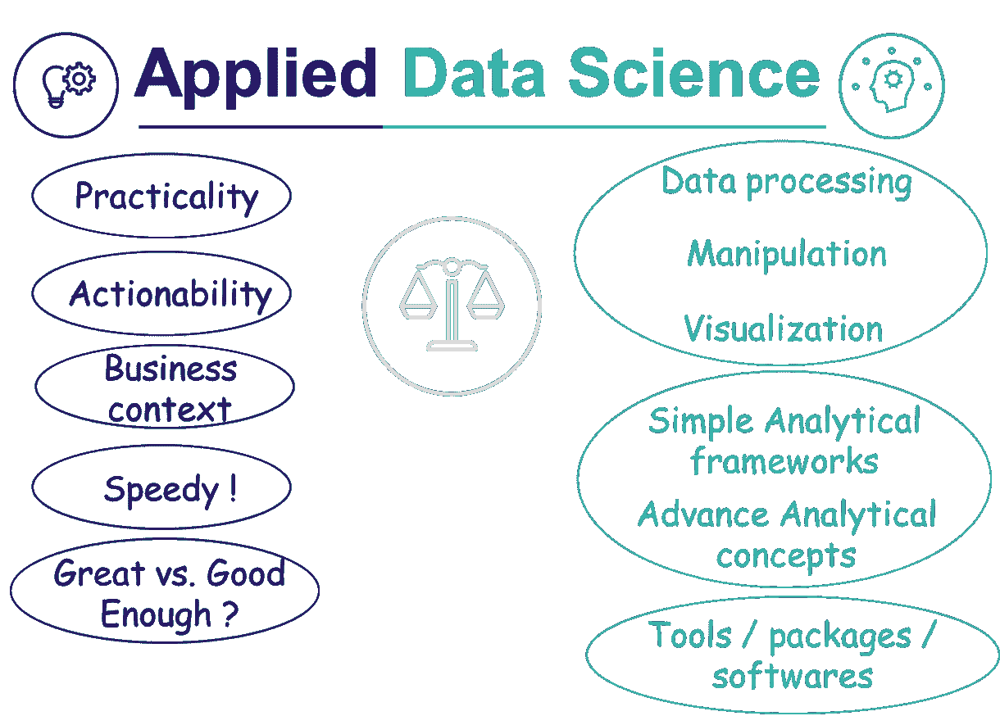

# 一位应用数据科学家:一窥他们的世界

> 原文：<https://towardsdatascience.com/an-applied-data-scientist-a-sneak-peek-into-their-world-6971c0500191?source=collection_archive---------6----------------------->

## 在数据科学世界里，一个看似新的工作简介中的“谁”、“什么”以及介于两者之间的一切。

[活动发起人](https://unsplash.com/@campaign_creators?utm_source=medium&utm_medium=referral)在 [Unsplash](https://unsplash.com?utm_source=medium&utm_medium=referral) 上的照片

数据科学是一个不断发展的领域，在过去的十年里，在运营以客户为中心的服务或业务方面，它已经从一个“**好东西**”变成了一个“**必备东西**”。与任何不断发展的领域一样，它的边界正在被突破，技能组合正在重新塑造自己，关于“数据科学家”的概念也在不断受到挑战。毫不奇怪，企业已经重新组织起来，以充分利用这一改变游戏规则的资产。

由此，我们看到了应用数据科学家的出现——这似乎是一种新的工作描述。但是是吗？它已经出现了很长时间，经历了命名约定的变化，并且仍然是业内最强大、最广泛需要的技能之一。过去我们称他们为“数据分析师”，现在我们有时称他们为“数据科学家”，或者在一些组织中专门称为“应用数据科学家”。

# 谁是应用数据科学家

简而言之，应用数据科学家是研究数据(即数据科学)的人，其目的是通过在底层数据(即数据科学)上应用理论框架(即概念框架)和算法，为商业问题提供可行的解决方案。

某人**处理、分析、建模和解释任何类型的数据**以驱动**有意义的见解**并帮助**解决业务问题** *(在大多数情况下，识别更多的数据！)*。

> 应用数据科学家处理底层数据，应用合适的技术/逻辑概念，为业务问题提供有意义的解决方案。

应用数据科学家是这样的人:

## **擅长“应用数据科学”**

成为一名优秀的数据科学家是成为一名优秀的应用数据科学家的基础。不言而喻，人们确实需要对正在处理的数据有很好的理解。此外，这通常意味着:

*   **对数据科学算法的深刻理解**从简单的基础分析到高级机器学习模型。深入了解所有这些的工作原理是有益的，但不是强制性的。与许多其他领域一样，帕累托原则在数据科学中也适用，*和* ***20%的算法*** *或方法可用于解决* ***80%的业务问题*** 。
    -了解这些算法并了解它们在行业内的可能应用非常重要。
*   **牢固掌握实施所需的平台(或工具/软件)**。如果你不知道如何在底层数据上使用数据科学算法，那么理解数据科学算法没有多大用处。这是通过具有机器学习/统计包的编码平台以及帮助我们解释和分析的可视化工具来完成的。
    -知道如何读取数据、处理数据、清理数据、处理数据、可视化数据和建模数据至关重要。

> 必须具备方法的技术知识和实施方法的能力

## **牢牢掌握领域知识**

领域知识或行业知识是应用数据科学家的关键。在分析项目期间，经常会出现需要将分析导向一个方向而不是另一个方向的时候，这就是行业知识可以帮助一个人**应用业务背景/逻辑**并引导分析的地方。一个应用数据科学家对他的领域有很好的理解。

> 领域知识对于在分析过程中做出决策有很大的帮助，并且常常是好的和伟大的区别。

## 为行动带来洞察力

如果说应用数据科学家有什么与众不同的地方，那就是在对底层数据应用数据科学技术后，对业务问题提出**可行建议**的能力。在处理完数据并在此基础上使用他们的领域知识进行上下文分析后，一位应用数据科学家通过编写一个故事将分析带入生活。一个故事，以基于潜在数据的见解的建议结束，利益相关者可以根据这些建议采取行动。

*例如，在零售业中创建客户细分是一项涉及复杂数据科学的工作。然而，为了与业务利益相关者达成一致，描述一下这些细分市场代表的客户类型会有所帮助。解决问题，如他们长什么样，他们主要属于哪个人群，他们如何购物，他们买什么等。帮助企业理解它们，将它们可视化，并使分析变得生动(非常真实)。*蛋糕上的樱桃是数据科学家可以覆盖他们的领域知识，并描述业务可以实施的策略，以激活这些群体。

> 什么？那又怎样？“现在——什么？”框架通常用于将分析带入生活，并可以帮助基于洞察力决定关键行动。

此外，应用数据科学家**与客户(或商业利益相关者)密切合作**。这是他们拥有强大的领域知识并能够将业务基本原理应用于数据科学问题的一个原因。与业务(或客户)对应方建立牢固的关系也意味着他们能够知道他们的分析的哪些部分可以采取行动以及如何采取行动。

> 发展和培养与客户的密切关系是持续提供巨大客户价值的重要因素。

## **化繁为简**

对于外行人来说，一些数据科学算法可能非常复杂。所涉及的数学可能很难掌握，如果不是数据科学背景的人，这一点更是如此。

数据科学项目的关键利益相关者通常是决策者，他们可能/可能不具备数据科学背景。这使得数据科学家的工作变得非常困难，因为获得利益相关方的认可非常重要，以确保分析引导决策过程，而不仅仅是最终成为“值得一做的研究”。这涉及到用简单的门外汉术语向关键利益相关者解释复杂科学的能力，并让他们相信分析结果。这种对复杂数学数据框架/模型的简单外行描述可能会因利益相关者的数据科学知识或理解倾向而异。

> 复杂的数据科学项目的简单性确保了它的广泛应用。

## **知道—伟大与足够好的分析**

应用数据科学家有时从事短期(2-3 天)项目，有时从事长期(数周)项目，并且经常跨越不同长度的多个项目。这种广泛的范围意味着有时利益相关者会提出快速的要求/请求，而时间是最重要的。为了实现这些目标，应用数据科学家需要对企业内的现有产品/定制解决方案有**全面的了解；并且能够依靠他们在这些场景中提供**快速解决方案**。这显然意味着与其他垂直部门*(如产品团队、数据工程团队、商业团队等)互动。)*定期进行，并记录这些工作之间的相互联系。**

> 几乎总是不希望从零开始，而是利用现有的知识库/工具集

另外，如果对时间敏感的项目意味着接一个电话，那么**是好还是不够好？**了解在何处利用同类最佳的科学算法深入分析，以及何时使用更简单的框架并及时完成分析以帮助决策。

> 当一个业务结果依赖于分析时，超时瞄准好的解决方案是好的，及时交付足够好的是好的。

# 也许不是新的，但它是不同的

在数据科学领域，应用数据科学概要文件当然不是新的概要文件。然而有一点是不同的*(..和更好的)*，是它是**更精确地定义**和**更好地区分**比一般的数据科学家的个人资料。

应用数据科学档案有很多好处:

*   显而易见的是**学习** —随着时间的推移，人们可以学习数据科学、其应用、关键工具以及开发坚实的领域知识。
*   **定义明确的角色**意味着角色中的人更加清楚组织的期望，能够设定明确的目标并实现它们。
*   由于与客户密切合作，他们经常能够看到在他们的分析背后做出的决定，并且能够很容易地看到他们工作的影响。
*   与多个项目的多个利益相关者合作，这通常意味着应用数据科学家拥有一个跨越多个垂直领域的强大网络。
*   应用数据科学家通常可以在他们职业生涯的后期，基于他们所掌握的众多技能，为自己开拓出不同的职业道路

# 应用数据科学家与研究数据科学家

一些组织只有一个“数据科学家”档案，而一些组织有两个独立的数据科学家档案——应用数据科学家和研究数据科学家(请注意，这些档案中的任何一个也可以被命名为“数据科学家”)。

***应用数据科学家和研究数据科学家有区别吗？***

这是一个价值百万美元的问题。在我看来，**在这两种情况下所需的技能组合**之间没有太大的区别，而且这两者可以在他们想要的时候**互换**。
然而，由于**工作方式的本质或组织的期望**，它们之间有时会有一条**细线**。

> 但是，必须再次强调的是，这两种技能没有理由是不同的。

让我们看看这条**细线**，以便更好地理解它:

**数据科学技能:**
这两个配置文件中的数据科学技能没有理由不同。组织期望研究数据的科学家深入研究问题*(即* ***垂直深度*** *很重要)*，而应用数据的科学家则期望对更广泛的数据科学问题和解决方案有更全面的了解*(即* ***水平覆盖*** *更有价值)*

*   由于他们的工作性质，应用数据科学家可能不知道所有的数据科学算法，而研究人员或多或少会有透彻的理解。
*   应用型专家更擅长 20%概念的广泛应用，这些概念可以帮助解决他们领域中 80%的数据科学问题。
*   预计两者都将处理复杂的高级分析、机器学习、Python 等。；然而，应用数据科学家将始终牢记实际应用，而研究数据科学家将更深入地研究问题。

**客户互动技巧:**
还是那句话，这些不一样没什么特别的原因。这两种模式都要求对业务问题有详细的了解，能够将它们转化为数据科学问题，并为它们提供数据支持的解决方案。
然而，由于工作的性质，应用数据科学家将更接近利益相关者，因此将获得对业务目标**更广泛/更深入的了解**，使他们能够从分析中得出可操作的结果

在我看来，有两个独立的工作简介是有益的，并给个人提供了根据自己的愿望选择深入或广泛的机会。显然，对员工有更清晰的期望对组织和员工都非常有帮助。

# 摘要

**有趣、有活力、有回报** —当我想到当今世界的应用数据科学时，这些词会浮现在我的脑海中。

应用数据科学| *(图片由作者提供)*

→它似乎在**适用的技术专长**和**业务知识**之间达到了完美的平衡，以完成有影响力的工作。

## 保持联系..

如果你喜欢这篇文章并且对类似的文章感兴趣 [***在 Medium 上关注我***](https://medium.com/@deepakchopra2911) 、 [***加入我的邮件列表***](https://medium.com/subscribe/@deepakchopra2911) 和*(..如果你已经不是了..)*跳上去成为 [***中的一员***](https://medium.com/@deepakchopra2911/membership)*获取上千篇有帮助的文章。*(如果你使用以上链接，我将获得你 50%的会员费)**

***..不断学习，不断成长！***