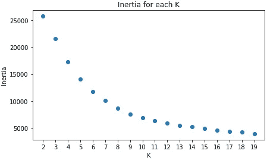

# 一种选择 K-均值聚类数的方法

> 原文：<https://towardsdatascience.com/an-approach-for-choosing-number-of-clusters-for-k-means-c28e614ecb2c?source=collection_archive---------7----------------------->

## 所建议的方法考虑了内部距离和聚类数目之间的一般权衡，并自动选择聚类数目

弗兰基·查马基在 [Unsplash](https://unsplash.com/s/photos/data-clusters?utm_source=unsplash&utm_medium=referral&utm_content=creditCopyText) 上拍摄的照片

当我们使用聚类算法时，选择聚类的数量总是一项具有挑战性的任务。虽然有一些现有的方法可以帮助完成这项任务，但它们通常是单独使用，以便做出决定。此外，您可能还需要根据方法的结果手动选择最终的集群数量。

在这里，我建议一种方法，它考虑了内部距离和集群数量之间的折衷，并自动选择集群的数量。

# 现有方法

在本节中，您可以找到选择集群数量的两种最常见的方法。各有各的优势和局限。

## 轮廓分析

这是一个众所周知的方法，也提供了非常酷的可视化。它允许我们解释和验证集群内的一致性。完整的 Python 实现和解释可以在 scikit-learn 页面中找到:

 [## 在 KMeans clustering - scikit-learn 上使用剪影分析选择聚类数…

### 剪影分析可用于研究所得聚类之间的分离距离。剪影情节…

scikit-learn.org](https://scikit-learn.org/stable/auto_examples/cluster/plot_kmeans_silhouette_analysis.html) 

这个 scikit-learn Python 代码产生了下面的可视化效果，帮助我们理解所选择的集群数量是否是一个好的选择。

这种方法的一个缺点(在链接中也有提到)是，它可能会产生多个集群，所以您需要自己从不同的选项中进行选择。

## 惯性和肘法

惯性是样本到它们最近的聚类中心的平方距离的总和。我们希望这个数字尽可能小。但是，如果我们选择 K 等于样本数，我们将得到惯性=0。这是我们能够达到的最小惯性值，但是我们没有达到将数据聚类到最佳数量的聚类中的目标。
惯性值随着聚类数的增加而减少——所以我们需要手动选择 K，同时考虑惯性值和聚类数之间的权衡。为此，我们通常使用肘方法，我们选择惯性图中的肘点。之后，惯性值的改善不显著。

惯性图

基于这种方法，选择的 K 大约为 8–11，但是需要手动选取。

这里有一篇很好的文章总结了这种方法:

 [## k-均值聚类:从 A 到 Z

### 关于 K-均值聚类你需要知道的一切

towardsdatascience.com](/k-means-clustering-from-a-to-z-f6242a314e9a) 

# 建议的接近比例惯性

上述两种方法需要您手动决定集群的数量。基于我从这些方法中学到的东西，我开发了一个自动选择 K(聚类数)的过程。

所建议的方法考虑了每个可能的 K 的惯性值，并通过惩罚参数对其进行加权。该参数表示惯性和簇数量之间的权衡。

我们没有单独使用惯性，而是计算了它的加权版本:

比例惯性公式

*   惯性-样本到其最近的聚类中心的距离的平方和
*   阿尔法-手动调整的因素，给予惩罚的集群数量
*   惯性(K=1)-所有数据点都在同一聚类中的基本情况的惯性

比例惯性图

Alpha 是手动调整的，因为在我看来，集群数量的损失是一个商业决策，应该纳入分析中。

使用缩放的惯性，选择的 K 是明显的，并且可以自动完成。在上述情况下，K=9。

# 密码

以下函数是在并行计算中为每个 K 计算调整后的惯性。非并行选项在下一段代码中。

非平行选项:

# 示例-如何使用

该函数返回最佳 k 值和一个数据框，该数据框包含所有可能的 k 值的所有调整惯性值:

返回的结果

# 关闭

建议的解决方案对我过去遇到的各种业务问题非常有效。请让我知道它是如何为你工作的，如果你认为可以做更多的调整来改善它。

非常感谢 Oshry Ben-Harush 帮助我开发了这种方法，并感谢 Noga Gershon Barak 和 T2 Noam Kalush 提供的技术反馈以及对本文的校对和评论。

# 附加阅读

很好的指南，详细介绍了 k-means 算法以及在 Python 中的使用

 [## Python 中的 K-Means 聚类:实用指南-真正的 Python

### 在本教程中，您将了解到:聚类是一组用于将数据划分成组或簇的技术…

realpython.com](https://realpython.com/k-means-clustering-python/)