# 构建 Spotify 算法的尝试

> 原文：<https://towardsdatascience.com/an-attempt-to-construct-spotify-algorithm-9ac21ae1ecfb?source=collection_archive---------24----------------------->

## 使用最近邻方法实现基于内容的过滤以开发推荐系统

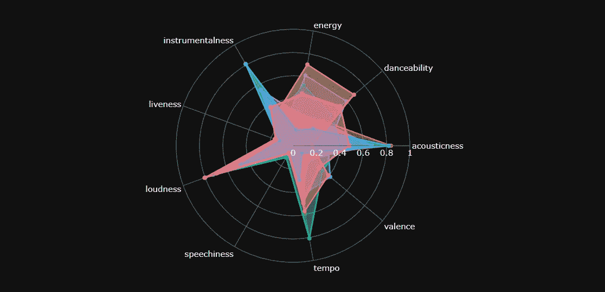

音乐聚类分析-作者雷达图

# 介绍

在本文中，我将尝试使用最近邻算法构建一个 Spotify 推荐系统模型，并使用 Spotify 进行数据收集。这项研究将是一个无人监督的机器学习项目。

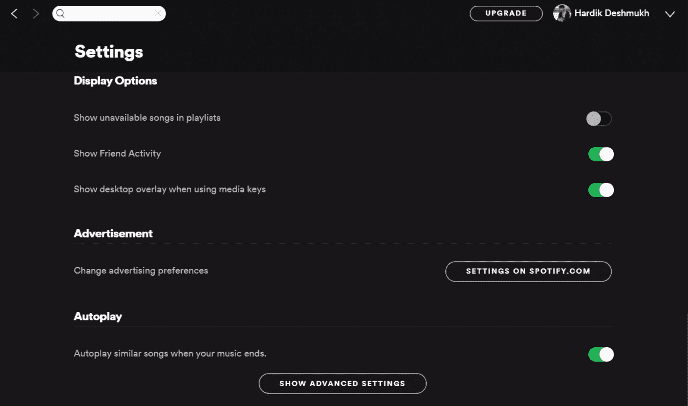

作者的 Spotify 桌面设置图片

你在周日早上醒来很晚，在 Spotify 上播放你选择的歌曲，然后去浴室。当歌曲完成时，音乐播放器不会就此停止，而是播放一大堆类似的歌曲，除非你关闭自动播放，否则不会让你以一种奇怪的方式从浴室出来，逃离潮湿的地板，并改变音乐。好吧，我的观点是，你曾经想知道 Spotify 如何在大多数时候推荐一套近乎完美的歌曲。Spotify 前机器学习工程师克里斯·约翰森分享了一场演讲，对 Spotify 推荐系统及其架构的发展提供了大量见解。

克里斯·约翰森在 Spotify 上的算法音乐推荐

## **内容** - **基础过滤**

这是一种基于项目相似性的推荐系统。一种方法是利用产品的特性。例如，假设您刚刚完成了一个网络系列，现在您想观看一个类似的网络系列，在这种情况下，基于内容的过滤是如何工作的，它会建议其他网络系列具有与所观看的相似的功能。为了计算这种相似性，我们将采用基于邻域的方法。

## **基于邻域的方法**

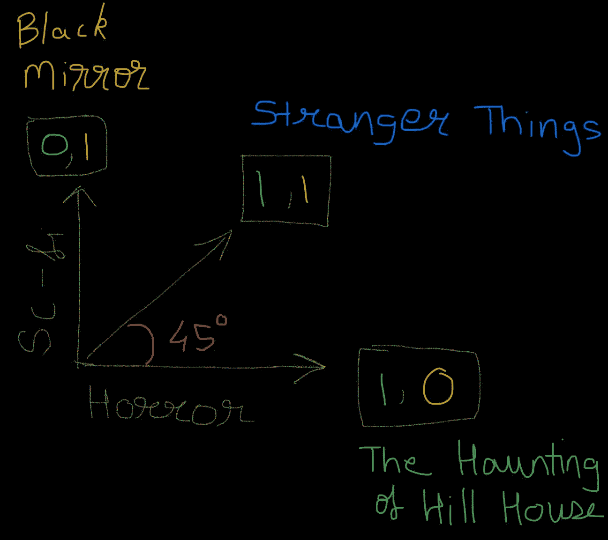

余弦相似性

它有助于量化对象之间的相似性。可以使用余弦的相似性度量来计算相似性。在这里，我展示了如何衡量两个网络系列之间的相似性。x 轴和 y 轴分别反映科幻和恐怖类型。它的存在和不存在分别由值 1 和 0 给出。以这种方式，可以在稀疏矩阵中表达特征，该稀疏矩阵作为输入数据提供给我们的最近邻模型。

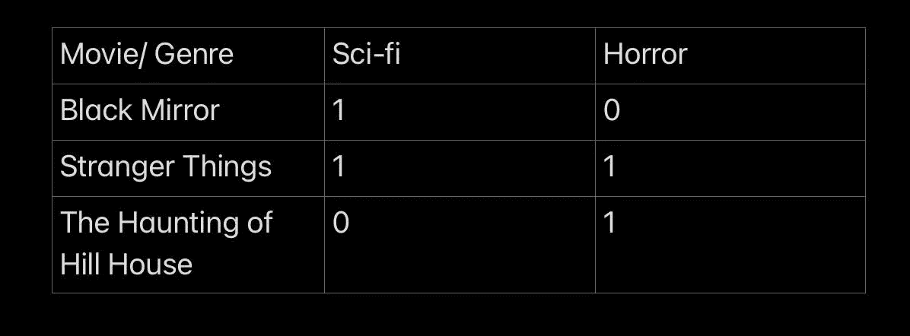

稀疏矩阵

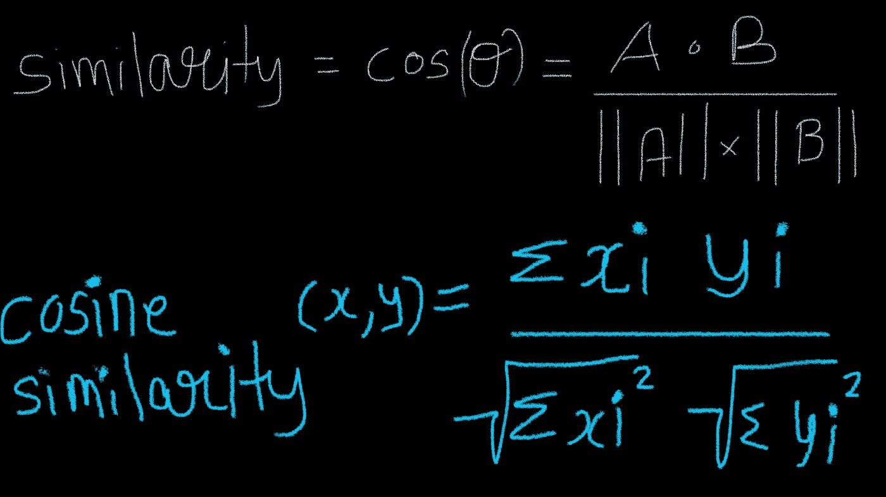

余弦相似公式

为了计算距离/相似性，余弦公式如上所示。一旦计算出相似性/距离，我们就可以搜索最近的 K 个具有相似特征的 Web 系列。

# 数据集

数据集是一个***4358 首曲目*** 的播放列表，累计播放时间是 ***273 小时*** ，而且因为是协作播放列表，所以还在增加。这个播放列表由几乎 ***900 个子流派*** 组成，范围从古典到说唱等等。

> 这个播放列表/数据集是在我的朋友们的帮助下制作的:[阿达什·米什拉](https://www.linkedin.com/in/adarsh9923/)，[阿什温·拉古南丹](https://www.linkedin.com/in/ashwin-raghunandan-8160b1188/)，[苏亚迪普·马拉](https://www.linkedin.com/in/souradeep-malas-49936b1a7/)，[瓦龙·维诺德](https://www.linkedin.com/in/varun-vinod-0b09601a7/)，[丁奇·米什拉](https://www.linkedin.com/in/dinky-mishra-161b641aa/) & [尼兰詹·戈斯瓦米](https://www.linkedin.com/in/neelanjan-goswami/)。非常感谢各位！

“数据科学”播放列表(数据集来源)

在 Spotipy 的帮助下，我们可以从这个庞大的数据集中提取元数据和其他有用的属性。

## 要提取的有用特征列表:

**[A]元数据**

1.  uri——该曲目的唯一 Spotify URI。
2.  id —曲目的唯一 Spotify ID。
3.  流行度——专辑的流行度。该值将介于 0 和 100 之间，100 是最受欢迎的。流行度是根据专辑中各首歌曲的流行度计算出来的。
4.  名称—轨道的名称
5.  duration_ms —以毫秒为单位的音轨长度
6.  艺术家—艺术家的姓名
7.  release_date —专辑首次发行的日期，例如“1981–12–15”。根据精度，它可能显示为“1981”或“1981–12”。
8.  专辑—曲目所属专辑的名称
9.  艺术家 _ 流派—艺术家的流派

**【B】音频特性**

1.  声学—[ 0–1]音轨是否声学的置信度。
2.  可跳舞性—[0–1]描述了基于音乐属性(包括速度、节奏、稳定性、节拍强度和整体规律性)的轨道适合跳舞的程度。
3.  能量—[0–1]强度和活动的感知度量。充满活力的音轨感觉起来很快，很响，很嘈杂(例如死亡金属:高能，巴赫前奏曲:低能)
4.  乐器性—[0–1]预测轨道是否不包含人声(高于 0.5 的值表示乐器轨道，而说唱歌曲的分数接近 0)。
5.  活跃度—[0–1]检测录像中是否有观众。
6.  响度—[-60–0 dB]整个轨道的平均音量。
7.  speech iness—[0–1]检测音轨中是否存在口语单词(高于 0.66 的值描述音轨可能完全由口语单词组成，0.33–0.66 描述音轨可能包含音乐和语音，低于 0.33 的值最有可能代表音乐和其他不像语音的音轨)。
8.  化合价—[0–1]描述了轨道所传达的音乐积极性。高价曲目听起来更积极(例如，快乐、愉快、欣快)，而低价曲目听起来更消极(例如，悲伤、沮丧、愤怒)。
9.  调式(Mode)——调式表示轨道的调式(大调或小调),其旋律内容来源于音阶的类型。大调用 1 表示，小调用 0 表示。
10.  速度—轨道的总体估计速度，单位为每分钟节拍数(BPM)。在音乐术语中，速度是给定作品的速度或节奏，直接来源于平均节拍持续时间。
11.  time_signature —轨道的估计整体拍号。拍号(拍子)是一种符号约定，用于指定每个小节(或小节)中有多少拍。
12.  调—轨道所在的调。整数映射到使用标准[音高](https://en.wikipedia.org/wiki/Pitch_class)的音高

关于这些功能的更多信息: [Web API 参考|面向开发者的 Spotify】](https://developer.spotify.com/documentation/web-api/reference/#endpoint-get-audio-features)

## 挑战

上面提到的[B]音频功能是制作 Spotify 算法所必需的功能。但是它们不足以建立一个有效的模型，因为有一首英语歌曲和一首印地语歌曲有相似的音频特征。在这种情况下，这些音轨可能会使模型互相推荐，这并不表示推荐模型是有效的。因此，要解决这个挑战，潜在的解决方案是获取曲目的流派，但是 Spotipy 没有任何曲目的流派。Spotipy 只提供艺术家和专辑的流派。但是大多数时候专辑的流派是不可用的(如果还没有分类，数组是空的)。所以，最终，我们必须选择适合每个艺术家的艺术家类型。

# 进口

```
import pandas as pd
import numpy as npimport spotipy
from spotipy.oauth2 import SpotifyClientCredentialsfrom IPython.display import clear_output
import matplotlib.pyplot as plt
import plotly.graph_objects as gofrom kneed import KneeLocator
from sklearn.preprocessing import MinMaxScaler
from scipy.sparse import csr_matrixfrom sklearn.neighbors import  NearestNeighbors
from sklearn.cluster import KMeans
```

# 资格证书

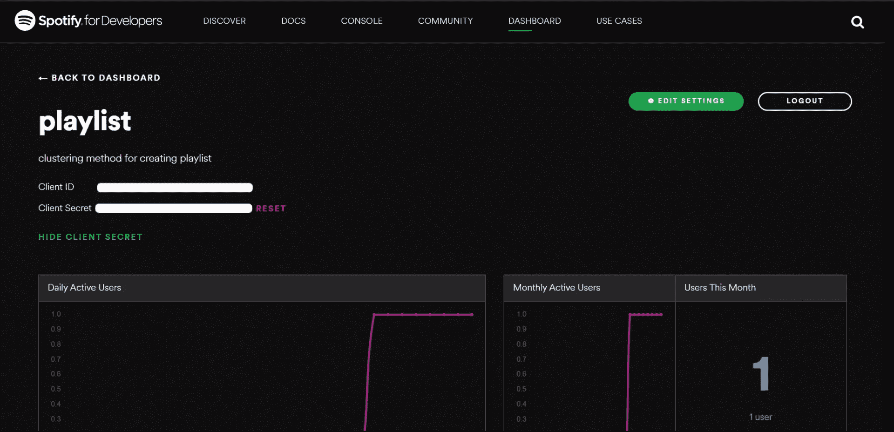

Spotify 开发者仪表盘应用

为了访问数据提取，我们需要用我们的 API 凭证生成一个令牌。你需要在他们的[网站](https://developer.spotify.com/)上注册开发者账户来获得你的令牌。建立帐户后，您需要在仪表板中创建一个应用程序，该应用程序会提供您的*客户 ID* 和*客户密码*。

```
#Define ConstantsCLIENT_ID = '####'
CLIENT_SECRET = '####'
username = '####'
playlist_id = 'spotify:playlist:0KY6lRcsNYtf6pHPfXDkFN'
```

我们将从共享选项中获得播放列表 id，其中显示复制 Spotify URI。


```
#Get Access Tokencredentials = SpotifyClientCredentials(client_id=CLIENT_ID,client_secret=CLIENT_SECRET)
token = credentials.get_access_token()
sp = spotipy.Spotify(auth=token)
```

# 提取 Spotify 数据

下面的代码从 spotipy 数据库中提取信息，并将所有信息存储在将用于创建 DataFrame 的列表中。

```
#Initiating lists to store features
uri,id,popularity,name,duration_ms,artist,year,album =[],[],[],[],[],[],[],[]
acousticness,danceability,energy,instrumentalness,key,liveness,loudness,mode,speechiness,tempo,time_signature,valence = [],[],[],[],[],[],[],[],[],[],[],[]
artist_genre = []a=0playlist_tracks = []
offset=0# To surpass extracting limit of 100
while True:
    results = sp.user_playlist_tracks(username, playlist_id, offset=offset)
    playlist_tracks += results['items']
    if results['next'] is not None:
        offset += 100
    else:
        breakfor track_meta in playlist_tracks:#Meta Data
  uri.append(track_meta['track']['uri'])
  id.append(track_meta['track']['id'])
  popularity.append(track_meta['track']['popularity'])
  name.append(track_meta['track']['name'])
  duration_ms.append(track_meta['track']['duration_ms'])
  artist.append(track_meta['track']['artists'][0]['name'])
  year.append(track_meta['track']['album']['release_date'])
  album.append(track_meta['track']['album']['name'])#Audio Features
  track_feature = sp.audio_features(track_meta['track']['uri'])[0] acousticness.append(track_feature['acousticness'])
  danceability.append(track_feature['danceability'])
  energy.append(track_feature['energy'])
  instrumentalness.append(track_feature['instrumentalness'])
  key.append(track_feature['key'])
  liveness.append(track_feature['liveness'])
  loudness.append(track_feature['loudness'])
  mode.append(track_feature['mode'])
  speechiness.append(track_feature['speechiness'])
  tempo.append(track_feature['tempo'])
  time_signature.append(track_feature['time_signature'])
  valence.append(track_feature['valence'])#Genre
  resultd = sp.search(track_meta['track']['artists'][0]['name'])
  try:
    trackd = resultd['tracks']['items'][0]
    artist_meta = sp.artist(trackd["artists"][0]["external_urls"]["spotify"])
    artist_genre.append(artist_meta["genres"])
  except:
    artist_genre.append([])
  finally:
    a = a+1
    clear_output()
    print(a)
```

创建数据框架

```
df = pd.DataFrame(list(zip(name,album,artist,year,popularity,duration_ms,uri,id,acousticness,danceability,energy,instrumentalness,
                           key,liveness,loudness,mode,speechiness,tempo,time_signature,valence,artist_genre)),

                  columns=['name','album','artist','year','popularity','duration_ms','uri','id','acousticness','danceability','energy','instrumentalness',
                           'key','liveness','loudness','mode','speechiness','tempo','time_signature','valence','artist_genre']
                  )df['playlist'] = sp.user_playlist(username, playlist_id.split(':')[2])['name']df = df.drop_duplicates(subset='id', keep="first")
df.reset_index(inplace=True,drop=True)df.head(3)
```

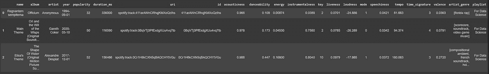

# 特征抽出

正如您在艺术家流派栏中看到的，每个艺术家都有一个或多个列表形式的流派。下面的代码列出了所有流派的唯一列表。

```
genre_list = []for i in df['artist_genre']:
  for j in i:
    if j not in genre_list:
      genre_list.append(j)print(pd.Series(genre_list).nunique())905
```

正如我们所看到的，有 905 个子流派可用。现在我们使用这些类型作为我们数据框架的离散特征。

```
list_of_row,row=[],[]for i in df['artist_genre']:for j in genre_list:
    if j not in i:
      row.append(0)
    else:
      row.append(1)list_of_row.append(row)
  row=[]#Checking out the Shape
print(len(list_of_row))
print(len(list_of_row[0]))3773 
905#Creating DataFrame of genre
df_genre = pd.DataFrame(list_of_row,columns=genre_list)#Copy id column for merging DataFrame
df_genre['id'] = df['id'].copy()
df_genre.head()
```

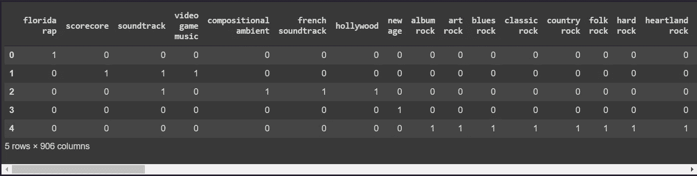

df _ 流派

```
#View some columnsdf_genre.columnsIndex(['florida rap', 'scorecore', 'soundtrack', 'video game music',        'compositional ambient', 'french soundtrack', 'hollywood', 'new age',        'album rock', 'art rock',        ...        'mumbai indie', 'pakistani indie', 'indian lo-fi', 'indian folk',        'pop r&b', 'horror synth', 'british post-rock', 'cosmic post-rock',        'british orchestra', 'id'],       dtype='object', length=906)
```

基于列“id”合并两个数据帧

```
merged_df = pd.merge(df, df_genre, on='id')
```

# 分析

```
merged_df.info()<class 'pandas.core.frame.DataFrame'> Int64Index: 3773 entries, 0 to 3772 Columns: 927 entries, name to british orchestra dtypes: float64(9), int64(910), object(8) memory usage: 26.7+ MB
```

## 使聚集

文章的这一部分深受 K 均值聚类和 PCA 的影响，通过相似的音频特征对音乐进行分类| Sejal Dua | 2020 年 12 月|走向数据科学

在我们创建基于音频特征的聚类之前，我们需要确定有多少个聚类将适合对我们的播放列表进行聚类。为此，我们将使用 WCSS。这将使我们能够使用肘过程找到 K-Means 的最佳聚类数。

```
# get within cluster sum of squares for each value of k
wcss = []
max_clusters = 200
for i in range(1, max_clusters):
    kmeans_cluster = KMeans(i, init='k-means++', random_state=42)
    kmeans_cluster.fit(df[['acousticness','danceability','energy','instrumentalness','liveness','loudness','speechiness','valence']])
    wcss.append(kmeans_cluster.inertia_)

# programmatically locate the elbow
n_clusters = KneeLocator([i for i in range(1, max_clusters)], wcss, curve='convex', direction='decreasing').knee
print("Optimal number of clusters", n_clusters)

# visualize the curve in order to locate the elbow
fig = plt.figure(figsize=(20,8))
plt.plot(range(1, max_clusters), wcss, marker='o', linestyle='--')
# plt.vlines(n_clusters, ymin=0, ymax=max(wcss), linestyles='dashed')
plt.xlabel('Number of Clusters', fontsize=18)
plt.ylabel('Within Cluster Sum of Squares (WCSS)', fontsize=18)
plt.xticks(fontsize=16)
plt.yticks(fontsize=16)
plt.show()Optimal number of clusters 8
```

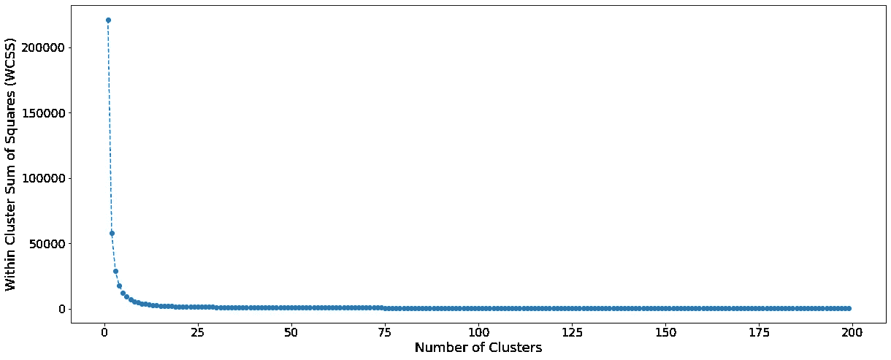

所以肘部在第八组

应用 K 均值和最小最大缩放来可视化

```
kmeans = KMeans(n_clusters=n_clusters, init='k-means++', random_state=42,)
kmeans.fit(df[['acousticness','danceability','energy','instrumentalness','liveness','loudness','speechiness','tempo','valence']])
scaled_df = df[['acousticness','danceability','energy','instrumentalness','liveness','loudness','speechiness','tempo','valence']].copy()scaler = MinMaxScaler() 
scaled_values = scaler.fit_transform(scaled_df) 
scaled_df.loc[:,:] = scaled_valuesscaled_df['Cluster'] = kmeans.labels_
```

可视化集群

```
fig = go.Figure()angles = list(scaled_df[['acousticness','danceability','energy','instrumentalness','liveness','loudness','speechiness','tempo','valence']].columns)
angles.append(angles[0])layoutdict = dict(
            radialaxis=dict(
            visible=True,
            range=[0, 1]
            ))for i in range(n_clusters):
    subset = scaled_df[scaled_df['Cluster'] == i]
    data = [np.mean(subset[col]) for col in subset[['acousticness','danceability','energy','instrumentalness','liveness','loudness','speechiness','tempo','valence']].columns]
    data.append(data[0])
    fig.add_trace(go.Scatterpolar(
        r=data,
        theta=angles,
        fill='toself',
        name="Cluster " + str(i)))

fig.update_layout(
        polar=layoutdict,
        showlegend=True,template='plotly_dark'
        )
fig.show()
```

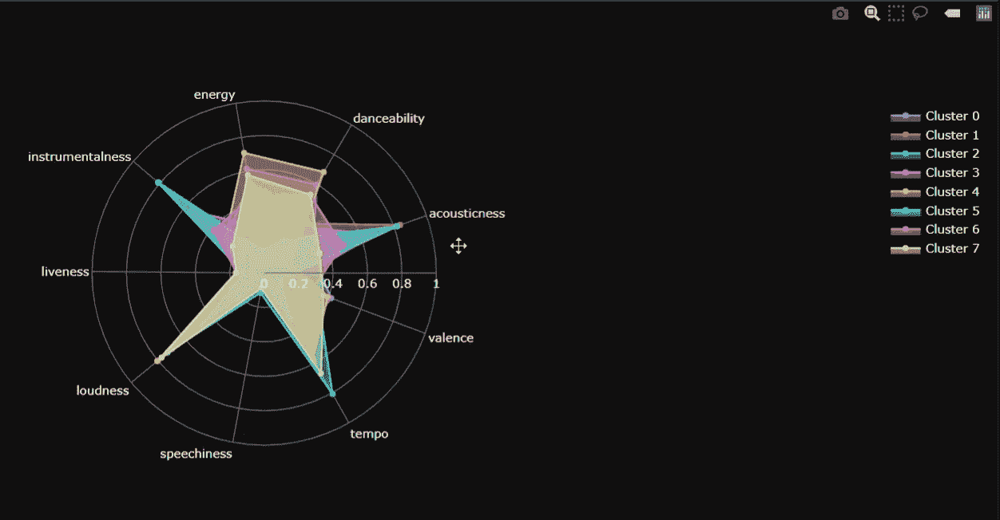

星团的雷达图分析

正如你所看到的，群集 5 有更多的乐器和声音，这意味着它包括更多的环境电影配乐。我们可以用这种方式评估其余的集群。

# 数据预处理

将数据转换为将输入到最近邻算法的稀疏矩阵。

```
#List of columns to be used as features
list1=['acousticness','danceability','energy','instrumentalness','liveness','loudness','speechiness','tempo','valence']list2=list(df_genre.columns)dataset = merged_df[list1+list2].copy()#set index
dataset.set_index('id',drop=True,inplace=True)
```

创建稀疏矩阵

```
dataset_matrix = csr_matrix(dataset.values)
```

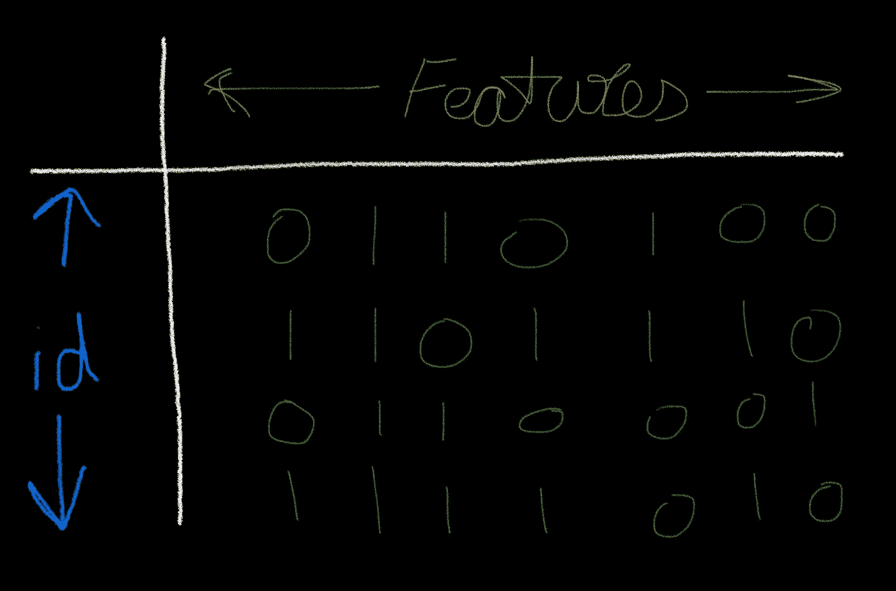

稀疏矩阵

# 最近邻

实施项目的大脑。

## 模型拟合

```
model_knn = NearestNeighbors(metric='cosine', algorithm='brute')
model_knn.fit(dataset_matrix)
```

## 推荐系统

我们需要设置 n 值来获得一定数量的推荐。

```
#Enter Track URI here for which you want Recommendations
search_uri = 'spotify:track:2LVr6WQ6W7B3i8CeWFjcLP'query_index = df[df['uri']==search_uri].index.values[0]distances, indices = model_knn.kneighbors(dataset.iloc[query_index,:].values.reshape(1,-1),n_neighbors = 10 )for i in range(0,len(distances.flatten())):
#  if distances.flatten()[i] <= 0.0001:if i == 0:
      print('Recommendations for {0}:\n'.format(df[df['id']==str(dataset.index[query_index])]['name'].values[0]))
    else:
      print('{0} : {1} by {3}, with distance of {2}'.format(i,
                                                     df[df['id']==str(dataset.index[indices.flatten()[i]])]['name'].values[0],
                                                     distances.flatten()[i],
                                                     df[df['id']==str(dataset.index[indices.flatten()[i]])]['artist'].values[0]))
```

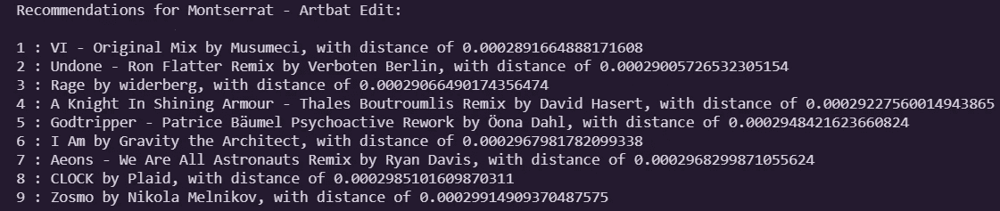

# 测试

为下面的测试选择的所有歌曲都来自这个播放列表，并且推荐的曲目将仅来自这个播放列表(因为这是我们模型的整个数据集)。

对于数据科学播放列表(数据集源)

## 测试— 1

测试模型的时间到了，首先我会得到我最喜欢的歌曲的推荐，蒙特塞拉特艺术编辑，一种基于电子音乐的流派的推荐

## 测试— 2

推荐 Baarishein，基于印地语原声的流派

## 测试— 3

推荐基于说唱的流派《知更鸟》

## 测试— 4

推荐基于视频游戏原声音乐的流派《战地一号》

## 测试— 5

推荐卢克和莱娅——出自《星球大战:绝地归来》，这是一部根据电影配乐改编的电影

## 测试— 6

宽大推荐，以钢琴独奏为基础的体裁

# 结论

如果你觉得一些推荐没有达到预期，那么我相信这个挑战可以通过用更多种类的歌曲填充播放列表来克服，并且如果 Spotipy 开始为歌曲和专辑提供流派，那么我认为这些事情可以帮助我们使模型更有效地工作。总之，大多数歌曲都得到了类似的推荐，如印度原声歌曲、钢琴独奏和家庭音乐，考虑到这样一个小的手工数据集，这似乎是一个很大的进步。

# 谢谢你留下来！！

如果你喜欢这篇文章，你可能想看看我的另一篇 Spotify 排行榜分析文章。[ [链接](https://smarthardik10.medium.com/spotify-top-charts-analysis-a6c4a4c10c73)

# 关注我的社交活动

链接到我关于这个项目的笔记本:【colab.research.google.com 

我的 LinkedIn 个人资料:【https://www.linkedin.com/in/hardik-deshmukh/ 

我的其他中型文章: [Hardik Deshmukh —中型](https://smarthardik10.medium.com/)

我的 GitHub:[https://github.com/smarthardik10](https://github.com/smarthardik10)

# 参考

[1] [K-Means 聚类和 PCA 通过相似的音频特征对音乐进行分类| Sejal Dua | 2020 年 12 月|走向数据科学](/k-means-clustering-and-pca-to-categorize-music-by-similar-audio-features-df09c93e8b64)

[2][https://youtu.be/kccT0FVK6OY](https://youtu.be/kccT0FVK6OY)

[3] [基于内容的推荐—第 3 部分| rakesh 4 real | Fnplus Club | Medium](https://medium.com/fnplus/content-based-recommendations-ffb221931485)