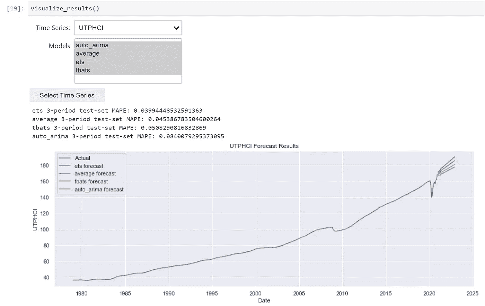

# 利用 Jupyter 部件的自动预报方法

> 原文：<https://towardsdatascience.com/an-automated-forecast-approach-utilizing-jupyter-widgets-142b6c51d314?source=collection_archive---------31----------------------->

## 创建用户友好的代码和小部件来访问和比较预测结果


马库斯·斯皮斯克在 [Unsplash](https://unsplash.com?utm_source=medium&utm_medium=referral) 上的照片

你有几个系列来预测未来 24 个月，比如说 50 到 150 个月。你没有时间为每一个都找到完美的模型，所以你需要某种一般化的方法。你可以写一个循环，应用一个安全的，虽然不是很动态的方法，比如简单的指数平滑，移动平均，或者其他。但是你需要更精确一点的东西来提高你的准确度，而不需要投入大量的时间。

在过去的几年里，我在一些场合遇到过同样的问题。我开发了一个现在经常使用的 Python 模块。源代码如下:

[](https://github.com/mikekeith52/AllStatesForecast) [## mikekeith52/AllStatesForecast

### 构建预测对象，为我们公司想要扩展的许多时间序列创建易于访问的预测…

github.com](https://github.com/mikekeith52/AllStatesForecast) 

我以前在自动预测季节性的背景下写过这个模块。你可以在这里看到文章。我假设你正在使用 Jupyer Lab 或 Jupyter Notebook，如果你想继续下去的话。

# **数据格式化和加载**

首先，让我们将观察到的数据加载到预测器对象中。我们可以使用 pandas 数据框架，其中每一列都是要预测的序列，行索引是 pandas 日期时间周期。在这个例子中，我们的数据是每月的。这种格式的伪代码如下所示:

现在，我们有了一个带有名称空间预测的字典，其中每个键是来自我们的 pandas 数据帧的一个列标签，值是为预测未来 24 个月而加载的预测器对象。同样的概念应该适用于任何粒度，无论是每天、每小时、每周等等。

# 预测

接下来，我们将选择要应用的预测。这需要我们的时间序列的一些知识，以及哪些模型可能捕捉到我们的序列的特点。幸运的是，预测器模块为您提供了许多模型选项，包括许多自动应用程序，以找到最佳超参数。这些包括但不限于:

*   ARIMA(包括 SARIMA、ARIMAX 和 SARIMAX)
*   指数平滑(包括霍尔特温特斯、ETS 和 TBATS)
*   神经网络自回归
*   向量自动回归

对于这个例子，为了能够使用实际数据，我将选择两个序列进行预测:犹他州经济巧合指标和佛罗里达州巧合指标，因为它们很容易从圣路易斯美联储网站上提取，而且因为它们是我最近居住过的两个州。3 个月的样本外测试集似乎是合理的，因为我们正处于衰退之中，使用比这长得多的时间段并不能真正表明最有可能捕捉最近趋势的预测。我将使用 ARIMA、TBATS 和 ETS，因为它们自动处理与平稳性相关的问题，并设置自己的超参数。我还将使用表现最好的两个模型的平均值。代码如下:

# 可视化结果

现在，让我们看看结果。显然，我的例子只针对与一个州的经济相关的两个序列，但是这个解决方案应该可以扩展到许多序列和不同的业务环境。我建议，在获得结果后，逐一查看每个系列，以确保至少有一个预测看起来合理，样本外误差率较低。下面给出了使用 Jupyter 小部件实现这一点的简单方法。

首先，让我们安装一些要求:

```
pip install ipywidgets==7.5.1
conda install -c conda-forge nodejsjupyter nbextension enable --py widgetsnbextension
```

如果您使用 Jupyter Lab:

```
jupyter labextension install @jupyter-widgets/jupyterlab-manager
```

让我们也导入所有必需的库:

```
from ipywidgets import widgets
from IPython.display import display, clear_output
import matplotlib.pyplot as plt
import seaborn as sns
```

## 查看所选系列的多个型号

现在，创建小部件。我们将使用下拉菜单深入到单个系列，并使用一个表来选择一个、一个或几个我们想要绘制的模型。选择后，我们使用一个按钮来完成选择。我们必须告诉笔记本显示小部件的所有三个部分——下拉菜单、表格和按钮(以及输出)。代码如下所示:

```
models = ('auto_arima','tbats','auto_hwes','average')ts_dropdown = widgets.Dropdown(options=mm.keys(), description = 'Time Series:')mo_select = widgets.SelectMultiple(options=sorted(list(set(all_models))),description='Models',disabled=False)button = widgets.Button(description="Select Time Series")output = widgets.Output()      
display(ts_dropdown, mo_select, button, output)
```

如果您照原样运行这段代码，它将为您输出一些小部件，这意味着将出现一个下拉列表、一个表格和一个按钮。但是你的选择没有任何作用。下一段代码告诉您的笔记本对用户选择做一些事情:

```
def on_button_clicked(b):
  ts_selection = ts_dropdown.value
  mo_selection = list(mo_select.value)
  with output:
    clear_output()
    forecasts[ts_selection].plot(models=mo_selection, print_mapes=True, plot_fitted=True)button.on_click(on_button_clicked)
```

我们可以将这两个代码段放在一个函数中:

现在，我们有了漂亮的输出，可以在我们的时间序列之间轻松切换:



作者图片

您可以使用标有“时间序列”的下拉菜单在预测的每个序列之间切换，还可以关闭和打开绘制模型。根据您选择在系列中使用的模型数量，您可以对这种格式进行一些调整(例如，如果您选择应用一组模型，使用前 n 名模型的下拉列表可能会更有效地快速找到您的最佳表现模型)，但这种基本的视觉结构允许我快速评估自己的结果。

## 可视化模型性能

假设您还对直观地比较每个系列的每个模型的评估准确度感兴趣。为此，您可以使用类似的小部件方法。代码如下:

输出看起来很惊人。


作者图片

这显示了给定系列的模型误差率之间的相对差异。我并不总是选择具有最佳误差度量的模型作为要实现的模型——这也取决于哪一个看起来最合理。但是，使用预测的可视化表示以及模型之间的相对误差率的可视化表示，我通常可以做出好的决定，并且我的预测已经通过使用这种方法的真实数据证明是准确的。

## 结论

我们使用预测模块和 Jupyter 小部件构建了一个简单的可视化分析。使用这个基本示例，我们可以将预测解决方案扩展到多个系列，这使得为多个系列建模这一看似困难的任务变得更加容易。如果你感兴趣，下面是包含完整笔记本的 zip 文件。

 [## generalizable_forecast.zip

### 在线存储照片和文档。从任何 PC、Mac 或手机访问它们。在 Word、Excel 或……上创建和协同工作

1drv.ms](https://1drv.ms/u/s!AiU-wPmtZaslhoxGdoUR-BQm-0EdJQ?e=hmH8I8)