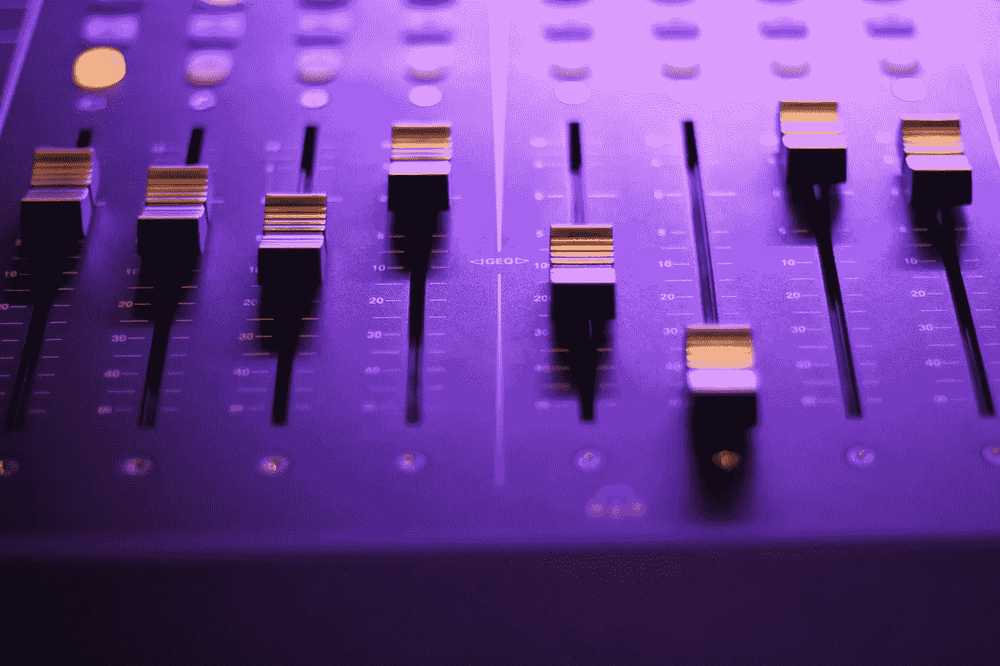
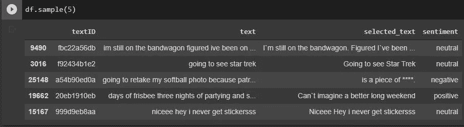
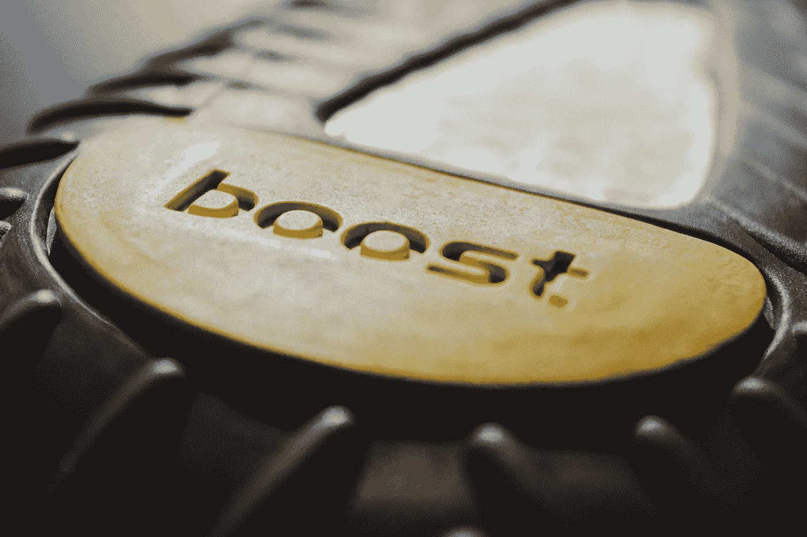
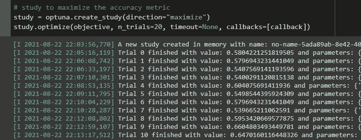
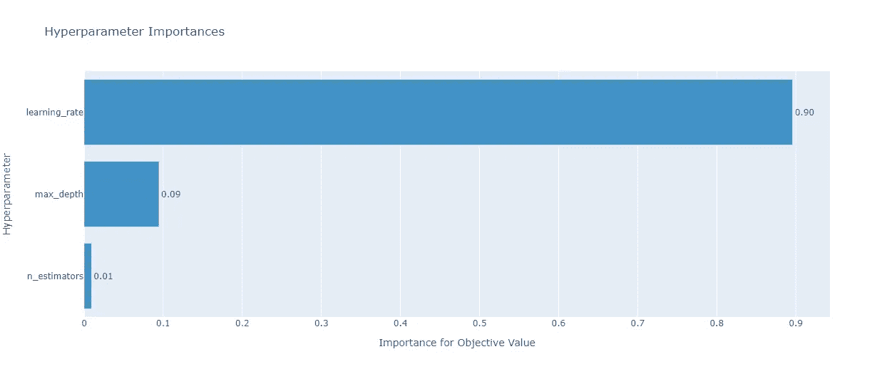
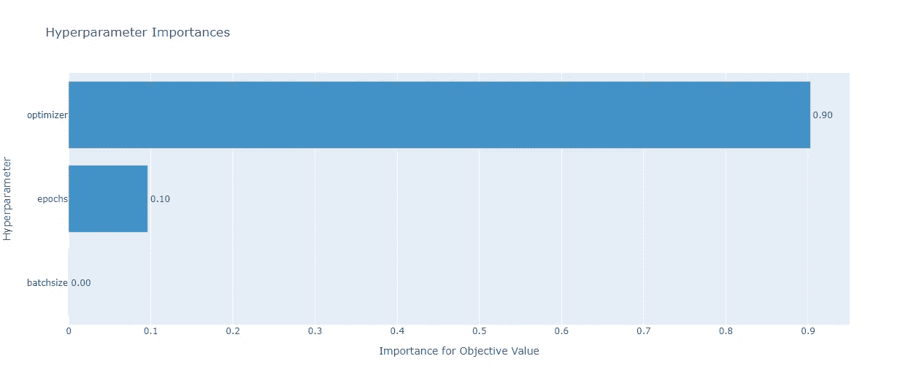

# Twitter 情感分析问题的自动超参数优化

> 原文：<https://towardsdatascience.com/an-automatic-hyperparameter-optimization-on-a-twitter-sentiment-analysis-problem-6d5dc732f500?source=collection_archive---------19----------------------->

## 这是一个漂亮的超参数调整技术的解释，使您的生活更容易。请放心在你的下一个 ML 项目中使用它！



照片由[丹尼斯·莱昂](https://unsplash.com/@denisseleon?utm_source=unsplash&utm_medium=referral&utm_content=creditCopyText)在 [Unsplash](https://unsplash.com/s/photos/tune?utm_source=unsplash&utm_medium=referral&utm_content=creditCopyText) 上拍摄

H 超参数调优是机器学习生命周期中最重要的部分之一。这在计算上是昂贵的，并且也是耗时的过程。

在读硕士期间，我偶然发现了一个自动超参数优化框架 [Optuna](https://optuna.org/) 。一个有趣的方面是，我们可以将 Optuna 与标准的机器学习算法以及神经网络方法一起使用。

在本文中，我将通过展示一些例子来记录我发现的关于 Optuna 的所有有用的东西。最重要的是，我将解决您在测试这个 Optuna 库时将会遇到的常见问题。

*继续阅读这篇文章，你会发现:*

1.  *如何使用 XGBoost 和 LSTM 对情感分析问题建模。*
2.  *如何将 Optuna 集成到 XGBoost 和 LSTM 模型中，并执行超参数调整。*
3.  *在使用 Optuna 时，我们如何减少一些常见的陷阱。*

**感兴趣？开始阅读！**

# 问题是


杰瑞米·泽罗在 [Unsplash](https://unsplash.com/s/photos/twitter?utm_source=unsplash&utm_medium=referral&utm_content=creditCopyText) 拍摄的照片

我们可以为此挑选任何问题，但我希望它更有趣一些，所以我选择了***Twitter 数据的情感分析*** 。

情感分析属于自然语言处理领域，我们使用多种文本处理方法来理解文本数据并从中获得洞察力。这种方法最常见的用途是识别推文的极性或情绪。

简而言之，我们的目标是将一条推文/短语或一句话归类为一组情绪，如*积极*、*消极*或*中性*。这是一个更广泛的分类，但我们可以更进一步，对推文情绪进行更详细的分类，如*非常快乐*、*适度快乐*，以及类似版本的*悲伤*、*愤怒*、*厌恶*等。

我使用的数据集来自一场[卡格尔比赛](https://www.kaggle.com/c/tweet-sentiment-extraction/data)。

> [数据](https://www.kaggle.com/c/tweet-sentiment-extraction/data):知识共享署名下的 4.0 国际许可
> 
> 虽然，比赛谈论的是推文提取，但我将数据重新用于情感分析。



来自数据集的样本推文(来源:作者)

对于实验，我将使用`text`和`sentiment`功能，在这里我将建立一个机器学习模型，它将一条推文作为输入，并告诉我们它的情感/情绪。由于我们有 3 种情绪类型(积极、消极和中性)，这是一个 ***多类分类任务*** 的情况。

# 数据预处理

并非推文的每一部分对我们进行的文本处理都很重要。推文的某些方面，如数字、符号、停用词，对于情感分析来说并不那么有用。

所以我们只需在预处理步骤中移除它们。我使用了`nltk` python 库和`regular expressions`来删除停用词、电子邮件、URL、数字、空格、标点符号、特殊字符和 Unicode 数据。

代码如下所示:

正如我之前提到的，我们将使用两种不同的方法进行情感分析，即 XGBoost 分类器和 LSTM 神经网络架构。

# XGBoost 分类器



照片由 [Haithem Ferdi](https://unsplash.com/@haithemfrd_off?utm_source=unsplash&utm_medium=referral&utm_content=creditCopyText) 在 [Unsplash](https://unsplash.com/s/photos/boost?utm_source=unsplash&utm_medium=referral&utm_content=creditCopyText) 上拍摄

“清理”完文本数据后，下一步就是矢量化。在这里，我们只是将文本转换成数字格式，以便机器学习模型可以“理解”它。

> 您可以观察到，在构建 ML 模型之前，需要将文本、图像、图表等数据结构转换成数字表示。

**矢量化**

为了对文本进行矢量化，我们可以简单地使用 Sci-Kit Learn 的[计数矢量化工具](https://scikit-learn.org/stable/modules/generated/sklearn.feature_extraction.text.CountVectorizer.html)方法。基本上，我们将文本转换成唯一单词的稀疏矩阵，其中我们使用数字来表示文本示例中某个单词的存在。

我们将数据分为训练集、验证集和测试集，分割比例为-80:10:10。分割是分层的，因此我们在所有数据分割中具有相同比例的标签/情感。

您可以使用以下代码来实现这一点:

**Optuna 集成**

现在，我们准备好训练模型并调整超参数。通过以下方式安装 Optuna:

```
pip install optuna
```

在下面的代码中，您会注意到一个被 Optuna 优化的目标函数。首先，我们定义我们感兴趣的超参数，并将它们添加到试验对象中。在这里，我选择调`learning_rate, max_depth and n_estimators`。根据超参数的类型，我们可以使用`suggest_float, suggest_int, suggest_categorical`等方法。

在这个目标函数中，我们创建了一个模型实例，并使其适合训练集。在训练之后，我们预测验证集上的情感，并计算准确性度量。Optuna 的目标函数将通过用不同的超参数值进行试验来尝试最大化这个准确度分数。在优化过程中，可以采用不同的[采样技术](https://optuna.readthedocs.io/en/stable/reference/samplers.html)。

> 我们可以重写目标函数来处理模型的损失值。在这种情况下，我们将尝试最小化目标函数。

一种提前停止的方法以修剪的形式实现。如果看起来没有希望，试验将被跳过/取消。

你可能已经注意到了`set_user_attr`方法。这是用来保存任何变量，我们可能会发现重要的。这里我们感兴趣的是保存与最高验证准确性相关的最佳模型。我们在这个用户属性中保存了最佳的 XGboost 模型。

在 Optuna 优化过程中，您会看到:



通过运行试验调整超参数(来源:作者)

> 如果您希望 Optuna 覆盖更大范围的超参数值，则试验次数可以更多。

试验完成后，我们可以检索超参数重要性图，如下所示:



XGBoost 超参数重要性(来源:作者)

我们观察到`learning_rate`是比其他参数更重要的超参数。有了这个，我们就知道需要关注哪些超参数了。

**在测试集上预测**

因此，我们已经完成了模型训练和超参数调整。我们进行了 20 次试验来寻找最佳超参数。现在，我们可以检索我们的最佳模型，并对测试集进行预测。

```
# retrieve the best model from optuna study
best_model = study.user_attrs['best_model']y_pred = best_model.predict(x_test)print(accuracy_score(y_test, y_pred))
```

> 测试精度(XGBoost): 0.683

**不算寒酸的分数！让我们看看我们是否能做得更好。**

# LSTM 建筑


泰勒·维克在 [Unsplash](https://unsplash.com/s/photos/network?utm_source=unsplash&utm_medium=referral&utm_content=creditCopyText) 上的照片

长短期记忆神经网络结构在自然语言处理领域中很流行，因为它具有在其“记忆”中保留序列信息的能力。

就像 XGBoost 一样，我们应该对文本数据进行矢量化，以便训练 LSTM 模型。我们执行标记化，然后将矢量化的序列填充到相同的长度。

数据以类似于 XGBoost 模型的方式分割，这样我们就可以对两者进行比较。

**标记化和填充**

现在，我们将 **LSTM 模型**定义如下:

我选择了`optimizer, epochs and batch_size`作为可调超参数。

这个神经网络模型现在可以开始训练了！！

在训练 LSTM 模型时，让我们集成 Optuna 来执行超参数调整。

这个 Optuna 集成的代码如下所示:

这个 Optuna 集成的结构是相同的。我们只是改变了目标函数中的模型和超参数。

类似地，我们获得 LSTM 的超参数重要性图:



LSTM 超参数重要性(来源:作者)

我们看到 optimizer 是一个重要的超参数，批处理大小对准确性分数的提高没有太大贡献。

# 我面临的问题

对于 XGBoost，我们可以直接保存模型，但是当您试图以类似的方式保存 Keras 模型时，Optuna 会给出一些错误。从我的搜索中，我发现这是因为 Keras 模型是不可挑选的？！

对此的解决方法是只保存最佳模型的权重，然后使用这些权重来重建模型。

以下代码将对此进行更多解释:

您只需创建模型的一个新实例，并设置从 Optuna 检索的权重，而不是再次训练它。

用 LSTM 获得的测试准确度分数:

> 测试精度(LSTM): 0.72

这个分数比 XGBoost 好。通常，神经网络方法比标准的机器学习方法表现得更好。通过使用 BERT、RoBERTa 或 XLNet 等变压器架构，我们可以进一步提高这一精度分数。

最后，我喜欢使用 Optuna 进行超参数调优。我可以很容易地从所有不同的试验中检索出最佳模型，并了解在训练过程中哪个超参数是重要的(使用超参数重要性图)。

如果你看到了这篇文章的这一部分，感谢你的阅读和关注。我希望你觉得这篇文章内容丰富，如果你有任何问题，请随时通过 [LinkedIn](https://www.linkedin.com/in/rohithteja/) 、 [Twitter](https://twitter.com/RohithTeja15) 或 [GitHub](https://github.com/rohithteja) 联系我。