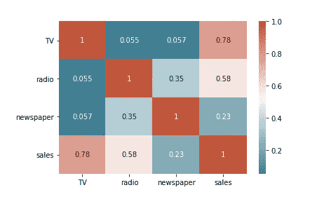
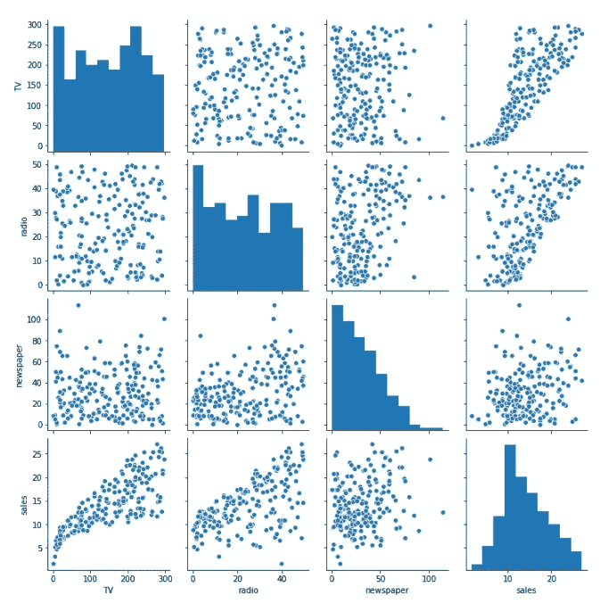
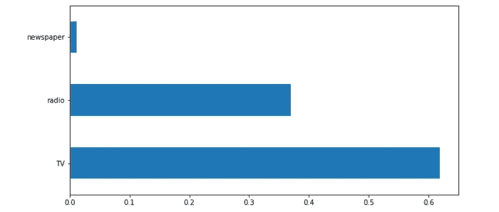
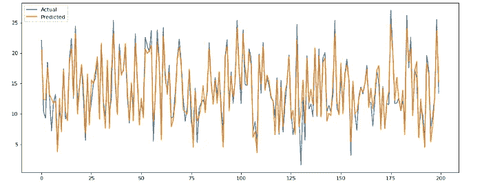
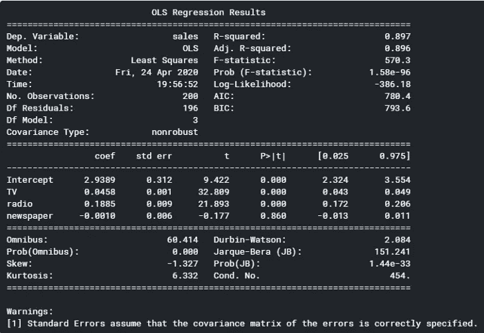

# 2021 年建立营销组合模式的完整指南

> 原文：<https://towardsdatascience.com/an-complete-guide-to-building-a-marketing-mix-model-in-2021-fb53975be754?source=collection_archive---------2----------------------->

## 充分理解什么是营销组合模型以及如何使用它


约书亚·厄尔在 [Unsplash](https://unsplash.com/s/photos/advertising?utm_source=unsplash&utm_medium=referral&utm_content=creditCopyText) 上的照片

# 介绍

营销一直被认为是一门艺术，而不是一门科学。但随着在线营销和大数据的出现，营销比以往任何时候都更加数学化和有条不紊。事实上，数据科学和机器学习应用的最大机会领域之一是营销！

这篇文章将集中在一个非常流行和强大的营销科学技术称为营销组合建模。本文将介绍它是什么，为什么它如此有用，如何用 Python 构建一个，最重要的是，**如何解释它**。

# 什么是营销组合模式？

**营销组合模型**是一种建模技术，用于确定市场属性，即给定公司使用的每个营销渠道的估计影响。

与[归因建模](https://blog.getcensus.com/marketing-attribution-modeling-in-python/)(另一种用于营销归因的技术)不同，营销组合模型试图衡量不可估量的营销渠道的影响，如电视、广播和报纸。

一般来说，你的输出变量是销售额或转化率，但也可以是网站流量。您的输入变量通常包括按时段(日、周、月、季度等)划分的渠道营销支出，但也可以包括我们稍后将讨论的其他变量。

# 为什么这么有用？

您可以通过多种方式利用营销组合模式的力量，包括:

*   更好地了解您的营销渠道和目标指标(即转化率)之间的关系。
*   区分高投资回报率营销渠道和低投资回报率营销渠道，最终更好地优化您的营销预算。
*   根据给定的输入预测未来的转换。

这些见解中的每一个都可以在您扩展业务时提供大量的价值。让我们深入了解用 Python 构建一个这样的模型需要什么。👀

# 构建营销组合模型

为了对营销组合模型有更好的直觉，本节将从头开始用 Python 构建一个营销组合模型。这个营销组合模型将建立在 Kaggle 的数据集[之上。](https://www.kaggle.com/sazid28/advertising.csv)

## 步骤 1:导入所有相关的库和数据。

```
import numpy as np
import pandas as pd
import seaborn as sns
import matplotlib.pyplot as pltdf = pd.read_csv("../input/advertising.csv/Advertising.csv")
```

## 步骤 2:执行一些 EDA

一般来说，您会进行更多的探索性数据分析，但对于本教程，我们将重点关注三个最常见的(根据我的经验，也是最强大的):

1.  **相关矩阵**:显示每个配对关系的相关值的表格
2.  **结对图**:一种简单的方法来可视化每个变量之间的关系
3.  **特征重要性**:根据每个特征在预测目标变量时的有用程度来给它们打分的技术

**相关矩阵**

再次重申，相关矩阵是显示每个配对关系的相关值的表格。这是理解特征关系的一种非常快速有效的方式。这是我们矩阵的代码。

```
corr = df.corr()
sns.heatmap(corr, xticklabels = corr.columns, yticklabels = corr.columns, annot = True, cmap = sns.diverging_palette(220, 20, as_cmap=True))
```



上面的相关矩阵显示，电视和销售之间有很强的相关性(0.78)，广播和销售之间有中等的相关性(0.58)，报纸和销售之间的相关性很弱(0.23)。现在下结论还为时过早，但这有利于我们继续前进。

**配对图**

配对图是一种直观显示每个变量之间关系的简单方法，它类似于相关矩阵，只是它显示的是每个配对关系的图表，而不是相关性。现在让我们来看看结对图的代码。

```
sns.pairplot(df)
```



我们可以看到我们的配对图和我们的原始相关矩阵之间的一些一致性。看起来电视和销售之间有很强的正相关关系，对广播来说没有，对报纸来说就更没有了。

**特征重要性**

要素重要性允许您确定每个输入变量对预测输出变量的“重要性”。如果打乱某个要素的值会增加模型误差，则该要素非常重要，因为这意味着模型依赖该要素进行预测。

```
# Setting X and y variables
X = df.loc[:, df.columns != 'sales']
y = df['sales']# Building Random Forest modelfrom sklearn.ensemble import RandomForestRegressor
from sklearn.model_selection import train_test_split
from sklearn.metrics import mean_absolute_error as maeX_train, X_test, y_train, y_test = train_test_split(X, y, test_size=.25, random_state=0)
model = RandomForestRegressor(random_state=1)
model.fit(X_train, y_train)
pred = model.predict(X_test)# Visualizing Feature Importance
feat_importances = pd.Series(model.feature_importances_, index=X.columns)
feat_importances.nlargest(25).plot(kind='barh',figsize=(10,10))
```

上面的代码首先创建一个随机森林模型，将销售额作为目标变量，将营销渠道作为特征输入。一旦创建了模型，我们就可以计算每个预测值的特征重要性，并将其绘制在条形图上。



似乎有一种模式，电视是最重要的，其次是广播，最后才是报纸。接下来是实际构建模型。

## 第三步:建立营销组合模型(又名。OLS 模型)

是时候建立我们的营销组合模型了！我们正在构建的模型的另一种说法是 OLS 模型，是普通最小二乘法的缩写，是一种用于估计线性回归模型中参数的方法。OLS 模型是一种回归模型，在构建营销组合模型时最常用。

Python 如此神奇的地方在于它已经有了一个库，可以用来创建 OLS 模型:

```
import statsmodels.formula.api as smmodel = sm.ols(formula="sales~TV+radio+newspaper", data=df).fit()print(model.summary())
```

上面的代码创建了我们的普通最小二乘回归模型，该模型指定我们根据电视、广播和报纸的营销费用来预测销售额。

## 步骤 4:绘制实际值与预测值的对比图

接下来，让我们用实际销售值绘制预测销售值的图表，以直观地了解我们的模型的表现。在业务用例中，如果您试图了解您的模型反映实际发生的情况有多好，这是一件特别有用的事情，在这种情况下，如果您试图了解您的模型根据每个营销渠道的支出金额预测销售额有多好。

```
from matplotlib.pyplot import figurey_pred = model.predict()
labels = df['sales']
df_temp = pd.DataFrame({'Actual': labels, 'Predicted':y_pred})
df_temp.head()figure(num=None, figsize=(15, 6), dpi=80, facecolor='w', edgecolor='k')
y1 = df_temp['Actual']
y2 = df_temp['Predicted']plt.plot(y1, label = 'Actual')plt.plot(y2, label = 'Predicted')
plt.legend()
plt.show()
```



实际值与预测值

还不错！在给定电视、广播和报纸支出的情况下，这个模型似乎在预测销售方面做得很好。

# 如何解释营销组合模型

回到。summary()，有几件事需要注意:



1.  **T1。总结()** 为我们提供了关于我们模型的丰富见解。回到*的输出。summary()* ，我们可以看到几个需要关注的领域(您可以参考下面 OLS 回归结果中的这些见解):
2.  **调整后的 R 平方为 0.896** 。这意味着数据中大约 90%的总变化可以用模型来解释。这也意味着该模型没有占所用数据的 10%，这可能是由于缺少变量，例如是否有另一个营销渠道没有包括在内，或者只是由于数据中的噪音。
3.  **在上半部分可以看到 Prob (F 统计量):1.58e-96** 。这个概率值(p 值)表示目标变量没有**好的预测值的可能性——在这种情况下，没有好的销售预测值。由于 p 值接近于零，我们知道模型中至少有**一个预测器能够很好地预测销售额。****

**如果查看 P > |t|列，可以看到每个预测值的 P 值。**电视和广播的 p 值小于 0.000，但报纸的 p 值为 0.86，这表明报纸支出对销售没有显著影响。一般你希望 p 值小于 1%或者 5%，这是实践中的两个标准。

# 感谢阅读！

通过阅读这篇文章，你现在应该知道什么是营销组合模式，如何建立一个，以及如何有效地使用它为您的业务。一如既往，我祝你学习一切顺利:)

不确定接下来要读什么？我为你挑选了另一篇文章:

[](/all-probability-distributions-explained-in-six-minutes-fe57b1d49600) [## 六分钟内解释所有概率分布

towardsdatascience.com](/all-probability-distributions-explained-in-six-minutes-fe57b1d49600) 

**又一个！**

[](/top-five-sql-window-functions-you-should-know-for-data-science-interviews-b8b334af437) [## 数据科学面试中你应该知道的五大 SQL 窗口函数

### 关注数据科学家的重要概念。

towardsdatascience.com](/top-five-sql-window-functions-you-should-know-for-data-science-interviews-b8b334af437) 

# 特伦斯·申

*   ***如果你喜欢这个，*** [***跟我上中等***](https://medium.com/@terenceshin) ***更多***
*   ***有兴趣合作吗？让我们连线上***[***LinkedIn***](https://www.linkedin.com/in/terenceshin/)