# Git 入门指南第 1 部分

> 原文：<https://towardsdatascience.com/an-easy-beginners-guide-to-git-2d5a99682a4c?source=collection_archive---------1----------------------->

## [入门](https://towardsdatascience.com/tagged/getting-started)

## 在短短 12 分钟内学习 Git 的基础知识


[扬西·敏](https://unsplash.com/@yancymin?utm_source=medium&utm_medium=referral)在 [Unsplash](https://unsplash.com?utm_source=medium&utm_medium=referral) 上的照片

如果你是编程新手，你肯定会想学习 Git！

Git 是一个分布式版本控制软件，基本上允许多人并行工作，并且它保存了所有更改的历史记录。这将有助于确保没有代码冲突，并允许开发人员将文件或整个项目恢复到他们代码的先前版本。

Git 可以跟踪做了什么更改，谁做了更改，他们什么时候做的更改，以及他们为什么做了更改。多酷啊。更好的是，这一切都是免费的！

在本文中，我将帮助您使用 Git 导航。一旦你掌握了它的窍门，它就会很容易使用。以下是主题的概要:

1.  安装 Git
2.  创建本地 Git 存储库
3.  将文件提交到本地存储库
4.  检查所有提交
5.  提交时忽略文件
6.  Git 分支
7.  创建与其他人共享的远程存储库
8.  在本地和远程存储库之间移动代码
9.  加分内容！磨尖

# 安装 Git

如果您的计算机上还没有安装 Git，请按照下面链接中的说明进行安装。

[https://Git-SCM . com/book/en/v2/Getting-Started-Installing-Git](https://git-scm.com/book/en/v2/Getting-Started-Installing-Git)

如果您不确定您是否有它，您可以在您的终端中键入以下命令来查看它是否已安装。

`git --version`

注意:要使用 Git，Mac 用户将使用终端进行交互。对于 Windows 用户，它将是命令提示符。

# 创建本地 Git 存储库

如果您从一个全新的项目开始，您将需要创建一个本地 Git 存储库。这是您的文件和变更检查点的存储位置，以便进行版本控制。

在我们初始化本地存储库之前，让我们在您的桌面上为我们的示例创建一个文件夹。姑且称之为“git-demo-example”。

现在，打开您的终端(或命令提示符)。复制下面的命令。第 1 行将导航到我们刚刚创建的文件夹，第 2 行将创建我们的本地存储库。

```
cd ~/Desktop/git-demo-example
git init
```

就是这样！我们已经创建了第一个本地存储库，它位于 git-demo-example 文件夹中。

接下来，让我们把一些文件放到文件夹中，这样我们就有东西可以用了。在我们的 git-demo-example 文件夹中创建一个名为 fruits.py 的文件，并将下面这段代码复制到该文件中。*注意:* *如果你没有安装 Python，你可以创建一个. txt 文件，而不是. py 文件，然后继续。*

```
fruits = ['apple', 'dragonfruit', 'peach', 'banana', 'grape', 'apple', 'peach', 'watermelon', 'grape', 'grape']
```

保存文档并退出。在同一个文件夹中再创建一个名为 veggies.py 的文件，并将下面这段代码复制到该文件中。

```
veggies = ['cabbage', 'carrot', 'spinach', 'asparagus', 'artichoke', 'pumpkin', 'lettuce']
```

现在 git-demo-example 文件夹中应该有两个文件。

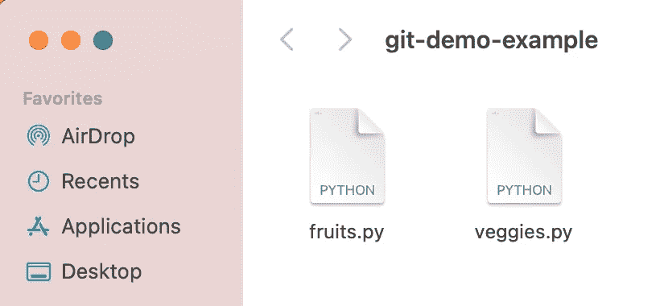

来源:作者

# 将文件提交到本地存储库

到目前为止，我们已经创建了一个本地存储库，并将两个文件添加到我们的工作目录(git-demo-example 文件夹)中。为了能够开始跟踪文件和我们所做的更改，我们必须将文件添加到本地存储库中。将文件添加到本地存储库的过程称为*提交*。

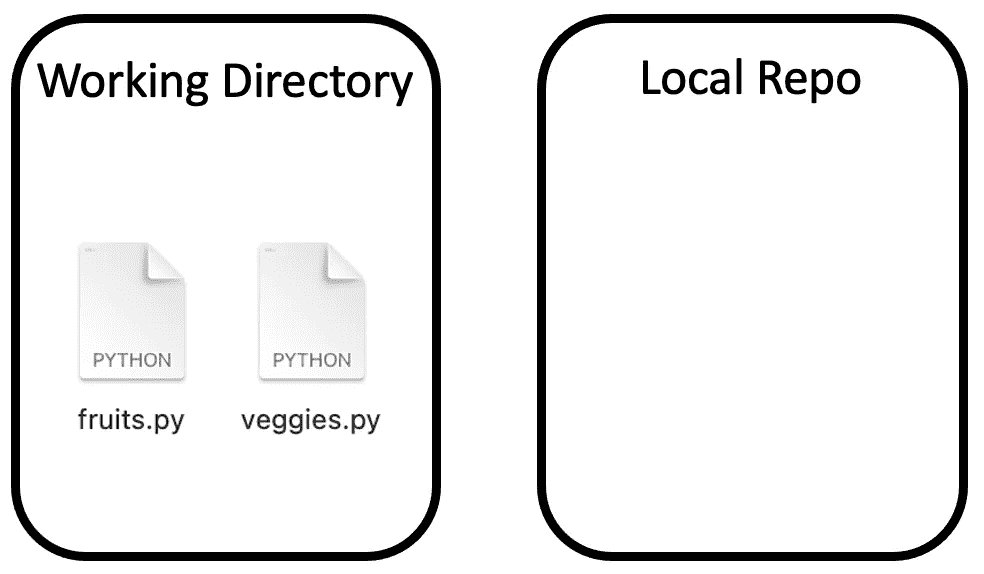

这是一个两步的过程，以便我们将代码提交到本地存储库。我们需要首先将文件添加到临时区域，然后提交。这个过程中的额外步骤使您能够控制您实际上想要提交到本地存储库的文件，并且如果您最初不小心选择了错误的文件，也允许您改变主意。

要将单个文件添加到临时区域，您可以使用`git add fruit.py`

要添加多个文件，使用这个:`git add fruit.py veggies.py`

如果你有很多文件或者懒得输入文件名，你可以使用`git add .`来添加文件夹中的所有文件。

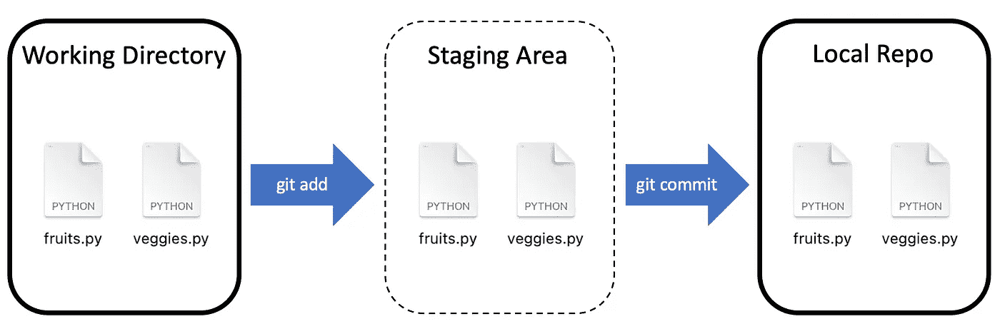

来源:作者

继续使用上面提到的两个选项之一将这两个文件添加到临时区域。如果您想仔细检查暂存区中有什么，您可以使用`git status`来检查暂存区。您可以在下面看到我们的两个新文件，更改尚未提交。

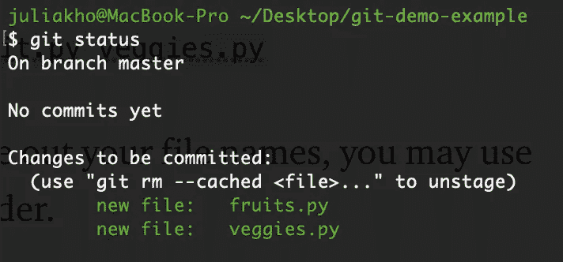

来源:作者

为了提交文件，我们将使用`git commit -m “My First Commit”`。“我的第一次提交”可以是你想对代码或者对你所做的修改所做的任何评论。这绝对是一个好主意，输入一些相关的东西，这样将来你就可以记住做了什么。

我们刚刚完成了第一次承诺！干得好！


Viktor Nikolaienko 在 [Unsplash](https://unsplash.com?utm_source=medium&utm_medium=referral) 上拍摄的照片

我真傻。在我们的蔬菜清单中，我们把南瓜列为一种蔬菜，但实际上它是一种水果！你知道吗？让我们改正那个错误。打开我们创建的两个文件，将南瓜从蔬菜中移除，添加到水果中。在对这些文档进行更改之后，继续练习进行另一次提交。

```
git add .
git commit -m “Changed pumpkin from veggie to fruit”
```

> 我曾经对南瓜上瘾，但后来我去了补丁。


照片由[麦蒂·贝克](https://unsplash.com/@maddybakes?utm_source=medium&utm_medium=referral)在 [Unsplash](https://unsplash.com?utm_source=medium&utm_medium=referral) 拍摄

到目前为止，我们已经提交了两次。可以把这些看作是我们可以在任何时间点恢复的检查点。

*有益提醒:记得常犯！它会让你的生活变得更加轻松！*

# 检查所有提交

如果您想查看到目前为止我们已经提交的所有提交的列表，您可以使用`git log`。在日志中，您可以找到提交的作者、提交日期以及每次提交的提交消息。

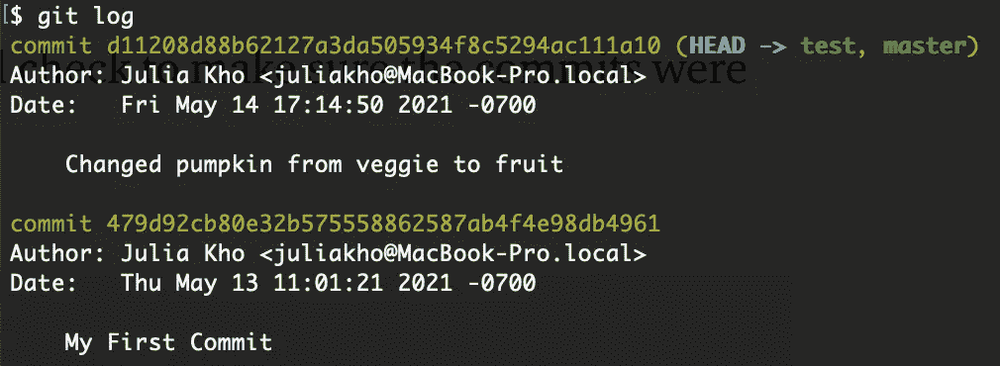

如果您已经提交了很多次，那么您可能需要在这个日志中滚动一段时间。使用`git log --pretty=oneline`可能是值得的，它会将您的提交消息压缩到一行。

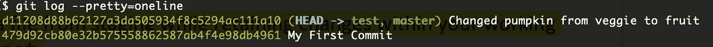

来源:作者

如果您想查看 Julia 提交的所有内容，还可以使用其他很酷的参数，比如`git log — author=julia`。

如果你很好奇，这篇文章[向你展示了使用日志工具的 10 种不同方式。](https://www.thegeekstuff.com/2014/04/git-log/#:~:text=The%20Git%20Log%20tool%20allows,the%20most%20recent%20commits%20first).)

# 提交时忽略文件

如果有些文件您永远不想提交，您可以创建一个. gitignore 文件来帮助解决这个问题。这个。gitignore file 将告诉 git 哪些文件或模式应该被忽略，这样它们就不会意外地被暂存和提交。这是明智之举！


安德鲁·乔治在 [Unsplash](https://unsplash.com?utm_source=medium&utm_medium=referral) 上拍摄的照片

创造。gitignore 文件在终端中用这个命令:`touch .gitignore`

开门。gitignore 并添加不想被跟踪的文件的名称。注意:如果您没有看到。gitignore，它可能是隐藏的，所以请确保您正在查看隐藏的文件。

下面的代码片段是一个. gitignore 文件的示例。第一行和第二行是我不想包含的文件名。您还可以指定与文件名匹配的模式。例如，picture*将查找所有以单词 picture 开头的文件。这里的星号实际上是匹配零个或多个字符的通配符。

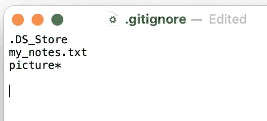

来源:作者

有关模式匹配的更多信息，请点击这里的链接。

继续练习第三次提交。gitignore 文件到您的本地存储库。

# Git 分支

使用 Git 可以做的一件非常酷的事情是，您可以创建不同的分支，这样您就可以将您的工作与主分支分开。如果您想测试代码，这很有用。

在您的终端中，如果您键入`git status`，您可以看到您在主分支上。

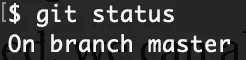

来源:作者

默认情况下，您将总是在 Git 的主分支下工作。我们之前进行的两次提交是在主分支上。我们有能力创建一个新的分支(例如 test ),在那里我们可以测试新的代码，而不会弄乱主分支中的代码。

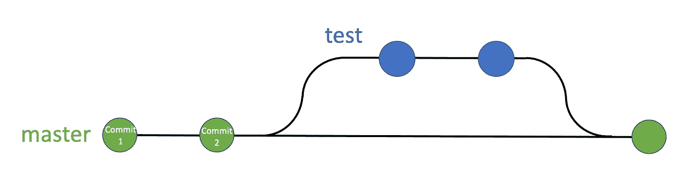

来源:作者

在上面的例子中，每个圆圈代表一次提交。当我们在测试分支中提交时，这些检查点将与主分支分开保存。如果我们喜欢测试分支中的代码，我们可以与主分支合并。如果在测试分支中实现的想法失败了，我们可以放弃它们。当与多个协作者一起工作时，您也可以各自创建自己的分支。

让我们创建一个名为 test 的新分支。

`git branch test`

要查看你所在的分支，你可以输入`git branch`，你所在的分支将以绿色突出显示。我们目前在主分支上。

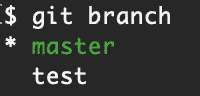

如果我们想要将代码提交到测试分支，我们将需要从主分支转移到测试分支。为此，请使用以下命令:`git checkout test`

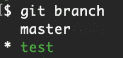

来源:作者

如果您再次输入`git branch`，请注意我们现在在测试分支上。

## 合并分支

当我们在测试分支中时，让我们修改我们的 fruits.py 文件，并将更改提交到这个测试分支。您可能已经注意到，我们的列表中有重复的水果。在下面的代码中添加 fruits.py 文件以获得一个唯一的集合。

`fruits = set(fruits)`

保存并提交新的更改。

```
git add fruits.py
git commit -m “Removed duplicate fruits”
```

这个测试分支包含我们之前进行的前两次提交以及我们最近的代码提交，而主分支只包含之前的前两次提交。然而，我们可以将测试分支合并到主分支，这样主分支就有了最新的代码。

在合并两个分支之前，可以通过使用`git diff test master`来看看分支之间发生了什么变化。Test 是您的源分支，master 是您的目标分支。

要执行合并，您必须返回到主分支，然后像这样使用合并功能:

```
git checkout master
git merge test
```

# 创建与其他人共享的远程存储库

您已经将所有的更改保存在本地存储库中，这很好，但是也许您想与您的同事或全世界共享它。我们可以创建一个远程存储库，并将其与您的本地存储库同步。这样，您可以将更改推到一个中心位置，在那里其他人可以访问您的代码，他们也可以提供帮助。

有几个网站可以托管 Git 项目，但是为了这些练习的目的，我将使用一个名为 Github.com 的网站。报名是免费的！如果您还没有帐户，请在 https://github.com/的[上注册。](https://github.com/)

在主页上，单击启动项目并创建存储库。我将把它命名为“Git-for-初学者”。

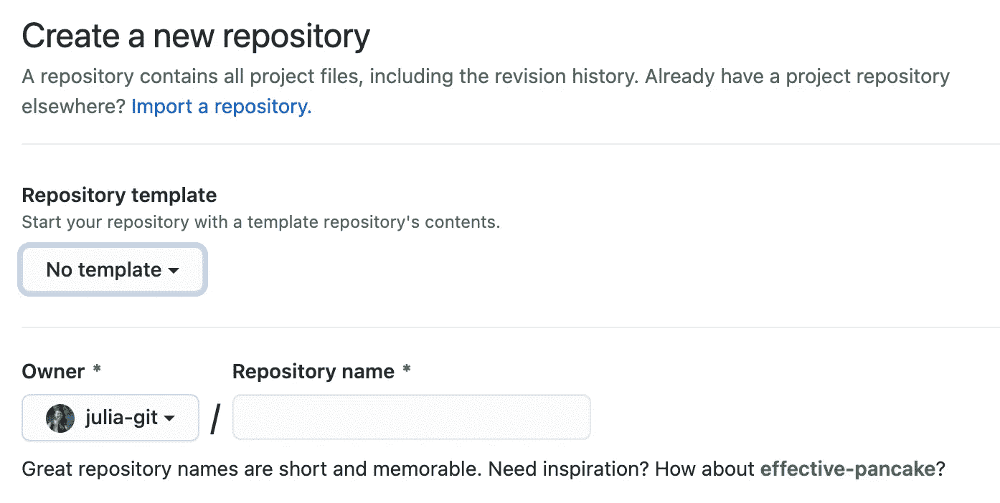

来源:作者

设置好 repo 之后，复制存储库的 url。如下图所示，我的知识库网址是[https://github.com/julia-git/Git-for-Beginners.git](https://github.com/julia-git/Git-for-Beginners.git)

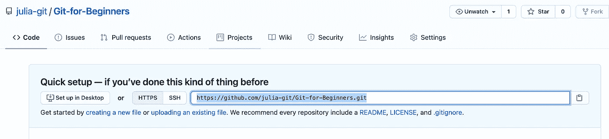

来源:作者

现在，我们需要告诉我们的本地存储库我们的远程存储库在哪里，以便在两者之间建立一个链接。用您自己的存储库 url 替换下面的代码行。

`git remote add origin [repository url]`

您需要输入您的 Github 用户名和密码才能连接。

# 在本地和远程存储库之间移动代码

既然已经建立了连接，要将本地存储库中的所有代码移动到远程存储库中，可以使用`git push -u origin master`。

有了这一行代码，我们本地存储库中主分支的所有内容现在都将位于远程存储库中。如果您希望推送不同的分支，只需将“主”替换为您想要推送的分支的名称。

如果您返回到您的浏览器选项卡，您应该看到您的项目已经成功地被推送到远程存储库。

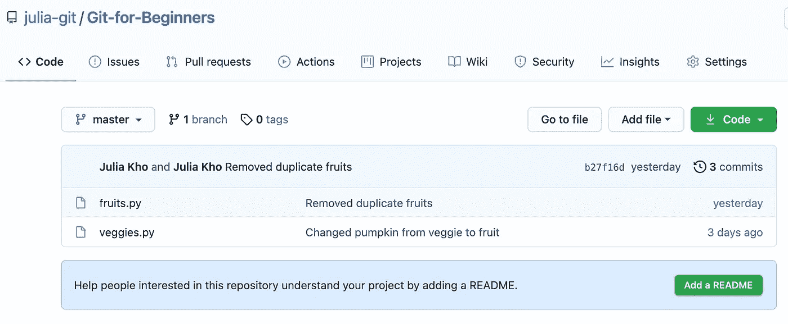

来源:作者

如果其他人正在处理这个项目并将变更推送到远程存储库，您可以将它们拉下到您计算机上的本地存储库。您将使用以下代码从主分支中提取:`git pull origin master`。

总之，下面的命令是我们到目前为止学到的一些东西。

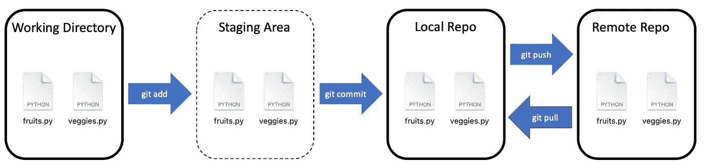

来源:作者

# 克隆远程存储库

现在让我们尝试一些不同的东西。假设你没有重新开始一个项目，但是你正在帮助你的队友完成他们的项目。我们必须去他们的远程存储库，并将其克隆到我们的计算机上，以创建一个本地存储库。请随意使用下面的库 url 克隆我为本文创建的库:https://github.com/julia-git/Git-for-Beginners

`git clone https://github.com/julia-git/Git-for-Beginners`

该命令实际上将存储库下载到您的本地计算机，并保留两个存储库之间的连接。

现在，您已经学习了使用 Git 导航的所有基本命令。如果您遇到困难，需要帮助来决定使用什么命令，您可以随时使用`git --help`。另外，[这里有](https://education.github.com/git-cheat-sheet-education.pdf)一个方便的备忘单，以防你忘记任何 Git 命令。

如果您想继续了解更多，请查看 Git 的简单初学者指南的第 2 部分。

# 加分内容！(对于那些特别喜欢冒险的人)

# 标签

您可以将提交历史中的特定点标记为重要点，例如，软件发布版本 1.0、2.0 等。

## 轻量级与带注释的标签

您可以创建两种类型的标记:轻量级和带注释的。

轻量级标记意味着更多的临时用途，因为它只是指向一个特定的提交。带有注释的标签充斥在包含标签者的姓名、电子邮件、日期、消息和身份验证的对象上。

要为 1.4 版创建轻量级标签:

```
git tag v1.4
```

要为 1.6 版创建带注释的标记，请执行以下操作:

```
git tag -a v1.6 -m "my version 1.6"
```

您可以用自己的信息替换上面引号中的信息。

如果你想看看你目前有哪些标签，你可以使用`git tag`。

## 在稍后的时间点进行标记

如果当前提交不是您想要标记的，我们可以查看提交历史来找到我们想要的。

```
git log --pretty=oneline
```

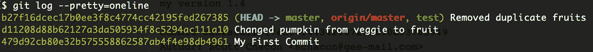

让我们假设第二次提交是我们想要标记的提交。将整个 id 或部分 id 复制到标记语句中。如上面的片段所示，我们将使用的 id 是`479d92`。

```
git tag -a v1.6 479d92 -m "new version 1.6"
```

## 将标签推送到远程存储库

标签不会被推送到远程存储库，除非您明确地这样做。将下面标签的名称替换为您要推送到服务器的名称。

`git push origin <tagname>`

## 删除标签

如果您想要删除本地存储库中的标记，您将使用以下内容:

```
git tag -d v1.0
```

如果您想要删除远程存储库中的标签，您将使用:

```
git push origin --delete <tagname>
```