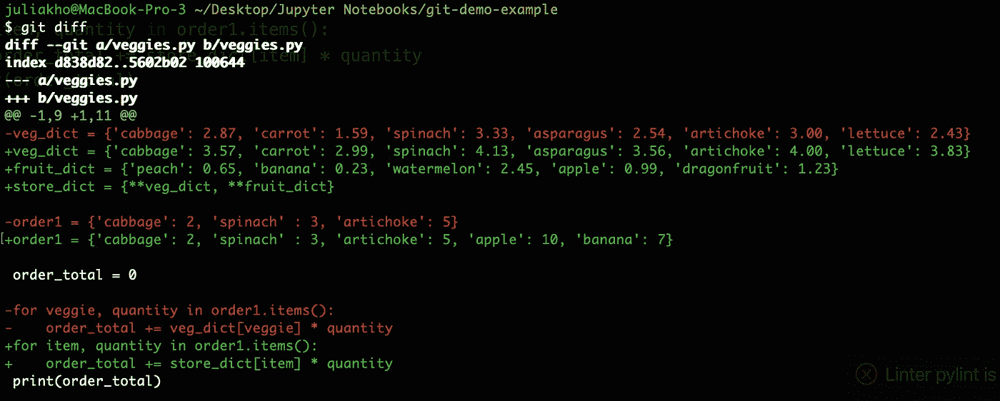
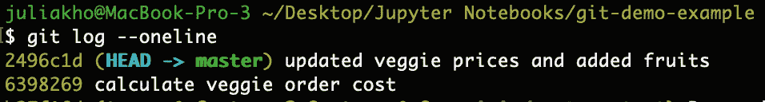
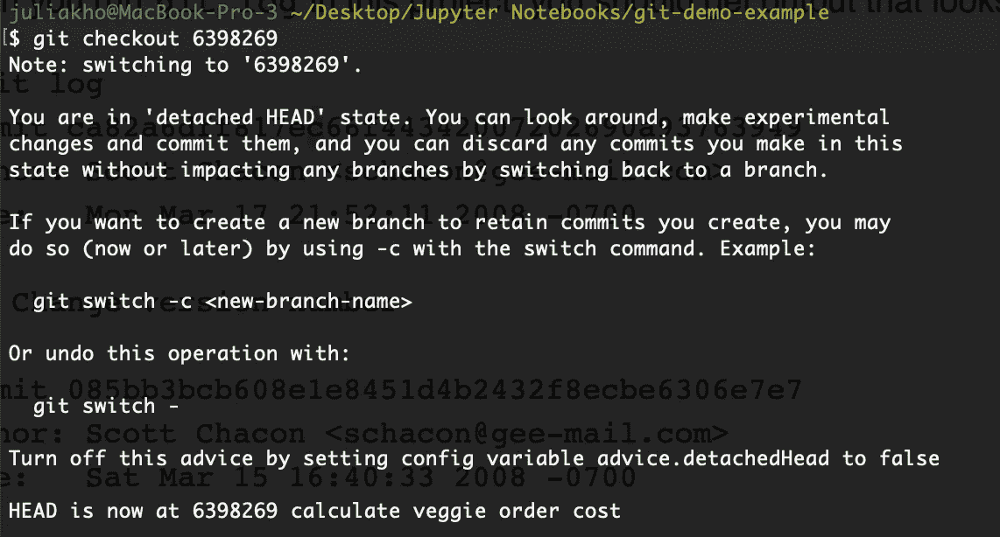
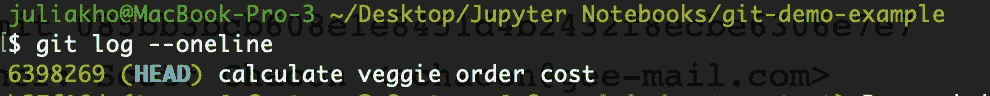
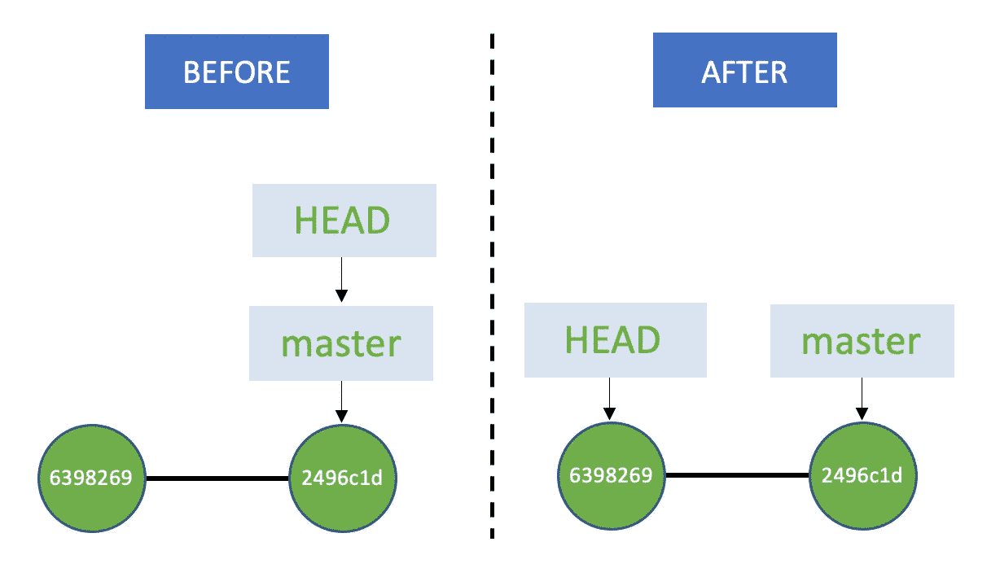
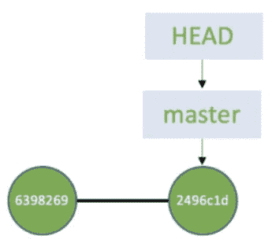
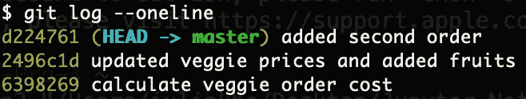
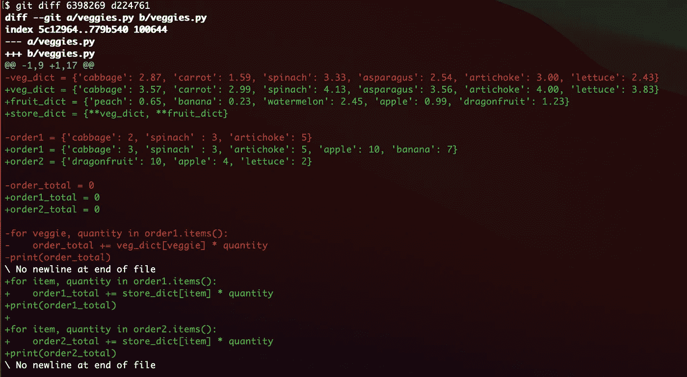
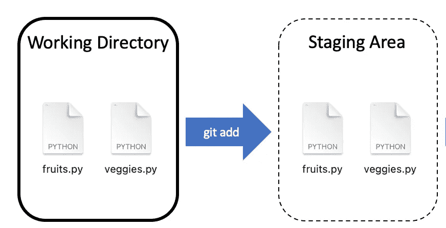
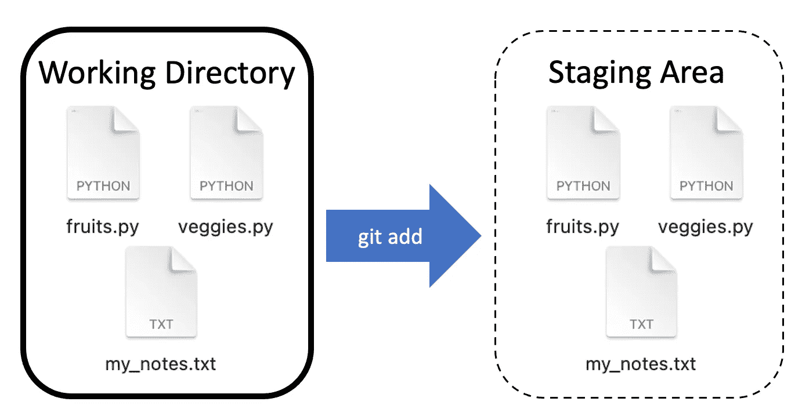

# Git 入门指南第 2 部分

> 原文：<https://towardsdatascience.com/an-easy-beginners-guide-to-git-part-2-a35bbbc89490?source=collection_archive---------15----------------------->

## 审查代码和撤销更改的 Git 基础知识


罗曼·辛克维奇在 [Unsplash](https://unsplash.com?utm_source=medium&utm_medium=referral) 上拍摄的照片

现在你已经从我的文章[中学习了如何使用 Git 的基础知识，Git 第 1 部分](/an-easy-beginners-guide-to-git-2d5a99682a4c)的简单初学者指南，让我们做更多的练习来熟悉 Git 的使用和导航。

您已经看到了 Git 如何跟踪所做的更改，谁做了更改，他们何时做了更改，以及他们为什么做了更改。现在我们将学习如何利用这个版本控制软件来帮助我们审查不同版本的代码以及撤销更改。

坚持我们之前的蔬菜水果主题，开始吧！

**审查代码变更**

A.将当前代码与上次提交的代码进行比较

B.查看以前提交的文件

C.在提交之间检查代码

**撤销更改**

A.撤消添加到临时区域

B.撤消您的上次提交

C.撤消当前更改并恢复到上次提交时的版本

D.撤消提交到错误的分支

# 检查代码更改

## A.将当前代码与上次提交的代码进行比较

让我们添加一些新代码，并学习如何检查您所做的具体更改。在 veggies.py 文件中，复制以下代码。

来源:作者

> 代码细节:上面名为 veg_dict 的字典保存了蔬菜的名称和我们收取的单位价格。我们有一个客户从我们这里订购，order1 存储了我们提供给该客户的商品名称和数量(以千计)。for 循环计算 order1 的总成本。

保存文件，然后用我们的新代码提交。如果您忘记了，下面是在终端中使用的命令。

```
git add veggies.py
git commit -m "calculate veggie order cost"
```


照片由 [NeONBRAND](https://unsplash.com/@neonbrand?utm_source=medium&utm_medium=referral) 在 [Unsplash](https://unsplash.com?utm_source=medium&utm_medium=referral) 上拍摄

我们的敌人通货膨胀来袭了！我们必须提高蔬菜的价格，所以让我们用上涨的价格更新我们的字典。一切都上涨了。

```
veg_dict = {'cabbage': 3.57, 'carrot': 2.99, 'spinach': 4.13, 'asparagus': 3.56, 'artichoke': 4.00, 'lettuce': 3.83}
```

此外，让我们也添加水果到我们的市场。水果价格存储在变量 fruit_dict 中。我们最喜欢的消费者保持同样数量的蔬菜，但也在他们的订单中添加了水果。请参见下面的新代码。

来源:作者

在 veggies.py 文件中粘贴新代码后，保存它。让我们转到命令行并键入以下内容，以比较对上次提交的更改。

```
git diff
```



git diff 来源:作者

您可以在终端输出中一行一行地看到到底做了什么更改！这不是很神奇吗？！

红色显示的是我们上次提交时删除的代码，绿色显示的是上次提交时添加的代码。如果代码是白色的，这意味着没有对该行进行任何更改。

在回顾了这些变化之后，我们很满意。所以让我们练习再做一次提交。如果你已经忘记了，这又是一次。

```
git add veggies.py
git commit -m "updated veggie prices and added fruits"
```

## B.查看以前提交的文件

比方说，您想回过头来看看上一次提交的代码。通货膨胀发生前蔬菜的价格是多少？

第一步是找到您想要查看的提交。您可能还记得本文的第 1 部分，如果您使用`git log --oneline`，您可以在左边看到黄色的惟一提交散列代码和白色的提交消息。



git 日志—在线—来源:作者

包含我们的原始蔬菜价格的提交哈希代码位于 6398269，如上面的截图所示。就像我们如何使用 git checkout 来切换分支一样，我们可以使用 git checkout 来切换到以前的提交。

```
git checkout 6398269
```



git checkout —来源:作者

您可能会看到这条关于“分离头”状态的消息。这是怎么回事？把头想象成一个指针。它指向您正在查看的当前提交。

回头看看前面使用`git log --oneline`时得到的输出。注意最近一次提交旁边的单词 HEAD。HEAD - > master 告诉我们，指针正指向我们当前所在的 master 分支。也就是说，它指向主分支中的最新提交。大多数时候，HEAD 会指向分支名称。


git 日志来源:作者

现在我们切换到提交 6398269，如果您再次键入`git log --oneline`，您会注意到单词 HEAD 现在就在下面截图中我们切换到的提交旁边。



来源:作者

这里有一个插图告诉你头指向哪里。在我们使用`git checkout 6398269`之前，头部是指向主分支的，如左图所示。在我们完成 git 检验之后，头部现在指向我们的 commit 6398269。



来源:作者

我们之前得到的分离 HEAD 消息只是告诉我们，指针当前指向一个特定的提交，而不是当前的分支。这听起来很糟糕，但实际上这更像是一个警告信息，而不是错误信息。


分离的头部——由[里克·蒙泰罗](https://unsplash.com/@rickmontii?utm_source=medium&utm_medium=referral)在 [Unsplash](https://unsplash.com?utm_source=medium&utm_medium=referral) 上拍摄

根据输出的消息，在这种分离状态下，“您可以四处查看，进行实验性的更改并提交它们，您可以通过切换回一个分支来放弃在这种状态下所做的任何提交，而不会影响任何分支。”本质上，您可以在这种状态下运行实验，然后决定是保留还是删除它们。

对于本练习，我们不做任何更改。我们只是查看包含蔬菜旧价格的代码行。打开 veggies.py 文件，您将看到来自 6398269 提交的代码。这是我们以前的价格！是不是很酷？

好了，现在让我们回到最近的提交。就是，我们来附个头吧！本质上，我们把头指向我们的主分支。你能猜到该用什么命令吗？

如果你没有，没关系。下次你会得到它的。我们将使用`git checkout master`。头部现在应该像下面这样连接。



来源:作者

## C.在提交之间检查代码

如果您想比较不同提交的文件之间的差异，您可以很容易地做到这一点。

首先，让我们将另一组代码更改添加到 veggies.py 文件中，以包含第二个订单，如下所示。

保存并再次练习提交。希望你现在已经记住了！

```
git add veggies.py
git commit -m "add second order"
```

假设我们想要比较提交 6398269 和提交 d224761 的代码。两者有什么区别？



我们可以使用`git diff 6398269 d224761`

与前面类似，您可以看到绿色的代码行来自我们最新的代码，红色的代码行来自之前的提交。现在你可以比较和对比。



git diff 来源:作者

你现在是审查代码变更的专家了。让我们继续学习如何撤销更改。

# 撤消更改


照片由[菲利佩佩拉昆](https://unsplash.com/@felipepelaquim?utm_source=medium&utm_medium=referral)在 [Unsplash](https://unsplash.com?utm_source=medium&utm_medium=referral) 拍摄

有时我们会犯错误，只希望时光能倒流。幸运的是，Git 为您提供了返回并撤销错误的能力。让我们来看几个你在开始时可能会遇到的不同场景。

## A.撤消添加到临时区域

如果您向临时区域添加了不想提交的文件，可以在提交之前将其取出。

作为对您在我的文章的第 1 部分中学到的内容的一个提醒，您首先使用 *git add* 命令将变更移动到暂存区域。让我们来学习如何撤销一个`git add`！



来源:作者

对于这个例子，让我们在您的工作目录中创建一个名为 my_notes.txt 的新文件。然后使用以下命令将工作目录中所有已更改的项目添加到您的文件夹中。

`git add .`



来源:作者

假设您不想将文件 *my_notes.txt* 添加到暂存区，因为该文件只是您不想提交的注释。

要撤消对临时区域的添加，可以使用以下命令。

`git reset my_notes.txt`

这将从您的暂存区中删除文件 *my_notes.txt* 。

类似于使用`git add .`添加所有文件，您可以使用`git reset .`从暂存区移除所有文件。

做一个`git status`就可以自己看到 *my_notes.txt* 已经不在暂存区了。

## B.撤消您的上次提交

如果你已经完成了一个`git commit`，不要担心，有一个方法可以撤销`git commit`！


来源:作者

让我们快速制作一个测试提交示例。

```
git add my_notes.txt 
git commit -m “added my_notes”
git log
```

要取消提交最后一次提交，您需要做的就是

`git reset --soft HEAD^`

现在继续执行`git log`,这样你就可以看到你的最后一次提交已经被撤销了。

> 记住，这只是为了撤销`git commit`功能。这意味着 *my_notes.txt* 现在在暂存区。如果你做`git status`，可以看到文件在暂存区等待。如果要将其从暂存区中删除，请参考上一节。

如果您想撤销最后两次提交，您可以使用下面的代码。

`git reset --soft HEAD~2`

用您想要撤消的任意数量的提交替换 2。

> 另一个注意事项。`git reset`最适合在计算机上撤销本地更改时使用。

## C.撤消当前更改并恢复到上次提交时的版本

如果您一直在处理一个文件，并且不喜欢您添加的任何新代码，您可以恢复到上次提交时的版本。

例如，打开 veggies.py，将以下内容复制并粘贴到第 1 行。

`#This is a test comment.`

继续保存文件。然后转到您的终端，键入以下内容:

`git checkout veggies.py`

现在回到 veggies.py 文件，您可以看到注释已经消失，代码与上次提交的代码完全相同。

如果您对多个文件进行了更改，您可以使用`git checkout .`将所有文件恢复到上次提交时的版本。


汉斯-尤尔根·马格在 [Unsplash](https://unsplash.com?utm_source=medium&utm_medium=referral) 拍摄的照片

如果你通过了第 1 部分和第 2 部分，你真的做得很好。Git 可能令人生畏。现在只是从这里开始练习，从错误中学习。还有很多 Git 命令我没有在这些文章中介绍，所以大胆地去 Google 上继续学习吧！

感谢阅读！如果你想在我有新文章发表时第一个知道，请随时点击 [**订阅这里的**](https://julia-kho.medium.com/subscribe) **。**


来源:作者