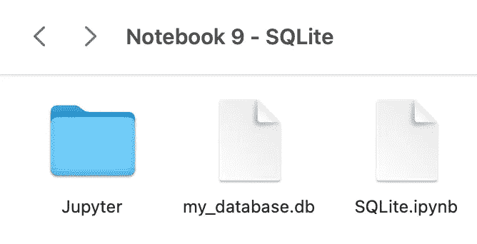
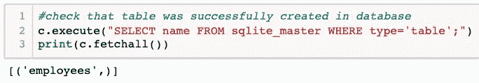
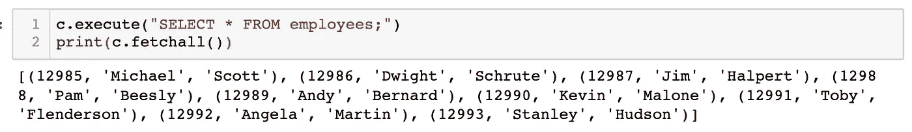
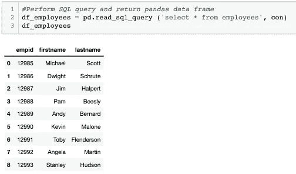
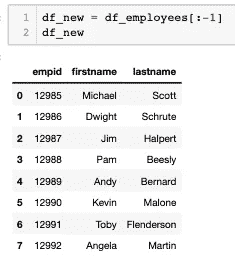
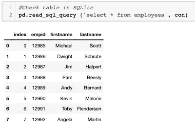

# Python 和 Pandas 中 SQLite 的简易初学者指南

> 原文：<https://towardsdatascience.com/an-easy-beginners-guide-to-sqlite-in-python-and-pandas-fbf1f38f6800?source=collection_archive---------5----------------------->

## 了解如何在 SQLite 中创建表和查询数据，以及从 Pandas 访问 SQLite


照片由 [Clément Hélardot](https://unsplash.com/@clemhlrdt?utm_source=medium&utm_medium=referral) 在 [Unsplash](https://unsplash.com?utm_source=medium&utm_medium=referral) 上拍摄

欢迎阅读 SQLite 的简易初学者指南。在本文中，您将了解什么是 SQLite，如何连接到数据库、创建表、插入和查询数据，以及在 Pandas 中访问 SQLite。我假设您对 SQL 有基本的了解，我在本文中的重点将是如何在 Python 中使用 SQLite。

# 什么是 SQLite？

SQLite 是一个软件库，它为我们提供了一个开源的关系数据管理系统，我们可以在其中存储大量的数据。

它易于设置，是独立的(需要最少的支持)，并且不需要服务器。SQLite 数据库实际上只是一个普通文件，这使得它易于访问和移植。鉴于 SQLite 的简单性，它是部署最广泛的数据库引擎。

SQLite 有很多优点，但是在实践中，如果要处理大量数据，就不应该使用 SQLite。该数据库实际上限为 281。

# 入门指南

如果你愿意跟随，你可以在这里下载我的 Jupyter 笔记本。

我们首先在 python 文件中导入 SQLite 库。如果您使用的是 Python 2.5 和更高版本，那么这个库不必下载，因为它应该已经包含在标准库中了。

`import sqlite3 as db`

接下来，我们可以连接到一个现有的数据库，或者创建一个新的数据库，如果它不存在的话。

`conn = db.connect('my_database.db')`



作者图片

> *请注意，SQLite 引擎将数据库维护为扩展名为. db 的文件，因此上面的代码行将连接到一个名为 my_database.db 的文件，如果它存在于文件夹中的话。如果它不存在，将在您的计算机上自动创建一个名为 my_database.db 的文件，如上面的代码片段所示。*

为了与数据库进行交互，我们现在必须创建一个游标。这就是我们将用来发布命令，允许我们查询或修改我们的数据库。

`c = conn.cursor()`

# 创建和修改表格

既然我们已经创建了数据库连接和游标，现在我们可以开始交互了。让我们在数据库中创建第一个表。

## 创建表格

我们对之前创建的游标`c`使用方法`execute`，并传入我们的 SQL 语句。

`c.execute("CREATE TABLE employees (empid INTEGER PRIMARY KEY, firstname NVARCHAR(20), lastname NVARCHAR(20))")`

上面的语句将创建一个名为 employees 的表，该表包含三列:empid、firstname 和 lastname。

您可以使用以下语句检查该表是否已成功创建。

```
c.execute("SELECT name FROM sqlite_master WHERE type='table';")
print(c.fetchall())
```



作者图片

上面的选择查询将显示数据库中的所有表。请注意，如果只有第一条语句，则不会输出查询结果。你必须使用`c.fetchall()`来显示结果。

## 将数据插入表格

要填充该表，我们有几个选项。如果只插入几行，可以使用下面的 insert 语句向 employee 表中输入两行。

```
c.execute("INSERT INTO employees VALUES (12986,'Michael','Scott')")
c.execute("INSERT INTO employees VALUES (12987,'Dwight','Schrute')")
```

如果有许多行要输入到表中，可以考虑制作一个元组列表，并使用`executemany()`命令。

```
new_employees = [(12987, 'Jim', 'Halpert'),
 (12988, 'Pam', 'Beesly'),
 (12989, 'Andy', 'Bernard'),
 (12990, 'Kevin', 'Malone'),
 (12991, 'Toby', 'Flenderson'),
 (12992, 'Angela', 'Martin'),
 (12993, 'Stanley', 'Hudson')]c.executemany('INSERT INTO employees VALUES (?, ?, ?)', new_employees)
```

请注意，我们已经用(？, ?, ?).这里的问号代表我们输入到表格中的三个项目的占位符。


由[上的](https://unsplash.com?utm_source=medium&utm_medium=referral)[窗口](https://unsplash.com/@windows?utm_source=medium&utm_medium=referral)拍照

让我们看看现在我们的表中有什么。我们可以在 execute 命令中使用 select 语句，就像我们以前做的那样。



作者图片

从输出中，我们可以看到我们所有的员工都被正确地输入到表中。万岁！

## 提交更改

我们已经对我们的数据库做了一些更改，但是它们还没有保存到数据库中！这些只是临时的修改，所以我们必须确保用下面的命令提交这些修改。

`conn.commit()`

否则，一旦我们关闭连接，更改将会丢失。


照片由 [Afif Kusuma](https://unsplash.com/@javaistan?utm_source=medium&utm_medium=referral) 在 [Unsplash](https://unsplash.com?utm_source=medium&utm_medium=referral) 上拍摄

最后，一旦完成，关闭光标和连接总是一个好习惯。我们可以用下面的命令做到这一点。

```
c.close()
conn.close()
```

# **SQLite via Pandas**

你可以做的一件很酷的事情是同时使用 SQLite 和 Pandas。Pandas 有一个`read_sql_query`方法，允许你以 Pandas dataframe 的形式返回数据。从那里，您可以更容易地操作 Pandas 中的数据。就我个人而言，我更喜欢把数据放在熊猫体内进行研究。

我们再次必须首先建立到数据库的连接。然后我们可以使用`pd.read_sql_query`并将输出保存为名为`df_employees.`的数据帧

```
#import library
import pandas as pdcon = db.connect('my_database.db')
df_employees = pd.read_sql_query('select * from employees', con)
```



作者的图片

现在它是一个 pandas 数据框架，您可以使用您常用的 Pandas 函数随意操作数据。

例如，假设 Stanley *(桌子上的最后一个人)*本来就不该被雇佣，所以我们需要把他从桌子上赶走。

`df_new = df_employees[:-1]`



作者图片

我们可以将新的 dataframe 写回 SQLite 并替换原始的 employee 表。为了写入 SQLite，我们在新的数据帧上使用方法`to_sql()`。

`df_new.to_sql("employees", con, if_exists="replace")`

我们在这个方法中提供了三个参数:

1.  SQL 表的名称
2.  与数据库的连接
3.  如果表已经存在，该如何操作。“替换”将删除原始表格。“失败”将在 Python 中引发一个值错误。“追加”会将数据作为新行插入到表中

为了检查它是否如我们预期的那样工作，我可以再次查询这个表，看看 Stanley 是否已经被删除。它有！

`pd.read_sql_query ('select * from employees', con)`



作者图片

就像之前一样，一旦我们完成，让我们关闭连接。

`con.close()`

就是这样！SQLite 使用起来非常简单。如果你正在寻找一个好的数据库来练习 SQL 和/或 SQLite，你可以在这里下载 Chinook 数据库[。关于 Chinook 数据库中数据的更多信息可以在](https://www.sqlitetutorial.net/wp-content/uploads/2018/03/chinook.zip)[这里](https://www.sqlitetutorial.net/sqlite-sample-database/)找到。

感谢您的阅读！如果你有问题或者想讲一个 SQL 笑话，请在评论中告诉我。


[医学家](https://unsplash.com/@medienstuermer)在 Unsplash 上拍摄的照片