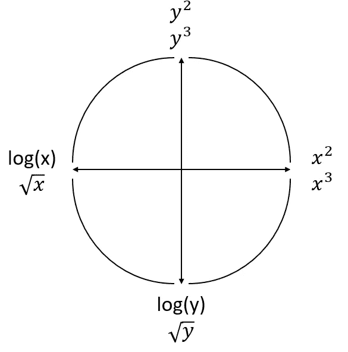
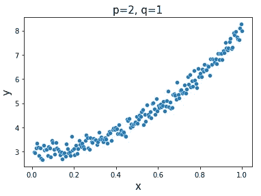
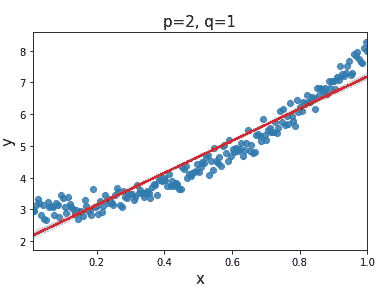
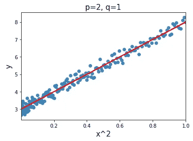
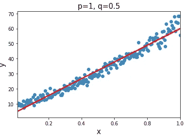
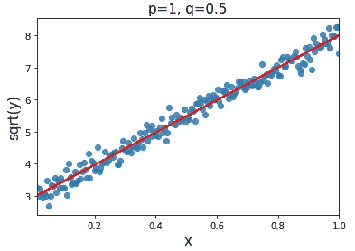

# 为线性回归正确转换非线性数据的简单工具

> 原文：<https://towardsdatascience.com/an-easy-tool-to-correctly-transform-non-linear-data-for-linear-regression-5fbe7f7bfe2f?source=collection_archive---------24----------------------->

## 使用 Tukey 和 Mosteller 膨胀规则将数据转换为线性关系


照片由[戈兰·艾沃斯](https://unsplash.com/@goran_ivos)在 [Unsplash](https://unsplash.com/photos/J_ozkAK9sZ4) 上拍摄

# 介绍

线性回归的两个重要假设是残差相互独立，并且这些误差中存在恒定的方差(也称为同方差)。这基本上意味着，当我们画回归线时，我们希望在整个直线的顶部和底部有相对相等数量的误差。

在许多情况下，我们想要为其建立模型的变量并不是线性相关的。当用线性回归模型拟合上述假设时，这导致了上述假设的失败。我们可以将变换函数应用于这些变量，以便使关系成为线性的。下图有助于我们决定对正在处理的非线性数据应用何种转换。



图基和莫斯特勒的膨胀规则图(也称为权力阶梯规则)

本文的目标是演示如何使用这个图表对数据进行转换。在我们开始举例之前，您可以这样阅读这个图表:

1.  如果您看到的数据看起来像左上角的曲线，您可以尝试降低 x 的放大率和/或增加 y 的放大率。
2.  如果你看到的数据看起来像右上角的曲线，你可以尝试增加 x 和/或 y 的力量。
3.  如果您看到数据看起来像右下角的曲线，您可以尝试增加 x 的幂和/或减少 y 的幂。
4.  如果你看到的数据看起来像左下角的曲线，你可以尝试降低 x 的幂和/或 y 的幂。

有趣的是，谷歌上关于这个规则的资源并不多(只有几千个搜索结果)。这是一个简单而强大的框架，用于快速确定要使用的转换，允许您在非线性数据上潜在地拟合线性模型。

# 生成数据

对于本文，我们将使用从以下 python 函数生成的数据:

```
def random_data(p=1, size=200, noise_sd = .1, q=1):
    x = list(np.linspace(0.01, 1, size))
    y = [(3 + 5 * x_val ** p + (random.normalvariate(0,noise_sd))) ** (1/q) for x_val in x]

    return x, y
```

上面要理解的两个重要变量是`p`和`q`。变量`p`表示应用于 x 值的功率，而`q`表示应用于 y 值的功率的倒数

我们正在为 0.01 和 1 之间的`x`生成`size`值，每个值之间的间隔相等。我们增加 3，将 y 值缩放 5，以避免负数，因为负数会导致我们在本文中讨论的规则出现问题。最后，我们使用`random.normalvariate(mean, sd)`给数据添加一点噪声，以使数据不完全符合我们想要演示的转换。

# 将 Tukey 和 Mosteller 膨胀规则应用于数据

让我们从上图右下角的数据分类示例开始。



p=2 和 q=1 时的数据散点图

当我们试图用最小二乘线性回归线拟合数据时，我们发现数据没有很好的线性关系。



p=2 和 q=1 的数据图，带回归线

该图告诉我们尝试降低 y 的幂或增加 x 的幂。下面我们看到，增加 x 的幂给我们带来了明显更好的线性关系和拟合。



p=2，q=1，x 转换为 x 的平方时的数据图

重要的是要记住考虑不同的变换可以有相同的形状。也就是说，数据可以用增加的 y 的幂生成，并且需要转换 y 变量以获得更好的线性拟合。



p=1 和 q=0.5 的数据图，带有线性回归线

在这种情况下，降低 y 的幂以获得更好的线性拟合是合适的。



p=1，q=0.5，y 转换为 y 的平方根时的数据图

# 结论

在上面的例子中，我们能够看到如何将 Tukey 和 Mosteller 膨胀规则应用于随机生成的数据(特别是符合图的右下角)。

值得注意的是，我们已经知道什么是正确的转换，因为我们在数据生成过程中选择了数据的参数。在实践中，您将不得不在图表的特定象限中尝试不同的转换，以找到最佳的转换。该图表旨在帮助您快速确定应该尝试哪些方法。


照片由[莎伦·麦卡琴](https://unsplash.com/@sharonmccutcheon)在 [Unsplash](https://unsplash.com/photos/eMP4sYPJ9x0) 拍摄

另一个需要注意的是，这个简单的规则有一些限制。具体来说，它为转换数据时的前进方向提供了一个良好的起点，但不是最佳的转换。考虑使用 [Box-Cox 变换](https://www.statisticshowto.com/box-cox-transformation/#:~:text=A%20Box%20Cox%20transformation%20is,a%20broader%20number%20of%20tests.)来构建一个更加复杂和精确的框架(尽管 Tukey 和 Mosteller 规则作为一种近似做得相对较好，这种类型的精度不一定会对你的模型产生有意义的改进)。在 R 中比较这两个规则的一些代码可以在[这里](https://freakonometrics.hypotheses.org/14967)找到。

另一件要注意的事情是，很多这样的转换需要正变量值才能工作。因此，该规则可能无法应用于具有负值的数据，或者可能需要额外的工作来确保所有值都是正值。

感谢您花时间阅读这篇文章，我希望它能帮助您构建下一个模型。