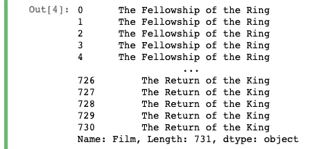
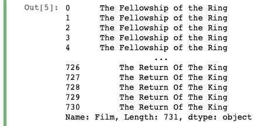
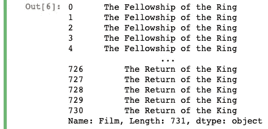
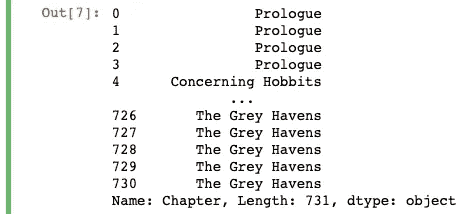

# 一种简单的方法来替换熊猫数据帧中的值

> 原文：<https://towardsdatascience.com/an-easy-way-to-replace-values-in-a-pandas-dataframe-2826bd34e59a?source=collection_archive---------2----------------------->

## 大蟒

## 使用内置的 Pandas 方法进行高级数据处理和字符串操作


我天才姐姐的封面艺术

Pandas 库被广泛用作数据处理和分析工具，用于从数据中清理和提取洞察力。

在处理数据时，作为预处理步骤的一部分，您通常需要编辑或移除某些数据。这可能涉及从现有的列创建新的列，或者修改现有的列，使它们适合更容易使用的框架。为此，Pandas 提供了多种方法，您可以使用这些方法来处理数据帧中所有数据类型的列。

在这一部分中，让我们具体看一下在数据帧中替换列中的值和子字符串。当您想要替换列中的每个值或者只想编辑值的一部分时，这将非常方便。

如果你想继续，在这里下载数据集[并加载下面的代码。](https://www.kaggle.com/mokosan/lord-of-the-rings-character-data?select=WordsByCharacter.csv)

```
import pandas as pd
df = pd.read_csv('WordsByCharacter.csv')
```


我们开始吧！

# 使用“替换”来编辑熊猫数据帧系列(列)中的字符串

Pandas 中的 replace 方法允许您在数据帧中的指定系列中搜索值，以找到可以更改的值或子字符串。首先，让我们快速地看一下如何对表中的“Film”列进行简单的更改，将“Of Of Of”改为“Of Of”。

```
# change "Of The" to "of the" - simple regex
df["Film"].replace("Of The", "of the")  # won't work if you do this
df["Film"].replace("Of The", "of the", regex=True)
```



上面，我们所做的只是将我们正在寻找的子字符串作为第一个参数传递给`replace`方法，然后将我们想要替换的值作为第二个参数传递给它。您将会看到，我们还必须通过`regex=True`才能让操作运行。否则，`replace`方法只会改变“属于”的列值，因为它只会匹配整个值。

通过匹配精确的字符串并提供您想要更改的整个值，您可以完成与上面相同的事情，如下所示。

```
df["Film"].replace("The Fellowship Of The Ring", "The Fellowship of the Ring")
```



这种方法的问题是，您必须逐个匹配值。也就是说，您需要传递您想要更改的每个值，以及您想要将其更改为什么值。在某些情况下，使用查找和替换匹配您定义的正则表达式的所有内容可能更容易。

然而，在您想要将不同的值更改为不同的替换值的情况下，您不必多次调用`replace`方法。相反，您可以简单地传递一个字典，其中键是您想要搜索的列值，值是您想要用来替换原始值的值。下面可以看到一个简单的例子。

```
# you can do multiple replacements in within one call of the replace method by creating a mapping dictionary
# very scalable woo
replacement_mapping_dict = {
    "The Fellowship Of The Ring": "The Fellowship of the Ring",
    "The Return Of The King": "The Return of the King"
}
df["Film"].replace(replacement_mapping_dict)
```



之前，我们只是简单地传递了`regex=True`,这样我们就可以在子字符串上进行匹配。让我们更进一步，写一些正则表达式来匹配。您会在“章节”栏中看到，章节名称前面有章节号和冒号。让我们做一点数据清理，并在`replace`方法中使用 regex 删除这些数据。

```
# remove number number colon from "Chapter" - bit more complex regex example
# regex is just <= 3 repetitions of any numeric character (0-9) immediately followed by a colon and a space
df["Chapter"].replace(r"\d{,3}: ", "", regex=True)
```



我们所做的就是传递`r"\d{,3}: "`来匹配一个重复三次或更少的数字字符，后跟一个冒号和一个空格(这将捕获“01:“”、“02:“”、…、“100:”等等)。每当在列值中发现这一点时，它就会从字符串中删除，因为我们传递的第二个参数是一个空字符串。

或者，如果您不想在每次调用`replace`方法时都传递`regex=True`，那么您可以通过下面的方法实现相同的结果:

```
# alternate way of doing the same thing (instead of having to pass regex=True at the end)
# if you had multiple things you want to replace you can put them all in a list
regex_list = [r"\d{,3}: ", r"The "]
df["Chapter"].replace(regex=regex_list, value="")
```


结果和之前的一样，只是有一些不同，使得这个方法更加清晰。首先，如果您想要匹配多个正则表达式，您可以在一个列表中定义它们，并在`replace`方法中将其作为关键字参数传递。然后，您需要显式地传递另一个关键字参数`value`来定义您想要的替换值。有人(包括你未来的自己)看着你的代码可能会很容易理解它做了什么，并对它进行扩展。


我才华横溢的哥哥的页脚艺术

仅此而已！

对于清理数据来说，这是一个相当常见的过程，所以我希望这个对 Pandas `replace`方法的快速介绍对您自己的工作有用。熊猫能提供的还有很多，所以请随意查看我在上面的一些其他作品，以获得更多关于你可以轻松利用熊猫做什么的实际例子。

祝您的数据之旅好运！

```
**More by me:** - [Check for a Substring in a Pandas DataFrame](/check-for-a-substring-in-a-pandas-dataframe-column-4b949f64852?sk=bfb5bbab11ae45c47bfb316d931c3b56)
- C[onditional Selection and Assignment With .loc in Pandas](/conditional-selection-and-assignment-with-loc-in-pandas-2a5d17c7765b?sk=e5672d859a3964c1453a1c09edca22cf)
- [2 Easy Ways to Get Tables From a Website With Pandas](/2-easy-ways-to-get-tables-from-a-website-with-pandas-b92fc835e741?sk=9981ddaf0785a79be893b5a1dd3e03dd)
- [5 (and a half) Lines of Code for Understanding Your Data with Pandas](/5-and-a-half-lines-of-code-for-understanding-your-data-with-pandas-aedd3bec4c89?sk=7007a1ae248cf7ea4ef5fcd4af7ae72b)
- [Top 4 Repositories on GitHub to Learn Pandas](/top-4-repositories-on-github-to-learn-pandas-1008cb769f77?source=friends_link&sk=d3acc38062490a86ecb46875342224e6)
```