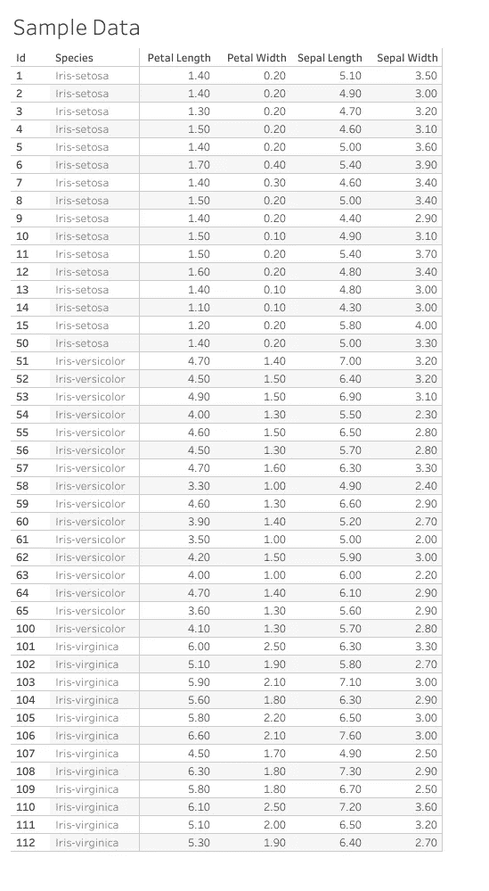
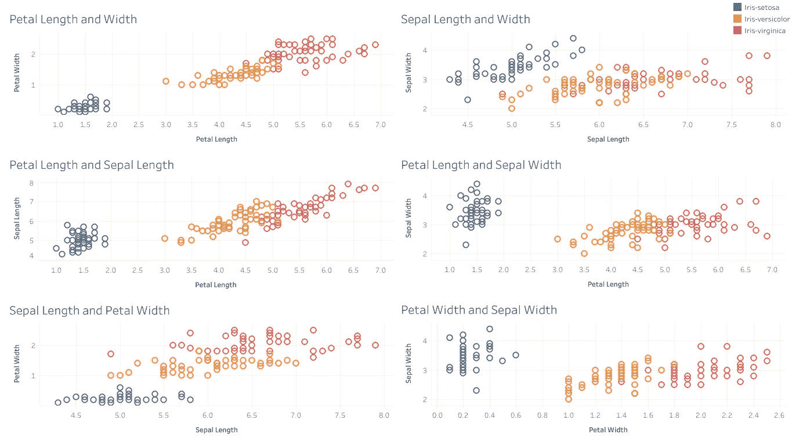
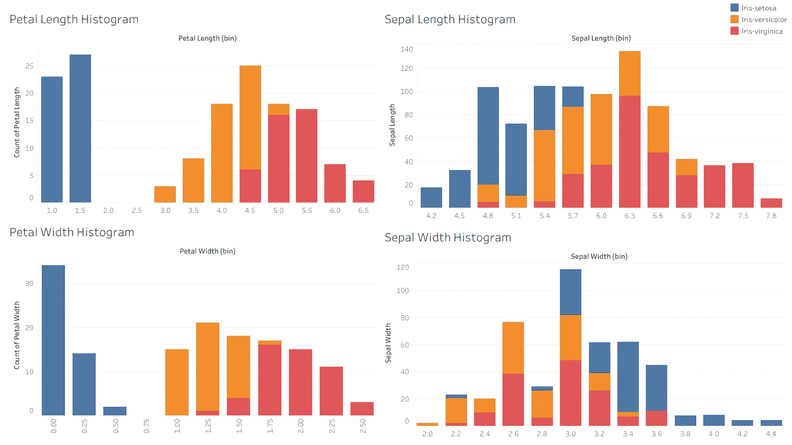
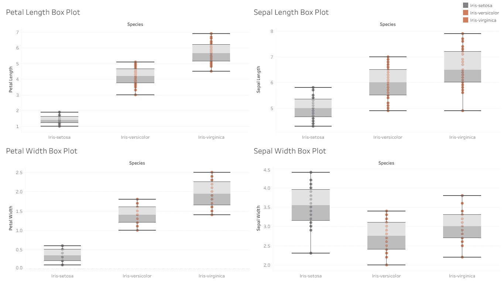

# EDA 演练 Iris 数据集

> 原文：<https://towardsdatascience.com/an-eda-walkthrough-the-iris-dataset-3f79246266c1?source=collection_archive---------35----------------------->

## 在拟合模型之前视觉探索虹膜数据集

这是一系列文章中的第一篇，在这篇文章中，我将通过不同的数据集展示建模前的景象。这些文章的目的是强调在为 ML 模型提供数据之前理解数据的重要性。

由[迈克尔·泽兹奇](https://unsplash.com/@lazycreekimages?utm_source=unsplash&utm_medium=referral&utm_content=creditCopyText)在 [Unsplash](https://unsplash.com/s/photos/artificial-intelligence?utm_source=unsplash&utm_medium=referral&utm_content=creditCopyText) 上拍摄的照片

## 介绍

目标源于对常见的 ML 模型是如何构建的理解。回归、神经网络、支持向量机和决策树是以迭代和自我改进的方式利用线性代数基础的模型。这些模型的单个部分背后的数学相对简单，例如神经网络可以被认为是一系列较小的回归，决策树是每个节点上简单的是/否规则的集合，这些规则将数据分成越来越小的子部分。这些都只是对数学运算的模仿，这些运算可能在我们的大脑中以普通的方式进行。扩展决策树的例子，如果我们想把动物分成不同的组，我们会寻找共同的属性——腿的数量，皮毛的颜色，它是生活在陆地还是海洋等等。尽管这些信息已经呈现在我们面前，但我们可能看不到的是其他不太相关的属性，比如眼睛的颜色或反应速度。

当存在大量不相关的属性时，一些 ML 模型可能不够智能，无法分离出相关的属性。因此，重要的是，我们提供给模型的输入给它做出正确预测的最佳机会。因此需要 EDA——探索性数据分析。即使我们不从数据中删除特征(在通过模型运行数据之前，我们不一定要这样做), EDA 也能让我们初步了解数据的组成。当我们进入建模阶段时，我们知道哪些变量预计会在预测中大量涉及(通常通过回归中的较高系数显示)，或者在分类问题中区分某些类别的困难可能在哪里。

也就是说，从 iris 数据集开始一系列机器学习似乎是唯一符合逻辑的。iris 数据集是 ML 历史上最古老和最著名的数据集之一。它由 R.A. Fisher 在 1936 年的一篇论文中用来引入聚类概念，并且通常是一个新的编码人员在分类问题上获得一些实践经验的最佳起点之一。

该数据集包含 150 行，平均分布在 3 种鸢尾花上。每个实例由 4 个值表征，其萼片长度、萼片宽度、花瓣长度和花瓣宽度，下面提供了一个示例。

作者图片

每个解释变量都是连续的，所以从散点图开始是合理的。

作者图片

从最初的观点来看，我们可以对这些情节做出一些结论。首先，在很大程度上，Setosa 花和 Versicolour 和 Virginica 之间有明显的区别，当我们观察花瓣的长度和宽度时，这一点尤其明显。在不使用机器学习的情况下，如果花瓣宽度小于 0.7 和/或花瓣长度小于 2，我们可能能够对 Setosa flower 进行分类(或者，如果您希望留出一些空间，因为我们不知道我们看不见的数据的确切性质，我们可以将边界设置为 2.5)。因此，我们应该可以轻松地用四个变量中的两个来完美地预测我们的 Setosa 花。这是我在评估我的模型时要考虑的特性之一。由于一个物种有如此大的差异，我预计特别是 Setosa 花的预测准确率为 100%，如果不是，这将需要进一步的调查。

作者图片

我们可能注意到的另一个特征是这个数据集中的复杂性来自于另外两个物种，云芝和海滨锦鸡儿。在所有 4 个变量中，没有一个变量能给我们提供任何明确的分离，这是可以理解的，因为如果我们确实看到了这一点，我们就不需要复杂的算法。花瓣宽度，作为一个单一的变量，似乎是最接近的，1.6 是一个潜在的边界数字。如果我们观察两个变量，穿过花瓣长度和宽度图的对角线是另一个粗略的估计值。

作者图片

当我们看箱线图时，我们注意到的第一件事是没有异常值。通过回顾散点图可以证实这一点，这告诉我们，我们不必对异常数据点的有效性进行任何抽查。我们也不希望任何非常不一致的数据点扭曲或分散我们的模型，虽然这不是我们在现实中遇到的典型数据集，但我们至少找到了一种方法来找到不寻常的值，并为未来的数据集提供了一个框架。

既然我们已经确定了濑户花分类的区别，我们的注意力应该转移到其他两个。一个有趣的观察是，特别是当观察萼片的长度和宽度时，似乎很难区分云芝和海滨锦葵。在这两种情况下，Virginica 似乎具有更高的方差，但是用非常相似的方法，这两个变量几乎是不可区分的。

事实上，唯一的变量似乎显示任何区别是花瓣长度和宽度，这证实了我们的观察散点图。Versicolor 和 Virginica 花的花瓣长度和宽度的平均值似乎相差很远，虽然它们在分布的末端有一些重叠值，但中间 50%的数据明显不同。

从几个图表来看，这些是我进入 ML 工作流建模阶段的最初想法。在这个数据集中，我特别关注我的测试数据中 Setosa 预测的准确性。我也对萼片长度和宽度的系数感兴趣，因为我不期望它们非常高，并且比花瓣长度和宽度小很多。当评估我的模型时，我可能还会重新运行一个算法，仅将花瓣长度和宽度作为我的输入变量，因为这些似乎提供了准确预测的最佳机会，我想知道萼片测量实际上是帮助还是阻碍了我的模型的性能。