# 将两个优化器结合起来，形成一个训练模型的强大方法

> 原文：<https://towardsdatascience.com/an-efficient-hybrid-algorithm-to-solve-nonlinear-least-squares-problems-262801bcfe25?source=collection_archive---------8----------------------->

## [实践教程](https://towardsdatascience.com/tagged/hands-on-tutorials)

## 当 Levenberg-Marquardt 遇到准牛顿。是的，我们用 Python 从头开始构建它！


由[约书亚·阿拉贡](https://unsplash.com/@goshua13?utm_source=medium&utm_medium=referral)在 [Unsplash](https://unsplash.com?utm_source=medium&utm_medium=referral) 上拍摄的照片

```
**Table of Contents** (read till the end to see how you can get the complete python code of this story)· [Seeing the Big Picture](#48e0)
· [Defining The Problem](#e640)
· [A Hybrid Method](#d4e9)
  ∘ [Objective Function](#0b95)
  ∘ [General Algorithm](#d56d)
  ∘ [Levenberg-Marquardt Step](#9602)
  ∘ [Quasi-Newton Step](#3fca)
· [Implementation](#d1e8)
· [Conclusion](#440b)
```

# 看到全局

在之前的文章中，我们已经看到了[梯度下降](/complete-step-by-step-gradient-descent-algorithm-from-scratch-acba013e8420)和[共轭梯度](/complete-step-by-step-conjugate-gradient-algorithm-from-scratch-202c07fb52a8)算法的作用，作为两种最简单的优化方法。我们实现了线搜索来搜索目标函数的优化方向。

还有另一种生成步骤的方法，称为*信任区域*。信赖域方法在当前迭代周围定义一个区域，在该区域内，它们相信模型是目标函数的适当表示，然后选择步长作为该区域中模型的近似极小值。实际上，与线搜索不同，它们同时选择方向和步长。

还有很多其他优化方法，如牛顿法和拟牛顿法。在本文中，我们将使用 Levenberg-Marquardt 和拟牛顿法的混合，利用信赖域进行步长选择。此外，这篇文章带来了一个不同的问题。我们将得到一个数据集和数据的非线性模型，然后找到模型的最佳优化参数，而不是找到目标函数的优化器。优化的参数是由那些给出最小残差平方的人定义的。有些人可能称之为曲线拟合问题。

让我们导入一些库。

# 定义问题

如下创建一个虚构的数据集。它有 11 个观察值和 2 个特征，第一个特征相当于第二个特征的索引。

```
t 	  y
------------------
[[ 0.0000 0.0000]
 [ 2.0000 3.5500]
 [ 4.0000 3.8200]
 [ 6.0000 2.9800]
 [ 8.0000 2.3200]
 [10.0000 1.4800]
 [12.0000 1.0200]
 [14.0000 0.8100]
 [16.0000 0.4100]
 [18.0000 0.4200]
 [20.0000 0.1500]]Data shape: (11, 2)
```

将数据可视化为卡特修斯平面中的点( *t* ， *y* ) = ( *tᵢ* ， *yᵢ* )，其中 *i* = 1，2，…，11。

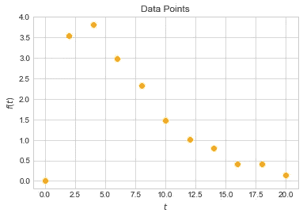

图片由[作者](http://dwiuzila.medium.com/membership)

我们立即意识到数据没有线性趋势(这里的点(0，0)是*而不是*一个异常值)。因此，我们使用的模型也是非线性的。相反，我们将使用两个指数函数的线性组合，根据定义，它被声明为

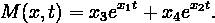

如前所述，参数 *x =* [ *x₁* ， *x₂* ， *x₃* ， *x₄* ，将使用 Levenberg-Marquardt (LM)和拟牛顿(QN)的混合方法进行估计。

# 混合方法

## 目标函数


图片由[矢量-市场](https://www.flaticon.com/authors/vectors-market)在[平面图标](http://flaticon.com)上显示

总的来说，我们要为一组 *m* 数据点( *tᵢ* 、 *yᵢ* )建立一个模型 *M* ( *x* 、 *t* )。为此，目标函数的具体定义是必要的。对于最小二乘问题，这个目标函数是每个数据点残差的平方和。数据点的残差由实际数据到模型预测的距离来定义，即通过用实际数据点减去该点的模型预测来定义。从数学上讲，第 *i* 个数据点的残差为

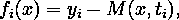

或者以向量的形式

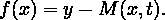

由于目标函数是每个数据点残差的平方和，因此可以写成

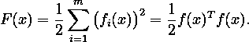

为方便推导 *F* ，附上上述系数。

设ǁ⋅ǁ是向量的最大范数的符号。我们的任务是找到使 *F* 最小的 *x* 。为此，我们将找到 *x* ，其中ǁ *g* ( *x* )ǁ ≈ 0，其中*g*=*f’*是 *F* 的一阶导数。衍生

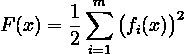

w.r.t .每个 *xⱼ* 利用链式法则，我们得到

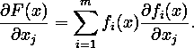

定义雅可比矩阵

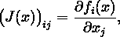

*g* 的值可以计算如下

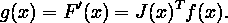

下面这个 python 函数，除了返回 *g* 之外，还返回 *J* ，后面会派上用场。

## 一般算法

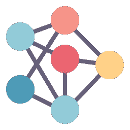

由 [becris](https://www.flaticon.com/authors/becris) 在[平面图标](http://flaticon.com)上拍摄的图像

设 *x** 为残差平方和的极小值。最小二乘问题可以用一般的最优化方法来解决，但我们将提出更有效的特殊方法。1988 年，Madsen [1]提出了一种混合方法，该方法将 LM 方法(二次收敛，如果 *F* ( *x** ) = 0，否则线性收敛)与 QN 方法相结合，即使 *F* ( *x** ) ≠ 0，该方法也能给出超线性收敛。

在信赖域方法中，算法在当前迭代 *x* 的邻域中生成 *F* 行为的*信任*模型 *L* ，

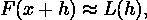

其中 *h* 是要采取的步骤。我们假设我们知道一个正数δ，使得该模型在半径为δ、以 *x* 为中心的球内足够精确，并且该算法将步长确定为

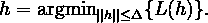

在*阻尼型*中，步长确定为

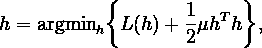

其中*阻尼参数* *μ* ≥ 0。该术语

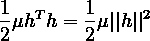

是用来惩罚大步流星的。

从现在开始，我们将开始迭代。因此，我们将引入一个索引 *k* ，这意味着所讨论的变量是针对第 *k* 次迭代的。例如， *xₖ* 是 *x* 在第 *k* 次迭代的值，如此类推*fₖ*=*f*(*xₖ*)*gₖ*=*g*(*xₖ*)*jₖ*=*j*(【t54

在迭代开始之前，重要的是初始化阻尼参数 *μ* = *μ* ₀和海森近似 *B* ₀(海森在迭代 *x* 时由*f】’*(*x*)定义，QN 方法使用其近似 *B* )。

*B* ₀的合理选择是对称正定矩阵 *I* ，即单位矩阵。 *μ* ₀的选择应与中元素的大小有关

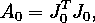

例如通过让

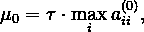

其中 *aᵢᵢ* ⁰是 *A* ₀的第 *i* 个对角线分量， *τ* 由用户选择。在本文中，我们将设置 *τ* = 1 × 10⁻。

下面这个 python 函数，除了返回 *μ* ₀，还返回 *A* ₀，后面会派上用场。

在初始化了 *μ* ₀和 *B* ₀之后，迭代从 LM 方法的一系列步骤开始。如果性能指示 *F* ( *x** )显著非零，那么我们切换到 QN 方法以获得更好的性能。我们可能会得到一个指示，即最好切换回 LM 方法，因此也有一个机制，我们将在后面介绍。迭代继续进行，直到满足以下停止标准之一:

*   目标函数的梯度的范数足够接近零，也就是说，

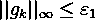

*   步长的范数满足

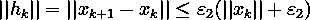

*   采取的步骤数是 1000

本文将 *ε* ₁和 *ε* ₂设为 1 × 10⁻⁵.

在每一步之后，无论是通过 LM 还是 QN 方法， *Bₖ* 通过首先定义来更新

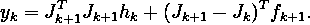

如果

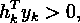

然后更新 *Bₖ* 由

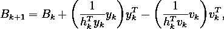

其中 *vₖ* = *Bₖhₖ* 。否则， *Bₖ* 不变，即 *Bₖ₊₁* = *Bₖ* 。

由 LM 或 QN 方法找到的新的*xₖ₊₁*=*xₖ*+*hₖ*然后被传递到下一次迭代。整个过程可以写成下面的代码。

现在，让我们来看看每一步的细节。上面的`LMstep()`和`QNstep()`函数是怎么回事？

## 勒文伯格-马夸特步骤

在混合迭代开始时，首先使用 LM 方法。在第 *k* 次迭代时，通过求解找到步骤 *hₖ*

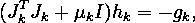

然后计算

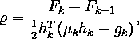

其中 *Fₖ₊₁* 就是*f*(*xₖ*+*hₖ*)。

然后我们考虑两种情况:

1.  如果*ϱ*t80】0，这意味着迭代成功，我们可以更新*xₖ₊₁*=*xₖ*+*hₖ*。此时，我们需要检查 *F* ( *x** )是否远离零，即通过检查:如果ǁ*gₖ*ǁ<0.02⋅*fₖ*连续三次迭代成功，那么我们就换成 QN 法进行下一次迭代。另外，更新

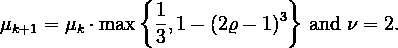

2.如果 *ϱ* ≤ 0，则迭代不成功，我们不会更新 *xₖ* ，即 *xₖ₊₁* = *xₖ* 。对于这种情况，更新 *μₖ₊₁* = *μₖν* 和 *ν* := 2 *ν* 。

上面说的 *μ* 的更新方法是尼尔森开发的。我们也有另一个由马夸特的变化，如下所示。

整个 LM 步骤如下所示。请注意，在下面的代码中，我们正在传递δ*ₖ*，这是 QN 步骤将使用的信赖域半径，以防我们在未来的迭代中将步骤计算方法更改为 QN。这里我们不用δ*ₖ*。

## 准牛顿步

由于 QN 方法使用信赖域进行步长计算，因此在开始使用 QN 方法时，初始化信赖域半径很重要

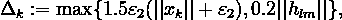

其中 *hₗₘ* 是前一个 LM 步获得的步。但是不要担心，这个初始化部分是不需要的，因为我们总是在 LM 和 QN 步骤中计算δ*ₖ*。如你所见，上面的最后一个公式已经嵌入到`LMstep()`函数行 14 中。

在第 *k* 次迭代时，通过求解找到步骤 *hₖ*

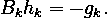

如果ǁ*hₖ*ǁ>δ*ₖ*，那么将 *hₖ* 的长度减少为δ*ₖ*，即通过设置

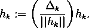

δ*ₖ*然后在 *ϱ* 的几个条件下被更新，其使用与我们在 LM 步骤中使用的公式相同的公式计算:

*   如果*ϱ*t94】0.25，则设定δ*ₖ₊₁*=δ*ₖ*/2
*   如果*ϱ*t95】0.75，则设定δ*ₖ₊₁*= max {δ*ₖ*，3 ǁ *hₖ* ǁ}
*   否则，δ*ₖ₊₁*=δ*ₖ*

接下来，我们考虑两种情况:

1.  如果*fₖ₊₁*≤(1+*δ*)*fₖ*和ǁ*gₖ₊₁*ǁ<ǁ*gₖ*ǁ，或者*fₙt34<*fₙ*，那么迭代成功，我们可以更新 *x 此时，我们专注于使 *g* 更接近零，因此我们接受 *F* 的值稍微增加，例如小至 *δ* = *√ε* 乘以先前的 *F* ，其中 *ε* 是机器ε。**
2.  否则迭代视为失败， *xₖ* 不会更新，即 *xₖ₊₁* = *xₖ* 。

如果梯度下降得不够快，即ǁ*gₖ₊₁*ǁ≥ǁ*gₖ*ǁ，那么我们转到 LM 步进行下一次迭代。

整个 QN 步骤可以如下所示。注意，在下面的代码中，我们像在 LM 步骤中一样计算 *ϱ* 。

# 履行

我们现在准备应用我们的知识来解决本文开头定义的问题。我们将在三种不同的情况下改变初始点:

*   ₀ = [-1，1，-10，10]
*   ₀ = [-4，1，2，-3]
*   ₀ = [0，0，0，0]

但首先，让我们引入一个 python 函数`MakeAnimation()`来动画化算法的学习过程。

## 场景 1

```
Iteration:1	x = [-1.0000 0.9500 -10.0000 9.9997], 
		gradient = 64932772695986634752.0000, step = LM
Iteration:2	x = [-1.0000 0.9001 -10.0000 9.9994], 
		gradient = 8871075343566318592.0000, step = LM
Iteration:3	x = [-1.0000 0.8510 -10.0000 9.9992], 
		gradient = 1250145055141384192.0000, step = LM
Iteration:4	x = [-1.0000 0.8050 -10.0000 9.9990], 
		gradient = 199964648437467488.0000, step = LM
Iteration:5	x = [-1.0000 0.7686 -10.0000 9.9988], 
		gradient = 46950703393293552.0000, step = LM
Iteration:6	x = [-1.0000 0.7454 -10.0000 9.9987], 
		gradient = 18613190948807260.0000, step = LM
Iteration:7	x = [-1.0000 0.7283 -10.0000 9.9986], 
		gradient = 9421138350386658.0000, step = LM
Iteration:8	x = [-1.0000 0.7127 -10.0000 9.9985], 
		gradient = 5067642599353893.0000, step = LM
Iteration:9	x = [-1.0000 0.6974 -10.0000 9.9984], 
		gradient = 2761173975265880.5000, step = LM
Iteration:10	x = [-1.0000 0.6822 -10.0000 9.9983], 
		gradient = 1508437660486741.0000, step = LM
Iteration:11	x = [-1.0000 0.6670 -10.0000 9.9983], 
		gradient = 824513384402736.2500, step = LM
Iteration:12	x = [-1.0000 0.6518 -10.0000 9.9982], 
		gradient = 450734053994430.5000, step = LM
Iteration:13	x = [-1.0000 0.6366 -10.0000 9.9981], 
		gradient = 246409971021028.8438, step = LM
Iteration:14	x = [-1.0000 0.6214 -10.0000 9.9980], 
		gradient = 134711382454059.4531, step = LM
Iteration:15	x = [-1.0000 0.6062 -10.0000 9.9980], 
		gradient = 73647395414745.6094, step = LM
Iteration:16	x = [-1.0000 0.5909 -10.0000 9.9979], 
		gradient = 40264084923738.5469, step = LM
Iteration:17	x = [-1.0000 0.5757 -10.0000 9.9978], 
		gradient = 22013352246245.9766, step = LM
Iteration:18	x = [-1.0000 0.5605 -10.0000 9.9977], 
		gradient = 12035471978657.0332, step = LM
Iteration:19	x = [-1.0000 0.5452 -10.0000 9.9976], 
		gradient = 6580356674017.7891, step = LM
Iteration:20	x = [-1.0000 0.5299 -10.0000 9.9976], 
		gradient = 3597874150520.1475, step = LM
Iteration:21	x = [-1.0000 0.5146 -10.0000 9.9975], 
		gradient = 1967223429070.2634, step = LM
Iteration:22	x = [-1.0000 0.4993 -10.0000 9.9974], 
		gradient = 1075656653534.5968, step = LM
Iteration:23	x = [-1.0000 0.4840 -10.0000 9.9973], 
		gradient = 588175745878.2034, step = LM
Iteration:24	x = [-1.0000 0.4687 -10.0000 9.9973], 
		gradient = 321629128815.2425, step = LM
Iteration:25	x = [-1.0000 0.4534 -10.0000 9.9972], 
		gradient = 175881428072.9430, step = LM
Iteration:26	x = [-1.0000 0.4380 -10.0000 9.9971], 
		gradient = 96183963098.1861, step = LM
Iteration:27	x = [-1.0000 0.4226 -10.0000 9.9970], 
		gradient = 52602379508.8333, step = LM
Iteration:28	x = [-1.0000 0.4072 -10.0000 9.9969], 
		gradient = 28769372395.6593, step = LM
Iteration:29	x = [-1.0000 0.3918 -10.0000 9.9969], 
		gradient = 15735488020.7650, step = LM
Iteration:30	x = [-1.0000 0.3763 -10.0000 9.9968], 
		gradient = 8607119032.2862, step = LM
Iteration:31	x = [-1.0000 0.3609 -10.0000 9.9967], 
		gradient = 4708326165.4597, step = LM
Iteration:32	x = [-1.0000 0.3454 -10.0000 9.9966], 
		gradient = 2575789155.9012, step = LM
Iteration:33	x = [-1.0000 0.3298 -10.0000 9.9965], 
		gradient = 1409268155.2911, step = LM
Iteration:34	x = [-1.0000 0.3142 -10.0000 9.9965], 
		gradient = 771119669.0625, step = LM
Iteration:35	x = [-1.0000 0.2986 -10.0000 9.9964], 
		gradient = 421988746.9021, step = LM
Iteration:36	x = [-1.0000 0.2829 -10.0000 9.9963], 
		gradient = 230960695.7163, step = LM
Iteration:37	x = [-1.0000 0.2672 -10.0000 9.9962], 
		gradient = 126427578.6262, step = LM
Iteration:38	x = [-1.0000 0.2514 -10.0000 9.9961], 
		gradient = 69218466.4778, step = LM
Iteration:39	x = [-1.0000 0.2356 -10.0000 9.9960], 
		gradient = 37904445.7661, step = LM
Iteration:40	x = [-1.0000 0.2197 -10.0000 9.9960], 
		gradient = 20761560.5190, step = LM
Iteration:41	x = [-1.0000 0.2036 -10.0000 9.9959], 
		gradient = 11374897.3379, step = LM
Iteration:42	x = [-1.0000 0.1875 -10.0000 9.9958], 
		gradient = 6234064.0376, step = LM
Iteration:43	x = [-1.0000 0.1713 -10.0000 9.9957], 
		gradient = 3417848.7040, step = LM
Iteration:44	x = [-1.0000 0.1550 -10.0000 9.9956], 
		gradient = 1874634.8523, step = LM
Iteration:45	x = [-1.0000 0.1385 -10.0000 9.9955], 
		gradient = 1028702.8782, step = LM
Iteration:46	x = [-1.0000 0.1218 -10.0000 9.9954], 
		gradient = 564808.7854, step = LM
Iteration:47	x = [-1.0000 0.1049 -10.0000 9.9953], 
		gradient = 310298.2705, step = LM
Iteration:48	x = [-1.0000 0.0877 -10.0000 9.9952], 
		gradient = 170587.3249, step = LM
Iteration:49	x = [-1.0000 0.0703 -10.0000 9.9951], 
		gradient = 93845.4326, step = LM
Iteration:50	x = [-1.0000 0.0524 -10.0000 9.9950], 
		gradient = 51660.5782, step = LM
Iteration:51	x = [-1.0000 0.0341 -10.0000 9.9949], 
		gradient = 28451.8639, step = LM
Iteration:52	x = [-1.0000 0.0153 -10.0000 9.9947], 
		gradient = 15670.8490, step = LM
Iteration:53	x = [-0.9999 -0.0043 -10.0000 9.9946], 
		gradient = 8624.8546, step = LM
Iteration:54	x = [-0.9999 -0.0246 -10.0000 9.9944], 
		gradient = 4736.1605, step = LM
Iteration:55	x = [-0.9998 -0.0461 -10.0000 9.9941], 
		gradient = 2587.7373, step = LM
Iteration:56	x = [-0.9996 -0.0687 -10.0000 9.9939], 
		gradient = 1399.9325, step = LM
Iteration:57	x = [-0.9993 -0.0928 -10.0000 9.9936], 
		gradient = 743.3551, step = LM
Iteration:58	x = [-0.9987 -0.1184 -10.0001 9.9931], 
		gradient = 381.2687, step = LM
Iteration:59	x = [-0.9976 -0.1456 -10.0001 9.9925], 
		gradient = 183.0379, step = LM
Iteration:60	x = [-0.9952 -0.1736 -10.0002 9.9917], 
		gradient = 76.6425, step = LM
Iteration:61	x = [-0.9894 -0.1972 -10.0005 9.9901], 
		gradient = 26.4382, step = LM
Iteration:62	x = [-0.9744 -0.2105 -10.0012 9.9871], 
		gradient = 6.8472, step = LM
Iteration:63	x = [-0.9336 -0.2136 -10.0030 9.9797], 
		gradient = 4.4702, step = LM
Iteration:64	x = [-0.8269 -0.2088 -10.0070 9.9631], 
		gradient = 4.2573, step = LM
Iteration:65	x = [-0.6379 -0.1953 -10.0103 9.9430], 
		gradient = 6.5882, step = LM
Iteration:66	x = [-0.5576 -0.1832 -10.0023 9.9499], 
		gradient = 1.3240, step = LM
Iteration:67	x = [-0.5559 -0.1827 -9.9933 9.9681], 
		gradient = 0.0227, step = LM
Iteration:68	x = [-0.5544 -0.1829 -10.0000 9.9888], 
		gradient = 0.0087, step = LM
Iteration:69	x = [-0.5527 -0.1832 -10.0389 10.0305], 
		gradient = 0.0117, step = LM
Iteration:70	x = [-0.5482 -0.1843 -10.1523 10.1442], 
		gradient = 0.0548, step = LM
Iteration:71	x = [-0.5372 -0.1868 -10.4402 10.4325], 
		gradient = 0.2795, step = LM
Iteration:72	x = [-0.5173 -0.1916 -11.0244 11.0175], 
		gradient = 1.0133, step = LM
Iteration:73	x = [-0.5025 -0.1958 -11.5877 11.5812], 
		gradient = 0.7806, step = LM
Iteration:74	x = [-0.4883 -0.2000 -12.1891 12.1835], 
		gradient = 0.8407, step = LM
Iteration:75	x = [-0.4787 -0.2030 -12.6707 12.6659], 
		gradient = 0.4784, step = LM
Iteration:76	x = [-0.4704 -0.2057 -13.1195 13.1156], 
		gradient = 0.4040, step = LM
Iteration:77	x = [-0.4656 -0.2073 -13.4055 13.4021], 
		gradient = 0.1502, step = LM
Iteration:78	x = [-0.4629 -0.2083 -13.5758 13.5728], 
		gradient = 0.0525, step = LM
Iteration:79	x = [-0.4622 -0.2085 -13.6183 13.6154], 
		gradient = 0.0030, step = LM
Iteration:80	x = [-0.4622 -0.2085 -13.6218 13.6188], 
		gradient = 0.0000, step = LM
Iteration:81	x = [-0.4622 -0.2085 -13.6218 13.6188], 
		gradient = 0.0000, step = LMFinal estimated parameters: [-0.4622 -0.2085 -13.6218 13.6188]
```

视频作者[作者](http://dwiuzila.medium.com/membership)

该算法运行 81 次迭代，产生参数估计结果 *x** = [-0.46，-0.21，-13.62，13.62]，ǁ *g* ( *x** )ǁ ≈ 0。换句话说，该算法在满足停止准则ǁ *gₖ* ǁ ≤ *ε* ₁的情况下成功收敛。还可以看出，该算法在给定数据的曲线拟合中总是使用 LM 方法。这意味着每连续 3 次迭代，就有一次迭代 *xₖ* 满足ǁ*gₖ*ǁ≥0.02⋅*fₖ*。

## 场景 2

```
Iteration:1	x = [-4.0000 0.9500 2.0000 -2.9990], 
		gradient = 5843944048763837440.0000, step = LM
Iteration:2	x = [-4.0000 0.9001 2.0000 -2.9981], 
		gradient = 798393836723220864.0000, step = LM
Iteration:3	x = [-4.0000 0.8510 2.0000 -2.9973], 
		gradient = 112511464378970688.0000, step = LM
Iteration:4	x = [-4.0000 0.8050 2.0000 -2.9965], 
		gradient = 17995869734728704.0000, step = LM
Iteration:5	x = [-4.0000 0.7687 2.0000 -2.9959], 
		gradient = 4224958744295105.0000, step = LM
Iteration:6	x = [-4.0000 0.7454 2.0000 -2.9955], 
		gradient = 1674832246409442.5000, step = LM
Iteration:7	x = [-4.0000 0.7283 2.0000 -2.9952], 
		gradient = 847705835813273.6250, step = LM
Iteration:8	x = [-4.0000 0.7128 2.0000 -2.9950], 
		gradient = 455980000478269.1875, step = LM
Iteration:9	x = [-4.0000 0.6975 2.0000 -2.9947], 
		gradient = 248446618239291.2812, step = LM
Iteration:10	x = [-4.0000 0.6823 2.0000 -2.9945], 
		gradient = 135727074063636.5469, step = LM
Iteration:11	x = [-4.0000 0.6671 2.0000 -2.9942], 
		gradient = 74188516827416.2656, step = LM
Iteration:12	x = [-4.0000 0.6519 2.0000 -2.9940], 
		gradient = 40556383042130.0234, step = LM
Iteration:13	x = [-4.0000 0.6367 2.0000 -2.9937], 
		gradient = 22171597557325.9102, step = LM
Iteration:14	x = [-4.0000 0.6215 2.0000 -2.9934], 
		gradient = 12121123175141.8398, step = LM
Iteration:15	x = [-4.0000 0.6063 2.0000 -2.9932], 
		gradient = 6626677353862.0400, step = LM
Iteration:16	x = [-4.0000 0.5910 2.0000 -2.9929], 
		gradient = 3622898207455.6821, step = LM
Iteration:17	x = [-4.0000 0.5758 2.0000 -2.9927], 
		gradient = 1980725783949.0017, step = LM
Iteration:18	x = [-4.0000 0.5606 2.0000 -2.9924], 
		gradient = 1082932002365.9087, step = LM
Iteration:19	x = [-4.0000 0.5453 2.0000 -2.9922], 
		gradient = 592089574010.1783, step = LM
Iteration:20	x = [-4.0000 0.5300 2.0000 -2.9919], 
		gradient = 323730717048.8542, step = LM
Iteration:21	x = [-4.0000 0.5148 2.0000 -2.9916], 
		gradient = 177007495788.6531, step = LM
Iteration:22	x = [-4.0000 0.4995 2.0000 -2.9914], 
		gradient = 96785827387.7305, step = LM
Iteration:23	x = [-4.0000 0.4842 2.0000 -2.9911], 
		gradient = 52923125898.6776, step = LM
Iteration:24	x = [-4.0000 0.4688 2.0000 -2.9909], 
		gradient = 28939714442.5817, step = LM
Iteration:25	x = [-4.0000 0.4535 2.0000 -2.9906], 
		gradient = 15825580540.4678, step = LM
Iteration:26	x = [-4.0000 0.4381 2.0000 -2.9903], 
		gradient = 8654531799.0783, step = LM
Iteration:27	x = [-4.0000 0.4228 2.0000 -2.9901], 
		gradient = 4733127210.2534, step = LM
Iteration:28	x = [-4.0000 0.4074 2.0000 -2.9898], 
		gradient = 2588665603.7885, step = LM
Iteration:29	x = [-4.0000 0.3919 2.0000 -2.9895], 
		gradient = 1415891078.6356, step = LM
Iteration:30	x = [-4.0000 0.3765 2.0000 -2.9893], 
		gradient = 774485568.1282, step = LM
Iteration:31	x = [-4.0000 0.3610 2.0000 -2.9890], 
		gradient = 423672773.1613, step = LM
Iteration:32	x = [-4.0000 0.3455 2.0000 -2.9887], 
		gradient = 231785640.8201, step = LM
Iteration:33	x = [-4.0000 0.3300 2.0000 -2.9885], 
		gradient = 126819882.7775, step = LM
Iteration:34	x = [-4.0000 0.3144 2.0000 -2.9882], 
		gradient = 69396974.7767, step = LM
Iteration:35	x = [-4.0000 0.2988 2.0000 -2.9879], 
		gradient = 37980046.8186, step = LM
Iteration:36	x = [-4.0000 0.2831 2.0000 -2.9876], 
		gradient = 20789502.5936, step = LM
Iteration:37	x = [-4.0000 0.2674 2.0000 -2.9874], 
		gradient = 11382078.3240, step = LM
Iteration:38	x = [-4.0000 0.2516 2.0000 -2.9871], 
		gradient = 6233151.4407, step = LM
Iteration:39	x = [-4.0000 0.2358 2.0000 -2.9868], 
		gradient = 3414510.4438, step = LM
Iteration:40	x = [-4.0000 0.2198 2.0000 -2.9865], 
		gradient = 1871192.9516, step = LM
Iteration:41	x = [-4.0000 0.2038 2.0000 -2.9862], 
		gradient = 1025947.0256, step = LM
Iteration:42	x = [-4.0000 0.1877 2.0000 -2.9859], 
		gradient = 562874.5612, step = LM
Iteration:43	x = [-4.0000 0.1714 2.0000 -2.9856], 
		gradient = 309077.3735, step = LM
Iteration:44	x = [-4.0000 0.1550 2.0000 -2.9853], 
		gradient = 169908.6045, step = LM
Iteration:45	x = [-4.0000 0.1384 2.0000 -2.9850], 
		gradient = 93547.0603, step = LM
Iteration:46	x = [-4.0000 0.1215 2.0000 -2.9847], 
		gradient = 51612.8671, step = LM
Iteration:47	x = [-4.0000 0.1044 2.0000 -2.9843], 
		gradient = 28559.4009, step = LM
Iteration:48	x = [-4.0000 0.0869 2.0000 -2.9839], 
		gradient = 15867.2252, step = LM
Iteration:49	x = [-4.0000 0.0688 2.0000 -2.9835], 
		gradient = 8865.7762, step = LM
Iteration:50	x = [-4.0000 0.0500 2.0000 -2.9830], 
		gradient = 4993.1844, step = LM
Iteration:51	x = [-4.0000 0.0303 2.0000 -2.9825], 
		gradient = 2843.2836, step = LM
Iteration:52	x = [-4.0000 0.0092 2.0000 -2.9818], 
		gradient = 1643.5749, step = LM
Iteration:53	x = [-4.0000 -0.0138 2.0000 -2.9809], 
		gradient = 969.1664, step = LM
Iteration:54	x = [-4.0000 -0.0397 2.0001 -2.9798], 
		gradient = 585.9656, step = LM
Iteration:55	x = [-4.0000 -0.0695 2.0001 -2.9782], 
		gradient = 364.7187, step = LM
Iteration:56	x = [-4.0000 -0.1047 2.0003 -2.9760], 
		gradient = 233.9465, step = LM
Iteration:57	x = [-4.0000 -0.1465 2.0005 -2.9730], 
		gradient = 154.2224, step = LM
Iteration:58	x = [-4.0000 -0.1954 2.0008 -2.9690], 
		gradient = 103.9455, step = LM
Iteration:59	x = [-4.0000 -0.2516 2.0014 -2.9638], 
		gradient = 71.2219, step = LM
Iteration:60	x = [-4.0000 -0.3152 2.0023 -2.9571], 
		gradient = 49.3390, step = LM
Iteration:61	x = [-4.0000 -0.3865 2.0037 -2.9486], 
		gradient = 34.3994, step = LM
Iteration:62	x = [-4.0000 -0.4659 2.0060 -2.9378], 
		gradient = 24.0583, step = LM
Iteration:63	x = [-3.9999 -0.5540 2.0095 -2.9242], 
		gradient = 16.8404, step = LM
Iteration:64	x = [-3.9999 -0.6510 2.0148 -2.9069], 
		gradient = 11.7791, step = LM
Iteration:65	x = [-3.9998 -0.7574 2.0228 -2.8848], 
		gradient = 8.2216, step = LM
Iteration:66	x = [-3.9998 -0.8733 2.0348 -2.8567], 
		gradient = 5.7186, step = LM
Iteration:67	x = [-3.9996 -0.9990 2.0522 -2.8209], 
		gradient = 3.9571, step = LM
Iteration:68	x = [-3.9995 -1.1349 2.0768 -2.7754], 
		gradient = 2.7180, step = LM
Iteration:69	x = [-3.9992 -1.2813 2.1103 -2.7183], 
		gradient = 1.8476, step = LM
Iteration:70	x = [-3.9987 -1.4390 2.1533 -2.6485], 
		gradient = 1.2392, step = LM
Iteration:71	x = [-3.9980 -1.6079 2.2038 -2.5681], 
		gradient = 0.8190, step = LM
Iteration:72	x = [-3.9968 -1.7865 2.2547 -2.4842], 
		gradient = 0.5357, step = LM
Iteration:73	x = [-3.9949 -1.9699 2.2945 -2.4089], 
		gradient = 0.3513, step = LM
Iteration:74	x = [-3.9920 -2.1517 2.3148 -2.3524], 
		gradient = 0.2345, step = LM
Iteration:75	x = [-3.9878 -2.3283 2.3156 -2.3155], 
		gradient = 0.1603, step = LM
Iteration:76	x = [-3.9863 -2.3635 2.3124 -2.3081], 
		gradient = 0.1487, step = QN
Iteration:77	x = [-3.9803 -2.4682 2.2972 -2.2863], 
		gradient = 0.1189, step = QN
Iteration:78	x = [-3.9577 -2.7803 2.2395 -2.2211], 
		gradient = 0.0613, step = QN
Iteration:79	x = [-3.9319 -3.0541 2.1785 -2.1639], 
		gradient = 0.0344, step = QN
Iteration:80	x = [-3.9000 -3.3271 2.1135 -2.1068], 
		gradient = 0.0193, step = QN
Iteration:81	x = [-3.8784 -3.4807 2.0776 -2.0748], 
		gradient = 0.0140, step = QN
Iteration:82	x = [-3.8657 -3.5574 2.0604 -2.0588], 
		gradient = 0.0119, step = QN
Iteration:83	x = [-3.8510 -3.6338 2.0437 -2.0428], 
		gradient = 0.0101, step = QN
Iteration:84	x = [-3.8335 -3.7098 2.0276 -2.0269], 
		gradient = 0.0086, step = QN
Iteration:85	x = [-3.8227 -3.7473 2.0198 -2.0191], 
		gradient = 0.0080, step = QN
Iteration:86	x = [-3.8090 -3.7840 2.0123 -2.0114], 
		gradient = 0.0074, step = QN
Iteration:87	x = [-3.7911 -3.8190 2.0053 -2.0041], 
		gradient = 0.0073, step = QN
Iteration:88	x = [-3.7664 -3.8489 1.9996 -1.9979], 
		gradient = 0.0076, step = QN
Iteration:89	x = [-3.7581 -3.8559 1.9998 -1.9981], 
		gradient = 0.0077, step = LM
Iteration:90	x = [-3.7330 -3.8766 2.0004 -1.9986], 
		gradient = 0.0081, step = LM
Iteration:91	x = [-3.6535 -3.9361 2.0028 -2.0011], 
		gradient = 0.0096, step = LM
Iteration:92	x = [-3.3739 -4.0948 2.0180 -2.0161], 
		gradient = 0.0168, step = LM
Iteration:93	x = [-1.8970 -4.4431 2.1579 -2.1553], 
		gradient = 0.3573, step = LM
Iteration:94	x = [-1.8970 -4.4431 2.1579 -2.1553], 
		gradient = 0.3573, step = LM
Iteration:95	x = [-1.8970 -4.4431 2.1579 -2.1553], 
		gradient = 0.3573, step = LM
Iteration:96	x = [-1.8970 -4.4431 2.1579 -2.1553], 
		gradient = 0.3573, step = LM
Iteration:97	x = [-0.4821 -4.4514 2.3330 -2.2979], 
		gradient = 12.9667, step = LM
Iteration:98	x = [-0.4821 -4.4514 2.3330 -2.2979], 
		gradient = 12.9667, step = LM
Iteration:99	x = [-0.4821 -4.4514 2.3330 -2.2979], 
		gradient = 12.9667, step = LM
Iteration:100	x = [-0.4821 -4.4514 2.3330 -2.2979], 
		gradient = 12.9667, step = LM
Iteration:101	x = [-0.4821 -4.4514 2.3330 -2.2979], 
		gradient = 12.9667, step = LM
Iteration:102	x = [-0.3361 -4.4514 2.3517 -2.2985], 
		gradient = 23.2634, step = LM
Iteration:103	x = [-0.3361 -4.4514 2.3517 -2.2985], 
		gradient = 23.2634, step = LM
Iteration:104	x = [-0.0195 -4.4514 2.3844 -2.3000], 
		gradient = 141.8487, step = LM
Iteration:105	x = [-0.0542 -4.4514 2.5491 -2.3129], 
		gradient = 2.7825, step = LM
Iteration:106	x = [-0.0622 -4.4515 2.7408 -2.3468], 
		gradient = 3.8567, step = LM
Iteration:107	x = [-0.0733 -4.4516 3.1240 -2.5063], 
		gradient = 5.6536, step = LM
Iteration:108	x = [-0.0887 -4.4519 3.7063 -3.0302], 
		gradient = 7.1668, step = LM
Iteration:109	x = [-0.1056 -4.4518 4.4259 -4.0061], 
		gradient = 6.3086, step = LM
Iteration:110	x = [-0.1190 -4.4484 5.0608 -4.9286], 
		gradient = 3.4276, step = LM
Iteration:111	x = [-0.1236 -4.4311 5.3256 -5.3076], 
		gradient = 0.7579, step = LM
Iteration:112	x = [-0.1239 -4.3717 5.3572 -5.3565], 
		gradient = 0.0396, step = LM
Iteration:113	x = [-0.1239 -4.1687 5.3583 -5.3584], 
		gradient = 0.0016, step = LM
Iteration:114	x = [-0.1240 -3.2559 5.3610 -5.3611], 
		gradient = 0.0427, step = LM
Iteration:115	x = [-0.1240 -3.2559 5.3610 -5.3611], 
		gradient = 0.0427, step = LM
Iteration:116	x = [-0.1240 -3.2559 5.3610 -5.3611], 
		gradient = 0.0427, step = LM
Iteration:117	x = [-0.1248 -1.1768 5.4018 -5.4026], 
		gradient = 4.7877, step = LM
Iteration:118	x = [-0.1248 -1.1768 5.4018 -5.4026], 
		gradient = 4.7877, step = LM
Iteration:119	x = [-0.1248 -1.1768 5.4018 -5.4026], 
		gradient = 4.7877, step = LM
Iteration:120	x = [-0.1248 -1.1768 5.4018 -5.4026], 
		gradient = 4.7877, step = LM
Iteration:121	x = [-0.1248 -1.1768 5.4018 -5.4026], 
		gradient = 4.7877, step = LM
Iteration:122	x = [-0.1244 -1.1290 5.5183 -5.4517], 
		gradient = 0.1904, step = LM
Iteration:123	x = [-0.1292 -1.0057 5.7614 -5.6610], 
		gradient = 1.1816, step = LM
Iteration:124	x = [-0.1382 -0.8383 6.2791 -6.1944], 
		gradient = 3.1482, step = LM
Iteration:125	x = [-0.1464 -0.7806 6.8138 -6.7630], 
		gradient = 1.7846, step = LM
Iteration:126	x = [-0.1599 -0.6524 7.7451 -7.7208], 
		gradient = 5.7805, step = LM
Iteration:127	x = [-0.1658 -0.6428 8.2978 -8.2944], 
		gradient = 0.8161, step = LM
Iteration:128	x = [-0.1770 -0.5710 9.2787 -9.2788], 
		gradient = 4.5341, step = LM
Iteration:129	x = [-0.1818 -0.5588 9.8477 -9.8546], 
		gradient = 0.7032, step = LM
Iteration:130	x = [-0.1902 -0.5204 10.7897 -10.7955], 
		gradient = 2.9184, step = LM
Iteration:131	x = [-0.1941 -0.5090 11.3439 -11.3510], 
		gradient = 0.6201, step = LM
Iteration:132	x = [-0.1999 -0.4878 12.1563 -12.1617], 
		gradient = 1.6519, step = LM
Iteration:133	x = [-0.2027 -0.4799 12.6128 -12.6178], 
		gradient = 0.3816, step = LM
Iteration:134	x = [-0.2059 -0.4697 13.1434 -13.1472], 
		gradient = 0.5800, step = LM
Iteration:135	x = [-0.2073 -0.4656 13.4035 -13.4068], 
		gradient = 0.1173, step = LM
Iteration:136	x = [-0.2082 -0.4629 13.5699 -13.5729], 
		gradient = 0.0504, step = LM
Iteration:137	x = [-0.2085 -0.4622 13.6148 -13.6177], 
		gradient = 0.0034, step = LM
Iteration:138	x = [-0.2085 -0.4622 13.6188 -13.6218], 
		gradient = 0.0000, step = LM
Iteration:139	x = [-0.2085 -0.4622 13.6188 -13.6218], 
		gradient = 0.0000, step = LMFinal estimated parameters: [-0.2085 -0.4622 13.6188 -13.6218]
```

视频作者[作者](http://dwiuzila.medium.com/membership)

该算法运行多达 139 次迭代，产生参数估计结果 *x** = [-0.21，-0.46，13.62，-13.62]，ǁ *g* ( *x** )ǁ ≈ 0。换句话说，该算法在满足停止准则ǁ *gₖ* ǁ ≤ *ε* ₁的情况下成功收敛。还可以看出，在给定数据的曲线拟合过程中，算法在第 76–88 次迭代时将步长方法改为 QN，然后再改回 LM。这意味着在迭代 76 之前的最后 3 次迭代中，没有迭代 *xₖ* 满足ǁ*gₖ*ǁ≥0.02⋅*fₖ*从而 QN 方法被认为在迭代 76 之后能够比 LM 方法更快地收敛。然后，在迭代 88，我们得到ǁ*gₖ₊₁*ǁ≥ǁ*gₖ*ǁ，这意味着使用 QN 方法梯度下降得不够快，使得该方法切换到 LM 用于下一次迭代。

因为初始值 *x* ₀离解很远，所以需要比场景 1 更多的迭代。还有，注意到目前为止满足收敛值 *x** 的解有两个，分别是 *x** = [-0.46，-0.21，-13.62，13.62]和 *x** = [-0.21，-0.46，13.62，-13.62]。

## 场景 3

```
Iteration:1	x = [0.0000 0.0000 0.7705 0.7705], 
		gradient = 42.5292, step = LM
Iteration:2	x = [-0.0815 -0.0815 1.3987 1.3987], 
		gradient = 16.7516, step = LM
Iteration:3	x = [-0.0400 -0.0400 1.2150 1.2150], 
		gradient = 18.3468, step = LM
Iteration:4	x = [-0.0607 -0.0695 1.3851 1.3851], 
		gradient = 4.8184, step = LM
Iteration:5	x = [-0.0607 -0.0695 1.3851 1.3851], 
		gradient = 4.8184, step = LM
Iteration:6	x = [-0.0607 -0.0695 1.3851 1.3851], 
		gradient = 4.8184, step = LM
Iteration:7	x = [-0.0607 -0.0695 1.3851 1.3851], 
		gradient = 4.8184, step = LM
Iteration:8	x = [-0.0607 -0.0695 1.3851 1.3851], 
		gradient = 4.8184, step = LM
Iteration:9	x = [-0.0607 -0.0695 1.3851 1.3851], 
		gradient = 4.8184, step = LM
Iteration:10	x = [-0.0631 -0.0584 1.3830 1.3830], 
		gradient = 1.3008, step = LM
Iteration:11	x = [-0.0596 -0.0627 1.3811 1.3811], 
		gradient = 0.4178, step = LM
Iteration:12	x = [-0.0620 -0.0601 1.3793 1.3792], 
		gradient = 0.2770, step = LM
Iteration:13	x = [-0.0604 -0.0616 1.3775 1.3775], 
		gradient = 0.2522, step = LM
Iteration:14	x = [-0.0613 -0.0605 1.3758 1.3757], 
		gradient = 0.2432, step = LM
Iteration:15	x = [-0.0604 -0.0612 1.3737 1.3737], 
		gradient = 0.2332, step = LM
Iteration:16	x = [-0.0615 -0.0597 1.3708 1.3708], 
		gradient = 0.2541, step = LM
Iteration:17	x = [-0.0582 -0.0627 1.3678 1.3677], 
		gradient = 0.6396, step = LM
Iteration:18	x = [-0.0582 -0.0627 1.3678 1.3677], 
		gradient = 0.6396, step = LM
Iteration:19	x = [-0.0607 -0.0600 1.3668 1.3668], 
		gradient = 0.1995, step = LM
Iteration:20	x = [-0.0603 -0.0604 1.3658 1.3658], 
		gradient = 0.1930, step = LM
Iteration:21	x = [-0.0603 -0.0601 1.3639 1.3638], 
		gradient = 0.1840, step = LM
Iteration:22	x = [-0.0593 -0.0605 1.3587 1.3586], 
		gradient = 0.2076, step = LM
Iteration:23	x = [-0.0593 -0.0605 1.3587 1.3586], 
		gradient = 0.2076, step = LM
Iteration:24	x = [-0.0593 -0.0605 1.3587 1.3586], 
		gradient = 0.2076, step = LM
Iteration:25	x = [-0.0608 -0.0590 1.3571 1.3570], 
		gradient = 0.2311, step = LM
Iteration:26	x = [-0.0584 -0.0611 1.3556 1.3555], 
		gradient = 0.3672, step = LM
Iteration:27	x = [-0.0609 -0.0586 1.3545 1.3544], 
		gradient = 0.3171, step = LM
Iteration:28	x = [-0.0590 -0.0603 1.3536 1.3536], 
		gradient = 0.1788, step = LM
Iteration:29	x = [-0.0600 -0.0593 1.3528 1.3527], 
		gradient = 0.1280, step = LM
Iteration:30	x = [-0.0594 -0.0598 1.3519 1.3519], 
		gradient = 0.1237, step = LM
Iteration:31	x = [-0.0597 -0.0594 1.3510 1.3510], 
		gradient = 0.1192, step = LM
Iteration:32	x = [-0.0597 -0.0594 1.3508 1.3510], 
		gradient = 0.1183, step = QN
Iteration:33	x = [-0.0597 -0.0594 1.3500 1.3510], 
		gradient = 0.1155, step = QN
Iteration:34	x = [-0.0596 -0.0594 1.3475 1.3510], 
		gradient = 0.1084, step = QN
Iteration:35	x = [-0.0592 -0.0594 1.3401 1.3510], 
		gradient = 0.1055, step = QN
Iteration:36	x = [-0.0589 -0.0594 1.3328 1.3510], 
		gradient = 0.2028, step = QN
Iteration:37	x = [-0.0595 -0.0585 1.3319 1.3501], 
		gradient = 0.1538, step = LM
Iteration:38	x = [-0.0595 -0.0585 1.3319 1.3501], 
		gradient = 0.1538, step = LM
Iteration:39	x = [-0.0587 -0.0592 1.3314 1.3496], 
		gradient = 0.0704, step = LM
Iteration:40	x = [-0.0591 -0.0588 1.3310 1.3492], 
		gradient = 0.0640, step = LM
Iteration:41	x = [-0.0588 -0.0590 1.3306 1.3488], 
		gradient = 0.0618, step = LM
Iteration:42	x = [-0.0588 -0.0590 1.3304 1.3488], 
		gradient = 0.0615, step = QN
Iteration:43	x = [-0.0588 -0.0590 1.3300 1.3488], 
		gradient = 0.0610, step = QN
Iteration:44	x = [-0.0587 -0.0590 1.3288 1.3488], 
		gradient = 0.0582, step = QN
Iteration:45	x = [-0.0586 -0.0590 1.3275 1.3488], 
		gradient = 0.0571, step = QN
Iteration:46	x = [-0.0586 -0.0590 1.3263 1.3488], 
		gradient = 0.0554, step = QN
Iteration:47	x = [-0.0585 -0.0590 1.3251 1.3488], 
		gradient = 0.0646, step = QN
Iteration:48	x = [-0.0590 -0.0585 1.3247 1.3484], 
		gradient = 0.0576, step = LM
Iteration:49	x = [-0.0585 -0.0589 1.3243 1.3481], 
		gradient = 0.0494, step = LM
Iteration:50	x = [-0.0589 -0.0585 1.3240 1.3477], 
		gradient = 0.0455, step = LM
Iteration:51	x = [-0.0585 -0.0588 1.3237 1.3474], 
		gradient = 0.0409, step = LM
Iteration:52	x = [-0.0588 -0.0585 1.3233 1.3471], 
		gradient = 0.0393, step = LM
Iteration:53	x = [-0.0585 -0.0588 1.3230 1.3468], 
		gradient = 0.0377, step = LM
Iteration:54	x = [-0.0588 -0.0585 1.3228 1.3465], 
		gradient = 0.0363, step = LM
Iteration:55	x = [-0.0585 -0.0587 1.3225 1.3462], 
		gradient = 0.0348, step = LM
Iteration:56	x = [-0.0587 -0.0585 1.3222 1.3459], 
		gradient = 0.0335, step = LM
Iteration:57	x = [-0.0585 -0.0587 1.3219 1.3457], 
		gradient = 0.0321, step = LM
Iteration:58	x = [-0.0587 -0.0585 1.3217 1.3454], 
		gradient = 0.0307, step = LM
Iteration:59	x = [-0.0584 -0.0587 1.3214 1.3452], 
		gradient = 0.0294, step = LM
Iteration:60	x = [-0.0587 -0.0584 1.3212 1.3449], 
		gradient = 0.0319, step = LM
Iteration:61	x = [-0.0584 -0.0587 1.3209 1.3447], 
		gradient = 0.0330, step = LM
Iteration:62	x = [-0.0587 -0.0584 1.3207 1.3445], 
		gradient = 0.0357, step = LM
Iteration:63	x = [-0.0584 -0.0587 1.3205 1.3442], 
		gradient = 0.0362, step = LM
Iteration:64	x = [-0.0586 -0.0584 1.3203 1.3440], 
		gradient = 0.0363, step = LM
Iteration:65	x = [-0.0584 -0.0586 1.3201 1.3439], 
		gradient = 0.0321, step = LM
Iteration:66	x = [-0.0586 -0.0584 1.3199 1.3437], 
		gradient = 0.0281, step = LM
Iteration:67	x = [-0.0584 -0.0586 1.3198 1.3435], 
		gradient = 0.0228, step = LM
Iteration:68	x = [-0.0585 -0.0584 1.3196 1.3434], 
		gradient = 0.0203, step = LM
Iteration:69	x = [-0.0584 -0.0585 1.3195 1.3432], 
		gradient = 0.0195, step = LM
Iteration:70	x = [-0.0585 -0.0584 1.3193 1.3431], 
		gradient = 0.0188, step = LM
Iteration:71	x = [-0.0584 -0.0585 1.3192 1.3429], 
		gradient = 0.0181, step = LM
Iteration:72	x = [-0.0585 -0.0584 1.3190 1.3428], 
		gradient = 0.0174, step = LM
Iteration:73	x = [-0.0584 -0.0585 1.3189 1.3426], 
		gradient = 0.0166, step = LM
Iteration:74	x = [-0.0585 -0.0583 1.3187 1.3425], 
		gradient = 0.0175, step = LM
Iteration:75	x = [-0.0583 -0.0585 1.3186 1.3423], 
		gradient = 0.0212, step = LM
Iteration:76	x = [-0.0585 -0.0583 1.3185 1.3422], 
		gradient = 0.0264, step = LM
Iteration:77	x = [-0.0583 -0.0585 1.3183 1.3421], 
		gradient = 0.0264, step = LM
Iteration:78	x = [-0.0585 -0.0583 1.3182 1.3420], 
		gradient = 0.0201, step = LM
Iteration:79	x = [-0.0583 -0.0584 1.3182 1.3419], 
		gradient = 0.0130, step = LM
Iteration:80	x = [-0.0584 -0.0583 1.3181 1.3418], 
		gradient = 0.0124, step = LM
Iteration:81	x = [-0.0584 -0.0584 1.3180 1.3417], 
		gradient = 0.0120, step = LM
Iteration:82	x = [-0.0584 -0.0583 1.3179 1.3416], 
		gradient = 0.0115, step = LM
Iteration:83	x = [-0.0583 -0.0584 1.3178 1.3415], 
		gradient = 0.0110, step = LM
Iteration:84	x = [-0.0584 -0.0583 1.3176 1.3414], 
		gradient = 0.0186, step = LM
Iteration:85	x = [-0.0584 -0.0583 1.3176 1.3414], 
		gradient = 0.0186, step = LM
Iteration:86	x = [-0.0583 -0.0584 1.3176 1.3413], 
		gradient = 0.0112, step = LM
Iteration:87	x = [-0.0584 -0.0583 1.3175 1.3412], 
		gradient = 0.0095, step = LM
Iteration:88	x = [-0.0583 -0.0584 1.3174 1.3412], 
		gradient = 0.0092, step = LM
Iteration:89	x = [-0.0583 -0.0584 1.3174 1.3412], 
		gradient = 0.0090, step = QN
Iteration:90	x = [-0.0583 -0.0584 1.3173 1.3412], 
		gradient = 0.0260, step = QN
Iteration:91	x = [-0.0584 -0.0583 1.3173 1.3411], 
		gradient = 0.0085, step = LM
Iteration:92	x = [-0.0583 -0.0584 1.3172 1.3411], 
		gradient = 0.0083, step = LM
Iteration:93	x = [-0.0583 -0.0583 1.3171 1.3410], 
		gradient = 0.0080, step = LM
Iteration:94	x = [-0.0583 -0.0583 1.3171 1.3409], 
		gradient = 0.0077, step = LM
Iteration:95	x = [-0.0584 -0.0583 1.3170 1.3409], 
		gradient = 0.0075, step = LM
Iteration:96	x = [-0.0583 -0.0584 1.3169 1.3408], 
		gradient = 0.0110, step = LM
Iteration:97	x = [-0.0584 -0.0582 1.3169 1.3407], 
		gradient = 0.0165, step = LM
Iteration:98	x = [-0.0583 -0.0584 1.3168 1.3407], 
		gradient = 0.0109, step = LM
Iteration:99	x = [-0.0583 -0.0583 1.3168 1.3406], 
		gradient = 0.0062, step = LM
Iteration:100	x = [-0.0583 -0.0583 1.3167 1.3406], 
		gradient = 0.0059, step = LM
Iteration:101	x = [-0.0583 -0.0583 1.3167 1.3406], 
		gradient = 0.0057, step = LM
Iteration:102	x = [-0.0583 -0.0583 1.3167 1.3405], 
		gradient = 0.0055, step = LM
Iteration:103	x = [-0.0583 -0.0583 1.3166 1.3404], 
		gradient = 0.0075, step = LM
Iteration:104	x = [-0.0583 -0.0583 1.3166 1.3404], 
		gradient = 0.0075, step = LM
Iteration:105	x = [-0.0583 -0.0583 1.3165 1.3404], 
		gradient = 0.0090, step = LM
Iteration:106	x = [-0.0583 -0.0583 1.3165 1.3403], 
		gradient = 0.0099, step = LM
Iteration:107	x = [-0.0583 -0.0583 1.3164 1.3403], 
		gradient = 0.0064, step = LM
Iteration:108	x = [-0.0583 -0.0583 1.3164 1.3403], 
		gradient = 0.0064, step = QN
Iteration:109	x = [-0.0583 -0.0583 1.3164 1.3403], 
		gradient = 0.0043, step = LM
Iteration:110	x = [-0.0583 -0.0583 1.3164 1.3402], 
		gradient = 0.0041, step = LM
Iteration:111	x = [-0.0583 -0.0583 1.3164 1.3402], 
		gradient = 0.0040, step = LM
Iteration:112	x = [-0.0583 -0.0583 1.3163 1.3402], 
		gradient = 0.0038, step = LM
Iteration:113	x = [-0.0583 -0.0583 1.3163 1.3401], 
		gradient = 0.0050, step = LM
Iteration:114	x = [-0.0583 -0.0583 1.3163 1.3401], 
		gradient = 0.0050, step = LM
Iteration:115	x = [-0.0583 -0.0583 1.3162 1.3401], 
		gradient = 0.0045, step = LM
Iteration:116	x = [-0.0583 -0.0583 1.3162 1.3401], 
		gradient = 0.0044, step = LM
Iteration:117	x = [-0.0583 -0.0583 1.3162 1.3400], 
		gradient = 0.0040, step = LM
Iteration:118	x = [-0.0583 -0.0583 1.3162 1.3400], 
		gradient = 0.0040, step = QN
Iteration:119	x = [-0.0583 -0.0583 1.3162 1.3400], 
		gradient = 0.0037, step = LM
Iteration:120	x = [-0.0583 -0.0583 1.3161 1.3400], 
		gradient = 0.0032, step = LM
Iteration:121	x = [-0.0583 -0.0583 1.3161 1.3400], 
		gradient = 0.0030, step = LM
Iteration:122	x = [-0.0583 -0.0583 1.3161 1.3400], 
		gradient = 0.0027, step = LM
Iteration:123	x = [-0.0583 -0.0583 1.3161 1.3399], 
		gradient = 0.0026, step = LM
Iteration:124	x = [-0.0583 -0.0583 1.3161 1.3399], 
		gradient = 0.0025, step = LM
Iteration:125	x = [-0.0583 -0.0583 1.3160 1.3399], 
		gradient = 0.0024, step = LM
Iteration:126	x = [-0.0583 -0.0583 1.3160 1.3399], 
		gradient = 0.0023, step = LM
Iteration:127	x = [-0.0583 -0.0583 1.3160 1.3399], 
		gradient = 0.0022, step = LM
Iteration:128	x = [-0.0583 -0.0583 1.3160 1.3398], 
		gradient = 0.0021, step = LM
Iteration:129	x = [-0.0583 -0.0583 1.3160 1.3398], 
		gradient = 0.0020, step = LM
Iteration:130	x = [-0.0583 -0.0583 1.3160 1.3398], 
		gradient = 0.0020, step = LM
Iteration:131	x = [-0.0583 -0.0583 1.3159 1.3398], 
		gradient = 0.0022, step = LM
Iteration:132	x = [-0.0583 -0.0583 1.3159 1.3398], 
		gradient = 0.0024, step = LM
Iteration:133	x = [-0.0583 -0.0583 1.3159 1.3398], 
		gradient = 0.0026, step = LM
Iteration:134	x = [-0.0583 -0.0583 1.3159 1.3397], 
		gradient = 0.0025, step = LM
Iteration:135	x = [-0.0583 -0.0583 1.3159 1.3397], 
		gradient = 0.0023, step = LM
Iteration:136	x = [-0.0583 -0.0583 1.3159 1.3397], 
		gradient = 0.0018, step = LM
Iteration:137	x = [-0.0583 -0.0583 1.3159 1.3397], 
		gradient = 0.0015, step = LM
Iteration:138	x = [-0.0583 -0.0583 1.3158 1.3397], 
		gradient = 0.0014, step = LM
Iteration:139	x = [-0.0583 -0.0583 1.3158 1.3397], 
		gradient = 0.0014, step = LMFinal estimated parameters: [-0.0583 -0.0583 1.3158 1.3397]
```

视频作者[作者](http://dwiuzila.medium.com/membership)

该算法运行 139 次迭代，产生参数估计结果 *x** = [-0.06，-0.06，1.32，1.34]，ǁ*gₖ*ǁ≈0.0014>ε₁.换句话说，算法没有成功收敛，但是迭代已经终止，因为满足了停止准则ǁ*hₖ*ǁ≤*ε*₂(ǁ*xₖ*ǁ+*ε*₂)。还可以看出，在给定数据的曲线拟合过程中，由于情景 2 中描述的原因，算法反复将步长方法更改为 QN，反之亦然。从上图来看，显然，找到的解决方案 *x** 不够好。

通过在迭代过程中查看 *x* 的值，观察到 *x* ₁ ≈ *x* ₂和 *x* ₃ ≈ *x* ₄.因此，我们可以得出结论，选择初始值 *x* ₀ = [0，0，0，0]是一个糟糕的选择，因为该值是对称的，并且该算法不能破坏对称性。你可以试着看看同样的事情发生在选择其他初始对称值上，比如 *x* ₀ = [-1，-1，-1]， *x* ₀ = [1，1，1，1]，或者 *x* ₀ = [2，2，2，2]。哦，这只是一个巧合。你怎么想呢?

从实验中你还发现了什么有趣的东西？

# 结论

我们开发了一种有效的算法来解决非线性最小二乘问题。该算法结合了 Levenberg-Marquardt 和拟牛顿法，利用信赖域进行步长选择。该算法能以超线性收敛速度准确找到模型的最佳参数。但是，不良的参数初始化可能会导致不好的结果。在我们的研究案例中，该算法找到了符合数据的以下两个模型:

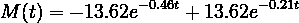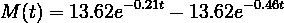

当然，通过重新排列参数 *x* 的组件，这两个模型是等价的。


🔥你好！如果你喜欢这个故事，想支持我这个作家，可以考虑 [***成为会员***](https://dwiuzila.medium.com/membership) *。每月只需 5 美元，你就可以无限制地阅读媒体上的所有报道。如果你注册使用我的链接，我会赚一小笔佣金。*

🔖*想了解更多关于经典机器学习模型的工作原理，以及它们如何优化参数？或者 MLOps 大型项目的例子？有史以来最优秀的文章呢？继续阅读:*


[艾伯斯·乌兹拉](https://dwiuzila.medium.com/?source=post_page-----262801bcfe25--------------------------------)

## 从零开始的机器学习

[View list](https://dwiuzila.medium.com/list/machine-learning-from-scratch-b35db8650093?source=post_page-----262801bcfe25--------------------------------)8 stories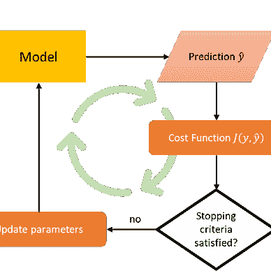

[艾伯斯·乌兹拉](https://dwiuzila.medium.com/?source=post_page-----262801bcfe25--------------------------------)

## 高级优化方法

[View list](https://dwiuzila.medium.com/list/advanced-optimization-methods-26e264a361e4?source=post_page-----262801bcfe25--------------------------------)7 stories

[艾伯斯乌兹拉](https://dwiuzila.medium.com/?source=post_page-----262801bcfe25--------------------------------)

## MLOps 大型项目

[View list](https://dwiuzila.medium.com/list/mlops-megaproject-6a3bf86e45e4?source=post_page-----262801bcfe25--------------------------------)6 stories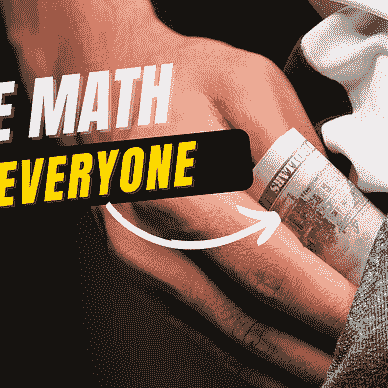

[艾伯斯乌兹拉](https://dwiuzila.medium.com/?source=post_page-----262801bcfe25--------------------------------)

## 我最好的故事

[View list](https://dwiuzila.medium.com/list/my-best-stories-d8243ae80aa0?source=post_page-----262801bcfe25--------------------------------)24 stories

[艾伯斯乌兹拉](https://dwiuzila.medium.com/?source=post_page-----262801bcfe25--------------------------------)

## R 中的数据科学

[View list](https://dwiuzila.medium.com/list/data-science-in-r-0a8179814b50?source=post_page-----262801bcfe25--------------------------------)7 stories[](https://dwiuzila.medium.com/membership)

[1] K. Madsen (1988): *一种用于非线性最小二乘法的组合高斯-牛顿和拟牛顿方法*。DTU 数值分析研究所(现为 IMM 的一部分)。报告 NI-88–10。