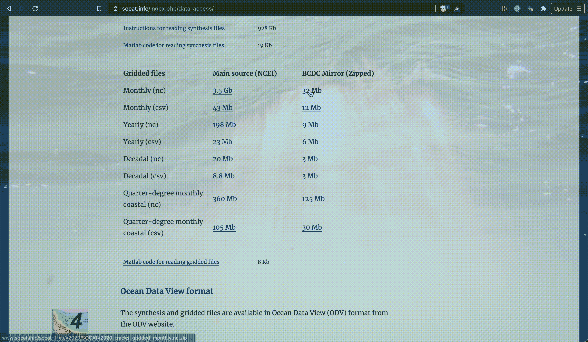

# 将数据从 Web 直接读入 Python 的有效方法

> 原文：<https://towardsdatascience.com/an-efficient-way-to-read-data-from-the-web-directly-into-python-a526a0b4f4cb?source=collection_archive---------7----------------------->

## 而不必下载到你的硬盘上


[七射手](https://unsplash.com/@sevenshooterimage?utm_source=medium&utm_medium=referral)在 [Unsplash](https://unsplash.com?utm_source=medium&utm_medium=referral) 上拍照

我硬盘上的存储空间非常宝贵，我不想下载一大堆数据，因为我只想把它们整理成易于管理的东西。

有时我们可以将一个 URL 粘贴到`pd.read_csv()`或`xr.read_dataset()`中，它会很高兴地读取数据。例如，xarray 支持 [OPeNDAP](https://xarray.pydata.org/en/stable/io.html#opendap) 通过 HTTP 访问一些数据集，但不是全部。

这篇文章将描述一个解决方案，当事情不顺利，直接将 URL 粘贴到 xarray 失败时，你可以使用它。我将概述如何从 web 服务器直接读取数据到 Python 中，甚至是从 zip 文件中读取，所有这些都不需要写入磁盘。

# 基本思想

目标是通过 HTTP 或 FTP 访问数据，这使用了请求和响应结构。例如，我们可以*请求*一个 URL 的内容，服务器将(希望)把数据作为*响应*发送给我们。下面是这个结构在`urllib.request` Python 包中的工作原理:

1.  `**url='https://google.com'**` **:** 这是我们要访问的 URL。
2.  `**req=urllib.request.Request(url)**` **:** 创建一个请求对象，指定我们想要的 URL。
3.  `**resp=urllib.request.urlopen(resp)**` **:** 从服务器返回请求 URL 的响应对象。
4.  `**data=resp.read()**` **:** 响应对象(`resp`)是类文件的，表示我们可以读取。

现在让我们将这个基本思想应用到一些真实的数据中。

# 从 URL 读取数据

下面的代码从 [NCEP 再分析](https://psl.noaa.gov/data/gridded/data.ncep.reanalysis2.pressure.html)中获取特定年份的气温。我总是喜欢在打开 URL 时使用上下文管理器，这样我就不会忘记关闭它。

这段代码的最后一行用我们的数据返回一个 xarray 数据集。然而，那条线路有点忙，让我们打开它:

*   `resp.read()`:是我们要求的数据。但是，它是以字节为单位的。
*   `io.BytesIO()`:将我们请求的数据以字节的形式保存在内存缓冲区中。
*   `xr.open_dataset()`:打开字节文件作为 xarray 数据集。我可以这样做，因为我请求的 URL 是 NetCDF 文件。

这太棒了！不费吹灰之力，我们就可以将数据读入内存，而无需下载。

## 注意

如果您得到一个错误消息说“不能以字节形式打开 NetCDF”，那么您需要安装 h5netcdf。

```
conda install -c conda-forge h5netcdf
```

# 如果数据被压缩了呢？

没问题，Python `zipfile`包可以搞定。在下面的代码中，我向服务器请求一个 zip 文件。然后我使用`zipfile`包列出里面的文件。具体来说，我使用的是`namelist()`方法。最后，我使用 xarray 将其中一个 NetCDF 文件的内容读入一个数据集。

## HTTP 错误 403:禁止

如果你请求访问并得到这个错误信息，这意味着服务器知道你正试图从一个程序访问它。然而，我们比计算机更聪明，可以欺骗它认为我们是一个网络浏览器。这可以通过在我们的请求中附加一个用户代理来实现，这样看起来就像是来自一个 web 浏览器。打个比方，这就像敲敲门，宣布我们是谁。附加一个不同的用户代理类似于冒充我们不认识的人。

# 你从哪里得到数据 URL？

当你在网上找到一个数据集时，通常会有一个下载该数据集的按钮。我们想知道链接到该数据的 URL。在大多数浏览器中，你可以右击下载链接和“复制链接地址”这里有一个使用 [Brave](https://brave.com/) 浏览器获取海洋[数据集](https://www.socat.info/index.php/data-access/)链接的例子。



# 最后的想法

这种方法可以简化数据管道，并使您的代码易于被他人复制。然而，也有一些缺点。例如，如果服务器关闭，您将无法访问数据。这种方法可能并不适用于所有情况，例如数据集太大而无法放入内存。我还没有遇到任何问题，但是我不确定这种方法对于仍然可以放入内存的大型数据集是否有效。

总而言之，我发现这是一种让我的代码可以被其他研究人员复制的干净方式。好处是我不依赖他们先下载数据。至少这是另一个添加到你工具箱的技巧。

我很乐意帮助您解决从服务器读取数据到 Python 时遇到的任何问题。

*感谢阅读和支持媒体作者*

[](https://lukegloege.medium.com/membership) [## 通过我的推荐链接加入 Medium—Luke Gloege 博士

### 作为一个媒体会员，你的会员费的一部分会给你阅读的作家，你可以完全接触到每一个故事…

lukegloege.medium.com](https://lukegloege.medium.com/membership)