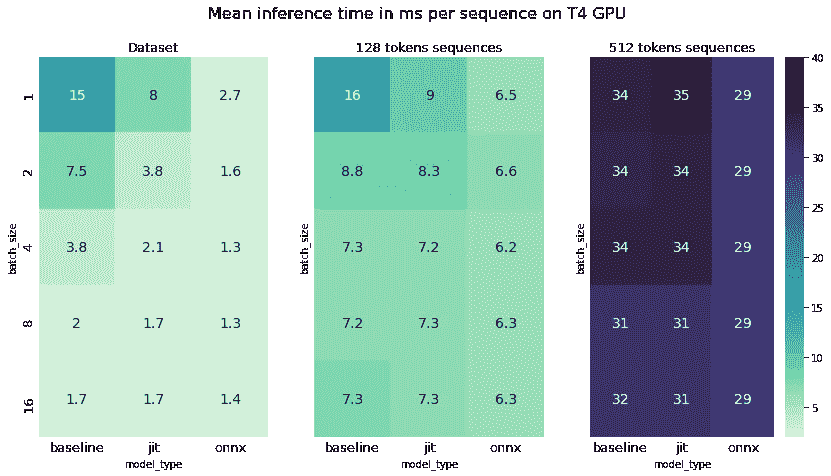

# 用 ONNX/Torchscript 加速 BERT 推理的经验方法

> 原文：<https://towardsdatascience.com/an-empirical-approach-to-speedup-your-bert-inference-with-onnx-torchscript-91da336b3a41?source=collection_archive---------5----------------------->


丹尼·米勒在 [Unsplash](https://unsplash.com?utm_source=medium&utm_medium=referral) 上的照片

近年来，基于 Transformer 架构的模型已经成为研究和行业中 NLP 突破背后的驱动力。伯特，XLNET，GPT 或 XLM 是一些模型，提高了艺术的状态，并达到像胶水流行基准的顶端。

这些进步伴随着巨大的计算成本，大多数基于变压器的模型是巨大的，并且用于训练的参数和数据的数量都在不断增加。虽然最初的伯特模型已经有 1.1 亿个参数，但最后的 GPT-3 有 1750 亿个参数，这是两年研究价值的惊人增长**~ 1700 倍**。

这些庞大的模型通常需要数百个 GPU 进行几天的训练才能有效，幸运的是，由于迁移学习，我们可以下载预训练的模型，并在我们自己的小得多的数据集上快速微调它们，成本很低。

也就是说，一旦培训完成，您仍然有一个大规模的模型，您可能想要部署到生产中。与更适度的模型相比，推断需要相对较长的时间，并且可能太慢而无法达到您需要的吞吐量。

虽然您可以投资更快的硬件或使用更多的服务器来完成这项工作，但有不同的方法来缩短模型的推理时间:

*   **模型** **修剪**:减少层数、嵌入维数或隐藏层单元数。
*   **量化**:权重不用 32 位浮点(FP32)，用半精度(FP16)甚至 8 位整数。
*   **将****模型从本机 Pytorch/Tensorflow 导出到适当的格式或推理引擎(torch script/ONNX/tensort...)**
*   ****批量**:对一批样本而不是单个样本进行预测**

**第一种和第二种方法通常意味着重新训练你的模型，而最后两种方法是在训练后完成的，本质上与你的特定任务无关。**

**如果推理速度对您的用例极其重要，那么您很可能需要试验所有这些方法，以产生一个可靠的、速度惊人的模型。然而，在大多数情况下，将您的模型导出到适当的格式/框架并进行批量预测将会以最少的工作量为您提供更快的结果。我们将在这里关注这种方法，看看它对我们模型的吞吐量的影响。**

**我们将通过几个实验来探索改变模型格式和批处理的影响:**

*   **基准用**香草**T2【py torch】CPU/GPU**
*   **将 Pytorch 模型导出到 **Torchscript** CPU/GPU**
*   **Pytorch 型号到 **ONNX** CPU/GPU**
*   **所有实验都在 1/2/4/8/16/32/64 批次的样品上进行**

**在这篇文章中，由于缺乏对 Pytorch 嵌入使用的 int64 的支持，还不能直接将 transformer 模型从 Pytorch 导出到 TensorRT，所以我们现在跳过它。**

**我们将在 camemBERT (~100M 参数)上执行句子分类，camemBERT 是 Roberta 的法语变体。因为绝大多数计算都是在 transformer 模型中完成的，所以不管您的任务是什么，您都应该得到类似的结果。**

**首先，我们将快速查看如何将 Pytorch 模型导出到相关的格式/框架，如果您不想阅读代码，可以直接跳到结果部分。**

# **如何导出您的模型**

## **香草火炬**

**在 Pytorch 中保存和加载模型非常简单，尽管有不同的方法。对于推断，官方文档建议保存模型的“state_dict ”,这是一个 python 字典，包含模型的可学习参数。这比酸洗你的整个模型更轻便和坚固。**

```
#saving
model = SequenceClassifier()
train_model(model)
torch.save(model.state_dict(), 'pytorch_model.pt')#loading
model **=** SequenceClassifier()
model**.**load_state_dict(torch**.**load(PATH))
model**.**eval() #Set dropout and batch normalization layers to evaluation mode
with torch.go_grad():
   logits = model(**batch_x)
```

**点击此 [**链接**](https://pytorch.org/tutorials/beginner/saving_loading_models.html) 了解关于保存/加载 Pytorch 的更多信息。**

## **Torchscript JIT**

**TorchScript 是一种从 Pytorch 代码创建可序列化和可优化模型的方法。一旦导出到 Torchscript，您的模型将可以从 Python 和 C++中运行。**

*   ****Trace** :通过模型发送一个输入，所有操作都记录在一个定义 torchscript 模型的图中。**
*   ****脚本**:如果你的模型比较复杂，有条件语句之类的控制流，脚本会检查模型的源代码，编译成 TorchScript 代码。**

**请注意，由于您的模型将被序列化，因此您将无法在保存后对其进行修改，因此您应将其置于评估模式，并在保存前将其导出到适当的设备上。**

**如果你想在 CPU 和 GPU 上进行推理，你需要保存两个不同的模型。**

```
#saving
jit_sample = (batch_x['input_ids'].int().to(device), batch_x['attention_mask'].int().to(device))model.eval()
model.to(device)
module = torch.jit.trace(model, jit_sample)
torch.jit.save('model_jit.pt')#loading
model = torch.jit.load('model_jit.pt', map_location=torch.device(device))
logits = model(**batch_x)
```

**更全面的介绍你可以跟随官方教程。**

## **ONNX**

**ONNX 为 AI 模型提供了一种开源格式，大多数框架可以将它们的模型导出到 ONNX 格式。除了框架之间的互操作性之外，ONNX 还提供了一些优化，可以加速推理。**

**导出到 ONNX 稍微复杂一些，但是 Pytorch 确实提供了直接导出功能，您只需要提供一些关键信息。**

*   ****opset_version** ，每个版本都有一组支持的操作符，一些具有更奇特架构的型号可能还不能导出。**
*   ****输入名称**和**输出名称**是分配给图的输入和输出节点的名称。**
*   ****dynamic_axes** 参数是一个字典，它指示输入和输出变量的哪个维度可以改变，例如 batch_size 或序列的长度。**

```
#saving
input_x = jit_sample ## taking sample from previous exampletorch.onnx.export(model, input_x,'model_onnx.pt',export_params=True,  opset_version=11, do_constant_folding=True, input_names = ['input_ids', 'attention_mask'], output_names = ['output'],
dynamic_axes= {
'input_ids' : {0 : 'batch_size', 1:'length'},'attention_mask' : {0 : 'batch_size', 1:'length'},
'output' : {0 : 'batch_size'}
})#loading
model = onnxruntime.InferenceSession(model_onnx)
batch_x = {
'input_ids':sample['input_ids'].cpu().numpy(),
"attention_mask":sample['attention_mask'].cpu().numpy()
}
logits = model.run(None, batch_x)
```

**ONNX 运行时可以与 GPU 一起使用，尽管它需要特定版本的 CUDA、cuDNN 和 OS，使得安装过程在开始时具有挑战性。**

**要获得更全面的教程，你可以遵循官方的[文档](https://pytorch.org/tutorials/advanced/super_resolution_with_onnxruntime.html)。**

# **实验结果**

**每个配置已经在 1k 个不同长度的句子的数据集上运行了 5 次。我们测试了两种不同的流行 GPU: T4 和 V100 与 torch 1.7.1 和 ONNX 1.6.0。请记住，结果会因您的特定硬件、软件包版本和数据集而异。**

****

**在我们的数据集上，推断时间的范围从平均每个样本 50 毫秒到 0.6 毫秒，取决于硬件设置。**

**在 CPU 上，与 pytorch 上的批处理大小 1 相比，ONNX 格式显然是 batch_size <32, at which point the format seems to not really matter anymore. If we predict sample by sample, we see that ONNX manages to be as fast as inference on our baseline on GPU for a fraction of the cost.**

**As expected, inference is much quicker on a GPU especially with higher batch size. We can also see that the ideal batch size depends on the GPU used:**

*   **For the T4 the best setup is to run ONNX with batches of 8 samples, this gives a ~ **12x** 加速的赢家**
*   **对于批量为 32 或 64 的 V100，与 GPU 的基准相比，我们可以实现高达 28 倍的加速比，与 CPU 的基准相比，我们可以实现高达 90 倍的加速比。**

**总的来说，我们发现选择合适的格式对较小的批量有很大的影响，但随着批量的增大，这种影响会缩小，对于 64 个样品的批量，3 个设置之间的误差在 10%以内。**

## **序列长度和批处理策略的影响**

**另一个要考虑的是序列长度。变压器通常被限制为 512 个令牌的序列，但是对于该范围内的不同序列长度，在速度和内存需求方面存在巨大差异。**

********

**对于较大的批次而言，推断时间与序列长度大致成线性比例增加，但对于单个样本而言并非如此。这意味着，如果你的数据是由很长的文本序列组成的(例如新闻文章)，那么你就不会通过批处理获得很大的加速。一如既往，这取决于你的硬件，V100 比 T4 快，在预测长序列时不会受到太大影响，而另一方面，我们的 CPU 确实会完全不堪重负:**

****

**如果您的数据在长度上是异构的，并且您使用批处理，这些差异将会导致问题，因为必须将您的样本填充到批处理中最长的一个，这会增加大量计算。因此，通常最好将相似长度的样本一起分批，因为预测多个相似长度的批次比预测一个主要是填充标记的大批次更快。**

**作为快速检查，让我们看看在运行推理之前对数据集进行排序时会发生什么:**

****

**正如我们所料，对于较大的批量，将相似长度的样品分组是一个重要的激励。对于未排序的数据，随着批次变大，出现一些较长样本的可能性越来越大，这将显著增加整个批次的推断时间。我们可以看到，从 16 到 64 的 batch_size 降低了 20%的推断速度，而对于排序后的数据，它的速度提高了 10%。**

**这种策略也可用于显著减少训练时间，但应谨慎操作，因为它可能会对模型的性能产生负面影响，尤其是在标签和样本长度之间存在某种相关性的情况下。**

## **后续步骤**

**虽然这些实验是直接在 Python 中运行的，但 Torchscript 和 ONNX 模型都可以直接在 C++中加载，这可以进一步提高推理速度。**

**如果你的模型对于你的用例来说仍然太慢，Pytorch 确实为[量化](https://pytorch.org/docs/stable/quantization.html)提供了不同的选项。**动态量化**可以在训练后进行，但很可能会对你的模型精度产生影响，而**量化感知训练**需要重新训练，但对你的模型性能影响应该较小。**

# ****结论****

**正如我们所看到的，优化您的推理时间没有直接的答案，因为它主要取决于您的特定硬件和您试图解决的问题。因此，您应该使用自己的目标硬件和数据进行实验，以获得可靠的结果。**

**尽管如此，还是有一些指导方针应该适用并且易于实施:**

*   **对批处理进行预测可以显著加速到一定的大小(取决于您的特定硬件)，特别是如果您可以一起批处理长度相似的样本。**
*   **使用 Torchscript 或 ONNX 确实为较低的批量和序列长度提供了显著的加速，在对单个样本进行推断时，这种效果尤其明显。**
*   **ONNX 似乎是我们测试的三种配置中性能最好的，尽管它也是最难安装在 GPU 上进行推理的。**
*   **Torchscript 确实为较小的批量提供了可靠的加速，并且非常容易设置。**