# 一个端到端的机器学习项目—心力衰竭预测，第 1 部分

> 原文：<https://towardsdatascience.com/an-end-to-end-machine-learning-project-heart-failure-prediction-part-1-ccad0b3b468a?source=collection_archive---------12----------------------->

## 数据探索、模型训练、验证和存储

在这个系列中，我将介绍一个端到端的机器学习项目，涵盖从数据探索到通过 web 应用程序部署模型的所有内容。我的目标是提供关于将模型投入生产所涉及的不同组件的一般见解；本系列不是机器学习管道的全面概述。本文将涵盖数据探索、模型训练、验证和存储。在整个系列中，读者将接触到各种语言和技术，如 Git、Python、SQL、Catboost、Flask、HTML、CSS、JavaScript 和 Heroku。这个系列的所有代码都可以在 [GitHub](https://github.com/hfhoffman1144/Heart-Disease-Prediction) 上找到。第二部分现已推出[这里](https://medium.com/towards-data-science/an-end-to-end-machine-learning-project-heart-failure-prediction-part-2-4518d2596421)。

# **问题陈述**

制定问题陈述是任何机器学习项目的第一个也是最重要的先决条件。问题陈述应该足够清晰，以显示机器学习如何用作解决方案。我为这个系列选择了下面的问题陈述:

> 我们希望分析心力衰竭的风险因素，并对个体心力衰竭的概率进行建模。

这个问题陈述有两个组成部分可以潜在地用机器学习来解决:*分析*风险因素和*建模*心力衰竭的概率。特别是，解决这个问题的一个方法是建立一个模型，该模型可以准确地预测个体心力衰竭的可能性，并以证据支持该预测。

# 数据

接下来，也是最重要的，机器学习项目的先决条件是拥有可靠、干净和结构化的数据源。在企业环境中，这些数据集通常是辛勤工作的数据工程团队的产品，不应该被视为理所当然。幸运的是，像 Kaggle 这样的网站为我们提供了准备建模的干净数据集。我们将在这个项目中使用一个流行的心脏病数据集。

[](https://www.kaggle.com/fedesoriano/heart-failure-prediction) [## 心力衰竭预测数据集

### 预测心脏病事件的 11 个临床特征。

www.kaggle.com](https://www.kaggle.com/fedesoriano/heart-failure-prediction) 

该数据集包含 11 个特征，我们将使用这些特征对心力衰竭概率进行建模。此外，在进行预测时，我们希望我们的模型能够告诉我们哪些特性贡献最大(在以后的文章中会有更多相关内容)。为了使数据源更加真实，我将把。csv 文件转换为. db 文件。这将使数据检索更加模块化，因为它将模拟一个实际的数据库。

# 数据探索

我们将从检查用于心力衰竭概率建模的数据开始。我不会检查每一行代码，但所有代码都可以在这个[笔记本](https://github.com/hfhoffman1144/Heart-Disease-Prediction/blob/main/notebooks/eda_model_training%20.ipynb)中找到。首先，我们将导入所有必需的库，并指定一些稍后将使用的存储路径:

```
import numpy as np
import pandas as pd
import matplotlib.pyplot as plt
import seaborn as sns
from catboost import CatBoostClassifier, Pool, cv
from sklearn.model_selection import train_test_split
from sklearn.metrics import confusion_matrix, classification_report, accuracy_score
import optuna
from optuna.samplers import TPESampler
import sqlite3
from datetime import datetime# display all of the columns of the dataframe in the notebook
pd.pandas.set_option('display.max_columns',None)%matplotlib inline# Path to mock database
SQL_PATH = 'data/MockDatabase.db'# Path to model storage location
MODEL_STORAGE_PATH = 'models/'
```

接下来，我们将从。数据库文件使用 SQL 查询。对于任何有兴趣知道如何创建一个. db 文件的人，请看这个[笔记本](https://github.com/hfhoffman1144/Heart-Disease-Prediction/blob/main/notebooks/csv_to_sql.ipynb)。下面使用的“创建连接”函数直接来自 sqlite [教程](https://www.sqlitetutorial.net/sqlite-python/creating-database/)。

```
# Read in training data
conn = create_connection(SQL_PATH)read_query = '''SELECT Age,
                       Sex, 
                       ChestPainType,
                       RestingBP,
                       Cholesterol,
                       FastingBS,
                       RestingECG,
                       MaxHR,
                       ExerciseAngina,
                       Oldpeak,
                       ST_Slope,
                       HeartDisease
                 FROM heart'''data_train = pd.read_sql(read_query, conn)
conn.close()print(data_train.shape)
data_train.head()
```

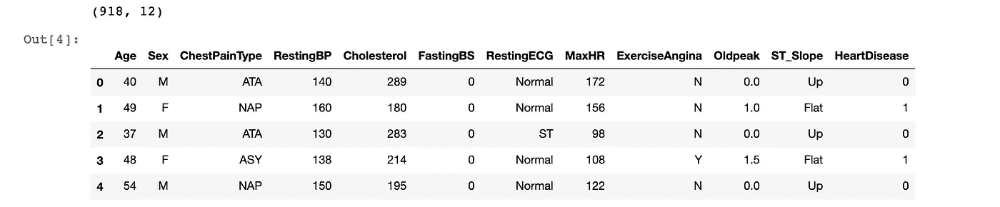

训练数据的峰值。图片作者。

我们的数据集似乎是分类特征和数字特征的完美结合。只有 918 行，没有太多的训练数据要处理。然而，这将使模型训练时间更快，并允许我们轻松地执行[超参数](https://en.wikipedia.org/wiki/Hyperparameter_optimization)调整和[交叉验证](https://en.wikipedia.org/wiki/Cross-validation_(statistics)#:~:text=Cross%2Dvalidation%20is%20a%20resampling,model%20will%20perform%20in%20practice.)。幸运的是，数据中没有缺失值；这对于医疗数据来说尤其令人惊讶，是数据工程团队工作出色的标志。好的数据工程[的重要性怎么强调都不为过。](https://www.jobsity.com/blog/the-importance-of-data-engineering-in-the-era-of-big-data)

我们的下一个目标是分析分类和数字特征。下面的代码创建了两个列表，一个用于分类特性，一个用于数字特性。分类特征列表将在稍后构建模型时使用。

```
# Separate columns by data type for analysis
cat_cols = [col for col in data_train.columns if data_train[col].dtype == np.object]num_cols = [col for col in data_train.columns if data_train[col].dtype != np.object]# Ensure that all columns have been accounted for
assert len(cat_cols) + len(num_cols) == data_train.shape[1]
```

从这里，我们可以看到每个分类特征的基数(唯一值的数量)。

```
# Look at cardinality of the categorical columns
cards = [len(data_train[col].unique()) for col in cat_cols]fig,ax = plt.subplots(figsize=(18,6))
sns.barplot(x=cat_cols, y=cards)
ax.set_xlabel('Feature')
ax.set_ylabel('Number of Categories')
ax.set_title('Feature Cardinality')
```

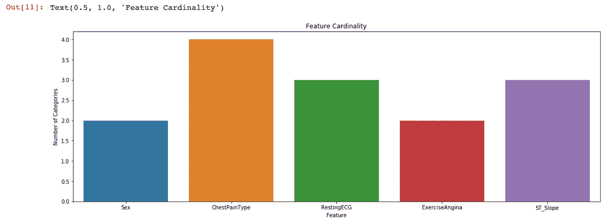

每个分类特征的基数。图片作者。

所有分类特征的基数都相对较低，因此模型很容易对这些特征进行编码和处理。这个数据集的一个有趣的特性是，大约 79%的患者是男性。此外，超过 90%的心脏病患者是男性。

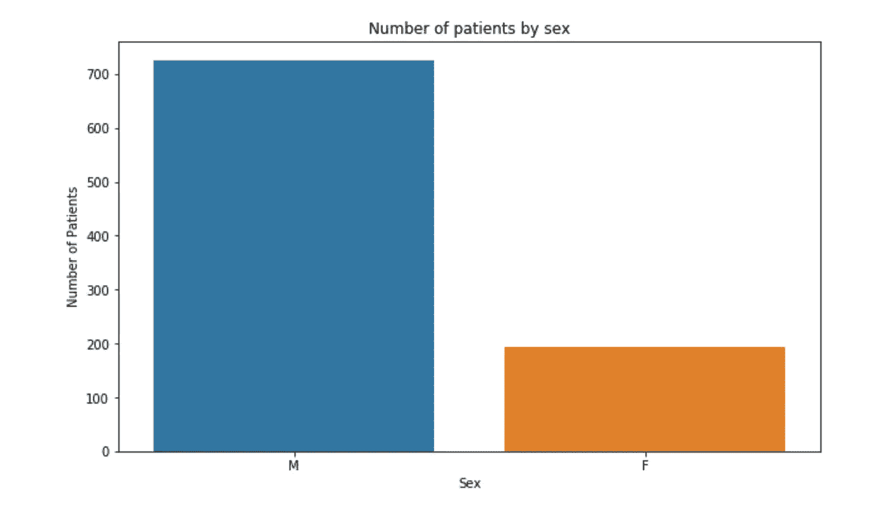

更多被研究的病人是男性。图片作者。

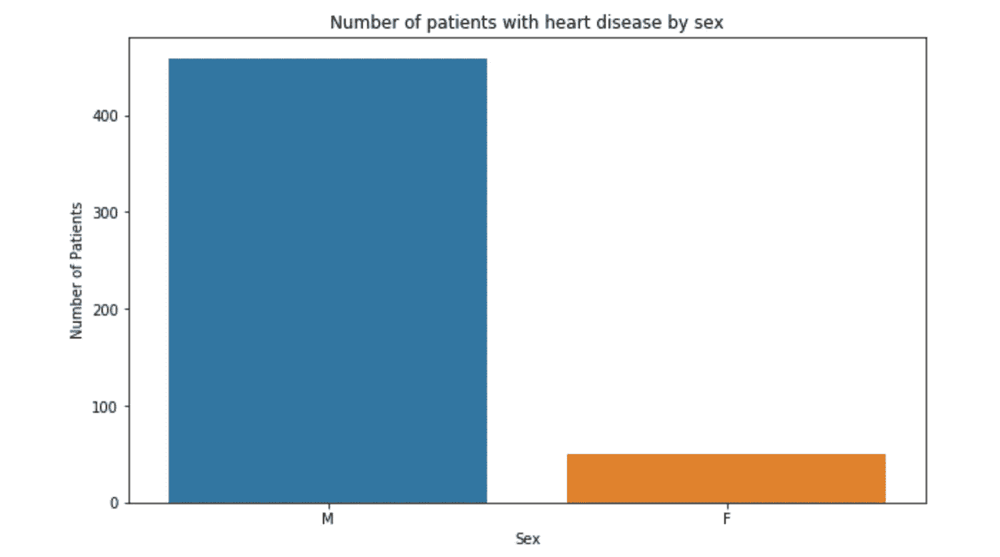

超过 90%的心脏病患者是男性。图片作者。

接下来，我们观察患病和未患病患者之间的静息血压分布。

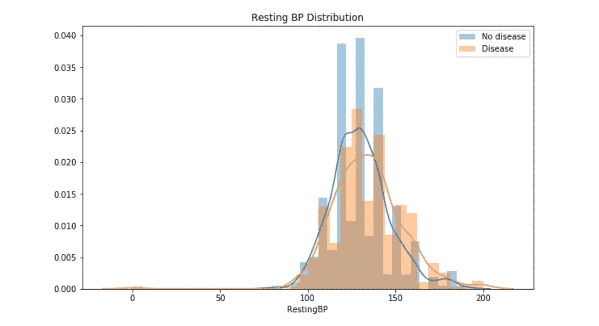

图片作者。

虽然分布看起来相对相似，但似乎疾病患者往往血压略高——这一观察结果可以通过[统计测试](https://en.wikipedia.org/wiki/Statistical_hypothesis_testing)得到验证。现在，当我们开始分析模型结果时，我们应该记住这些图中的一些。

最后，在我们开始建模之前，我们应该看看这些类是如何不平衡的。也就是有多少病人有和没有心脏病。

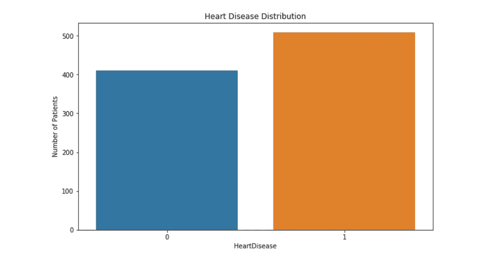

心脏病分布。图片作者。

大约 55%的被研究患者患有心脏病，这提供了一个基准百分比来衡量我们的模型。换句话说，如果我们的模型从数据中学习到任何东西，它应该有超过 55%的准确性。如果我们的模型预测心脏病的准确率为 55%，这表明没有从数据中获得新的信息。该模型可以简单地预测每个病人都有心脏病，准确率为 55%。在许多真实世界的分类问题中，如欺诈检测，基线准确率可以达到 90%或更高(大多数交易不是欺诈)。在这些情况下，通常会跟踪除准确性之外的指标，如[精度](https://en.wikipedia.org/wiki/Precision_and_recall)、[召回](https://en.wikipedia.org/wiki/Precision_and_recall)和 [f1 分数](https://en.wikipedia.org/wiki/F-score)。

# 初始模型训练

本系列选择的模型是 [Catboost](https://catboost.ai/) ，我们将从训练和评估一个简单的模型实例开始。下面，我们创建训练和测试数据集。训练数据集包含大约 80%的原始数据，而测试集包含大约 20%的原始数据。要复制训练结果，请在“train_test_split”函数中指定随机状态 13。

```
# Create training and testing data
x, y = data_train.drop(['HeartDisease'], axis=1), data_train['HeartDisease']

x_train, x_test, y_train, y_test = train_test_split(x, y, test_size=0.2, random_state=13)print(x_train.shape)
print(x_test.shape)
x_train.head()
```

下一步是创建 Catboost 模型实例。在我们这样做之前，必须创建一个包含每个分类特征的列号的列表。利用之前创建的“cat_cols”列表，可以轻松创建该列表。

```
# Specify index of categorical features in input data
cat_features = [x.columns.get_loc(col) for col in cat_cols]
```

然后，我们可以用所需的模型参数创建一个字典。首先，我们将只指定几个参数，因为 Catboost 以出色的“开箱即用”性能而闻名。

```
# Model parameter dict
params = {'iterations':5000,
          'loss_function':'Logloss',
          'depth':4,
          'early_stopping_rounds':20,
          'custom_loss':['AUC', 'Accuracy']}
```

Catboost 参数的描述可以在[这里](https://catboost.ai/en/docs/references/training-parameters/)找到。这里要指出的重要参数是“迭代”和“早期停止轮次”。在这种情况下，我们将训练模型，直到经过 5000 次迭代(树)或者经过 20 次迭代而测试误差没有减少。最后，我们实例化模型并调用“fit”方法。在“fit”方法中，我们传递测试集，以便模型可以实现早期停止回合(实际上更常见的是创建训练、测试和验证集)。

```
# Instantiate model
model = CatBoostClassifier(**params)# Fit model
model.fit(
    x_train,
    y_train,
    cat_features=cat_features,
    eval_set=(x_test, y_test),
    verbose=50,
    plot=True
)
```

模型完成训练后，我们对测试数据进行预测，并输出性能指标。

```
# Make predictions on test data
preds = model.predict(x_test)# Evaluate predictions
print(classification_report(y_test, preds))
print(confusion_matrix(y_test, preds))
```

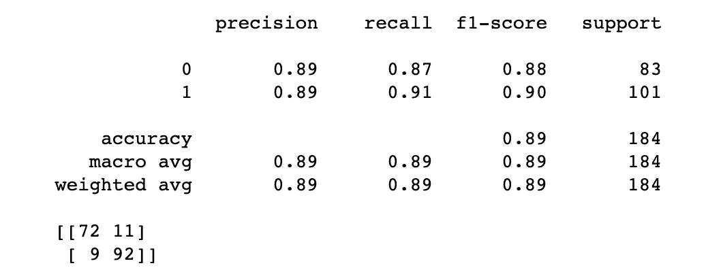

初始训练/测试分割的性能指标。图片作者。

在这个由 184 名患者组成的测试集上，该模型达到了 89%的准确率。这意味着该模型能够正确识别测试集中 89%的患者是否患有心脏病。我们可以把**的精度**解释为:当模型*预测*一个病人有心脏病时，它的正确率为 89%。类似地，我们可以将**回忆**解释为:在患有心脏病的患者数量中，该模型在 91%的情况下成功预测了这些患者存在心脏病。

接下来，我们可以看看模型实例的全局特性重要性。

```
fig,ax = plt.subplots(figsize=(10,6))feature_importance_data = pd.DataFrame({'feature':model.feature_names_, 'importance':model.feature_importances_})feature_importance_data.sort_values('importance', ascending=False, inplace=True)sns.barplot(x='importance', y='feature', data=feature_importance_data)
```

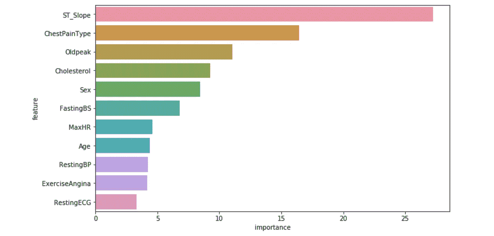

第一个模型实例的特征重要性。图片作者。

特征重要性表明“ST_Slope”是心脏病的头号预测因子。“ST_Slope”是患者运动时记录的心脏电活动的测量值；它采用“向上”、“向下”和“平坦”值。“胸部疼痛类型”是第二个最有影响力的预测因子，取值为“TA”(典型心绞痛)、“ATA”(非典型心绞痛)、“NAP”(非心绞痛性疼痛)和“ASY”(无症状)。第三，“Oldpeak”是“ST_Slope”大小的度量。总的来说，在没有广泛的心脏病学知识的情况下，特征重要性的顺序似乎是直观的。

# 超参数调谐

超参数调整通常被称为机器学习的“黑暗艺术”。这是因为有许多方法可以确定模型超参数的最佳集合，并且在大多数情况下，不可能知道是否已经找到了参数的最佳集合。此外，随着训练数据大小的增加，以及可能的超参数数量的增加，调优成为一个极其昂贵的高维优化问题。幸运的是，训练数据相对较小，可供搜索的有用超参数数量也很少。

我们将使用一个著名的优化库 [Optuna](https://optuna.org/) ，来搜索一组好的超参数。本节使用的一些代码改编自[扎卡里·沃恩斯](https://zjwarnes.medium.com/)写的一篇很棒的[文章](/hyper-parameter-optimization-with-optuna-4920d5732edf)。

我们必须首先定义一个目标函数来优化:

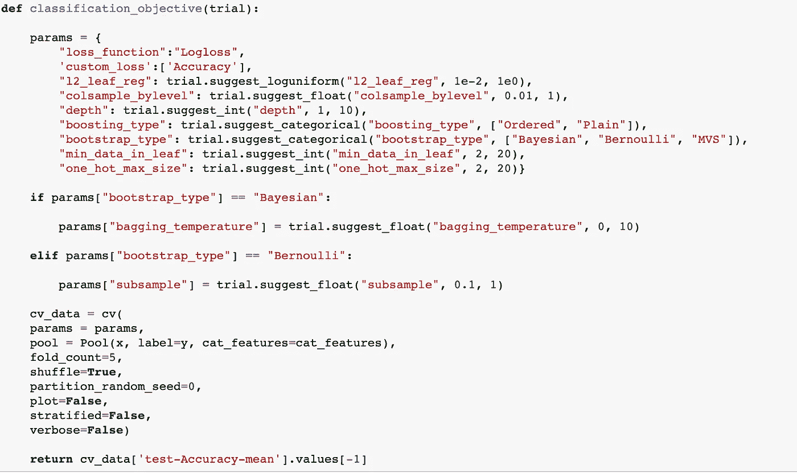

更多细节请参见本文[文章](/hyper-parameter-optimization-with-optuna-4920d5732edf)。图片作者。

“参数”字典定义了要搜索的所有超参数，以及要考虑的值的范围。值得注意的是，我们正在优化 5 重交叉验证测试的准确性，而不仅仅是在任意测试集上的准确性。这是通过使用 Catboost 的“cv”函数来完成的。

优化试验使用以下代码进行:

```
classification_study = optuna.create_study(sampler=TPESampler(), direction="maximize")
classification_study.optimize(classification_objective, n_trials=20, timeout=600) 
trial = classification_study.best_trialprint(f"Highest Accuracy: {trial.value}")
print("Optimal Parameters:")
for key, val in trial.params.items():
    print(f"{key}:{val}")
```

需要指出的两个主要问题是试验次数和超时。利用上述配置，优化算法将运行 20 次迭代，或者如果 10 分钟已经过去，它将在 20 次迭代之前终止。在第一次迭代之后，Optuna 将输出如下内容:

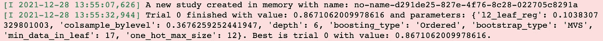

第一次迭代后的 Optuna 输出。图片作者。

这告诉我们，第一组超参数的交叉验证测试准确度约为 86.7%。人们可能会注意到，这低于我们在初始测试集上达到的 89%的准确率。这是意料之中的，因为交叉验证的准确性为我们提供了对真实模型准确性的更好估计，即模型在生产中的准确性。经过 20 次迭代后，Optuna 能够找到一组参数，将交叉验证的准确度提高到 88%左右。

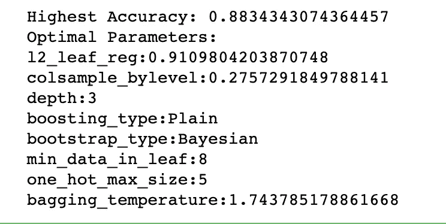

找到的最佳超参数集的输出。图片作者。

模型中迭代(树)的数量将通过使用这组超参数的交叉验证来确定。具体来说，最终的迭代次数由最大化交叉验证测试准确性的迭代次数决定。

```
# Create new parameter dictionary using optimal hyper-parameters
new_params = trial.params.copy()
new_params['loss_function'] = 'Logloss'
new_params['custom_loss'] = ['AUC','Accuracy']cv_data = cv(
        params = new_params,
        pool = Pool(x, label=y, cat_features=cat_features),
        fold_count=5,
        shuffle=True,
        partition_random_seed=0,
        plot=False,
        stratified=False,
        verbose=False)final_params = new_params.copy()# The final number of iterations is iteration number that maximizes cross-validated accuracyfinal_params['iterations'] = np.argmax(cv_data['test-Accuracy-mean'])final_params['cat_features'] = cat_features
```

# 训练和导出最终模型

最后，我们使用最优超参数集训练最终模型，并将其导出到所需的存储位置。

```
final_model = CatBoostClassifier(**final_params)
final_model.fit(x,y,verbose=100)# Export model
model_name = f'heart_disease_model_{str(datetime.today())[0:10]}'
final_model.save_model(MODEL_STORAGE_PATH + model_name)
```

# 第 1 部分概述

在本系列的第 1 部分中，我们检查了训练数据，训练并评估了一个模型实例，执行了超参数调整，并导出了最终的模型。同样，这绝不是一篇全面的文章。每一个机器学习项目都是独一无二的，大多数问题都需要对训练数据给予比这里给出的更多的关注。然而，我希望这里展示的代码为读者提供了一个机器学习项目的通用框架。

在下一篇文章中，我们将通过创建一个为最终用户提供我们的模型的应用程序来窥视 web 开发的世界。这将涉及到 HTML、CSS、JavaScript 和 Flask 的使用。感谢阅读！