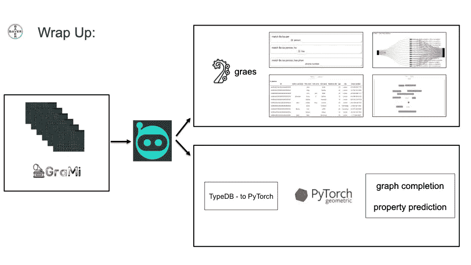

# 使用 TypeDB 的企业数据堆栈

> 原文：<https://towardsdatascience.com/an-enterprise-data-stack-using-typedb-aa6df12b420b?source=collection_archive---------26----------------------->

[https://www . shutterstock . com/image-illustration/3d-render-abstract-database-server-stack-1737433799](https://www.shutterstock.com/image-illustration/3d-render-abstract-database-server-stack-1737433799)

## 拜耳医药公司用于药物研发的数据架构

在世界上最大的制药公司之一拜耳公司，深入了解生物系统对于发现新的治疗方法至关重要。这促使人们采用能够加速和自动化发现的技术，从数据库开始，跨越数据基础架构的所有组件。

数据和发现过程中的挑战并非拜耳独有:

*   大规模加载异构数据集
*   将异构数据集映射到一个真实的来源——给定一种疾病，我们如何在多个数据集之间协调其不同的 id？
*   模拟生物系统的复杂性——基于基因组上的位置以及基因、蛋白质、途径、细胞、组织之间的三元关系，在数据库中自然地表示基因和变异
*   如此复杂系统上的查询构造
*   将 ML 管道连接到数据库

拜耳的团队——Henning kui ch、Dan Plischke 和 Joren Retel——着手建立一个堆栈来帮助他们解决这些挑战。

第一步是找到一个数据库，让他们能够模拟疾病周围生物系统的复杂性。它需要能够表示生物学中固有的相互联系，在需要时动态更新模型而不干扰过程的其余部分，并能够有效连接到知识提取管道，无论是可视化还是学习过程。他们在 [TypeDB](https://github.com/vaticle/typedb) 中找到了他们的数据库，这是来自 [Vaticle](https://vaticle.com) 团队的强类型数据库(社区版本完全开源)。

> "….我们实际上已经在内部开发了一个堆栈，以便非常认真地使用 TypeDB，所以我们已经建立了一个数据迁移器来将内容放入其中，然后我们现在有两个分支来将知识取出。”— Henning Kuich，拜耳制药公司资深计算科学家

拜耳的生产栈，用于 TypeDB 的高级工作——经许可使用。

# 用于模拟复杂性的数据库— TypeDB

生物学中的一切都是极其相关和依赖于上下文的，这使得在传统的关系数据库中表示数据非常困难。正因为如此，Henning 和他的团队认为 TypeDB 的类型系统是一种更自然的生物学建模方式。

生物医学实验是高度上下文相关的，因此在构建生物医学知识图时，您希望能够快速查询使用了哪些参数。实际的化验是什么？是在体外，还是在细胞里？这需要一个能够捕捉这种复杂程度的数据库，以及一种允许我们轻松地对这些数据提出复杂问题的查询语言。有了 TypeDB，Henning 的团队就能做到这一点。

Bayer 还利用了 TypeDB 中本机推理引擎的优势。推理可以为拥有类似复杂生物医学数据的团队做很多事情。例如，Henning 和他的团队使用 TypeDB 的推理引擎，根据它们在染色体上的位置来推断`variant`到`gene`的连接。

基因本质上只是基因组中的序列，实际上是沿着一长串其他位置的位置。变体是这些序列的变体，也沿着相同的数字和位置延伸。使用 type QL(TypeDB 的查询语言)，该团队能够根据重叠位置将变异映射到基因，而不是依赖于其他需要他们导入变异和基因之间关系的数据库。重要的是，这避免了维护其他数据库的需要，因为定期更新和迁移这些数据库需要很长时间。所有这些都可以通过使用 TypeDB 的推理引擎来避免。

TypeDB 还允许您在数据库生命周期中的任何时间点重新定义模式。例如，我们可以添加一个新的定义，根据基因的位置来定义与基因相关的变异。这很重要，尤其是当我们添加新的数据集时。所有这些都使 Henning 的团队能够更有效地运作，并加速他们的药物发现过程。

# 数据摄取— *类型数据库加载器*

*TypeDB Loader* 是一个 Java 应用程序和库，使您能够将其用作 CLI 工具或在自己的 Java 项目中使用。这是一个工具来加载许多大规模的 csv 文件，并将数据缝合在一起，成为一个真正的图形格式的 TypeDB。它可以用最少的配置文件来实现所有这些，配置文件告诉加载器使用哪些列将被加载的各种表中的数据关联在一起。使用它相对简单，只需指定正在与哪个实例对话，以及正在写入哪个 TypeDB 数据库。然后提供您的数据配置、处理器配置、TypeDB 模式，然后确定您希望在哪里跟踪迁移状态。这可以像一个 JSON 文件一样简单。

Henning 的团队决定构建自己的定制加载器，以提供一种可伸缩的方式将大量数据加载到 TypeDB 中。为了加载数据，最初的 TypeDB 文档建议构建一个读入文件(例如以表格格式)的函数，并构建一个生成插入查询的模板函数。然后，文档建议使用其中一个客户端驱动程序插入到 TypeDB 数据库中。然而，当大规模地这样做时，引入了 TypeDB Loader 试图解决的许多挑战:

*   处理所需模板函数的重复逻辑
*   注意潜在的脏数据，防止插入过程中的错误
*   大规模插入查询的并行化和批处理
*   大数据容错

# 数据探索— GraEs

考虑到生物学的复杂性，特别是对疾病的理解，自然会期望模型(TypeDB 模式)能够快速增长。

> 模式是您的领域的模型，在 TypeQL 中作为类型(实体、属性、关系、角色)和规则来实现。插入到 TypeDB 中的所有数据都将实例化部分模式，确保您的数据符合您已经实现的模型。

这在编写查询时提出了挑战，因为用户必须记住或查找在哪个关系中允许哪些角色扮演者，对于给定的变量或事物哪些属性可用，以及查询中约束的所有可能属性值。为了解决这个问题，Bayer 的团队建立了一个自动完成引擎，在你编写查询时提供基于语法和模式的建议。

该团队旨在解决的另一个挑战是创建一种快速可视化评估特定重要查询的方法。为了解决这个问题，GraEs 提供了汇总表和单个子图可视化。此外，它将自动返回从查询中返回的概念的所有可能的属性，因此您不必手动请求它们。如今，GraEs 已经拥有解决所有这些问题的基本布线:

*   查询完成
*   查询开发
*   子图的标准可视化
*   某些实体或关系的汇总表
*   为特定查询或查询类型的更多自定义可视化铺平了道路

# 用于链接预测和新发现管道的学习系统——type db 到 PyTorch 连接器

今天，很明显药物发现过程在时间和金钱上都是昂贵的。正如 Henning 指出的，生物学最自然的表现形式是图表，团队可以利用这种相互联系的性质来识别新的潜在目标。能够利用 TypeDB 提供的丰富语义建模，可以预测哪些基因、蛋白质或变体是最重要的。

虽然 kg lib(va ticle 的开源机器学习库)提供了与 TensorFlow 和 GraphNets 的连接，但拜耳的 ML 团队现在已经在 PyTorch 工作了两年。因此他们希望扩展 KGLIB 来连接 PyTorch。

他们构建的连接器背后的概念是从他们的 TypeDB 数据库中提取子图，并将它们直接传递给学习者。使用子图作为训练示例允许图学习方法在规模上操作。否则，整个图形(大小可能达到万亿字节)将需要保存在内存中以供学习。

这为他们提供了如下管道:

*   能够导出到 Python 内存中的 NetworkX 子图
*   从 TypeDB 超图实体/关系/属性模型编码成传统的节点-边模型
*   TensorFlow 和 PyTorch 嵌入器自动将 TypeDB 中的类型和值数据解释为特征
*   端到端管道已经准备好与任何新的和令人兴奋的本地图形学习算法一起使用，例如 py torch Geometric(GitHub 的链接)内置的那些算法

# 结论

希望这能让你对当今日益复杂的生物医学领域的药物发现过程有所了解。

虽然这只是围绕 TypeDB 构建的企业生产堆栈的一个例子，但我们看到越来越多的社区构建工具和库继续推进其应用程序和复杂问题的解决方案。从开发自动驾驶汽车系统的混合方法，为制造和物流行业建立因果关系模型，到患者治疗和精确医疗，网络智能威胁检测和供应链分析，TypeDB 使团队能够比以前更有效地工作，并更具表现力地建立领域模型。

要更多地了解社区正在构建什么，并为您自己的项目获得一些灵感，以下是一些方法:

*   加入[社区不和](https://vaticle.com/discord)
*   找到您的[本地聚会](https://meetup.com/topics/typedb)
*   [下载](https://github.com/vaticle/typedb/releases)最新的 TypeDB 版本并开始构建