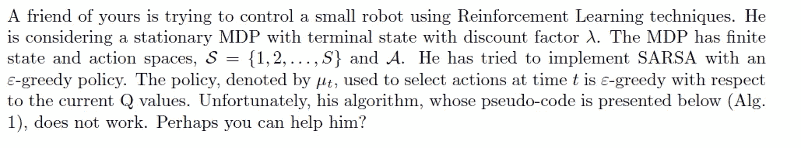
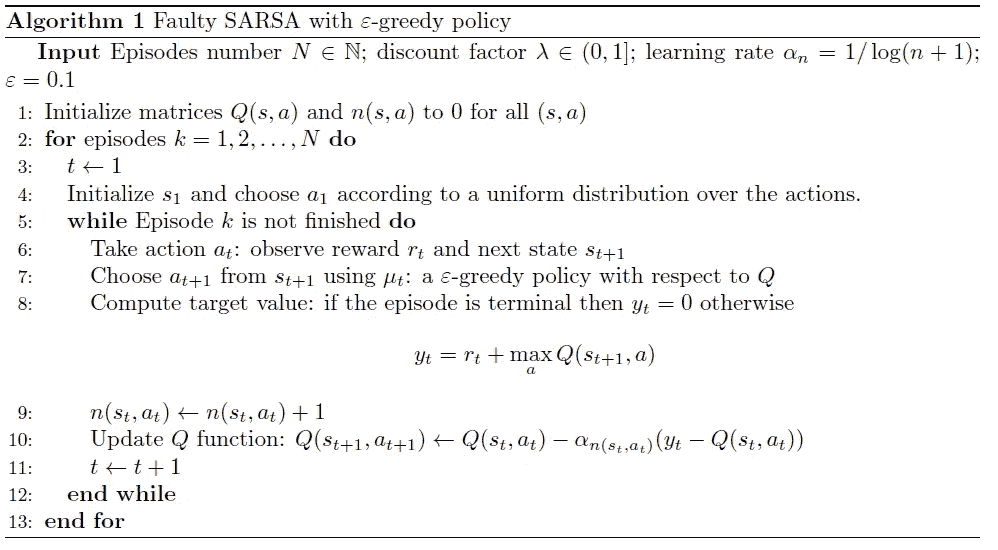
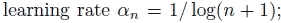
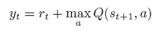
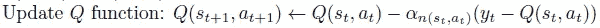
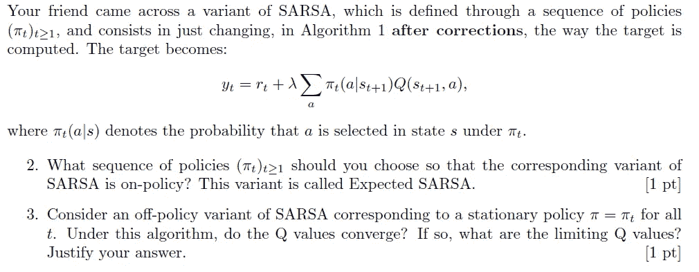

# 强化学习考试的一个例子——问题背后的基本原理(第一部分)

> 原文：<https://towardsdatascience.com/an-example-of-reinforcement-learning-exam-rationale-behind-the-questions-part-1-682d1358b571?source=collection_archive---------22----------------------->

## 在考试中你应该期待什么？我当老师的经历

Nguyen Dang Hoang Nhu 在 [Unsplash](https://unsplash.com?utm_source=medium&utm_medium=referral) 上拍摄的照片

*   **学生在强化学习考试中最常犯的错误是什么？**
*   有没有有效备考的方法？
*   **强化学习中最重要的研究课题是什么？**
*   **有哪些可能的问题？**

> 在这一系列文章中，我将回答这些问题，并提供如何应对测试的见解。

由于我在 KTH 皇家理工学院的教学经验，我遇到了学生可能遇到的不同问题，我将主要关注我自己的经历。KTH 大学的博士生需要教学，这是他们活动的一部分，也是我作为博士生最喜欢做的事情之一。

对于那些不再是学生的人来说，这篇文章可能仍然有助于获得新知识。

希望这能对许多学生有所帮助。

# 练习介绍:预期的 SARSA 和政策内与政策外学习

练习介绍

上学期(2021 年 1 月)据我的导师说，我在设计考题的时候还是蛮有创意的。**在上图中，你可以找到练习的介绍。**

> 作为一门研究生课程，学生应该发展反思和批判性思维技能，以及对强化学习的理解。

因此，我设计了这个活动来评估学生在以下方面的技能:

1.  **批判性思维**
2.  **理解基本的强化学习概念:策略上的、策略外的学习和收敛**
3.  **使算法适应不同需求的能力**

我将简要描述我是如何评估这三点的。

# 第一个问题——批判性思维和理解

对于我的学生，我通常会教他们如何通过他们的作品来思考。毕业后，我坚信拥有这种技能是必不可少的，也是必要的。

考试的第一部分旨在测试理论知识和评估算法的能力。本质上，这个测试评估学生在评估一件作品时的批判性判断。

**下图显示了一个错误的 SARSA 算法的伪代码。**

这是我问学生的第一个问题

> 1.找出算法中的所有错误。激励为什么这些是错误，并纠正它们。

该算法包含许多错误。

这个问题本身可能看起来很简单，但事实并非如此。**首先，我没有提供错误的总数。**它让这个练习看起来像一个真实的场景，在这个场景中，你必须评估其他人的工作。**此外，为了纠正错误，学生们需要了解基本的强化学习概念(否则你怎么能纠正它们呢？)**

**这个练习值 3 分(满分 10 分)，学生往往误以为每个错误值 1 分，总共 3 分**(整体考试值 50 分，有 5 个练习，每个 10 分)。

**不幸的是，这是一种幼稚的思维方式，学生应该避免用那些术语来思考。一个错误的价值可能超过 1 分，也可能低于 1 分。**

**总共 6 个错误，每个错误值半分。**

然而，这些错误并不都具有同样的重要性(在我看来)，将来我可能会使用不同的方法。

但是，有哪些错误呢？

> 大多数错误需要学生注意细节，而其余的是简单的数学错误(加号而不是减号，等等)。

第一个错误是关于学习速度

*   **第一个错误涉及罗宾斯-门罗条件，这是强化学习的基石之一。**随机近似算法用于强化学习中的数据学习。**以下两个条件是随机逼近格式收敛的必要条件:∑ α(t) = ∞和∑ α (t) < ∞。**
*   **在练习中，后一个要求没有得到满足。人们可以简单地选择不同的学习速率，例如 1/n**

三个错误是关于目标值的

*   第二个主要错误是目标值 y(t)的计算。SARSA 是一种政策学习方法。
*   **这意味着目标值应该根据行为策略**采取的动作来计算(换句话说，如果你采取了动作 x，你应该使用相同的动作 x 来计算目标值)，**而不是使用 Q 学习中的最大操作！**
*   **另一个错误是遗漏了折扣因子！**
*   **正确答案是 y(t) = r + λ Q(s(t+1)，a(t+1))。**
*   唯一的小错误(真正的小错误)是，当插曲结束时(即我们已经到达最终状态)，目标值应该只等于回报(y(t)=r)。

两个错误是关于 Q 值的更新

*   最后但并非最不重要的是，Q 值的计算也包含一些小误差。
*   **我们更新当前状态和动作对的值，而不是后续的值！左手边应该是 Q(s(t)，a(t))，而不是 Q(s(t+1)，a(t+1))。**
*   而且，α前面有个负号应该是加号。

# 第二和第三个问题:批判性思维、理解和适应

练习的第二和第三个问题

练习中的第二个和第三个问题给了我一点试验算法的自由。

> **这是为了测试学生适应意外情况的能力。**

**首先，我改变了计算目标值的方式。为了稍微改变一下，我引入了一个新元素，策略π。**使用这种方法，我可以评估他们对基本强化学习概念的理解，即策略外学习与策略内学习。****

> 就其本身而言，这些问题并不难。然而，在考试中引入意想不到的因素会对学生产生巨大的心理影响。他们中的大多数人可能会因为这一变化而感到紧张，这可能会影响他们的表现。
> 
> **不过，只要改的不需要复杂的答案，我感觉同学们应该都能搞定。**

你可以用一行回答问题 2:

*   **在问题(2)中，这个策略π就像一个自由参数。要回答这个问题，学生需要理解政策内学习和政策外学习的区别。**
*   此外，符号可能会让学生感到害怕。尽管是一所工程学校，但并不是所有的学生都能在这个水平上掌握数学符号。
    在我看来，这反映了缺乏数学知识，这是行业需要能够解决不需要数学建模的问题的数据科学家/数据工程师的结果。
*   **问题(2)的答案简单明了** : π应该就是行为策略，也就是你用来采取行动的策略。(因此政策μ)。

问题 3 也有点难，但不多，需要 1-2 行答案。

*   **假设行为策略无限频繁地对所有状态-动作对进行采样**，非策略算法将学习在目标值计算中使用的策略的 Q 值。****
*   ****因此**，给定一个充分探索的行为策略，**Q 值将收敛到策略π的 Q 值，而不是策略μ的 Q 值。****

# **结论和后续文章**

****

**安吉丽娜·利特温在 [Unsplash](https://unsplash.com?utm_source=medium&utm_medium=referral) 上的照片**

****这是一个系列的第一篇文章，我将描述一些在强化学习测试中最常见的问题。****

**在这篇文章中，我展示了我在上次考试中提出的一些简单而棘手的问题。在接下来的几篇文章中，我将展示更多的练习，并更详细地讨论其他强化学习问题。**

**我将主要讨论强化学习的方法和理论方面，重点是教师对学生的期望。**

> **希望这篇文章在你的解题方式上对你有所启发，以便对你即将到来的考试或者以后的学习有所帮助！**

****感谢您的阅读！****