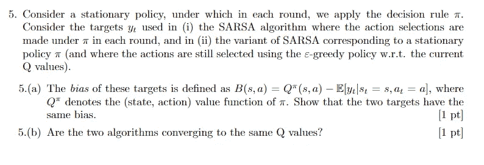
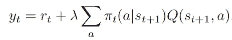
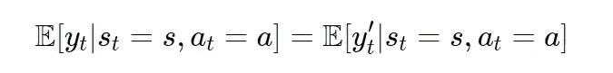
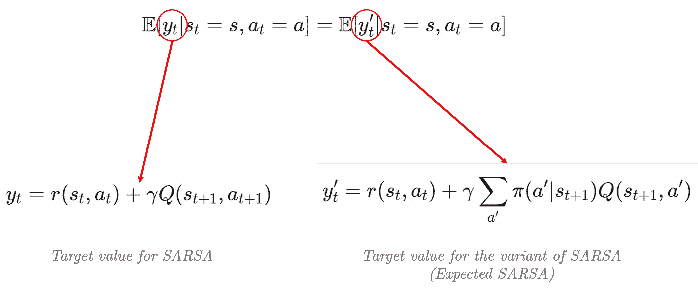
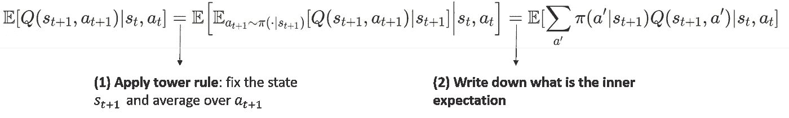
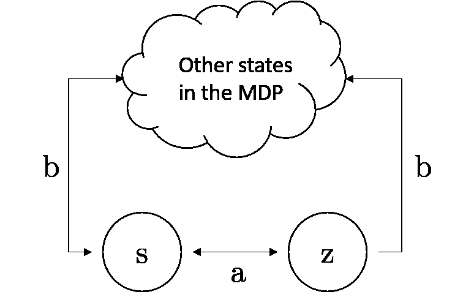

# 强化学习考试的一个例子:问题背后的基本原理(第二部分)

> 原文：<https://towardsdatascience.com/an-example-of-reinforcement-learning-exam-rationale-behind-the-questions-part-2-e66509ba50ee?source=collection_archive---------37----------------------->

## 在考试中你应该期待什么？我当老师的经历

[真诚媒体](https://unsplash.com/@sincerelymedia?utm_source=medium&utm_medium=referral)在 [Unsplash](https://unsplash.com?utm_source=medium&utm_medium=referral) 上拍摄的照片

*   **学生在强化学习考试中最常犯的错误是什么？**
*   **有哪些可能的问题？**

> 在这一系列文章中，我将回答这些问题，并提供如何应对测试的见解。

由于我的教学经验，我遇到了学生可能遇到的不同问题，我将主要集中在我自己的经验。

对于那些不再是学生的人来说，这篇文章可能仍然有助于获得新知识。

*查看前面的文章* [*这里的*](https://russoalessio.medium.com/list/rl-exams-3bcc5a4ba5cb) *。*

**在这里，我将涵盖我在上一篇文章中遗漏的几个问题(你可以在这里找到**</an-example-of-reinforcement-learning-exam-rationale-behind-the-questions-part-1-682d1358b571>****)。****

**下面的问题是整个练习中最难的**、**，但是正如我们所看到的，它们可以用几行来回答。**

****问题测试学生的概率和强化学习知识，以及解决问题的能力。****

**这些问题如下:**

****

**作者图片**

**首先，做一些澄清:**

*   ****π是这里的策略，**其中π( *a|s* )表示给定状态 *s.* 时选择动作 *a* 的概率**
*   ****目标 *y* 是 TD-target** ，如果我们使用 on-policy 或 off-policy 算法，它会发生变化(如果这不清楚，请查看我以前的文章[https://towards data science . com/an-example-of-enforcement-learning-exam-rational-behind-The-questions-part-1-682d 1358 b571](/an-example-of-reinforcement-learning-exam-rationale-behind-the-questions-part-1-682d1358b571))。**
*   ****SARSA**(又名*预期 SARSA* ) **的变体是一种算法，其中 TD-target 根据以下公式**进行计算**

****

**TD-SARSA 变体的目标(也称为预期 SARSA)；作者图片**

*   **偏见只是衡量一项政策好坏的标准。如果策略是最优的，我们期望偏差项为 0。**

## **问题(a)的解决方案**

****问题(a)是关于熟悉概率中的高塔法则属性，并知道 TD-target 是什么。****

**这是一个经典的解决问题的练习，学生需要一次走一步。**简单地写下你希望证明/解决的事情通常是个好主意。****

****首先，为了不混淆，让我们用 SARSA *、*用 *y* 表示目标值，用 SARSA** 的变体用*y’*表示目标值。因为 ***Q(s，a)* 在每个偏置项**中是相同的值，所以该练习归结为表明以下等式成立**

****

**我们需要证明什么！(图片由作者提供)**

****接下来:什么是 *y* 和*y’*？这些只是 TD 目标。我们已经知道如何写它们了。****

****

**作者图片**

**因此，原问题简化为证明以下等式**

**这是我们需要证明是真实的平等(图片由作者提供)**

**这确实是练习的第一个难点。我们怎样才能从这里搬走一个呢？不要惊慌。**

1.  ****注意，在左手边我们有两个随机变量，t+1 时刻的状态-动作对，而在右手边只有一个随机变量**(右手边只有一个随机变量，t+1 时刻的状态)。**

**这是一个人需要更新他/她的概率工具包的地方。**这个想法是通过使用条件期望的塔属性来洗去左侧额外随机变量的影响。****

**只需执行以下操作(从左至右阅读):**

****

**从左至右:应用(1)塔规；(2)把内心的期望写成和；作者图片**

*   ****解释:考虑左手边的表达式，对下一个动作取一个平均值，假装你知道下一个状态是什么**(我们得到中间的表达式)**。
    然后，写出平均值是多少**(右边最后一步)**。****
*   **这表明 Sarsa 的偏差相当于 SARSA 变体的偏差(也称为预期 SARSA)。**
*   ****塔性质为我们提供了一次处理一个随机变量的能力，在处理多个随机变量的期望时，我们的生活变得更加轻松。****

## **问题(b)的解决方案**

****在第二个问题(b)中，我们被要求回答两种算法是否收敛到相同的 Q 值**(你可以再次检查下面的问题)。**

****

**作者图片**

**这是一种开放式问题，学生被迫思考这个问题。学生需要了解哪些假设会导致肯定(或否定)的答案。**

****需要注意的一件重要事情是，政策π是固定的，不会随着时间而改变。** *这意味着我们并不是真的对学习更好的政策感兴趣，而只是学习π的值。***

**我们该如何开始？**

1.  **首先，我们需要假设罗宾斯-门罗条件得到满足。**
2.  ****其次，我们知道 SARSA 的变体使用一种行为策略，即ϵ-greedy 策略。****

****这两件事暗示着 SARSA 的变体会收敛到策略π的 Q 值(不是最优 Q 值)。****

*   **由于行为策略将无限频繁地探索每个状态-动作对，那么算法将收敛到我们用来计算 TD-target *y，*的策略的 Q 值，即π的 Q 值。**

**【SARSA 呢？**

*   **SARSA 将学习被无限频繁访问的状态-动作对的值。**
*   **然而，可能有些国家行动对从未被访问过。例如，考虑这样的情况，其中到达特定状态 *z* 的唯一方式是在状态 *s* 中执行动作 *a* 。如果那个概率是 0 ( *π(a|s)=0* ，我们将永远无法学习到 *z* 中的 Q 值。**

****

**如果在状态“s”中，我们从不执行动作“a ”,就不可能知道状态“z”中动作的值(图片由作者提供)**

*   **另一方面，SARSA 的变体将学习 *z* 中的 q 值，因为在这种情况下，行为策略是ϵ-greedy(这保证了状态 *z* 将在某个点被访问)**
*   **所以，唯一的办法就是保证π有足够的探索性。这就需要满足以下条件:我们需要一个正概率来挑选每个状态下所有可能的动作，即对于所有的状态-动作对， *π(a|s) > 0* 。**
*   **如果满足后一个条件，那么通过 SARSA 学习的 Q 值收敛到策略π的 Q 值。**

# **结论和后续文章**

****这是** [**系列**](https://russoalessio.medium.com/list/rl-exams-3bcc5a4ba5cb) **的第二篇文章，我在这里描述了一些你可以在强化学习测试中找到的最常见的问题。****

**在接下来的文章中，我将展示更多的练习，并更详细地讨论其他强化学习问题。**

**我将主要讨论强化学习的方法和理论方面，重点是老师对学生的期望。**

***希望这篇文章对你的解题方式有所启发，或许对你即将到来的考试或者以后的学习有所帮助！***

****感谢您的阅读！****