# Python 3.x 中决策树分类的详尽指南

> 原文：<https://towardsdatascience.com/an-exhaustive-guide-to-classification-using-decision-trees-8d472e77223f?source=collection_archive---------2----------------------->


图片来自 [Pinterest](https://www.google.com/url?sa=i&url=https%3A%2F%2Fwww.pinterest.com%2Fpardenpd%2Fillustrator-malika-favre%2F&psig=AOvVaw33xxMMkiBnFIS9tylwcoOF&ust=1639315821413000&source=images&cd=vfe&ved=0CAwQjhxqFwoTCLiPzb_t2_QCFQAAAAAdAAAAABAi)

## 使用决策树进行分类的端到端教程

有各种机器学习算法可以用于处理分类问题。一种这样的算法是决策树算法，除了分类之外，它还可以用于解决回归问题。虽然这是一种最简单的分类算法，但是如果对其参数进行适当的调整，可以产生非常精确的结果。

在这篇文章中，我将首先尝试给你一个什么是算法的直觉，以及它如何做出预测。然后，我将尝试分解与该算法密切相关的一些重要术语，最后，在本文结束时，我将使用决策树设计一个非常简单的分类器。

在开始这篇文章之前，我建议你看一下我以前的文章，我在这些文章中讨论了各种学习算法。另外，如果你喜欢这篇文章，请考虑为这篇文章鼓掌，并确保关注我以获得更多#MachineLearningRecipes。整篇文章的 PDF 副本可以从[这里](https://drive.google.com/file/d/1dk9eJruySiRbFkFOChmAZrLZGP3RvVo_/view?usp=sharing)下载，继续你的离线学习。

# **决策树是如何做出决策的？**

正如我在以前的文章中所讨论的，决策树算法是一种简单而有效的监督学习算法，其中数据点根据某些参数和/或算法试图解决的问题被连续分割。**决策树**通常也被称为 **CART** (代表分类和回归树)。

如果您有兴趣了解更多关于使用决策树解决回归问题的知识，请考虑查看我以前的文章[这里](/sowing-the-seeds-of-decision-tree-regression-2bb238dfd768?source=user_profile---------5----------------------------)。

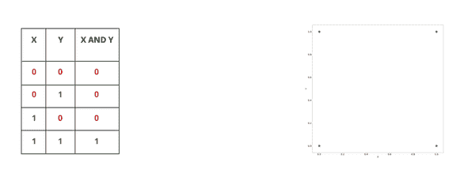

图片来自[黑客地球](https://www.hackerearth.com/practice/machine-learning/machine-learning-algorithms/ml-decision-tree/tutorial/)

每个决策树包括一个**根节点**，一些**分支**，和**叶节点**。树中的内部节点描述了不同的测试用例。决策树可以用来解决分类和回归问题。该算法可以被认为是一个图形树状结构，使用各种调整参数来预测结果。决策树将**自顶向下的方法**应用于训练期间输入的数据集。

为了理解算法实际上是如何工作的，假设需要开发一个预测模型，该模型可以预测学生申请进入特定课程是否被接受。考虑以下提供给任何决策树模型的数据集。

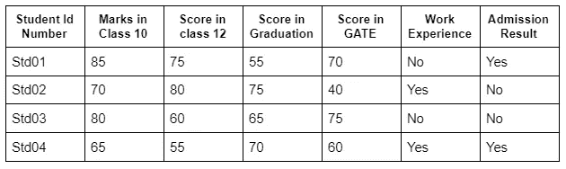

图片作者[作者](https://rajashwin.medium.com/)

某个学生的申请只有在满足下述条件的情况下才会被接受:

*   入门考试成绩应等于或大于 60 分。
*   毕业、10 级和 12 级的成绩应在 60 分以上。

在这种情况下，尽管上述条件可能有某些例外。在这种情况下，申请将被列入等候名单。

*   如果申请人的 GATE/毕业分数低于门槛分数，但有工作经验，则该申请将被列入名单。
*   如果申请人在第 12 类中的分数超过 75 分，但低于第 10 类中的最低要求分数，则他们的申请将被列入名单。


图片来自[豆类](https://algobeans.com/2016/07/27/decision-trees-tutorial/)

上例中考虑的问题可以用图形的形式来考虑，如决策树或流程图。一棵树将满足问题中提供的所有可能的情况。决策树算法的工作方式类似于一组嵌套的 if-else 语句，其中检查连续的条件，除非模型得出结论。

树的决策节点或简单节点是树在经过每个节点(从根节点开始)后呈现的问题。分支或子树是整个树的一个子部分。树的每个边对应于问题的结果，并且该结果由代表类别分布的叶节点或终端节点来表示。

# **决策树在分类中是如何使用的？**

决策树算法使用一种称为树的数据结构来预测特定问题的结果。由于决策树遵循有监督的方法，该算法被提供了预处理数据的集合。这些数据用于训练算法。点击了解更多关于此[的信息。](/sowing-the-seeds-of-decision-tree-regression-2bb238dfd768?source=user_profile---------5----------------------------)


图片来自 [KDNuggets](https://www.google.com/url?sa=i&url=https%3A%2F%2Fwww.kdnuggets.com%2F2018%2F08%2Fselecting-best-machine-learning-algorithm-regression-problem.html&psig=AOvVaw00IZQGqsdaumLDR02rpBgm&ust=1635603177980000&source=images&cd=vfe&ved=0CAwQjhxqFwoTCPD0l-vm7_MCFQAAAAAdAAAAABAX)

决策树遵循自上而下的方法，这意味着树的根节点总是在结构的顶部，而结果由树叶表示。决策树是使用一种称为递归划分(通常称为分治法)的启发式方法构建的。根节点之后的每个节点都被分成几个节点。

其核心思想是使用决策树将数据空间划分为密集区域和稀疏区域。二叉树的分裂可以是二进制的，也可以是多进制的。该算法继续分裂树，直到数据足够同质。在训练结束时，将返回一个决策树，该决策树可用于进行最佳分类预测。

这个算法发展中的一个重要术语是**熵**。它可以被认为是给定数据集的不确定性的度量，其值描述了特定节点的随机程度。当结果的差异幅度非常低，模型因此对预测的准确性没有信心时，就会出现这种情况。

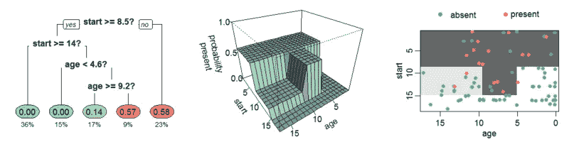

图片来自[维基百科](https://en.wikipedia.org/wiki/Decision_tree_learning)

熵越高，数据集中的随机性就越高。构建决策树时，应优先选择较低的熵。计算决策树熵的表达式如下:

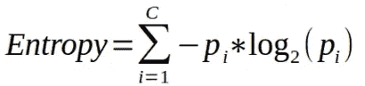

用于类似目的的另一个指标是基尼指数。它使用基尼系数法来创建分割点。**信息增益**是通常用于测量数据集中不确定性减少的度量。决策树中的信息增益通常由以下公式描述:

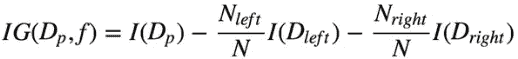

该度量可以进一步用于确定决策树的根节点和要进行的分裂的数量。决策树的根节点通常被称为**决策节点**或**主节点**。

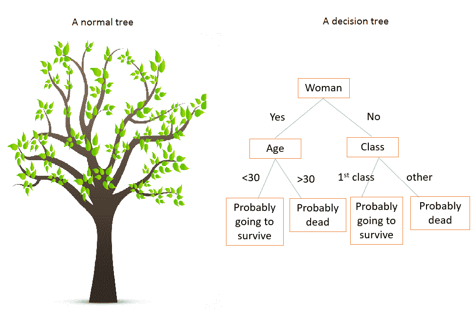

图片来自 [Kaggle](https://www.google.com/url?sa=i&url=https%3A%2F%2Fwww.kaggle.com%2Fakashchola%2Fdecision-tree-for-classification-regression&psig=AOvVaw00IZQGqsdaumLDR02rpBgm&ust=1635603177980000&source=images&cd=vfe&ved=0CAwQjhxqFwoTCPD0l-vm7_MCFQAAAAAdAAAAABBo)

每棵树都有一个根节点。根节点通常被认为是与所有其他特性相协调的最重要的特性。通常，所有要素中精度最高的要素被选为根节点。

# **决策树中的分裂**

随着决策树中分裂数量的增加，构建决策树所需的时间也会增加。然而，具有大量分裂的树容易过度拟合，导致精度差。然而，这可以通过决定**最大深度**参数的最佳值来管理。随着该参数值的增加，分割数也会增加。

可用于控制决策树拆分的其他参数包括 **min_samples_split** 、 **min_samples_leaf** 和 **max_features** 。

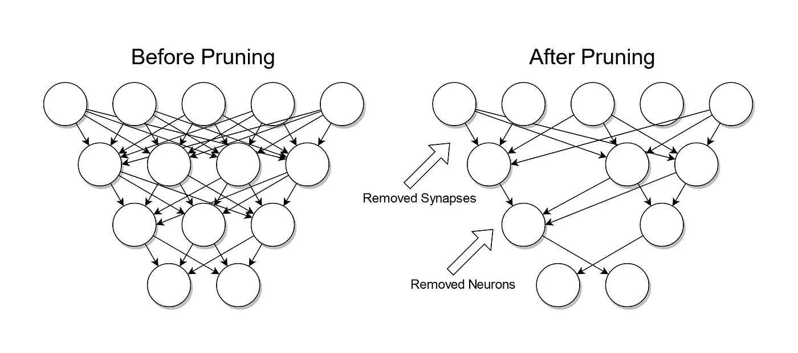

图片来自[维基百科](https://en.wikipedia.org/wiki/Decision_tree_pruning)

另一种可以在很大程度上避免过度拟合的方法是通过去除在决策过程中具有很小或没有意义的分支。这被称为**修剪**。有两种不同类型的修剪— **预修剪**和**后修剪**。预修剪在树生长时完成，而后修剪在树构建到一定深度后修剪节点。

> 如果你已经读到这里，我相信你一定喜欢这篇文章，并且发现它内容丰富，所以请考虑为这篇文章鼓掌，并关注我后面的文章。点击这里查看我的其他#机器学习食谱[。](https://rajashwin.medium.com/)

现在，我已经对算法及其工作的理论概念有了更好的理解，我们将尝试应用我们的知识来构建我们自己的分类器。用于构建分类器的[代码和其他资源](https://github.com/ashwinraj-in/MachineLearningRecipes/blob/master/DecisionTreeClassification.ipynb)可以在我的 [GitHub](https://github.com/ashwinraj-in/MachineLearningRecipes) 句柄中获得。

## **步骤 1:导入所需的库和数据集**

库是一组有用的功能，消除了从头编写代码的需要，在开发机器学习模型和其他应用程序中起着至关重要的作用。Python 提供了大量的库，可以用来开发高度复杂的学习模型。

```
import numpy as np
import pandas as pd
import seaborn as sns

import matplotlib.pyplot as plt
%matplotlib inline
```

首先，我们将引入一些流行的库，如 Pandas 和 NumPy。Pandas 是一个快速、强大、灵活且易于使用的开源数据分析和操作工具，构建于 Python 编程语言之上。**另一方面，NumPy** 由一组多维数组对象和处理这些 NumPy 数组的例程组成。

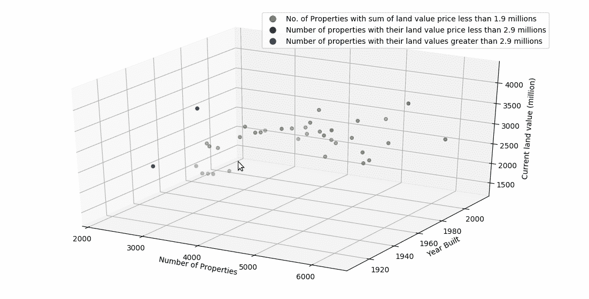

图片由[作者](https://rajashwin.medium.com/)

与 C/C++不同，Python 为我们在程序中前进时导入库提供了灵活性。Matplotlib 是一个基于 NumPy 数组的多平台数据可视化库，旨在与 SciPy 一起工作。

另一个满足类似需求的库是 Seaborn 库，它构建在 matplotlib 之上，并与 pandas 数据结构紧密集成。可视化是 Seaborn 的核心部分，有助于探索和理解数据以及探索性数据分析和洞察力研究。

```
import warnings
warnings.filterwarnings('ignore')data = 'car_evaluation.csv'
df = pd.read_csv(data, header=None)
```

一旦导入了所有这些库，下一步就是获取训练和测试预测模型所需的数据集。 **read_csv()** 方法用于将数据集加载到 python 文件/笔记本中。用于构建该决策树分类器模型的数据集可以从[这里](https://www.kaggle.com/elikplim/car-evaluation-data-set/version/1)下载。

## **第二步:探索性数据分析和特征工程**

将数据加载到 pandas 数据框后，开发模型的下一步是探索性数据分析。探索性数据分析是一种分析数据的方法，以便深入了解数据中隐藏的事实和模式，这些事实和模式通常是我们看不到的。

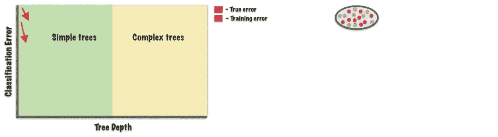

图片来自[媒体](/decision-trees-60707f06e836)艾伦·杰弗里斯

这一步还包括清理和预处理数据。在这一步中，我们深入了解了将要处理的数据类型。在这一步中，我们还对数据进行了一些更改，例如删除缺失值、删除某些列、查看字段、研究某些变量以及定义各种不同变量之间的关系。

```
from sklearn.model_selection import train_test_split
X_train, X_test, y_train, y_test = train_test_split(X, y, test_size = 0.33, random_state = 42)encoder = ce.OrdinalEncoder(cols=['buying', 'maint', 'doors', 'persons', 'lug_boot', 'safety'])
X_train = encoder.fit_transform(X_train)

X_test = encoder.transform(X_test)
```

数据经过适当的预处理后，下一步就是将数据分成训练数据和测试数据。通常 70–80%的数据作为训练数据，而剩余的数据作为测试数据。有时，测试数据可以进一步分类到称为验证数据的附加部分，用于评估模型。

```
X_train, X_test, y_train, y_test = train_test_split(X, y, test_size = 0.33, random_state = 42)
```

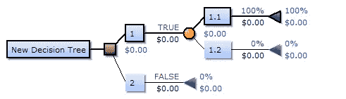

图片来自[维基百科](https://en.wikipedia.org/wiki/Decision_tree)

我们在训练模型之前的最后一步是特征工程。这是将原始数据转化为有用特征的过程，这些特征揭示了关于模型的有用见解，从而提高了模型的预测能力。在此步骤中，对分类值进行编码，并对数据进行其他适当的更改。到这一步结束时，预测模型就准备好了。

## **第三步:拟合模型，评估结果，可视化树木**

现在，数据已经完全准备好了，分类器被实例化，模型适合数据。为这个分类器选择的标准是熵，尽管也可以使用基尼指数。一旦我们的模型符合数据，我们尝试使用分类器模型预测值。这样做通常是为了执行公正的评估，并获得模型的准确性分数。

```
from sklearn.tree import DecisionTreeClassifier
clf_en = DecisionTreeClassifier(criterion='entropy', max_depth=3, random_state=0)
clf_en.fit(X_train, y_train)y_pred_en = clf_en.predict(X_test)
```

应确保模型既不过度拟合也不欠拟合数据。这可以通过计算训练和测试数据的准确度分数来完成。如果值是可比较的，那么模型没有过度拟合。

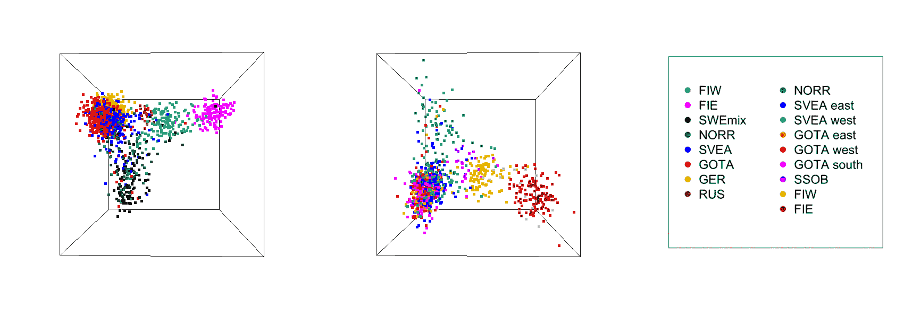

图片来自[维基共享资源](https://www.google.com/url?sa=i&url=https%3A%2F%2Fcommons.wikimedia.org%2Fwiki%2FFile%3A3D_PCA_of_SWE_and_FIN.gif&psig=AOvVaw045HpxtIhIthcEVpA_G21_&ust=1635379057108000&source=images&cd=vfe&ved=0CAwQjhxqFwoTCPj6gfuj6fMCFQAAAAAdAAAAABAO)

一旦模型适合数据并做出预测，我们的最后一步将是评估分类器。这种方法最流行的工具之一是计算分类器的混淆矩阵。混淆矩阵是总结模型性能的工具。

```
from sklearn.metrics import accuracy_score
print('Model accuracy score with criterion entropy: {0:0.4f}'. format(accuracy_score(y_test, y_pred_en)))y_pred_train_en = clf_en.predict(X_train)
y_pred_train_enplt.figure(figsize=(12,8))
from sklearn import tree
tree.plot_tree(clf_en.fit(X_train, y_train))
```

混淆矩阵为我们提供了按每个类别细分的正确和错误预测的完整摘要，揭示了分类模型的性能和模型产生的错误。

```
from sklearn.metrics import confusion_matrix
cm = confusion_matrix(y_test, y_pred_enprint('Confusion matrix\n\n', cm)
```


图片来自 [ML Wiki](http://mlwiki.org/index.php/Decision_Tree_(Data_Mining))

混淆矩阵有四种可能的结果，即真阳性、真阴性、假阳性和假阴性。混淆矩阵通常以表格形式输出。分类器的其他评估技术包括**精度分数**、 **f1 分数**、**召回率**和**支持度分数**。

# **决策树算法的优势**

决策树分类器是最广泛使用的分类预测算法之一。使它如此受欢迎的一些特征是:

*   未知记录的极快分类。
*   忽略预测中不太重要或不重要的特征。
*   如果参数调整到最佳状态，效率极高。
*   构建成本低廉，逻辑易于解释。

# **决策树算法的局限性**

尽管决策树分类器是最复杂的分类算法之一，但它可能有一定的局限性，尤其是在现实世界中。其威慑因素如下所述:

*   决策树分类器通常倾向于过度拟合训练数据。
*   数据的变化可能会导致结果发生不必要的变化。
*   大树有时很难解释。
*   这些偏向于具有多个级别的特征的分割。

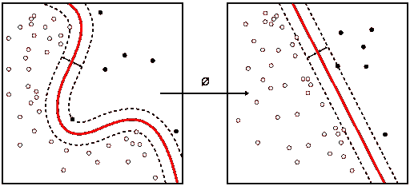

图片来自[维基百科](https://en.wikipedia.org/wiki/File:Kernel_Machine.svg)

由于决策树分类器在大多数情况下容易过拟合，因此对于具有大量特征的数据集，用**主成分分析**替换决策树分类器是有利的。

# **决策树分类器的应用**

在讨论了决策树算法的优点和局限性之后，是时候阐明决策树分类器的应用了。决策树算法最受欢迎的用途之一是在生物医学工程中，其中它用于识别可植入设备中使用的功能和探索潜在的药物。

决策树分类器也在数据挖掘、金融分析和经济产品开发中得到应用，其中它们被用于理解客户满意度、商业金融和相关行为。

在其他应用中，决策树分类器也用于系统设计和物理学，尤其是粒子检测。它还在制造和生产中得到应用，其中它可以用于质量控制、异常检测和半导体制造。


图片来自 [Finereport](https://www.google.com/url?sa=i&url=https%3A%2F%2Fwww.finereport.com%2Fen%2Fdata-visualization%2Fdata-visualization-how-to-choose-the-right-chart.html&psig=AOvVaw3i9hvSkiSo2-mBnIMm4AD7&ust=1635381400568000&source=images&cd=vfe&ved=0CAsQjRxqFwoTCPCays6s6fMCFQAAAAAdAAAAABB0)

至此，我们已经到了这篇文章的结尾。我希望这篇文章能帮助你对决策树分类器的工作原理有所了解。如果你有任何问题，或者如果你认为我犯了任何错误，请随时与我联系。通过[邮箱](http://rajashwin733@gmail.com)或 [LinkedIn](https://www.linkedin.com/in/rajashwin/) 与我联系。快乐学习！