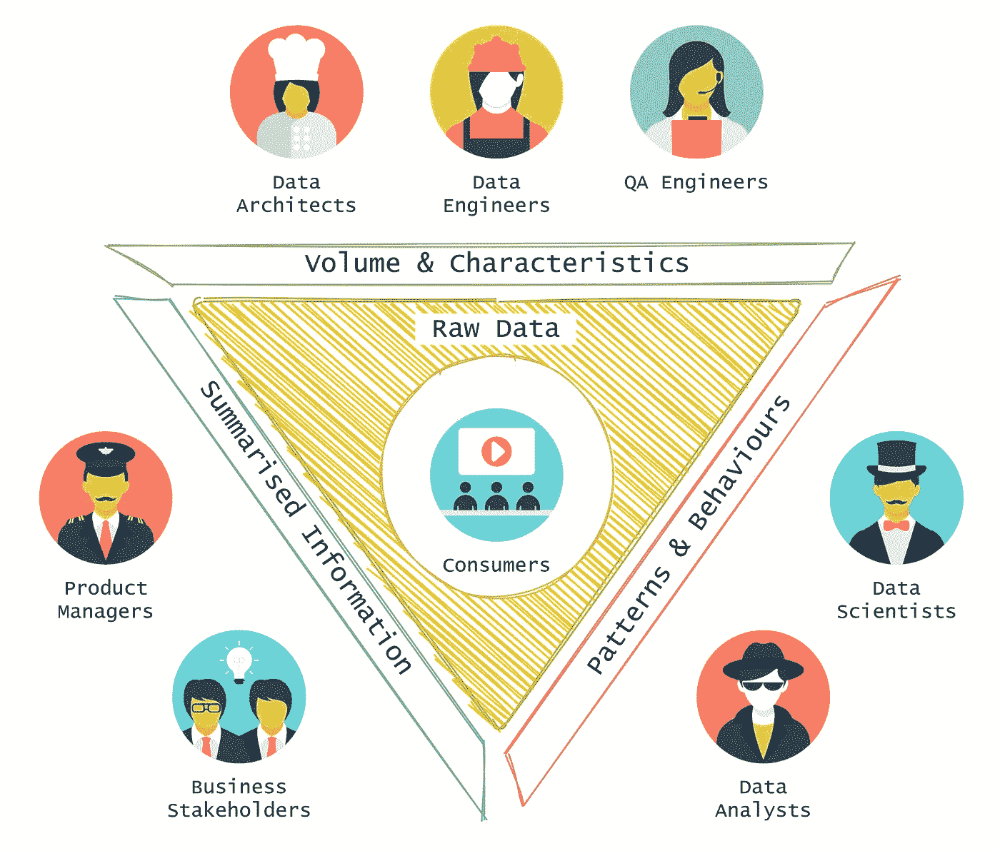
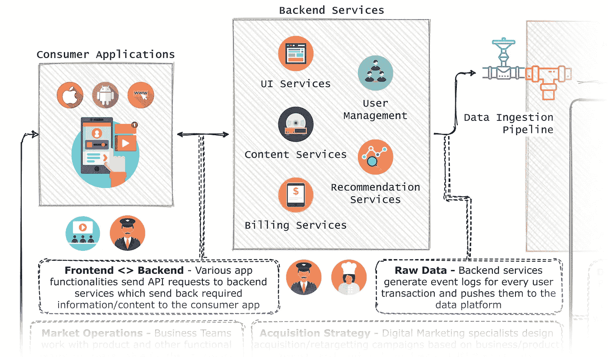
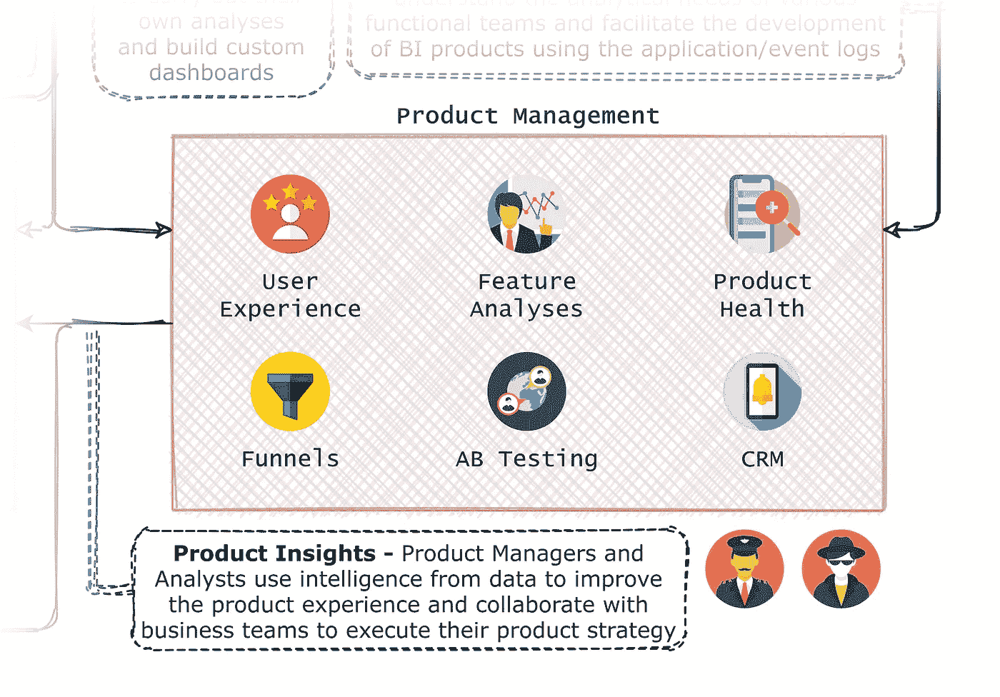
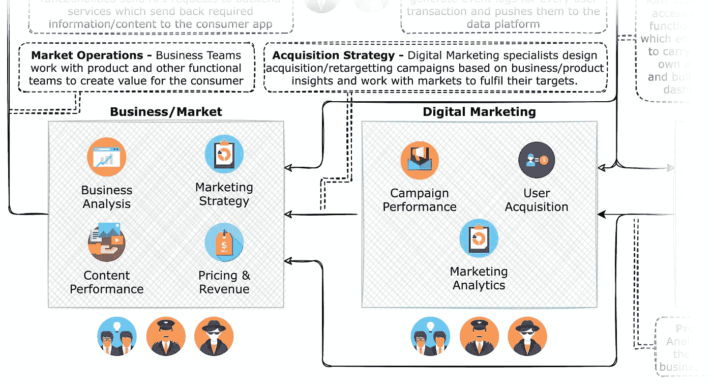
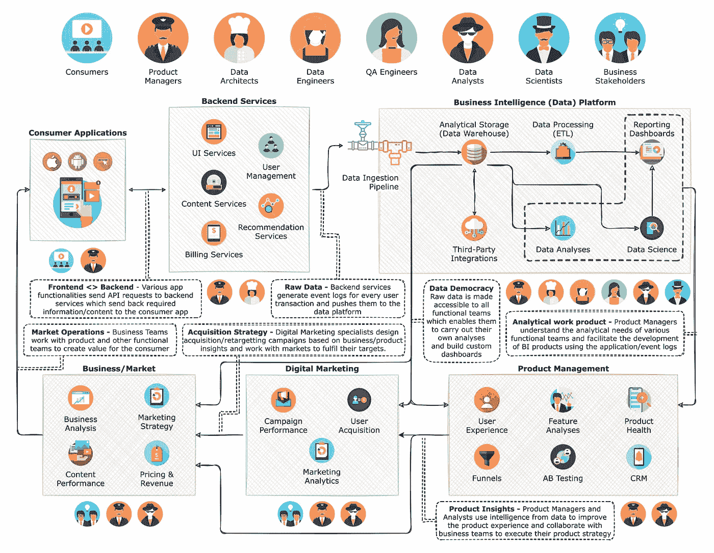

# 体验“数据生态系统”

> 原文：<https://towardsdatascience.com/an-experience-of-a-data-ecosystem-4f86e98fd013?source=collection_archive---------3----------------------->

## 我对数据世界的了解之旅—这篇文章描述了在产品组织中如何处理和消费数据，以及在数据生命周期的不同阶段，各种专业角色如何与数据进行交互

十多年来，数据一直是一种有价值的商品。它不仅改变了我们文明进步的方式，还为我们提供了一个新的视角来审视我们的技能和职业发展。对于一个刚开始处理数据的人来说，理解什么是数据以及如何处理和使用数据显然很重要。但是，了解使用数据意味着什么、数据的各种形式是什么、谁使用数据以及如何使用数据也很重要。这样的个体应该能够认同他们在这个生态系统中扮演的角色，以及他们可以进步到哪里。同时，他们还应该认识到这个生态系统中其他人的需求，以便理解问题陈述并创建更好的解决方案。

这篇文章概括了我在一家视频 OTT (B2C)产品公司担任数据专家的经历。这里的目的是描述现代数据驱动的产品公司的生态系统是什么样的，其生命周期的各个阶段是什么，以及谁是这个生态系统的生产者和消费者。数据不仅与工程和技术概念有关，还与正确转化为智能的决策和运营有关。

> 体验是独一无二的——这个生态系统对于一个组织来说也是独一无二的，可能不完全适用于其他地方。这个想法是为了给那些不熟悉这种生态系统的人一种工作的感觉。

# 认识一下这个生态系统的玩家！

虽然数据可能是 21 世纪最强大的人工资源，但人类在这个生态系统中扮演的角色至关重要。让我们看看他们是谁。

作者创作的插图

**消费者**是这个生态系统的中心——他们消费产品，享受不断发展的用户体验带来的好处。他们是这个世界的金矿，他们与各种数字产品的互动转化为贯穿整个生态系统的原始数据。

**产品经理**和**商业利益相关者**的任务是不断为消费者和他们所服务的产品/组织创造价值。他们齐心协力，满足消费者的期望，提高产品的价值定位，同时优化投资回报，实现组织目标。

**数据架构师**与产品经理合作，为需要生成何种原始数据以及如何消费这些数据奠定基础。它们提供了数据生态系统愿景的技术地图，该地图促进了数据处理管道、商业智能仪表板、数据馈送等的开发。

**数据工程师**通过设置资源和创建系统来存储和处理数据并支持其利益相关者的分析需求，在此基础上构建。他们的工作围绕着建立数据管道和维护各种形式的数据可用性。

**QA(质量保证)工程师**通过检查数据工程师生产的工作产品的质量，并确保正确满足利益相关者的期望，发挥着重要的作用。

数据分析师扮演了一个有趣的角色，因为他们与未知事物打交道。他们致力于回答组织中任何人提出的问题。他们帮助理解独特的用户行为，创建市场预测，调试问题和异常，等等。他们可能与技术、产品或业务团队合作，解决各种问题陈述。

> 分析师是工具箱中的扳手，可以调整它来拧紧各种大小的螺母和螺栓，并提供超出此范围的价值。

最后，还有**数据科学家**——他们肩负着从帽子里变出一只兔子的重任。他们的角色围绕着通过分析数据和使用数据科学和高级分析技术来产生更深刻的见解。从预测模型到创建推荐系统，他们的工作仍然是非结构化的，但非常有价值。

这些技术大脑聚集在一起，创造出令人惊叹的分析工作产品，让组织了解其消费者的行为，并帮助利益相关者每天做出更好的决策。

# 数据的方方面面——如何看待数据？

数据生态系统中的不同参与者以不同的方式与数据进行交互，这种交互定义了他们如何感知数据以及如何使用数据。2006 年，当 Clive Humby 创造了“数据是新的石油”这个短语时，他对这两种资源进行了明确的比较。就像石油要经历提取、提炼和储存等不同阶段一样；有些人重视原始形式的数据，有些人只利用经过处理的形式，有些人只需要了解数据的特征就可以存储和处理数据。

与数据的交互定义了玩家对数据的感知和使用。作者创作的插图。

在这个生态系统中，数据呈现 3 个方面。这些方面虽然对任何人都是可见和可访问的，但只对少数玩家有更高的相关性。

1.  **卷&特征** —这个方面对于数据工程参与者来说是最明显和最相关的，因为他们负责理解数据的结构和大小、存储数据、处理数据并创建分析工作产品，如报告、模型和分析。虽然他们也接触到其他两个方面，但与其职责的相关性较低，只能作为他们了解生态系统的额外知识，这可能有助于他们创建更好的解决方案。
2.  **模式&行为** —这个方面与数据分析师和科学家最相关。他们有责任弄脏自己的手，找到没有人知道如何解决的答案。他们研究隐藏的模式和消费者行为，以解决手头的问题陈述，这些陈述本质上总是探索性和诊断性的。他们的工作成果通常以开发新的生产流程的形式贡献给数据架构师和工程师。
3.  **总结信息** —这个方面对于生态系统的决策者来说是最重要的。产品经理和业务利益相关者借助报告仪表板、预测模型的结果、来自特别分析的见解等，执行各种运营(日常)和战略(长期)功能。他们依靠这些分析工具来改善产品体验，为消费者和组织创造价值。

这些相互作用可能不像上面看起来的那样具有排他性，生态系统中的任何人都可能经历相当多的重叠。业务利益相关者可能永远不会接触到原始数据或其元数据，因为他们可能在技术上不具备消费这些数据的能力，但没有什么可以阻止数据或 QA 工程师消费和理解呈现给这些利益相关者的汇总信息。这可能只是为了更好地理解他们工作的影响，或者是为了提升他们对所工作的产品或组织的了解。同样，虽然数据科学家的工作可能具有高度的技术性或统计性，但他们通常必须深入了解各种业务功能和市场动态，以便更好地了解他们对问题陈述的理解。

> 可以肯定地说，任何对所有这些方面如何相互作用有深刻理解的专业人士，在这个生态系统中都将是非常有用的，并且可能比其他人创造更大的价值。

# 数据会发生什么？

## 种植我们的作物——生成数据

数据生态系统的一个重要组成部分是原始数据的准确生成。消费者应用可以具有各种特性和功能、分支用户体验、视频播放器、支付网关等。为了更好地理解用户行为，有必要捕捉正确的用户接触点，要做到这一点，您必须正确设计您的应用程序事件记录架构。一个正确设计的架构可以帮助你了解关于你的大部分用户群的宝贵的行为信息；另一方面，设计不良的事件记录系统可能会让您失去宝贵的洞察力。

作者创作的插图

大多数生态系统依靠**前端和后端系统**之间的交互来生成用户交互的事件日志。每次用户与特定功能交互时，都会将一个事件日志推送到数据接收系统，其中包含定义所捕获事件的各种变量和参数。

> 比方说，用户试图在应用程序上搜索视频，当她点击搜索时，一个搜索请求被发送到后端服务，一个响应被发送回前端，为用户呈现多个相关的搜索结果。这个过程包括从后端和前端系统生成一个事件日志，该日志进入数据仓库，并作为原始数据存储起来，用于各种分析用例。该日志可以包含各种属性，如搜索关键字、搜索结果、语言等。这可以在以后帮助理解用户搜索什么或者评估所提供的搜索结果的质量。

在这里，**产品经理**和**数据架构师**扮演了一个重要的角色，他们理解并决定需要获取什么信息，以及如何将这些信息包含在服务的架构中。

## 智能工厂——数据平台

**商业智能系统**长期以来一直是任何公司决策过程中至关重要的一部分，并且随着数据管理和处理技术的发展而不断发展。在我们的生态系统中，架构完善的数据平台有助于组织构建数据驱动的战略，丰富面向消费者的产品。

作者创作的插图

从各种来源收集数据，包括消费者应用和后端服务的事件日志、外部供应商的内容元数据、支付合作伙伴的账单交易、社交媒体账户的交互数据、客户服务数据等。为了提取情报，所有这些数据都需要被正确地摄取、高效地存储和处理。数据工程团队接受了这一挑战，其中**数据架构师**与**数据工程师**一起创建了一个端到端的数据处理平台。他们建立数据接收管道，设计具有多个数据集市的数据仓库，创建 ETL 流程以满足各种业务报告的需求，并在一个或另一个企业数据可视化工具上构建这些报告。他们还确保可以与第三方服务集成，以便在它们之间建立数据馈送。

**数据工程团队**与**产品经理**一起创建各种分析工作产品——仪表板、总结报告、预测模型、知识图表和各种探索性分析。这些产品是来自业务涉众的各种需求以及产品管理和工程领域内的计划的结果。专业人员合作来理解什么样的产品将解决他们的用例，并记录他们的需求版本，然后与工程师讨论，以便将它付诸实施。 **QA 工程师**通过理解这些需求并确保可交付产品具有最高的质量和准确性，为这一过程做出了重要贡献。他们以汇总的形式验证任何报告中呈现的事实，从消费者的角度评估这些产品的使用情况，并确保利益相关者提出的任何问题都得到及时解决。

> 生态系统的一个重要组成部分是数据民主。存储和管理数据的负担可能落在工程团队身上，但是每个人都应该具备使用和分析这种资源的能力。在这个时代，越来越多的商业战略是数据驱动的，所以那些决策者更好地访问数据是有意义的。职能团队与他们的分析师一起创建定制的仪表板和分析，以支持他们的日常分析需求。数据民主化确保了对业务和行业的理解很容易被纳入问题解决流程，并减轻了工程团队在解决功能性问题时投入额外带宽的压力。

## 游说增长—产品管理

由**产品经理**和**分析师**组成的核心团队从核心驱动产品的发展和增长。产品经理处理产品的各个方面——一些人管理消费者应用程序的开发，而另一些人管理商业市场及其 KPI 的增长。这些经理中的一个小组负责通过与工程团队以及业务利益相关者协作来构建和推动数据生态系统。其他产品经理利用这个生态系统来推进他们自己产品组件的战略路线图。

作者创作的插图

## “这些数字告诉了我们什么？”—业务利益相关者

这些团队是我们生态系统中所有分析工作产品的主要消费者。他们围绕各种业务/市场运营制定战略，如获取和保留用户的线下和在线营销、广告和订阅工作流、内容获取和编程等。他们还不断评估各种产品功能的市场适应性，以及用户如何使用它们。这对于确保产品供应始终与其目标群体相关非常重要。

这些功能需求需要对用户行为和产品性能有深刻的理解，这些需要通过一系列及时的仪表盘、性能跟踪器、预测和预测模型、用户细分算法来实现……不胜枚举。**商业利益相关者**与**产品经理**合作，定义他们想要跟踪什么以及他们想要如何研究它。这些需求沿着树向下渗透到**工程人员**，他们为这些需求提供技术形式，并构建分析产品，为业务利益相关者提供可操作的见解。

作者创作的插图

生态系统似乎以循环的形式出现，产品消费者生成的数据以增强的用户体验和新产品功能的形式返回给他们。但是，在这个生态系统中创造的价值取决于其中人们的协作努力。坏的合作往往为客户创造零价值或低价值，而好的合作创造历史。最重要的是确定你在这个生态系统中的角色，既要成为一名高效的数据专家，又要成为一名成功的合作者。太棒了。

作者创作的插图

## 学分—

特别感谢***Supriya Pathak***对这件作品的宝贵见解和合作。

<https://www.linkedin.com/in/supriya-pathak-57485459/>  

图形是使用 diagrams.net 的[***(draw . io)***](https://app.diagrams.net/)*和[***flat icon***](https://www.flaticon.com/)开发的。巨大的资源！这篇文章是思想的原创作品。*